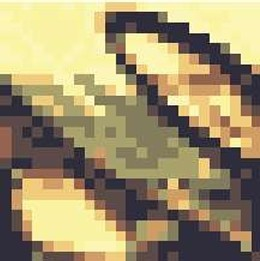
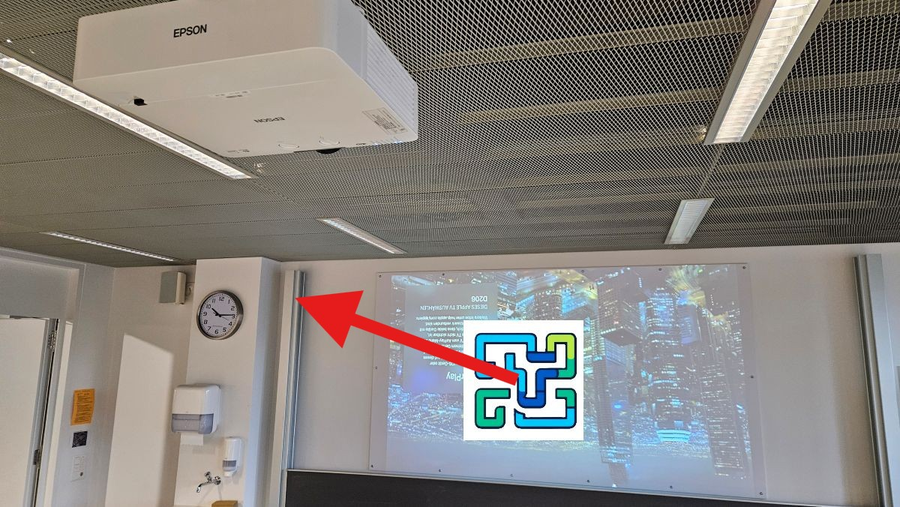
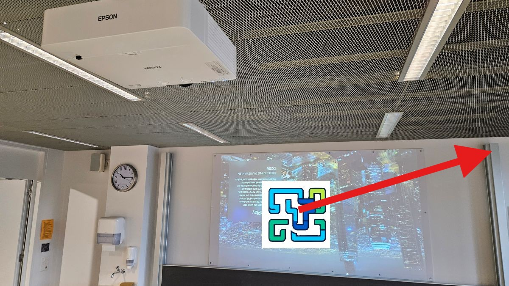
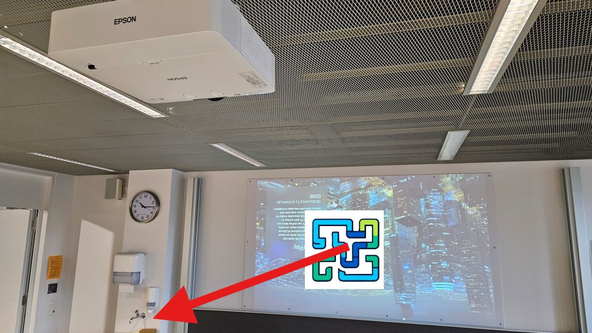
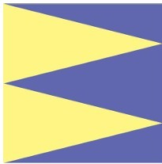
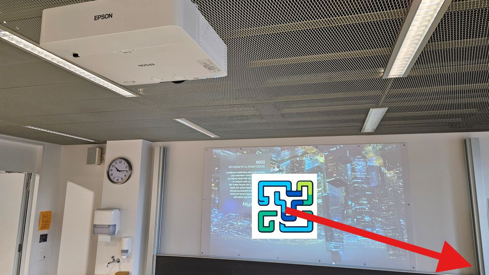
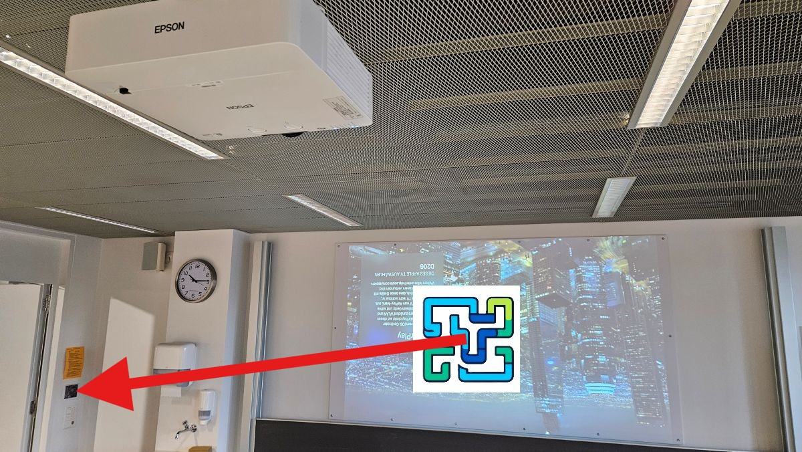

import { AdventureOption, AdventureOptions } from '@tdev-components/Adventure'

# Bilder verschlüsseln

Ein Bild ist ein Rechteck, das sich aus Zeilen und Spalten von Pixeln (Farbpunkte) zusammensetzt.

:::flex

::br

:::

Reto hat sich ein Verfahren zur Verschlüsselung von Bildern überlegt. Er verwendet dabei diese zwei Operationen:

## Operation H

**H** für horizontal

In Zeile 1 bleiben die Pixel unverändert. In Zeile 2 rückt jedes Pixel um 1 nach rechts. In Zeile 3 rückt jedes Pixel um 2 nach rechts.

> Jedes Pixel in der n-ten Zeile rückt um $n-1$ Spalten nach rechts.

Pixel, die dabei über den rechten Bildrand hinausrücken, werden in derselben Zeile links wieder eingefügt. Die Pixelreihenfolge wird dabei nicht verändert.

## Operation V

**V** für vertikal

> Jedes Pixel in der n-ten Spalte rückt um $n-1$ Zeilen nach unten.

Pixel, die über den unteren Bildrand hinausrücken, werden in derselben Spalte oben wieder eingefügt.

Die Operationen können hintereinander durchgeführt werden, als Folge. Im Beispiel hat Reto das Bild (25 x 25 Pixel) mit der Folge **HV** verschlüsselt (also Zuerst wurde Operation **H**, danach Operation **V** angewandt).

## Rätsel

Folgendes Bild wird mit **VH** verschlüsselt:

Wie sieht das Ergebnis aus?

<AdventureOptions>
  <AdventureOption label="a" nextGuessIn={65}>
    

    ---

    
  </AdventureOption>

  <AdventureOption label="b" nextGuessIn={65}>
    

    ---

    
  </AdventureOption>

  <AdventureOption label="c" nextGuessIn={65}>
    

    ---

    
  </AdventureOption>

  <AdventureOption label="d" nextGuessIn={65}>
    

    ---

    
  </AdventureOption>

  <AdventureOption label="e" nextGuessIn={65}>
    

    ---

    
  </AdventureOption>
</AdventureOptions>