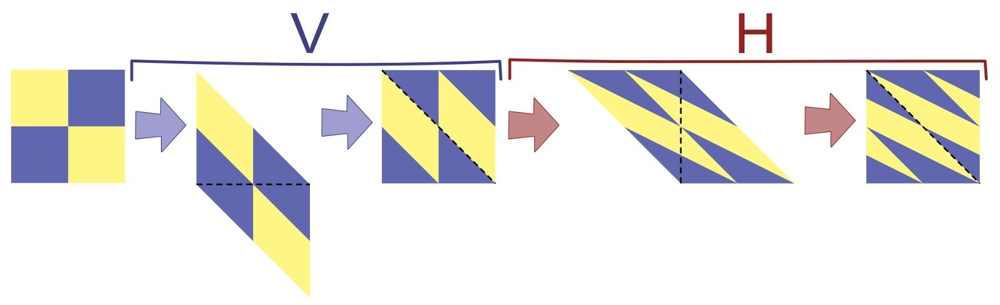
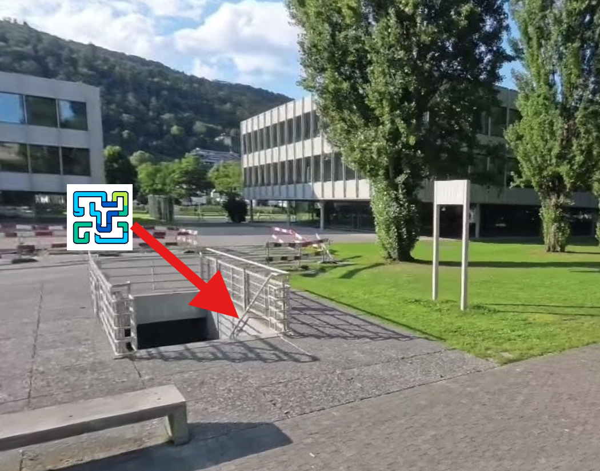

# Richtige Antwort

Du hast die richtige Antwort gefunden 🥳

## Lösung
Im Beispiel deutet die Verzerrung der Mona Lisa darauf hin, dass die Operation **H** geometrisch eine horizontale *Scherung* bewirkt und die Operation **V** eine vertikale *Scherung*.
Das Bild mit den vier farbigen Quadraten wird durch die Operation **V** zunächst nach unten *geschert*. Das Ergebnis ist eine Parallelogramm mit einem verzerrten Bild. Das überhängende Dreieck am unteren Rand wird oben eingefügt (durch *Parallelverschiebung*), so dass wieder ein rechteckiges Bild entsteht. In ähnlicher Weise erfolgt danach durch die Operation **H** eine Scherung nach rechts. Der Überhang wird links eingefügt:

Dieses Ergebnis der Verschlüsselung mit der Operationsfolge **VH** entspricht dem Bild aus Antwort **e**.

## Hintergrundinformationen zum Rätsel

Bei der Übertragung von Daten kann es wichtig sein, die Daten zu verschlüsseln. Sender\:in und Emp-
fänger\:in der Daten verabreden dazu, welches Verfahren zur Verschlüsselung (und zur Entschlüsselung)
verwendet wird. Wenn man kurz die Daten mit $D$ und das Verschlüsselungsverfahren mit $K$ (für
«Krypto») bezeichnet, kann man sagen, dass das Ergebnis der Anwendung von $K$ auf $D$ übertragen
wird, also $K(D)$. Der Empfänger muss dann den Entschlüsselungsteil des Verfahrens ($K'$) anwenden
und hat dann $K'(K(D)) = D$. So kann jemand, der die Übertragung von $K(D)$ beobachtet, die
originalen Daten $D$ nicht ohne Weiteres ermitteln.

Das Verschlüsselungsverfahren für Bilder aus dieser Aufgabe, mit den Operationen **H** und
**V**, hat den Vorteil, dass es einfach angewendet werden kann. Wenn der Empfänger den bei der
Verschlüsselung verwendeten Schlüssel, hier also die Operationsfolge (z. B. **HV**) kennt, kann er
die verschlüsselten Daten leicht entschlüsseln. Dennoch lässt das Ergebnis der Verschlüsselung das
Original mit dem Auge nicht mehr erkennen. Bei digitaler Übertragung der Daten kann aber mit
Hilfe von Computern gearbeitet und das Original relativ leicht entziffert (also: ohne Kenntnis des
Schlüssels ermittelt) werden.

Je höher der Sicherheitsanspruch an ein Verschlüsselungsverfahren ist, desto grösser ist oft der
Aufwand, der zur Ver- und Entschlüsselung betrieben werden muss (z. B. beim Rechenaufwand
und bei der Übermittlung eines komplexen geheimen Schlüssels zwischen Sender und Empfänger
der verschlüsselten Information). Die Informatik kennt aber moderne Verfahren, die wenig Aufwand
für Ver- und Entschlüsselung erfordern, die aber durch ihre besonderen (meist mathematischen)
Eigenschaften eine Entzifferung übertragener Daten praktisch unmöglich machen.

## Nächstes Rätsel

