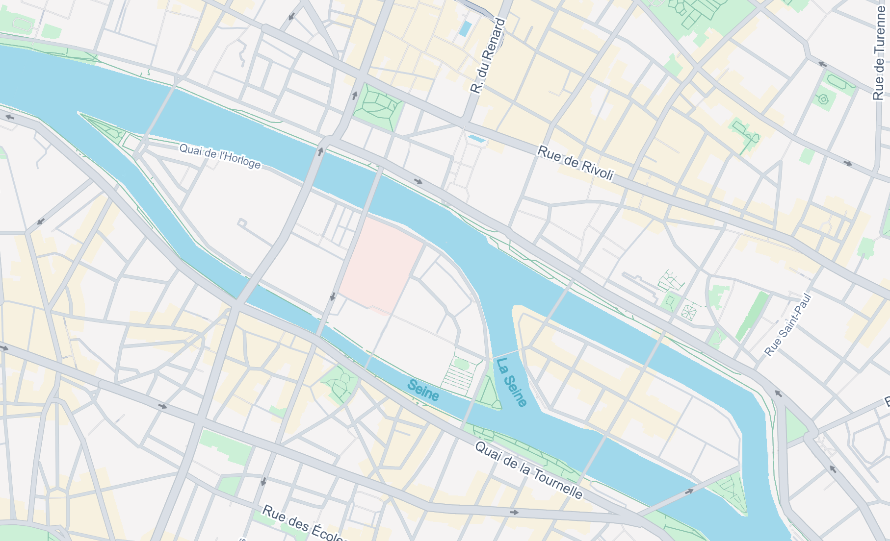
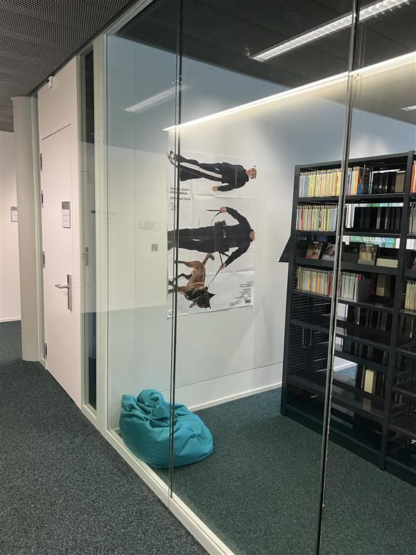
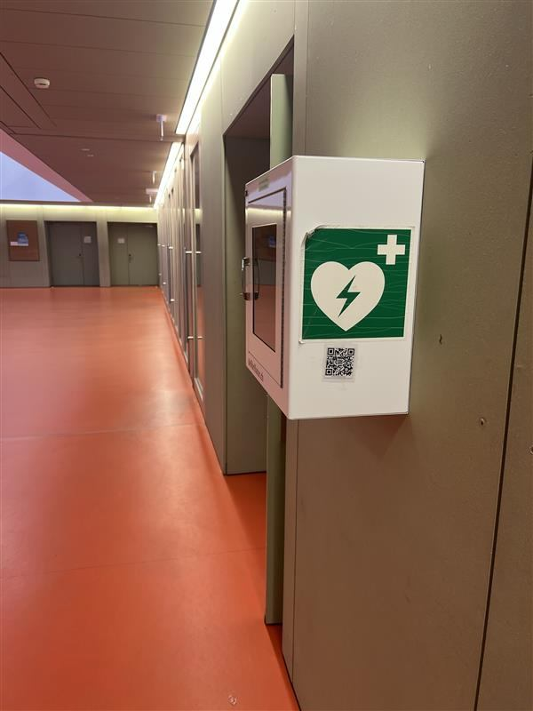
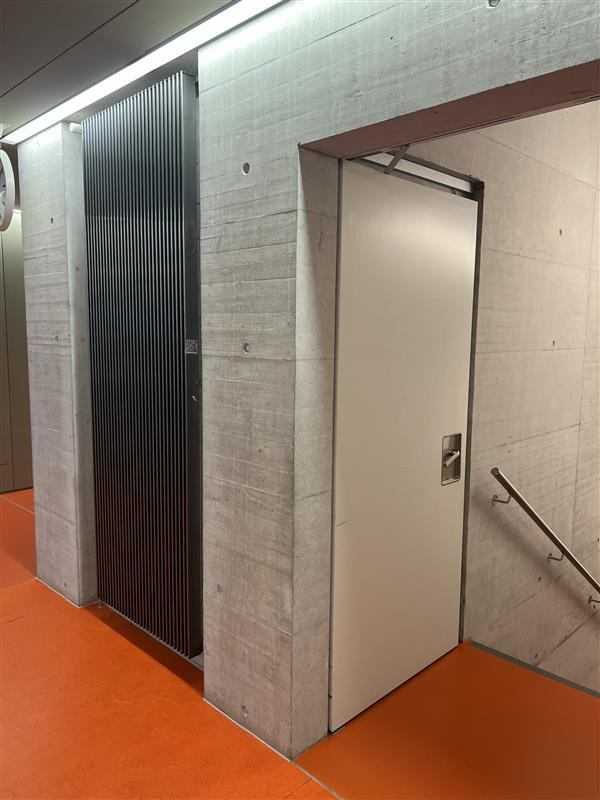
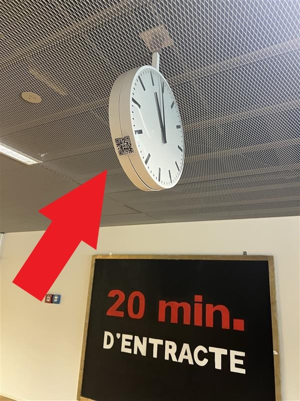

import { AdventureOptions, AdventureOption } from '@tdev-components/Adventure'

# Königsberger Brückenproblem

> von Fabian und Leo

Das Königsberger Brückenproblem ist ein berühmtes mathematisches Rätsel. Es beschäftigt sich mit folgender Frage:&#x20;

Ist es möglich einen Spaziergang durch die historische Stadt Königsberg so zu planen, dass man jede der sieben Brücken nur genau einmal überquert?

Bereits im 18. Jahrhundert untersuchte der Mathematiker **Leonhard Euler** dieses Problem und legte damit den Grundstein für ein wichtiges Gebiet der Mathematik, die **Graphentheorie**. Das Königsberger Brückenproblem kann man aber natürlich auch auf ähnlich aufgebaute Städte beziehen.

**Aufgabe:** Unterhalb findest du **fünf Varianten** eines Stadtplans der Stadt Paris, welche nur in der Anzahl der Brücken variieren. Du musst herausfinden, bei welchem der fünf Stadtpläne theoretisch ein Spaziergang möglich wäre, so dass man jede Brücke genau einmal überquert, und man schlussendlich wieder auf der gleichen Landmasse als Endpunkt angelangt (Rundgang). Wähle unterhalb die richtige Antwort **A, B, C, D oder E.**

(Das Wasser ist zu dreckig, da schwimmen wir nicht durch...)

### Karte A

### Karte B

### Karte C

### Karte D

### Karte E

## Antwortoptionen

<AdventureOptions>
  <AdventureOption label="A" nextGuessIn={1}>
    Karte A

    

    ---

    Ob Karte A die richtige Antwort ist, findest du heraus durch das scannen des QR-Codes im M-Gebäude, in der Bibliothek, hinten links neben diesem Poster.

    
  </AdventureOption>

  <AdventureOption label="B" nextGuessIn={1}>
    Karte B

    

    ---

    Ob Karte B die richtige Antwort ist, findest du heraus durch das scannen des QR-Codes am Kasten des Defibrillators im Foyer des G-Gebäudes.

    
  </AdventureOption>

  <AdventureOption label="C" nextGuessIn={1}>
    Karte C

    

    ---

    Ob Karte C die richtige Antwort ist, findest du heraus durch das scannen des QR-Codes an der Heizung rechts neben dem Treppenhaus des G-Gebäudes im 2. Stock.

    
  </AdventureOption>

  <AdventureOption label="D" nextGuessIn={1}>
    Karte D

    

    ---

    Ob Karte D die richtige Antwort ist, findest du heraus durch das scannen des QR-Codes unterhalb des Treppenhauses Richtung Strasse im Gebäude D im 1. UG.

    
  </AdventureOption>

  <AdventureOption label="E" nextGuessIn={1}>
    Karte E

    

    ---

    Ob Karte E die richtige Antwort ist, findest du heraus durch das scannen des QR-Codes an der Uhr vor dem Zimmer M902.

    
  </AdventureOption>
</AdventureOptions>

## Rubrik "Wer bin ich?"

:::warning[Wer bin ich?]
1. Manche Probleme scheinen unüberwindbar – so wie die sieben Brücken von Königsberg. Doch mit der richtigen Struktur kann man Wege erkennen, die vorher unsichtbar waren. Ähnlich wie jemand, der mit Strukturen arbeitete, die das Leben selbst definieren … Wer bin ich?
:::