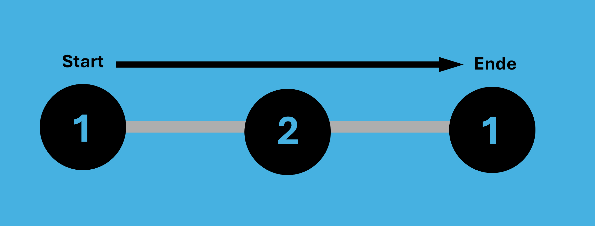
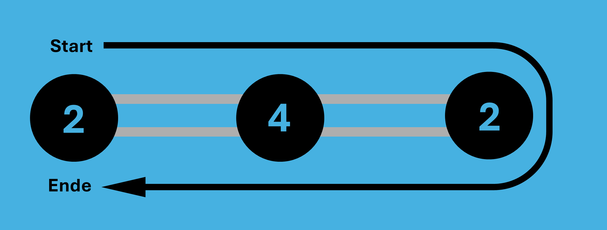
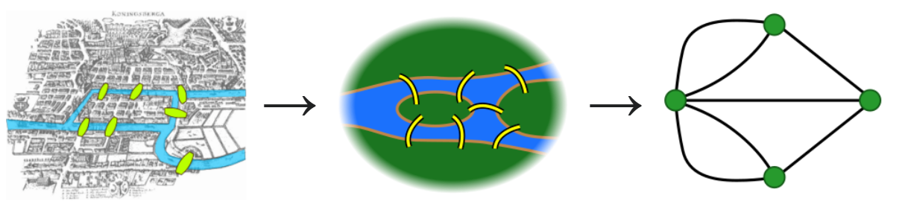
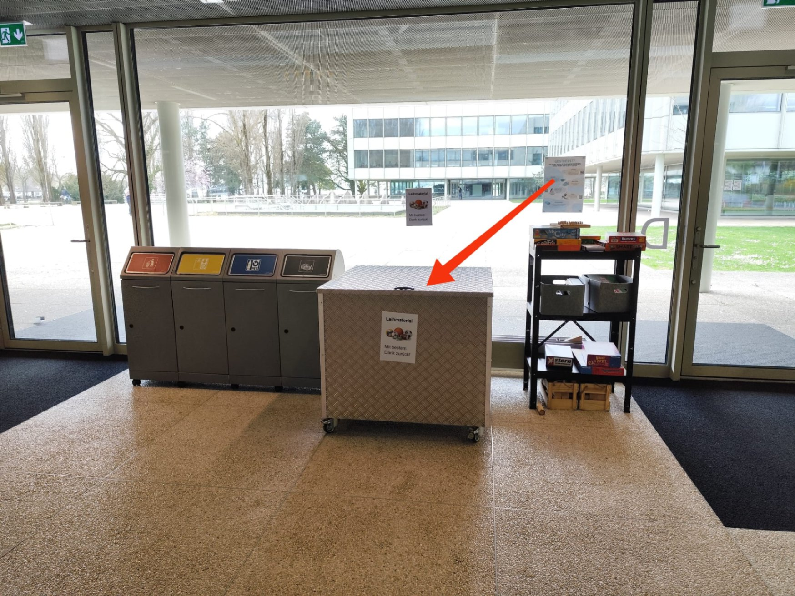

# Richtige Antwort

Du hast die richtige Antwort gefunden 🥳

Durch die mittelalterliche (Heute nicht mehr existierende) Stadt Königsberg floss der Fluss Pregel hindurch. Im Stadtzentrum gab es zwei Inseln, welche miteinander und den Flussufern durch insgesamt 7 Brücken verbunden waren. Der Mathematiker und Politiker Carl Ehler stellte sich als erstes die Frage, welche Strecke man gehen müsste, um alle 7 Brücken zu überqueren, ohne eine Brücke zweimal zu nehmen. Ehler bat den Mathematiker Leonhard Euler um 1736 um Rat, und dieser machte sich daran, einen Beweis zu suchen. Dabei begründete er ein neues Gebiet der Mathematik (Graphentheorie).

## Erklärung des Rätsels:

Das Problem bestand darin, einen Rundweg zu finden, der jede der sieben Brücken genau einmal passiert. Euler untersuchte 1736 dieses Problem und stellte fest, dass es keinen solchen Weg gibt. Er erkannte, dass die Lösung nicht von der genauen geografischen Lage der Brücken abhängt, sondern von der Anordnung und Verbindung der Brücken zwischen den Landmassen.

Genauer gesagt muss man eine Landmasse über eine Brücke betreten und über eine andere verlassen. Das heisst, die Anzahl Brücken, welche eine Landmasse berühren, müssten gerade sein. In Königsberg sind die Anzahl Brücken zu jeder Insel ungerade, d.h. es gibt keine Lösung. In der Graphentheorie sagt man den Landmassen **Knoten** und den Brücken **Kanten**.

Euler kam zum Schluss, dass es 2 Szenarien gibt:

1. Wenn 2 Knoten eine ungerade Anzahl Kanten haben (z.b. 1 Kante), ist der eine ungerade Knoten der Startpunkt und der andere der Endpunkt. Die restlichen Knoten in dem Szenario müssen eine gerade Anzahl Kanten haben.
   
2. Wenn alle Knoten eine gerade Anzahl Kanten haben, beginnt und endet der Weg an derselben Position. Einen solchen Rundgang nennt man auch einen **Eulerkreis**.
   

Eulerpfade bilden den Grundstein der heutigen Graphentheorie, einem ganz eigenen Gebiet der Mathematik. Dieses Muster mit Kanten und Knoten kann man im Alltag überall erkennen, zum Beispiel im altbekannten «Haus des Nikolaus» oder in den effizientesten Routen für die Müllabfahrt.

## Allgemeiner Lösungsweg:

Euler vereinfachte das Problem, indem er die Landmassen als Knoten und die Brücken als Kanten eines Graphen betrachtete. Er bewies, dass ein geschlossener Weg, der jede Kante genau einmal durchläuft (heute als Eulerkreis bekannt), nur dann existiert, wenn jeder Knoten eine gerade Anzahl von Kanten hat. Im Fall von Königsberg hatten jedoch alle vier Knoten eine ungerade Anzahl von Kanten, was einen Eulerkreis unmöglich machte.

**Die Karte vereinfachen zu Knoten und Geraden (siehe unten)**

Haben alle Knoten eine Gerade Anzahl von Kanten? --> Lösbar (Eulerkreis)

Haben alle Knoten eine Gerade Anzahl von Kanten ausser zweien? --> lösbar (Eulerpfad)

Haben 1 oder mehr als 2 Knoten eine ungerade Anzahl von Kanten? --> Nicht lösbar

---

## Weiter zum nächsten Rätsel
Wir hoffen, dass ihr beim lösen dieses Rätsels Spass hattet und etwas über Graphen und Eulerpfade gelernt habt. 
Dies ist jedoch nur das erste in einer Reihe von vielen. Den Start des zweiten Rätsels findet Ihr hier

