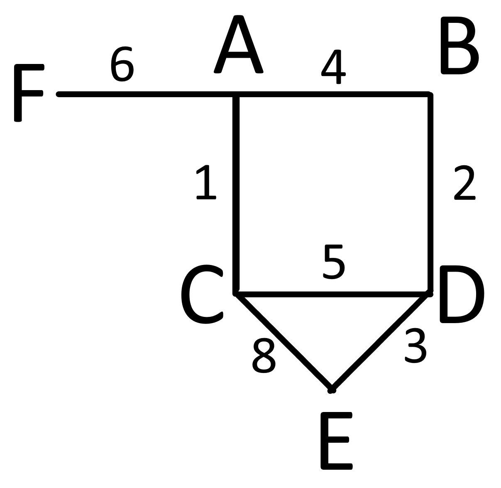
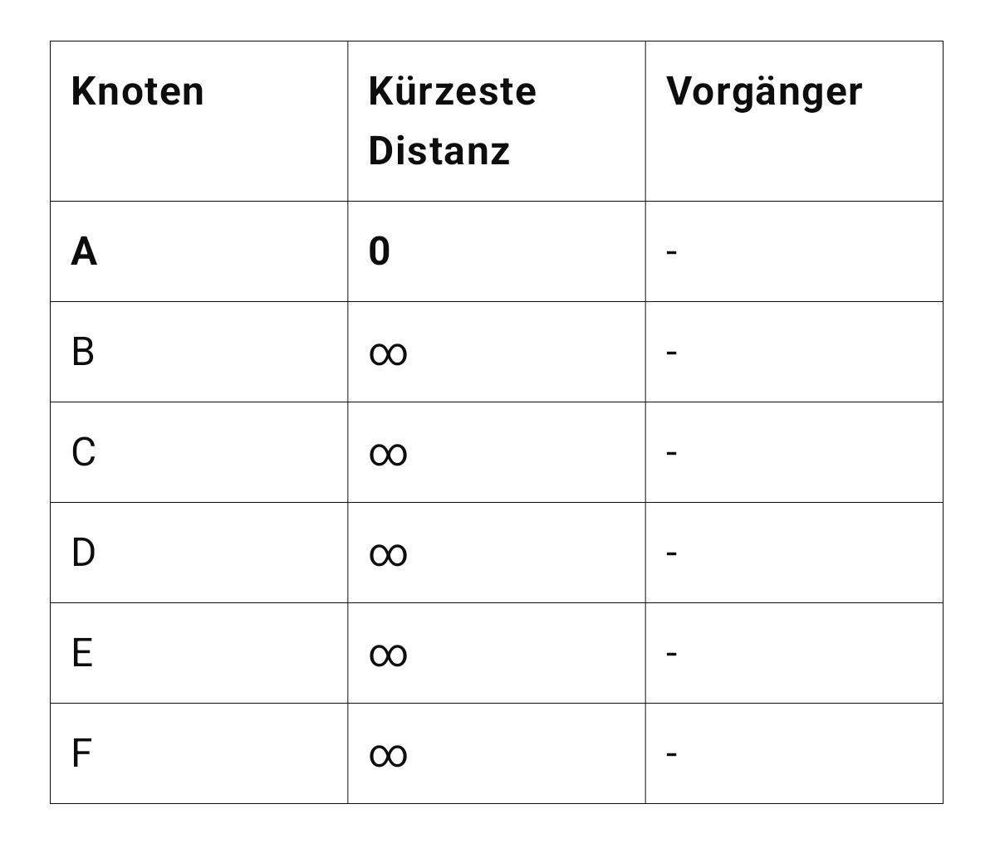
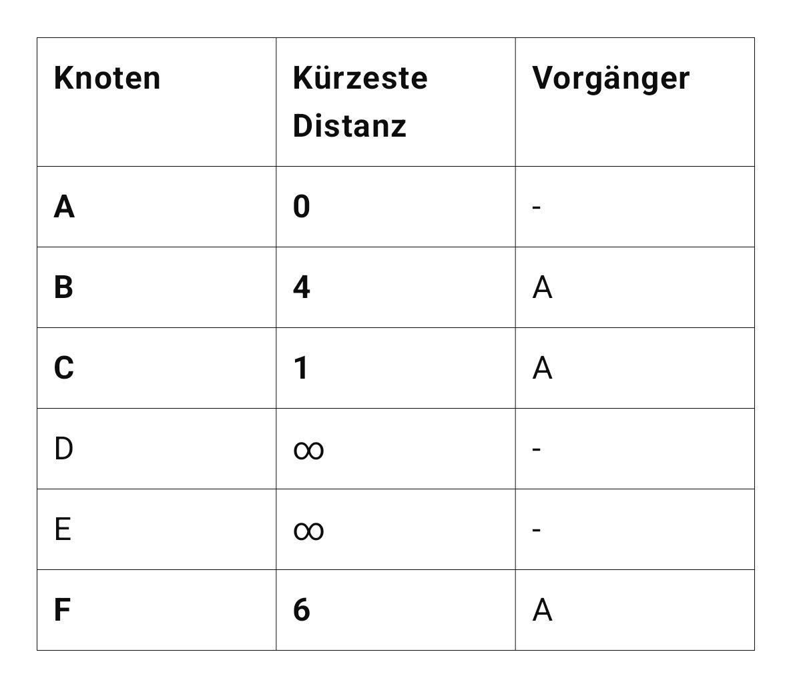
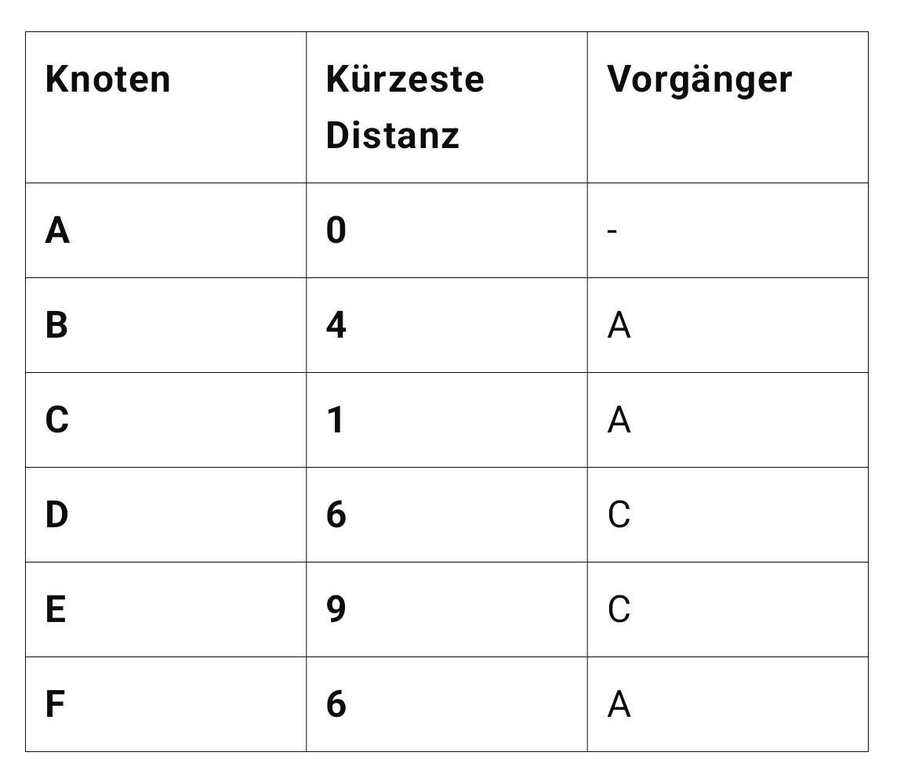
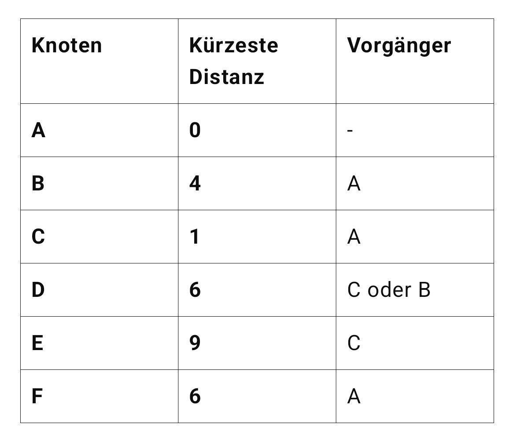
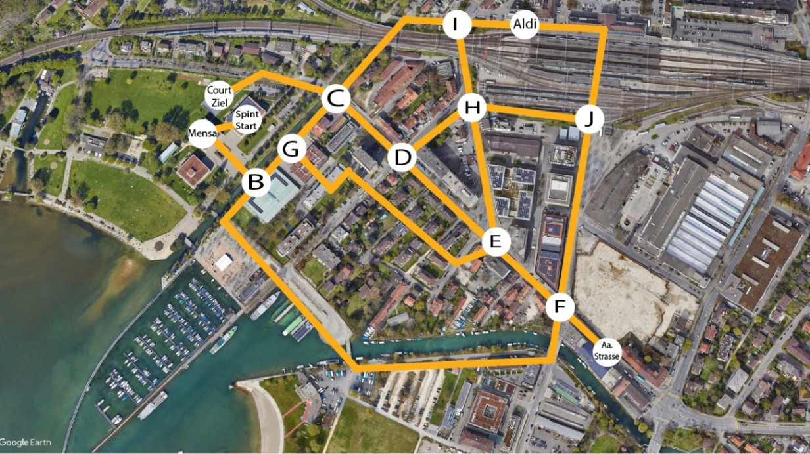
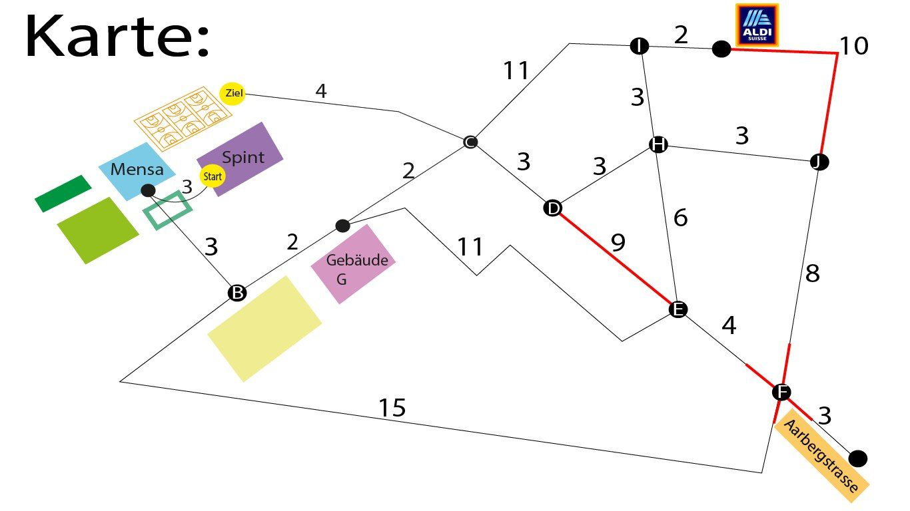

# Was ist Dijkstra Algorithm?

Der Dijkstra-Algorithmus ist ein Verfahren zur Bestimmung der kürzesten Wege in einem Graphen mit gewichteten Kanten. Er startet an einem Knoten und findet den schnellsten Weg zu allen anderen Knoten, indem er nach und nach die Entfernungen zu den benachbarten Knoten aktualisiert. Der Algorithmus wird häufig in Navigation und Netzwerkrouting verwendet, um den effizientesten Weg zu berechnen.

### 1️⃣ Initialisierung der Tabelle

A ist der Startknoten → Distanz 0

Alle anderen Knoten haben zuerst ∞ (unendlich)

### 2️⃣ Erste Iteration (Start bei A)

Von A aus gehen wir zu allen Nachbarn:

A → B = 4

A → C = 1

A → F = 6

👉 Wähle den Knoten mit der kleinsten Distanz → C (1 Schritt)

### 3️⃣ Zweite Iteration (Besuche C)

Von C aus:

C → D = 1 + 5 = 6

C → E = 1 + 8 = 9

👉 Wähle den Knoten mit der kleinsten Distanz → B (4 Schritte)

### 4️⃣ Dritte Iteration (Besuche B)

Von B aus:

B → D = 4 + 2 = 6 (bleibt gleich)

👉 Wähle den Knoten mit der kleinsten Distanz → D (6 Schritte)

### 5️⃣ Vierte Iteration (Besuche D)

Von D aus:

D → E = 6 + 3 = 9 (bleibt gleich)

👉 Wähle den Knoten mit der kleinsten Distanz → E (9 Schritte)

✅ E ist unser Ziel, Algorithmus fertig!

### 6️⃣ Endergebnis: Kürzester Weg von A nach E

Um den kürzesten Weg von A nach E zu rekonstruieren, schauen wir in die „Vorgänger“-Spalte zurück:

&#x20;E wurde über C erreicht → davor kam A

✔️ A → C → E (9 Schritte)

**Antwort**: Der kürzeste Weg von A nach E ist A → C → E mit einer Distanz von 9.

# Rätsel

## **Die perfekte Route für maximale Dunks!** :mdi[basketball]{.red spin="1.5s"}

Du willst nach der Schule noch genug Energie für Basketball haben, um alle auf dem Platz zu zerstören. Doch dein Tag ist vollgepackt – und je weniger du läufst, desto mehr Power hast du für deine Dunks!

## **Dein Tagesablauf:**

1️⃣ Start: Du beginnst am Spind.

2️⃣ Energie-Booster :mdi[fire]{.red}: Ein Cookie aus der Mensa gibt dir die nötige Power.

3️⃣ Unterricht :mdi[sleep]{.red}: Du hast Schule im G-Gebäude.

4️⃣ Snacks sichern :mdi[food]{.green}: Du brauchst noch Proviant aus dem Aldi.

5️⃣ Letzte Station :mdi[sleep]{.green}: Unterricht an der Aarbergstrasse.

6️⃣ Endlich Feierabend :mdi[party-popper]{.red}: Ab auf den Basketballplatz – mit maximaler Energie für deine Dunks!

## Karten

Hier ist die Karte von Biel mit den Zielen, wichtigen Punkten und allen Routes, die du brauchst:

Hier ist die vereinfachte Skizze mit allen Routes und den Energie-Credits:

## **Deine Mission**:&#x20;

Plane den kürzesten Weg, um alle deine Ziele zu erreichen. Welche Route wählst du? Nur eine der fünf Möglichkeiten ist die effizienteste – wählst du richtig, oder verschwendest du deine Energie-Credits? Berechne es mithilfe der gegebenen Karte und deines Taschenrechners.

