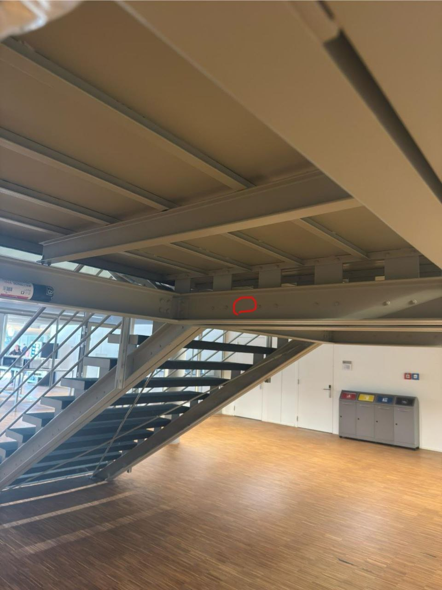

# Richtige Antwort

### Glückwunsch! Du hast das Rätsel gelöst! :mdi[fire]{.red spin="0.02s"}

Du hast dich erfolgreich durch das Labyrinth von Wegen und Abkürzungen navigiert und den kürzesten Pfad gefunden! Mit der optimalen Route sparst du wertvolle Energie und kannst am Ende des Tages auf dem Basketballplatz noch mehr dominieren. **Great job!** :mdi[basketball]{.red spin="0.5s"}

## Lösung

Du bist auf den kürzesten Weg gekommen, wenn du aber wissen willst, wie man diese Aufgabe mit dem Dijkstra Algorithmus löst, kannst du es von diesem Bild ablesen:

👉

## **Ein kurzer Blick in die Geschichte des Dijkstra-Algorithmus**

Der **Dijkstra-Algorithmus** wurde 1956 von **Edsger W. Dijkstra**, einem niederländischen Informatiker, entwickelt – und das innerhalb von nur **20 Minuten**! Er dachte sich das Verfahren während eines Urlaubs in den Niederlanden aus, als er überlegte, wie man den kürzesten Weg zwischen Städten auf einer Karte finden könnte.

Sein ursprünglicher Algorithmus wurde 1959 offiziell veröffentlicht und war ein Meilenstein in der Informatik. Dijkstra selbst sagte später, dass er anfangs nicht an Computer dachte, sondern einfach nur eine mathematische Lösung für das Problem der kürzesten Wege suchte.

Heute ist sein Algorithmus aus vielen technischen Anwendungen nicht mehr wegzudenken – sei es in **Navigationssystemen, Netzwerktechnologien oder künstlicher Intelligenz**. Sein Werk hat die Informatik nachhaltig geprägt, und sein Algorithmus ist eines der **grundlegendsten Konzepte der Graphentheorie**.

## Nächstes Rätsel

Scanne nun diesen QR-Code, um zum nächsten Rätsel zu kommen!

