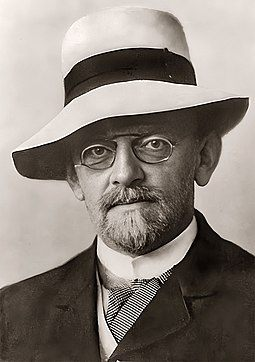
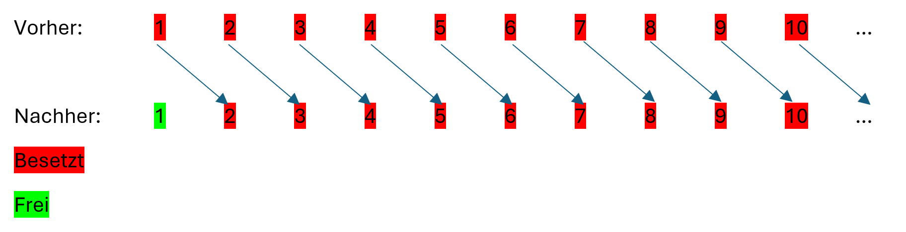
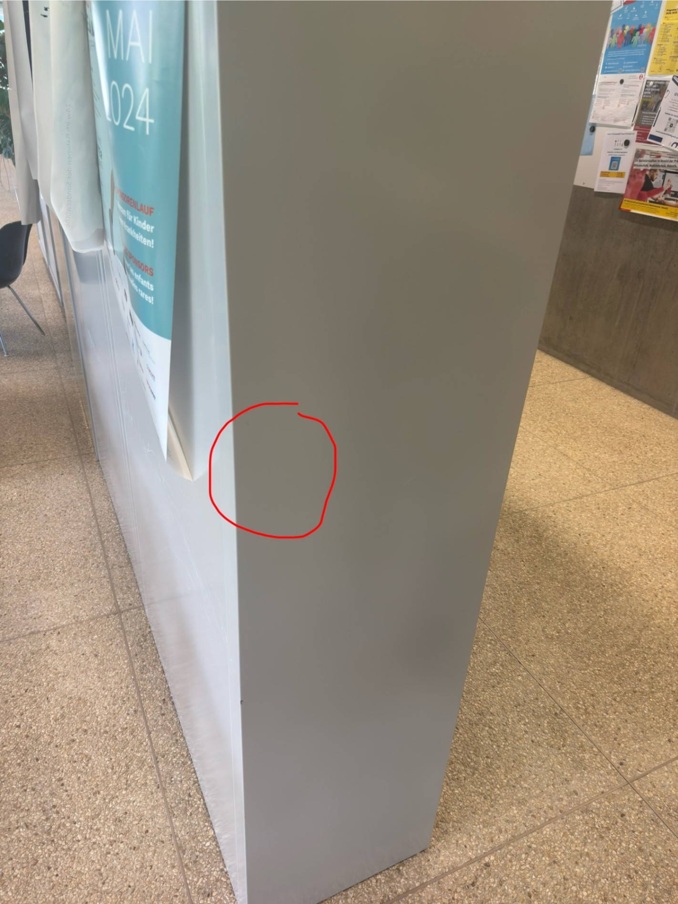
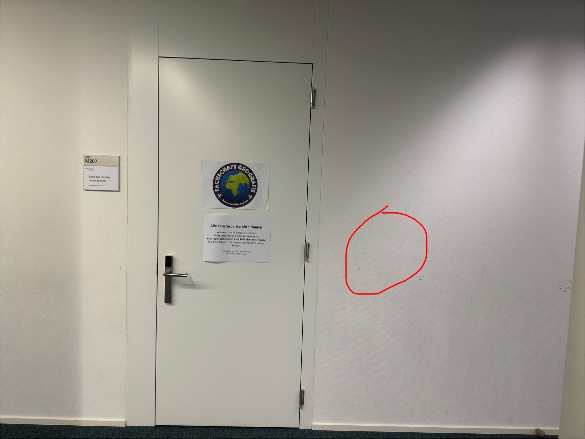
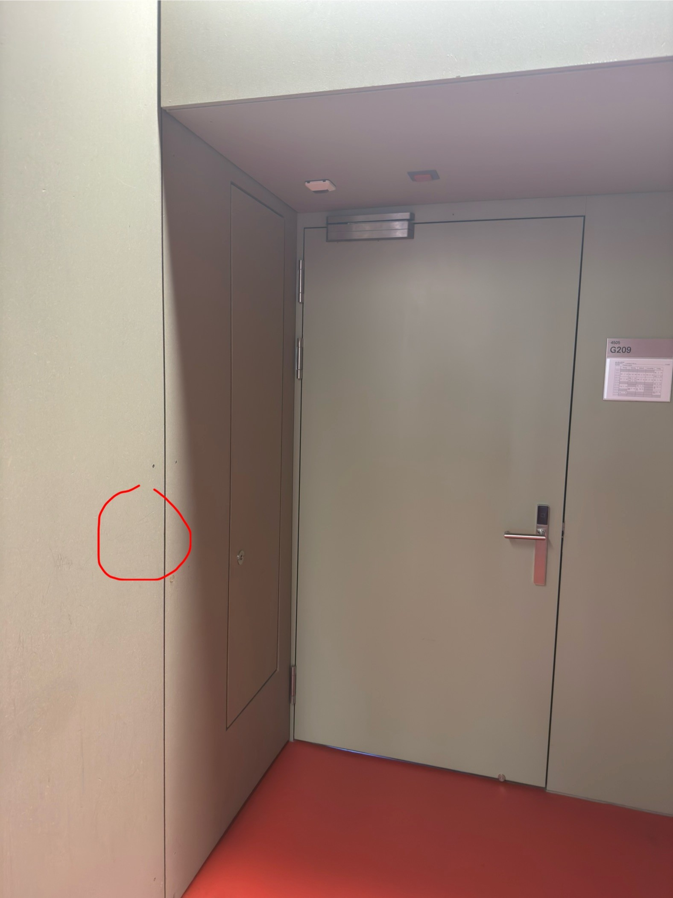
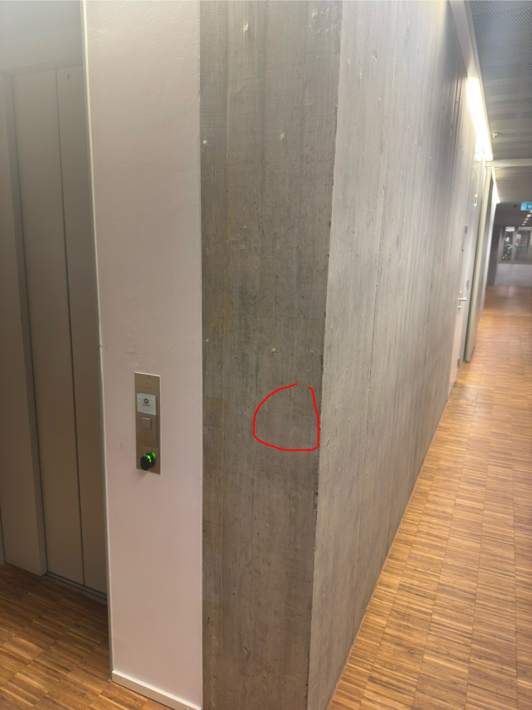

import { AdventureOptions, AdventureOption } from '@tdev-components/Adventure'

# David Hilbert und sein unendliches Hotel

von Benjamin H. und Jacy C.

---

**David Hilbert** gilt bis heute als einer der bedeutendsten Mathematiker der Neuzeit. Er wurde am 23.01.1862 in eine wohlhabende Familie in Königsberg geboren. Er besuchte renommierte Schulen und entwickelte schon früh ein Interesse für die Wissenschaft, insbesondere für die Mathematik, für welche sich schon seine Mutter interessierte. So studierte er 1880 Mathematik an der *Albertus-Universität* in Königsberg. Aber was macht ihn zu einem der **bekanntesten Mathematikern** der Neuzeit?

Hilbert erfand ein Axiomensystem für den euklidischen Raum. Es spielt jetzt keine Rolle, was genau das ist, aber viele Mathematiker waren auf der Suche danach und hielten es für notwendig, eins zu finden.&#x20;
In 1900 postulierte Hilbert **23 Probleme** aus allen Teilgebieten der Mathematik, die damals ungelöst waren. In 2012 galten 15 davon als gelöst, 3 als ungelöst und 5 als prinzipiell unlösbar.
Am 20. November 1915 reichte Hilbert eine Arbeit zur allgemeinen Relativitätstheorie ein, also **5 Tage vor Einstein.** Zu dieser Zeit war die allgemeine Relativitätstheorie noch nicht bekannt, nur die Spezielle. In Einsteins Arbeit waren aber auch die Einsteinschen Feldgleichungen enthalten, die als essenziell für die Relativitätstheorie gelten. Einstein und Hilbert haben sich aber nie gestritten und respektierten ihre jeweiligen Arbeiten.

In unserem Rätsel geht es um ein Gedankenexpeiment, das von Hilbert geschaffen wurde. Stell Dir ein Hotel vor, welches **unendlich viele Zimmer** hat und **vollständig besetzt** ist. Was kann die Rezeption tun, wenn ein neuer Gast ein Zimmer beziehen möchte?
Die Antwort ist einfach. Die Rezeption kann jeden Gast im Hotel um **ein Zimmer nach rechts** versetzen. Also der Gast aus Zimmer 1 geht in Zimmer 2, der Gast aus Zimmer 2 geht in Zimmer 3, der Gast aus Zimmer 3 in Zimmer 4, und so weiter. Die Rechnung lautet:&#x20;
Neue Zimmernummer = Zimmernummer + 1

Was kann die Rezeption tun, wenn 8 neue Gäste ein Zimmer beziehen möchten? Das Prinzip bleibt dasselbe. **Jeder Gast geht 8 Zimmer weiter**. Der Gast aus Zimmer 1 geht in Zimmer 9, der Gast aus Zimmer 2 geht in Zimmer 10, und so weiter.&#x20;
Es gilt also für jede endliche, natürliche Anzahl an Gästen:&#x20;
**Neue Zimmernummer = Aktuelle Zimmernummer + Anzahl neuer Gäste**

:::details[Mathematischere Darstellung]
$$
\begin{aligned}
n &:\quad \text{aktuelle Zimmernummer}\\
A &:\quad \text{Anzahl neuer Gäste}\\
N &:\quad \text{neue Zimmernummer}\\
&\\
N &= n + A
\end{aligned}
$$
:::

Was kann die Rezeption unternehmen, wenn vor dem Hotel **ein** Bus hält mit **unendlich vielen** Gästen? Die Antwort ist auch hier recht simpel. Die Gäste beziehen das Zimmer, das die **doppelt so hohe Nummer** hat wie ihr jetziges Zimmer. So geht der Gast aus Zimmer 1 in Zimmer 2, der Gast aus Zimmer 2 in Zimmer 4, der Gast aus Zimmer 3 in Zimmer 6, und so weiter. Dadurch werden alle Zimmer mit einer **geraden Nummer besetzt**, alle Zimmer mit einer **ungeraden Nummer frei**. Alle Gäste aus dem Bus können in den ungeraden Zimmern untergebracht werden.&#x20;
Es gilt also für unendlich viele Gäste:
**Neue Zimmernummer = 2 x Aktuelle Zimmernummer**

:::details[Mathematischere Darstellung]
$$
\begin{aligned}
    n &:\quad \text{aktuelle Zimmernummer}\\
    N &:\quad \text{neue Zimmernummer}\\
      &\text{}\\
    N &= 2 \cdot n
\end{aligned}
$$
:::

Nun kommen wir zur Rätselfrage:
**Was kann die Rezeption tun, wenn unendlich viele Busse mit jeweils unendlich vielen Gästen kommen?**

:::details[Hinweis]
Die Mengen sind unendlich abzählbar. Das heisst, sie können theoretisch mit den Natürlichen Zahlen durchnummeriert werden.
:::

<AdventureOptions>
  <AdventureOption label="I" nextGuessIn="60">
    Die Rezeption kann nichts tun; es ist unmöglich.

    ---

    Ob diese Antwort stimmt, findest du beim QR-Code hier:

    
  </AdventureOption>

  <AdventureOption label="II" nextGuessIn="60">
    Man multipliziert die Zimmernummer wieder mit 2, sodass alle ungeraden Zimmer frei sind. Danach belegt man alle Zimmer mit Nummern, welche ungerade Primzahlen sind und ihre Potenzen mit den Gästen aus einem Bus.

    $$
    \begin{aligned}
        k &\quad \in \quad \N \\
        p &\quad \text{ist eine Primzahl}
        &\quad\\
        &\quad\\
        &\quad \text{Zimmernummern für Bus 1: }&\quad 3^k\\
        &\quad \text{Zimmernummern für Bus 2: }&\quad 5^k\\
        &\quad \text{Zimmernummern für Bus 3: }&\quad 7^k\\
        &\quad \text{Zimmernummern für Bus 4: }&\quad 11^k\\
        &\quad \text{und so weiter...}&\\
        &\quad \text{Allgemein gilt: } p^k\\
    \end{aligned}
    $$

    ---

    Ob diese Antwort stimmt, findest Du beim QR-Code hier:

    
  </AdventureOption>

  <AdventureOption label="III" nextGuessIn="60">
    Jeder Gast geht in das Zimmer, welche eine doppelt so hohe Zimmernummer hat. Dadurch sind alle schon vorhandenen Gäste in den geraden Zimmernummern. Die neuen Gäste beziehen die ungeraden Zimmernummern und ihre Potenzen, damit alle Gäste aus allen Bussen Platz haben.

    $$
    \begin  {aligned}
        &n \quad \text{Aktuelle Zimmernummer}\\
        &k \quad \in \quad \N\\
        &\\
         \quad &\text{Jeder Gast geht ins folgende Zimmer}: 2n\\
         &\\
         \quad &\text{Gäste aus Bus 1 gehen in}: 3^k\\
         \quad &\text{Gäste aus Bus 2 gehen in}: 5^k\\
         \quad &\text{Gäste aus Bus 3 gehen in}: 7^k\\
         \quad &\text{Gäste aus Bus 4 gehen in}: 9^k\\
         \quad &\text{und so weiter...}\\
         \quad &\text{Allgemein gilt}: (2n+1)^k
        &\\
    \end{aligned}
    $$

    ---

    Ob diese Antwort stimmt, findest Du beim QR-Code hier:

    
  </AdventureOption>

  <AdventureOption label="IV" nextGuessIn="60">
    Jeder Gast nimmt das Zimmer mit der 3fachen Nummer seiner aktuellen Zimmernummer. Also Zimmer 1 geht in Zimmer 3, Zimmer 2 geht in Zimmer 6, Zimmer 3 geht in Zimmer 9, und so weiter. Die neuen Gäste gehen nun in die Potenzen der nicht 3er-Reihen Zahlen.

    $$
    \begin{aligned}
       & n \quad \text{Aktuelle Zimmernummer}\\
       &k \quad \in \quad \N\\
        \\
       & \text{Die Gäste gehen in folgendes Zimmer}:\quad 3n\\
        \\
       & \text{Gäste aus Bus 1 gehen in:} \quad 1^k\\
       & \text{Gäste aus Bus 2 gehen in:} \quad 2^k\\
       & \text{Gäste aus Bus 3 gehen in:} \quad 4^k\\
       & \text{Gäste aus Bus 4 gehen in:} \quad 5^k\\
       & \text{Gäste aus Bus 5 gehen in:} \quad 7^k\\
       & \text{und so weiter...}\\
       
    \end{aligned}
    $$

    ---

    Ob diese Antwort stimmt, findest Du beim QR-Code hier:

    
  </AdventureOption>
</AdventureOptions>

## Rubrik "Wer bin ich?"

:::info[Wer bin ich?]
Wir beide hatten grosse Visionen, aber ihre vollständige Umsetzung oder Anerkennung erlebten wir nicht mehr: Hilberts Traum von einem vollständigen, widerspruchsfreien mathematischen System wurde widerlegt. Ich starb, bevor ich Anerkennung für meine Arbeit erhielt… Wer bin ich?
:::

