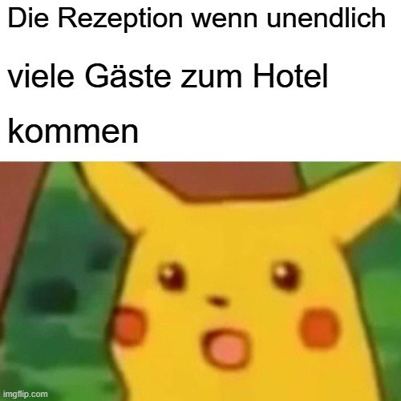

# Falsche Antwort

Schade Marmelade, leider daneben.&#x20;

Mit dieser Lösung würden Zimmer doppelt belegt werden, da zum Beispiel $\ 3^2 = 9^1 = 9$

Hier ein Meme zum Aufheitern:&#x20;

Zurück zum [Rätsel](https://mint-26e.gbsl.website/fkqzke)