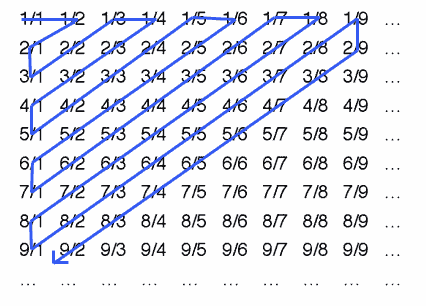

# Richtige Antwort

Bravo! Du lagst richtig. Die Lösung war:
Man multipliziert die Zimmernummer wieder mit 2, so dass alle ungeraden Zimmer frei sind. Danach belegt man alle ungeraden Zimmer und ihre Potenzen mit den Gästen aus einem Bus.

$$
\text{n = Zimmernummer}\\
\text{k ist ein Element der Natürlichen Zahlen}\\
\text{}\\
\text{Zimmernummer für Bus 1: } 3^k\\
\text{Zimmernummer für Bus 2: } 5^k\\
\text{Zimmernummer für Bus 3: } 7^k\\
\text{und so weiter}\\
\text{}\\
\text{Zimmernummer allgemein: } (2n+1)^k\\
$$

Wenn man dies tut, hat man unendlich viele ungerade Zahlen zur Verfügung, welche alle jeweils unendlich viele Potenzen haben. So können unendlich viele Gäste aus einem Bus zu einer Zahl und ihrer Potenzen, während alle Gäste aus dem nächsten Bus zur nächsten ungeraden Zahl und ihren Potenzen gehen können.

Hilberts Hotel lässt sich noch mehr erweitern. Wenn **überabzählbar** unendlich viele Busse kommen, kann man keinen Platz für alle Gäste schaffen. Anhand Hilberts Hotel kann man die Grössen von Unendlichkeiten verbildlichen. Es gibt also tatsächlich **Unendlichkeiten, welche grösser als andere Unendlichkeiten sind**. Es zeigt auch auf, dass Unendlichkeit **keine Zah**l ist, sondern eher **ein Konzept**.&#x20;
Eine überabzählbare Unendlichkeit ist eine Unendlichkeit, die man nicht abzählen kann. Zum Beispiel kann man die natürlichen Zahlen abzählen: 1, 2, 3, 4, 5, 6, .... Dasselbe geht mit den ganzen Zahlen: 0, 1, -1, 2, -2, 3, -3, .... Dabei muss man beim Zahlenstrahl herumspringen, um alle Zahlen zu erreichen. Auch bei den rationalen Zahlen kann man ein solches Schema aufbauen:&#x20;

Dasselbe ist aber nicht möglich mit den reellen Zahlen; sie sind **überabzählbar**. Das heisst, die reellen Zahlen sind irgendwie grösser als die natürlichen, ganzen und rationalen Zahlen. Das ganze kann in sogenannten **Kardinalzahlen**, einer Schreibweise für die Mächtigkeit von unendlichen Mengen, also für die Anzahl an Elementen einer unendlichen Menge, dargestellt werden. Dabei ist die **kleinste Kardinalzahl** $\aleph_0$, welche die Mächtigkeit der natürlichen, ganzen und rationalen Zahlen beschreibt. (Das Zeichen nennt man Aleph und es ist der erste Buchstabe des hebräischen Alphabets.) Man kann also sagen, dass diese Zahlenmengen gleich gross sind. Deshalb kann man auch so viele Gäste in Hilberts Hotel unterbringen. Wenn aber überabzählbar unendlich viele Gäste kommen, also die Unendlichkeit nicht mehr der Kardinalität $\aleph_0$ entspricht, können wir die Gäste nicht im Hotel unterbringen.

Georg Cantor, der Erfinder der Mengenlehrer und der Kardinalzahlen, schrieb über eine theoretische, absolute Unendlichkeit $\Omega$, dass sie, falls sie existiere, mit Gott verknüpft werden solle. Es ergibt mehr Sinn, diese absolute Unendlichkeit als theologisches oder philosophisches Konzept aufzufassen, da sie mit der Mathematik nicht mehr so viel zu tun hat.

## Nächstes Rätsel