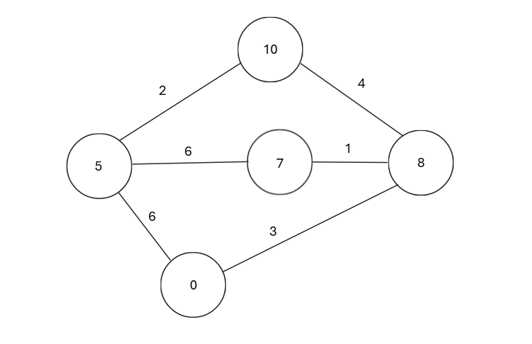

import NodeGraph from '@site/src/components/NodeMap'

# A\*

Der A-Stern-Algorithmus ist eine Methode zur Bestimmung des kürzesten Weges zu einem bestimmten Ziel. Es ist eine Weiterentwicklung des Dijkstra-Algorithmus, bei dem zusätzlich die geschätzte Entfernung in Luftlinie berücksichtigt wird. Dabei addiert man die Gesamtkosten des zurückgelegten Weges bis zum aktuellen Knoten (dies entspricht g) und die geschätzte Entfernung des aktuellen Knotens zum Ziel (dies entspricht h). Dies ergibt den Wert des aktuellen Knotens (dies entspricht f). Beim A-Stern-Algorithmus wählt man stets den Knoten mit dem tiefsten f-Wert aus. Falls zwei Knoten denselben f-Wert haben, wird der Knoten mit dem tieferen h-Wert bevorzugt. Durch die Kombination von tatsächlichem Weg und geschätzter Entfernung findet der Algorithmus den optimalen Pfad effizienter.

**f (n) = g (n) + h (n)**

Machen wir zusammen ein Beispiel durch:

Man fängt beim obersten Knoten an. Sein h beträgt 10. Man hat 2 Optionen. Der Weg zum linken Knoten kostest 2 und der Knoten hat eine Entfernung zum Ziel von 5. f = g + h = 7. Auf der rechten Seite kostet der Weg 4 und der Knoten hat eine Entfernung von 8. f = 12. Da das f auf der linken Seite tiefer ist, geht man zu diesem Knoten. Von dem neuen Knoten aus hat man 3 Optionen. Zurück zum Knoten 10, wahrscheinlich will man das nicht, zum Knoten 7, oder zum Knoten 0. Zum Knoten 7 kostet es 2 + 6. f = 15. Zum Knoten 0 kostest es 2 + 6. f = 8. Der schnellste Weg ist also über die Knoten 10-5-0.

Jetzt bist du gefragt! Füre den A\*-Algorithmus mithilfe des Grafens unten durch, wenn du auf einen Knoten tippst siest du den Ort dieses Knotens. Alle knoten befinden sich auf dem selben Stockwerk. **Schreibe dir auf welche Knoten du besuchst und in welcher reihenfolge du diese besuchst!**

<NodeGraph newNodes={['S', 'A', 'B']} newEdges={['eS-A','eS-B']} initializeNew />