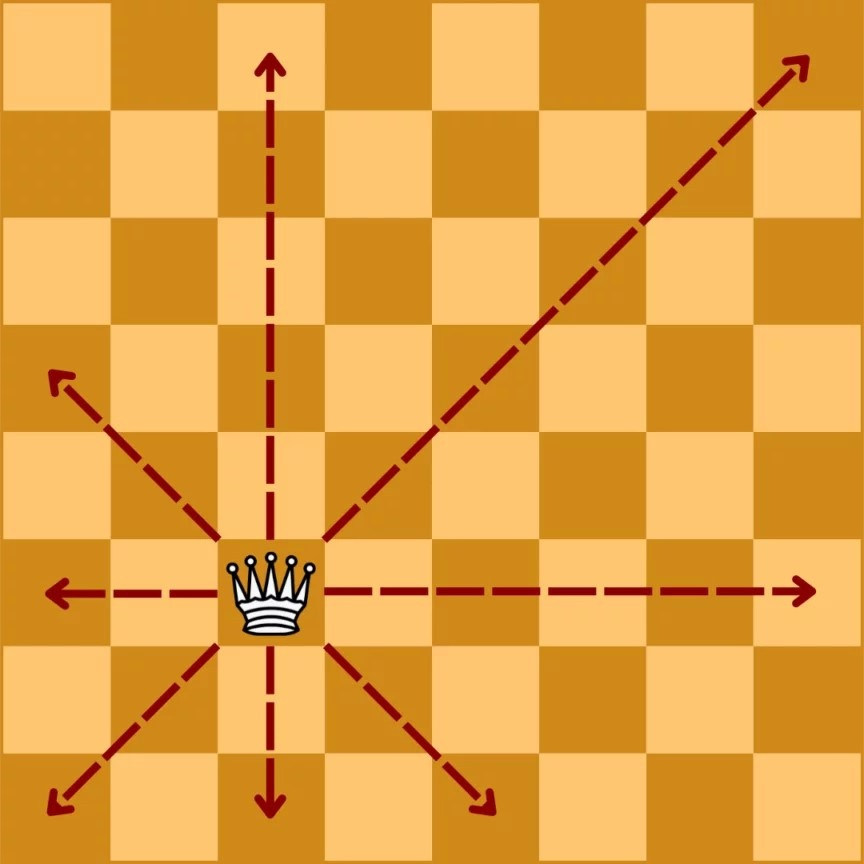
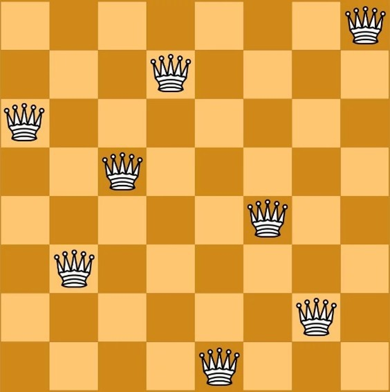

import { AdventureOptions, AdventureOption } from '@tdev-components/Adventure'

import Board from './Checkerboard'

# N-Damen-Problem

by Aviva und Sanja

## **Was ist das Damenproblem ?**

Bei dem Damenproblem handelt es sich um ein Mathematisches Problem, dass auf den bestehenden Schachregeln beruht.

Gegeben ist ein quadratisches Schachbrett, das mindestens n > 3 Felder groß sein muss. Auf diesem wird nun in jeder Spalte eine Dame platziert. Diese Damen müssen so platziert werden, dass sie sich horizontal, vertikal oder diagonal beliebig weit bewegen können, ohne sich gegenseitig zu schlagen.

Für ein n x n Schachbrett muss man n Damen platzieren. Eine mögliche Lösung für ein 8 x 8 Schachbrett ist:&#x20;

## **Rätsel**

Auf dem Schachbrett sind bereits 4 Damen platziert. Platziere die restlichen 4 Damen so, dass sie den Anforderungen des Damenproblems entsprechen.

<Board initialQueens={[{ row: 0, col: 6 },{ row: 3, col: 2 },{ row: 4, col: 0 },{ row: 7, col: 4 }]} />

<AdventureOptions>
  <AdventureOption label="1" nextGuessIn={6}>
    Antwort

    ---

    Standort des QR-Codes

    .jpeg)
  </AdventureOption>

  <AdventureOption label="2" nextGuessIn={6}>
    Antwort

    ---

    Ort des Standortes

    .jpeg)
  </AdventureOption>

<AdventureOptions>
  <AdventureOption label="3" nextGuessIn={6}>
    Antwort

    ---

    Standort des QR-Codes

  </AdventureOption>

  <AdventureOption label="4" nextGuessIn={6}>
    Antwort

    ---

    Ort des Standortes

  </AdventureOption>

 <AdventureOption label="5" nextGuessIn={6}>
    Antwort

    ---

    Ort des Standortes

  </AdventureOption>
</AdventureOptions>