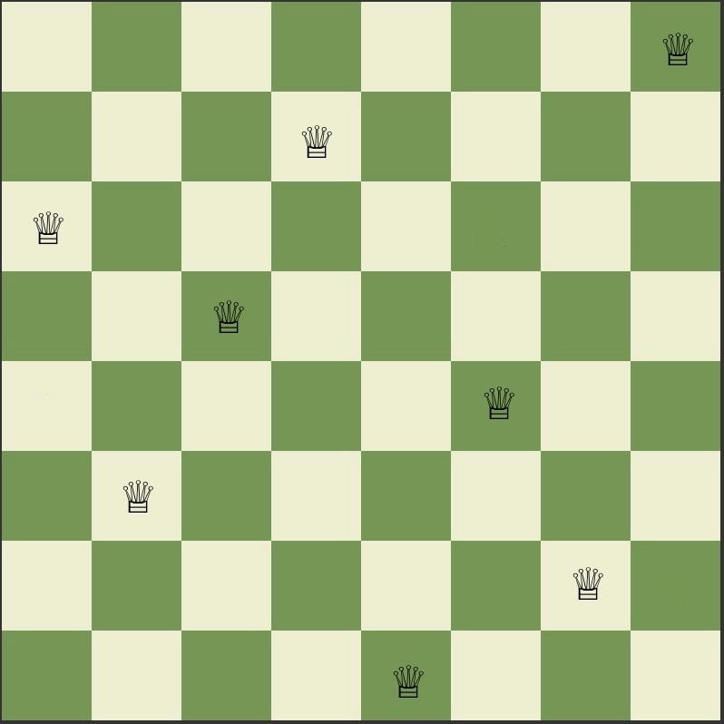
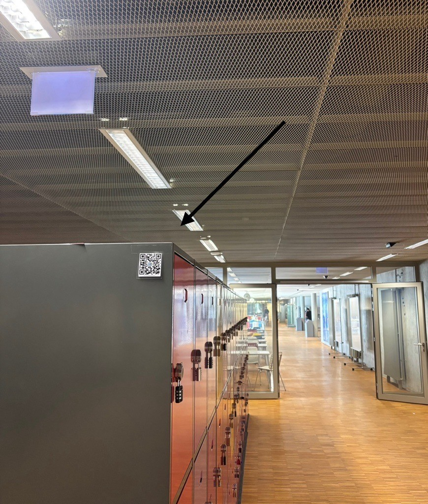
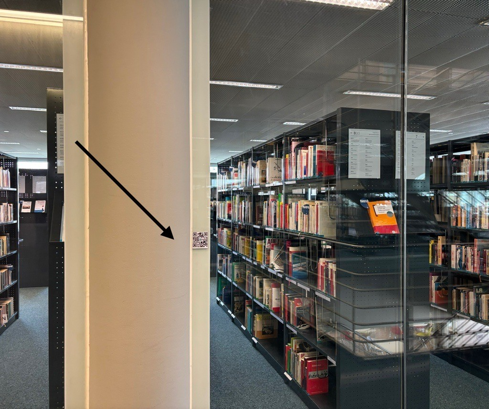

import { AdventureOptions, AdventureOption } from '@tdev-components/Adventure'

import Board from './Checkerboard'

# N-Damen-Problem

by Aviva und Sanja

## Was ist das Damenproblem ? [^2]

Bei dem Damenproblem handelt es sich um ein mathematisches Problem, dass auf den bestehenden Schachregeln beruht.

Gegeben ist ein quadratisches Schachbrett, das mindestens n > 3 Felder gross sein muss. Auf diesem wird nun in jeder Spalte eine Dame platziert. Diese Damen müssen so platziert werden, dass sie sich horizontal, vertikal oder diagonal beliebig weit bewegen können, ohne sich gegenseitig zu schlagen. Das bedeutet, die platzierten Damen dürfen nicht in der gleichen Reihe, der gleiche Spalte und der gleichen Diagonalen stehen.

Für ein n x n Schachbrett muss man n Damen platzieren. Eine mögliche Lösung für ein 8 x 8 Schachbrett ist:&#x20;

## Rätsel

Auf dem Schachbrett sind bereits 4 Damen platziert. Platziere die restlichen 4 Damen so, dass sie den Anforderungen des Damenproblems entsprechen. Kontrolliere deine Lösung mit der gegebenen Nummer.

<Board initialQueens={[{ row: 0, col: 6 },{ row: 3, col: 2 },{ row: 4, col: 0 },{ row: 7, col: 4 }]} />

<AdventureOptions>
  <AdventureOption label="1" nextGuessIn={30}>
    Antwort

    ---

    Ob deine Antwort richtig ist, findest du heraus, wenn du diesen QR-Code scannst.&#x20;

    
  </AdventureOption>

  <AdventureOption label="2" nextGuessIn={30}>
    Antwort

    ---

    Ob deine Antwort richtig ist, findest du heraus, wenn du diesen QR-Code scannst.&#x20;

    
  </AdventureOption>

  <AdventureOption label="3" nextGuessIn={30}>
    Antwort

    ---

    Ob deine Antwort richtig ist, findest du heraus, wenn du diesen QR-Code scannst.&#x20;

    
  </AdventureOption>

  <AdventureOption label="4" nextGuessIn={30}>
    Antwort

    ---

    Ob deine Antwort richtig ist, findest du heraus, wenn du diesen QR-Code scannst.&#x20;

    
  </AdventureOption>

  <AdventureOption label="5" nextGuessIn={30}>
    Antwort

    ---

    Ob deine Antwort richtig ist, findest du heraus, wenn du diesen QR-Code scannst.&#x20;

    
  </AdventureOption>
</AdventureOptions>

[^2]: Quelle: [https://l1nq.com/zvlOC](https://l1nq.com/zvlOC)\&#x20)

## Rubrik "Wer bin ich?"

:::tip[Wer bin ich?]
Wie die Damen im Schach den König beschützen, engagierte ich mich im 2.Weltkrieg, indem ich Forschungen zu Kohlenutzungseffizienz machte, Luftschutzwartin war und in mich bei Hilfsorganisationen betätigte, um meinem Land zu dienen… Wer bin ich?
:::