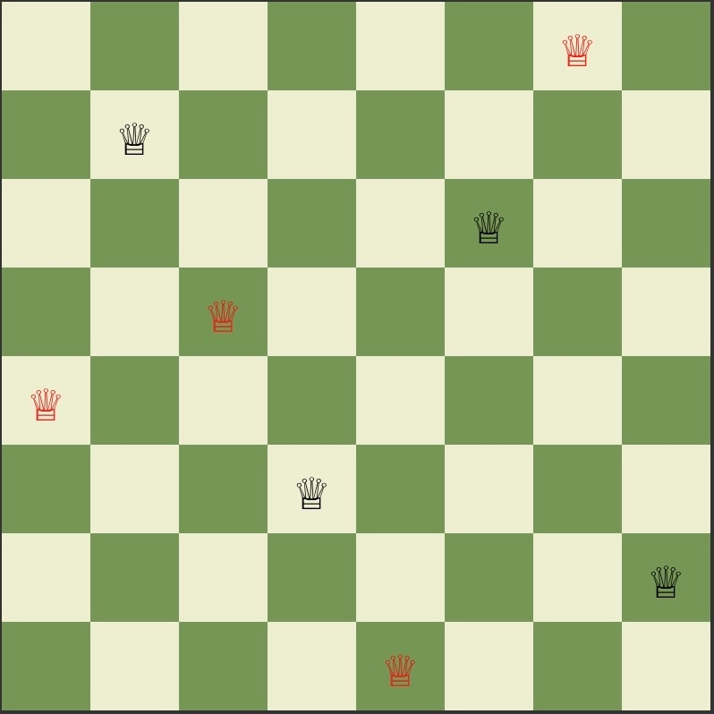
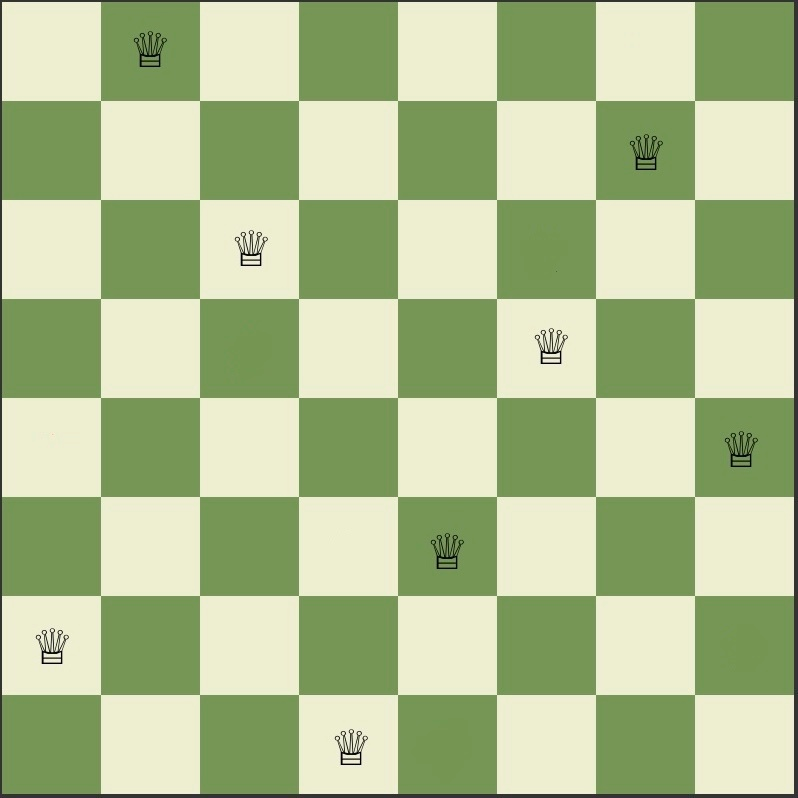
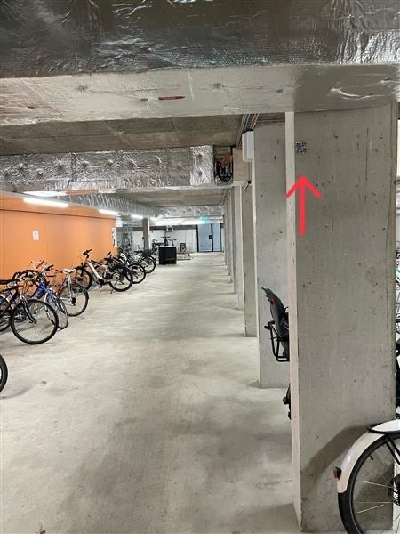

# Richtige Antwort

Du hast eine der insgesamt 92 verschiedene Lösungsmöglichkeiten für das 8-Damen-Problem gefunden!🥳

## Lösung

## Hintergrundinformationen zum Rätsel

Berücksichtigt man dabei, dass viele dieser 92 Lösungskonstellationen durch **Drehungen oder Spiegelungen** auseinander hervorgehen, so verbleiben immerhin noch 12 “grundsätzlich verschiedene” Lösungen. Die Lösung und die beiden folgenden Lösungen wurden als eine der **12 Basislösungen** gezählt oder als drei der insgesamt 92 Konstellationen.

Erstmals formuliert wurde das Damenproblem von dem bayerischen Schachmeister **Max Bezzel**. In der Berliner *Schachzeitung* fragte er 1848 nach der Anzahl der möglichen Lösungen. Als erster nannte 1850 der Zahnarzt **Franz Nauck** in der Leipziger *Illustrirten Zeitung* die korrekte Zahl **92**. 1874 bewies der englische Mathematiker **James Whitbread Lee Glaisher**, dass es nicht mehr Lösungen geben kann. Damit war das ursprüngliche Problem vollständig gelöst.

## Anzahl der Lösungen

## Rekursives Backtracking

## Nächstes Rätsel

