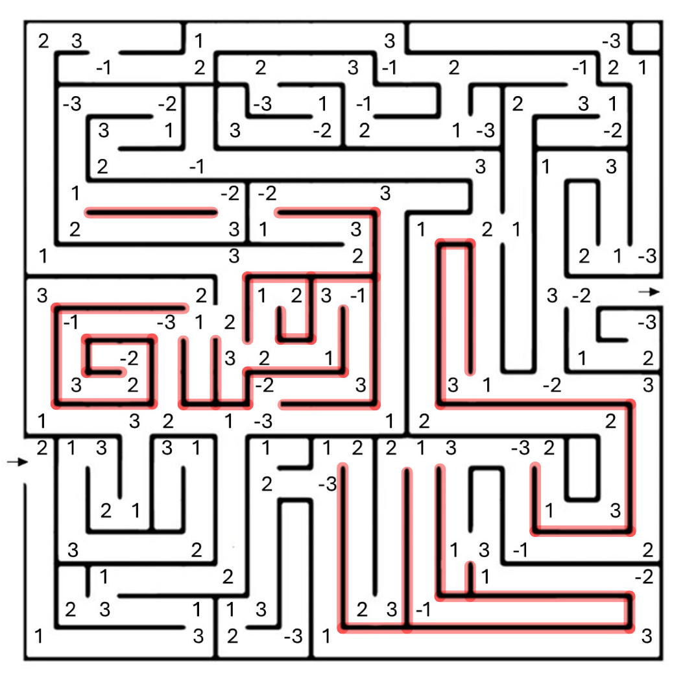
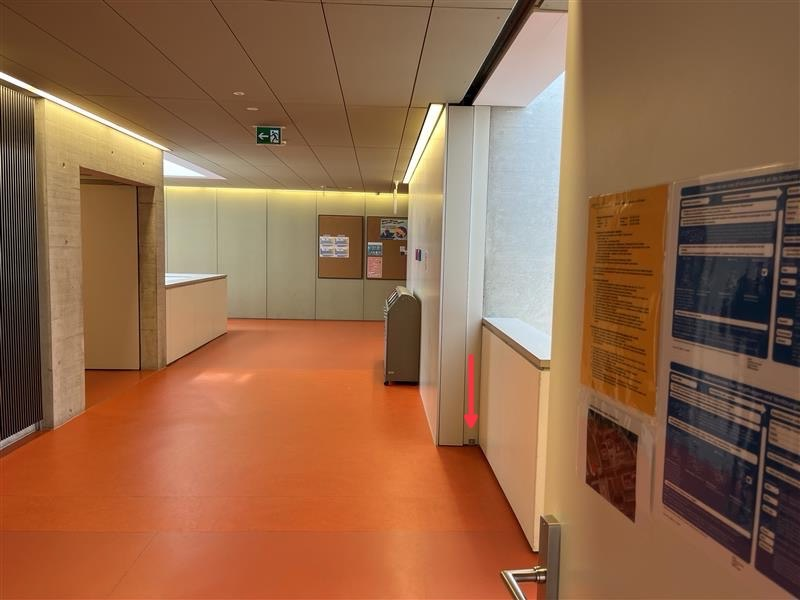

import { AdventureOption, AdventureOptions } from '@tdev-components/Adventure'

# Labyrinthe und Irrgärten

Von Tobias, Jari und Nico

**Right-Hand-Algorithmus** **(Rechte-Hand-Regel):**
Du legst deine rechte Hand an die Wand des Labyrinths und gehst immer so weiter, dass deine Hand **ständig die Wand berührt**.

- So folgst du der äusseren Wand des Labyrinths.
- Du kommst **immer zum Ausgang**, **wenn** das Labyrinth **keine “schwebenden” Wände** oder **Inseln** hat (rot markiert im Bild). &#x20;

Die Links- oder Rechtsstrategie funktioniert auch in Labyrinthen mit schwebenden Wänden so lange Start und Ziel im gleichen, zusammenhängenden Bereich liegen. Wichtig ist nur, dass man sich immer an einer Wand orientieren kann. Nur wenn Start oder Ziel auf einer **abgetrennten** „Insel“ liegen, funktioniert die Methode **nicht**. Zum Beispiel funktioniert das untenstehende Labyrinth, obwohl es (rot markiert) schwebende Wände hat.

**Left-Hand-Algorithmus** **(Linke-Hand-Regel):**
Dasselbe Prinzip, nur mit der **linken** Hand an der Wand.
Funktioniert genauso gut, führt dich aber meist auf einem anderen Weg zum Ziel.

Führe die folgenden zwei Algorithmen auf diesem Labyrinth aus:

1. Immer-rechts-Strategie: Halte dich stets an der rechten Wand.
2. Immer-links-Strategie: Halte dich stets an der linken Wand. &#x20;

Addiere dabei alle Zahlen auf dem Weg. Jede Zahl darf nur einmal gezählt werden, auch wenn sie mehrfach durchquert wird.

<AdventureOptions>
  <AdventureOption label="A" nextGuessIn={60}>
    Rechts-Strategie: 84

    Links-Strategie: 71

    ---

    
  </AdventureOption>

  <AdventureOption label="B" nextGuessIn={60}>
    Rechts-Strategie: 86

    Links-Strategie: 76

    ---

    
  </AdventureOption>

  <AdventureOption label="C" nextGuessIn={60}>
    Rechts-Strategie: 86

    Links-Strategie: 71

    ---

    
  </AdventureOption>

  <AdventureOption label="D" nextGuessIn={60}>
    Rechts-Strategie: 84

    Links-Strategie: 76

    ---

    
  </AdventureOption>
</AdventureOptions>

## Rubrik "Wer bin ich?"

:::info[Wer bin ich?]
Trotz der vielen Hindernisse und Unsicherheiten wie in einem Labyrinth fand ich den richtigen Weg und entdeckte den Grundbaustein der DNA: die Doppelhelix… Wer bin ich?
:::