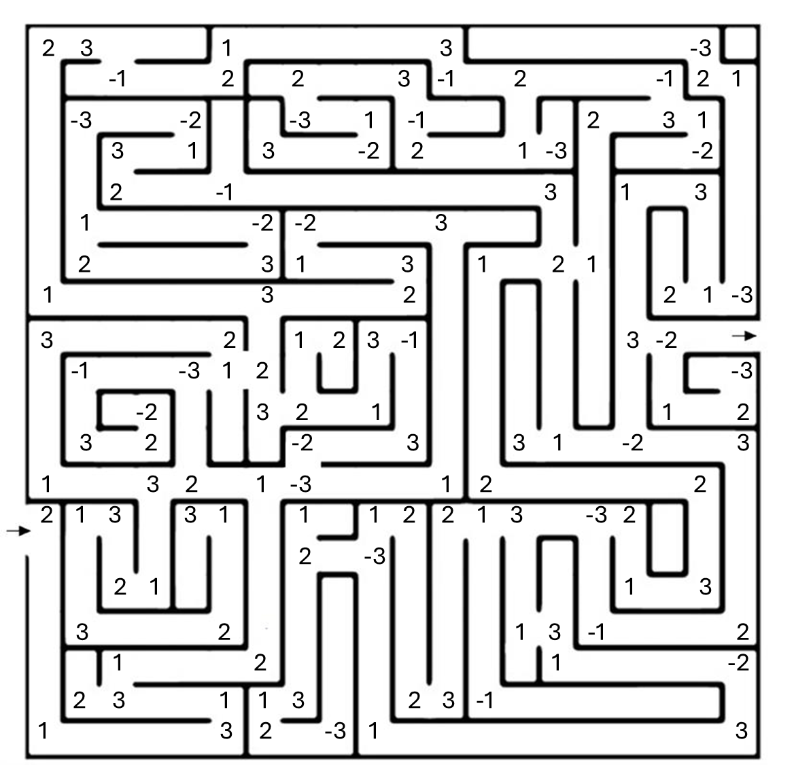

import { AdventureOption, AdventureOptions } from '@tdev-components/Adventure'

# Labyrinthe und Irrgärten

**Right-Hand-Algorithmus (Rechte-Hand-Regel):**

Du legst deine rechte Hand an die Wand des Labyrinths und gehst immer so weiter, dass deine Hand **ständig die Wand berührt**.
• So folgst du der äußeren Wand des Labyrinths.
• Du kommst **immer zum Ausgang**, **wenn** das Labyrinth **keine “schwebenden” Wände** oder **Inseln** hat (also wenn Start und Ziel mit dem Rand verbunden sind).

**Left-Hand-Algorithmus (Linke-Hand-Regel):**

Dasselbe Prinzip, nur mit der **linken** Hand an der Wand.
• Funktioniert genauso gut, führt dich aber meist auf einem anderen Weg zum Ziel.

⸻

Führe die folgenden zwei Algorithmen auf diesem Labyrinth aus:

1. Immer-rechts-Strategie: Halte dich stets an der rechten Wand.
2. Immer-links-Strategie: Halte dich stets an der linken Wand. &#x20;

Addiere dabei alle Zahlen auf dem Weg. Jede Zahl darf nur einmal gezählt werden, auch wenn sie mehrfach durchquert wird.

<AdventureOptions>
  <AdventureOption label="A" nextGuessIn={0}>
    Vorderseite

    ---
  
    Rückseite
  </AdventureOption>
  <AdventureOption label="B" nextGuessIn={0}>
    Vorderseite
  </AdventureOption>
</AdventureOption>