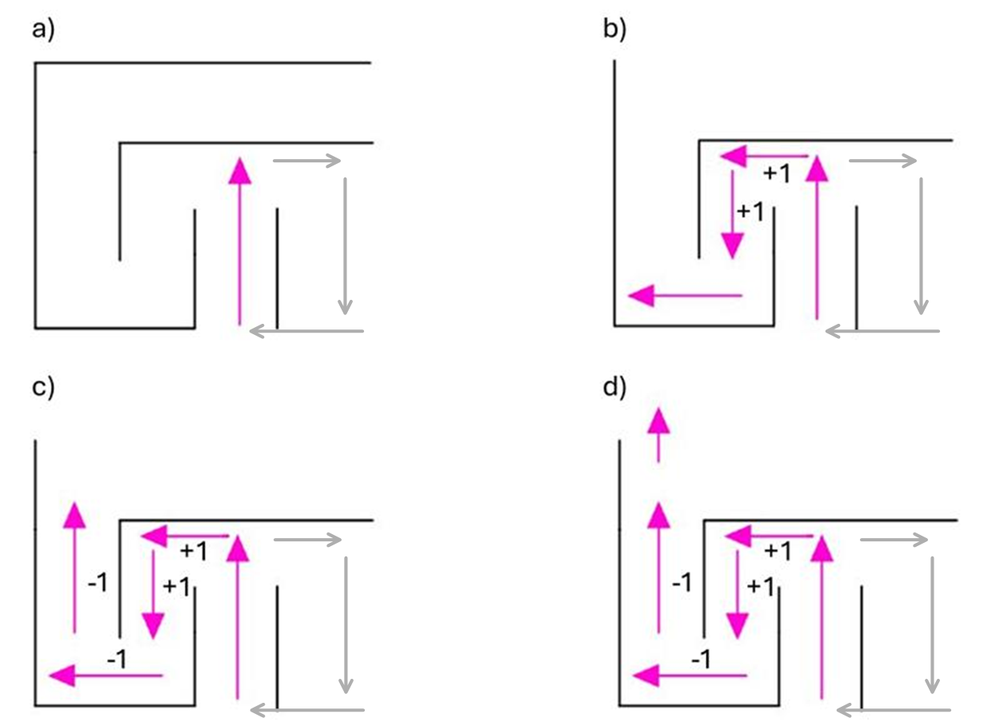

# Richtige Antwort

Du hast die richtige Antwort gefunden 🥳

Bei der Immer-rechts-Strategie ergibt die Summe 86.
Bei der Immer-links-Strategie ergibt die Summe 71.

**Warum funktioniert die Links-/Rechtsstrategie in Labyrinthen?**
Die Links- oder Rechtsstrategie funktioniert, weil du dich dabei immer an einer Wand orientierst. Wenn du zum Beispiel immer mit der rechten Hand an der Wand entlangläufst, folgst du dem äusseren Rand des Labyrinths. Dadurch durchläufst du alle Gänge, die mit dem Startpunkt verbunden sind, und kommst irgendwann zum Ausgang – *sofern Start und Ziel im selben verbundenen Bereich liegen*.

Falls dies nicht der Fall ist, gibt es einen anderen Algorithmus:&#x20;

**Pledge Algorithmus:**

Auf dem Bild befindet man sich bereits in einer Endlosschleife (graue Pfeile).

a) Beim Auftreffen auf ein Hindernis entscheidet man, ob man nach links oder rechts geht.

b) Die erste Entscheidung bestimmt, ob man bei einer Linkskurve **1 addiert** oder **1 subtrahiert**. Diese Zahlen beziehen sich nich auf das vorherige Rätsel, sondern auf den Zahlenwert der Richtung!

c) Dies wird so lange fortgesetzt, bis die Summe **0** beträgt.

d) Sobald die Summe **0** erreicht ist, geht man so lange geradeaus, bis man erneut auf ein Hindernis trifft. Anschliessend wird der Algorithmus von vorne ausgeführt.

Dieser Algorithmus dient ausschliesslich dazu, Endlosschleifen zu verlassen. Damit er vollständig funktioniert, muss die Richtung des Auswegs bekannt sein, der Ausweg muss ebenfalls am Rand des Labyrinths sein und nicht in der Mitte. Er ist nicht dazu geeignet, ein allgemeines Problem zu lösen oder zuverlässig aus einem Labyrinth herauszufinden.

Quelle: [https://de.wikipedia.org/wiki/Lösungsalgorithmen\_für\_Irrgärten#:\~:text=Der%20Trémaux%2DAlgorithmus%2C%20erfunden%20von,Irrgärten%2C%20die%20wohldefinierte%20Durchgänge%20besitzen.](https://de.wikipedia.org/wiki/Lösungsalgorithmen_für_Irrgärten#:~\:text=Der%20Trémaux%2DAlgorithmus%2C%20erfunden%20von,Irrgärten%2C%20die%20wohldefinierte%20Durchgänge%20besitzen.)

# **Hier findest du das nächste Rätsel:**

