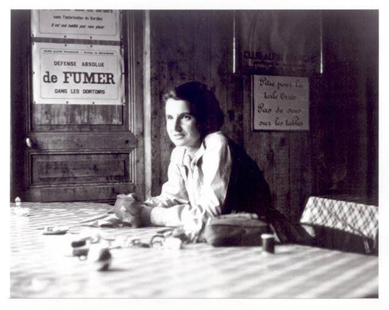
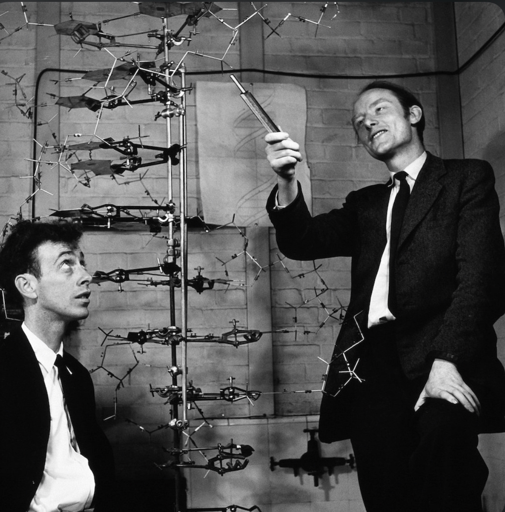

## Du hast die richtige Antwort gefunden 🥳

# Wer war Rosalind Franklin?&#x20;

Ich wurde 25. Juli 1920 in London geboren. Ich stamme aus einer jüdischen Bankiersfamilie und war die zweitälteste von fünf Kindern. Ich interessierte mich schon sehr früh für Naturwissenschaften, ich versuchte immer die Natur um mich herum zu erforschen und zu verstehen. Meinen Eltern, Muriel und Ellis Franklin, war die Ausbildung von mir und meinen Geschwistern sehr wichtig. Sie schickten mich ab zwölf Jahren in eine Mädchenschule, sie half mir, mich auf meine berufliche Laufbahn vorzubereiten. In dieser Schule wurde mein Interesse für Naturwissenschaften noch mehr gefördert und so entschied ich mich im Jahr 1938 die Zulassungsprüfungen an der Universität Cambridge zu schreiben. Ich bestand die Prüfungen und schnitt sogar als Beste in der Chemieprobe ab. Aufgrund meiner Leistung erhielt ich ein Stipendium. Mein Vater stellte jedoch einem deutschen Kriegsflüchtling zur Verfügung weil wir uns das Studium selbst leisten konnten. Ich studierte im Frauencollege «Newnham» Naturwissenschaften. Während meiner Studienzeit machte ich viel Sport, wie Squash und Tennis, um meine Gedanken freizubekommen. 1941 schloss ich als beste im Fach physikalischer Chemie ab. Durch ein College-Stipendium wurde mir ermöglicht, in einem vierten Jahr in Cambridge zu forschen.

Während der britischen Kriegsanstrengungen (1942-1946) verfolgte ich und meine Familie die Entwicklungen des nationalsozialistischen Deutschlands sehr aufmerksam. Insbesondere mein Vater engagierte sich stark, indem er zusammen mit Mamie Bentwich, seiner Schwester, eine Organisation gründete, die sich um die Unterbringung von in England ankommenden jüdischen Flüchtlingskindern kümmerte. Später erhielt ich die Gelegenheit, kriegswichtige Arbeit zu verrichten, indem ich Untersuchungen in der «British Coal Utilisation Research Association» durchführte. Es handelte sich um eine Non-Profit-Belegschaft von Physikern, die erforschten, wie Kohle effizienter genutzt werden kann. Zudem war ich noch in der Funktion als Luftschutzwartin tätig.

In den Jahren 1947 bis 1950 war ich in Paris tätig und arbeitete am Forschungsprojekt «Laboratoire Central des Services Chimiques de L’Etat». Dort entwickelte ich mich zur Spezialistin für Kristallstrukturanalyse. Ich erlernte unter Jaques Mering die Durchführung von Röntgenbeugungsanalysen an Kohlenstoffen. Meine Arbeit wurde am Ende meine Zeit in Frankreich als internationale Wissenschaftlerin anerkannt.

1950 begann ich mit meiner Forschung zur DNA-Struktur am «King’s College London». Trotz meiner bedeutenden Arbeit wurde ich von Maurice Wilkins zunächst als Assistentin missverstanden, was zu Spannungen führte. Trotzdem entdeckte ich durch Röntgenanalysen , dass es von DNA-Molekülen zwei Formen mit unterschiedlichem Wassergehalt gibt, und erstellte das bahnbrechende ,,Foto 51“ , dass die Helix Struktur belegt. So erkannte ich, dass die DNA die Form einer Helix hat. Neben den Bildern führte ich präzise mathematische Analysen durch. Dadurch konnte ich den Durchmesser der Helix (ca. 2 Nanometer), Die Windungslänge (eine volle Drehung alle 3,4 Nanometer) bestimmen und dass sich die Basenpaare im Inneren der Helix befindet bestätigten.

Dieser Erfolg blieb mir jedoch nicht lange. Zur selben Zeit ahnen auch James Watson und Francis Crick, zwei junge Forscher an der Universität Cambridge, dass sie sich auf dem Feld der DNA einen Namen machen könnten. Nachdem sie einen Vortrag von mir besucht haben, erstellen sie ein erstes, fehlerhaftes DNA-Modell.

Ohne ihr Wissen zeigt Wilkins mein Bild der Doppel-Helix Watson und Crick, die es als entscheidenden Hinweis für ihr DNA-Modell nutzen. Zudem erhalten sie vertrauliche Einblicke in meinen noch unveröffentlichten Bericht. 1953 publizierten sie ihre Ergebnisse in ,,Nature‘‘. In der gleichen Ausgabe erscheint auch mein Artikel – nach dem anderen von Watson und Crick. So wird er als Bestätigung anstatt als Inspiration für ihre Ideen wahrgenommen.

Erst Jahre später gesteht James Watson in seinem Buch „Die Doppelhelix“ ein, wie sehr er von meiner Arbeit profitiert hatte. Trotzdem nennt er mich im selben Buch durchgängig „Rosy“ und schreibt über mein Aussehen anstatt über meine harte Arbeit. Den Nobelpreis „für die Entdeckung der Molekularstruktur der Nukleinsäuren und ihre Bedeutung für die Weitergabe von Information in Lebewesen“ erhielten 1962 Watson, Crick und Wilkins. Bezeichnenderweise erwähnten weder Watson noch Crick mich in ihren Nobelpreisreden.

Seit 1956 entwickelten sich bei mir mehrere Krankheiten, welche zum Teil auf meine Arbeit mit Röntgenstrahlen zurückzuführen ist. Ich setzte meine Forschungsarbeiten bis zu meinem Tod am 16. April 1958 fort. Nicht nur meine akademischen Leistungen machten mich, Rosalind Franklin, bekannt: Ich wurde auch als gesellige Person geschätzt, die sozialen Kontakt pflegte.