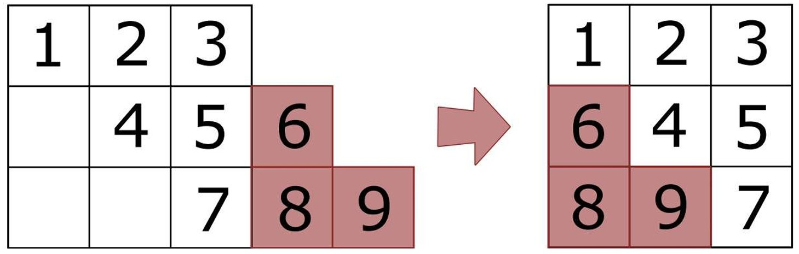
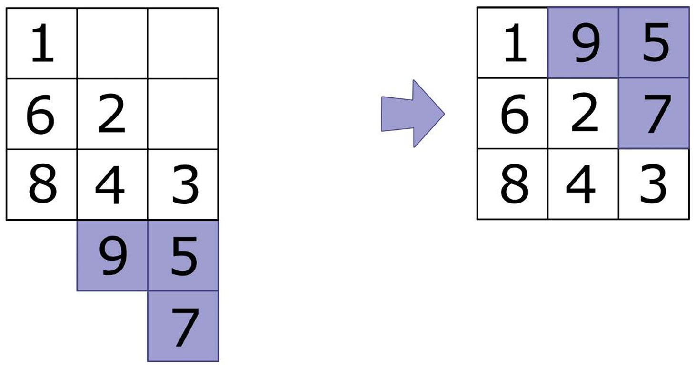
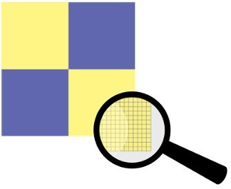

# Bilder verschlüsseln

Ein Bild ist ein Rechteck, das sich aus Zeilen und Spalten von Pixeln (Farbpunkte) zusammensetzt.

:::flex

::br

:::

Reto hat sich ein Verfahren zur Verschlüsselung von Bildern überlegt. Er verwendet dabei diese zwei Operationen:

## Operation H

**H** für horizontal

In Zeile 1 bleiben die Pixel unverändert. In Zeile 2 rückt jedes Pixel um 1 nach rechts. In Zeile 3 rückt jedes Pixel um 2 nach rechts.

> Jedes Pixel in der n-ten Zeile rückt um $n-1$ Spalten nach rechts.

Pixel, die dabei über den rechten Bildrand hinausrücken, werden in derselben Zeile links wieder eingefügt. Die Pixelreihenfolge wird dabei nicht verändert.

## Operation V

**V** für vertikal

> Jedes Pixel in der n-ten Spalte rückt um $n-1$ Zeilen nach unten.

Pixel, die über den unteren Bildrand hinausrücken, werden in derselben Spalte oben wieder eingefügt.

Die Operationen können hintereinander durchgeführt werden, als Folge. Im Beispiel hat Reto das Bild (25 x 25 Pixel) mit der Folge **HV** verschlüsselt (also Zuerst wurde Operation **H**, danach Operation **V** angewandt).

## Rätsel

Folgendes Bild wird mit **VH** verschlüsselt:

Wie sieht das Ergebnis aus?

|                                         |                                         |                                         |                                         |                                         |
| --------------------------------------- | --------------------------------------- | --------------------------------------- | --------------------------------------- | --------------------------------------- |
|  |  |  |  |  |

:::details[Lösung]
Antwort **e** ist richtig.

Im Beispiel deutet die Verzerrung der Mona Lisa darauf hin, dass die Operation **H** geometrisch eine horizontale *Scherung* bewirkt und die Operation **V** eine vertikale *Scherung*.
Das Bild mit den vier farbigen Quadraten wird durch die Operation **V** zunächst nach unten *geschert*. Das Ergebnis ist eine Parallelogramm mit einem verzerrten Bild. Das überhängende Dreieck am unteren Rand wird oben eingefügt (durch *Parallelverschiebung*), so dass wieder ein rechteckiges Bild entsteht. In ähnlicher Weise erfolgt danach durch die Operation **H** eine Scherung nach rechts. Der Überhang wird links eingefügt:

Dieses Ergebnis der Verschlüsselung mit der Operationsfolge **VH** entspricht dem Bild aus Antwort **e**.
:::

:::tip[Dies ist Informatik!]
Bei der Übertragung von Daten kann es wichtig sein, die Daten zu verschlüsseln. Sender\:in und Emp-
fänger\:in der Daten verabreden dazu, welches Verfahren zur Verschlüsselung (und zur Entschlüsselung)
verwendet wird. Wenn man kurz die Daten mit $D$ und das Verschlüsselungsverfahren mit $K$ (für
«Krypto») bezeichnet, kann man sagen, dass das Ergebnis der Anwendung von $K$ auf $D$ übertragen
wird, also $K(D)$. Der Empfänger muss dann den Entschlüsselungsteil des Verfahrens ($K'$) anwenden
und hat dann $K'(K(D)) = D$. So kann jemand, der die Übertragung von $K(D)$ beobachtet, die
originalen Daten $D$ nicht ohne Weiteres ermitteln.

Das Verschlüsselungsverfahren für Bilder aus dieser Aufgabe, mit den Operationen **H** und
**V**, hat den Vorteil, dass es einfach angewendet werden kann. Wenn der Empfänger den bei der
Verschlüsselung verwendeten Schlüssel, hier also die Operationsfolge (z. B. **HV**) kennt, kann er
die verschlüsselten Daten leicht entschlüsseln. Dennoch lässt das Ergebnis der Verschlüsselung das
Original mit dem Auge nicht mehr erkennen. Bei digitaler Übertragung der Daten kann aber mit
Hilfe von Computern gearbeitet und das Original relativ leicht entziffert (also: ohne Kenntnis des
Schlüssels ermittelt) werden.

Je höher der Sicherheitsanspruch an ein Verschlüsselungsverfahren ist, desto grösser ist oft der
Aufwand, der zur Ver- und Entschlüsselung betrieben werden muss (z. B. beim Rechenaufwand
und bei der Übermittlung eines komplexen geheimen Schlüssels zwischen Sender und Empfänger
der verschlüsselten Information). Die Informatik kennt aber moderne Verfahren, die wenig Aufwand
für Ver- und Entschlüsselung erfordern, die aber durch ihre besonderen (meist mathematischen)
Eigenschaften eine Entzifferung übertragener Daten praktisch unmöglich machen.
:::