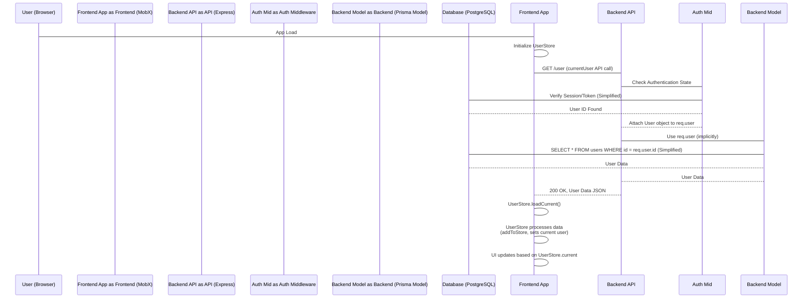

# Chapter 1: User

The **User** abstraction lies at the core of the `teaching-project`, representing the individual actors interacting with the system. Recognizing *who* is using the application is fundamental for controlling *what* they can do (authorization) and ensuring only legitimate actors gain access (authentication).

Consider the primary use case: a user logs into the application. The system must authenticate their identity, retrieve their associated data, determine their permissions, and present the relevant interface and content. The `User` concept provides the central handle for managing this identity and its related attributes throughout the system.

## The User Concept

A `User` instance encapsulates basic identity information and system-level properties. It's the key entity linking authentication outcomes to application-specific data and permissions.

Key aspects include:

*   **Identity & Data:** Stores unique identifiers (`id`), contact information (`email`), and name details (`firstName`, `lastName`).
*   **System Roles:** Notably includes an `isAdmin` flag for elevated privileges.
*   **Authentication:** While authentication itself is handled externally (Azure AD or mock authentication), the system maps the authenticated identity to a `User` record.
*   **Authorization:** User permissions are determined directly via `RootUserPermission`s or indirectly via membership in `StudentGroup`s, which hold `RootGroupPermission`s (details covered in [Chapter 5: Access Policy & Permissions](05_access_policy___permissions_.md) and [Chapter 4: Student Group](04_student_group_.md)).
*   **Frontend State:** The frontend tracks the currently logged-in `current` user and optionally a `viewedUser`. The `viewedUser` allows administrators to impersonate or view the system as if logged in as another user.

## Handling User Identity (Use Case: Login)

When a user logs in, the authentication layer (e.g., Azure AD) provides identity proof. The application backend then uses this identity (typically email or a unique ID) to find or create the corresponding `User` record in its database. This record is then used to populate the frontend state.

### API Interaction

The frontend interacts with the backend to fetch user data, primarily via the `/user` and `/users` endpoints.

Fetching the currently authenticated user's data:

```typescript
// teaching-dev\src\api\user.ts
import api from './base';
import { AxiosPromise } from 'axios';
// ... other imports

export type User = {
    id: string;
    email: string;
    firstName: string;
    lastName: string;
    isAdmin: boolean;
    createdAt: string;
    updatedAt: string;
};

export function currentUser(signal: AbortSignal): AxiosPromise<User> {
    return api.get('/user', { signal });
}

// ... other API functions
```

The `currentUser` function in `teaching-dev\src\api\user.ts` is the standard way for the frontend to request data for the user associated with the current session cookie or authentication token.

### Backend Controller

The backend receives this request and relies on authentication middleware (not shown here) to identify the user making the request. The controller then uses this identified user (attached to `req.user`) to respond.

```typescript
// teaching-api\src\controllers\users.ts
import { RequestHandler } from 'express';
// ... other imports

export const user: RequestHandler = async (req, res) => {
    // req.user is populated by authentication middleware
    res.json(req.user);
};

// ... other controller functions
```

The `user` controller function in `teaching-api\src\controllers\users.ts` is minimal. It simply returns the `User` object that was resolved during the authentication process preceding the controller execution.

### Database Representation

The `User` data is persisted in the database. The schema defines the structure and relationships.

```prisma
// teaching-api\prisma\schema.prisma
model User {
  id                              String                            @id @default(dbgenerated("gen_random_uuid()")) @db.Uuid
  email                           String                            @unique
  firstName                       String                            @map("first_name")
  lastName                        String                            @map("last_name")
  isAdmin                         Boolean                           @default(false) @map("is_admin")
  createdAt                       DateTime                          @default(now()) @map("created_at")
  updatedAt                       DateTime                          @default(now()) @updatedAt @map("updated_at")
  documents                       Document[]                        @relation("documents") // Documents authored by this user
  rootUserPermissions             RootUserPermission[]              @relation("root_user_to_user_permission") // Direct permissions
  studentGroups                   StudentGroup[]                    @relation("StudentGroupToUser") // Group memberships
  view_DocumentUserPermissions    view_DocumentUserPermissions[] // View for efficient permission checks
  view_AllDocumentUserPermissions view_AllDocumentUserPermissions[] // Another permission view
  cmsSettings                     CmsSettings? // CMS Integration settings

  @@map("users") // Maps model to database table name
}

// ... other models like Document, StudentGroup, RootUserPermission, Views
```

The `User` model in `teaching-api\prisma\schema.prisma` shows the core fields and the primary relationships: authored [Documents](02_document_.md), direct `RootUserPermission`s, and many-to-many relationships with `StudentGroup`s. The inclusion of views (`view_...Permissions`) linked to the user indicates how permissions are surfaced computationally.

### Backend Model Logic

Within the backend, the `User` model module (using Prisma client) encapsulates database logic for user interaction, including retrieval and updates.

```typescript
// teaching-api\src\models\User.ts
import { PrismaClient, User as DbUser } from '@prisma/client';
import prisma from '../prisma';
// ... other imports

function User(db: PrismaClient['user']) {
    return Object.assign(db, {
        async findModel(id: string): Promise<DbUser | null> {
            // Basic find by ID
            return db.findUnique({ where: { id } });
        },

        async updateModel(actor: DbUser, id: string, data: Partial<DbUser>): Promise<DbUser> {
            const record = await db.findUnique({ where: { id: id } });
            if (!record) { throw new HTTP404Error('User not found'); }
            // Authorization check: Can the actor update this user?
            // Only the user themselves or an admin can update
            if (!(record.id === actor.id || actor.isAdmin)) {
                throw new HTTP403Error('Not authorized');
            }
            // ... data sanitization ...
            return db.update({ where: { id: id }, data: sanitized });
        },

        // ... other methods like all, setIsAdmin
    });
}

export default User(prisma.user); // Initialize the model with the prisma client
```

The `findModel` method in `teaching-api\src\models\User.ts` is a simple wrapper around the Prisma client's `findUnique`. `updateModel` demonstrates a common pattern: loading the record, performing an authorization check (`record.id === actor.id || actor.isAdmin`), and then performing the update. The `actor` argument is crucial here, representing the *user performing the action*.

### Frontend State Management

On the frontend, MobX stores manage the application state, including user data. The `UserStore` holds the collection of `User` objects and tracks the `current` and `viewed` users.

```typescript
// teaching-dev\src\stores\UserStore.ts
import { action, computed, observable } from 'mobx';
// ... other imports
import User from '@tdev-models/User'; // Frontend User model

export class UserStore extends iStore<`update-${string}`> {
    readonly root: RootStore;

    @observable accessor _viewedUserId: string | undefined = undefined;
    users = observable<User>([]); // Collection of all known users

    constructor(root: RootStore) {
        super();
        this.root = root;
        // ... rehydration logic
    }

    find = computedFn(function <T>(this: UserStore, id?: string): User | undefined {
        // Efficiently find user by ID
        if (!id) { return; }
        return this.users.find((d) => d.id === id) as User;
    }, { keepAlive: true });

    @computed
    get current(): User | undefined {
        // Get the user based on session/auth details
        // Handles different auth methods (msal, apiKey)
        if (this.root.sessionStore?.authMethod === 'msal') {
          return this.users.find(u => u.email?.toLowerCase() === this.root?.sessionStore?.account?.username?.toLowerCase());
        }
        return this.users.find((u) => u.id === this.root.sessionStore?.currentUserId);
    }

    @computed
    get viewedUserId() {
        // If current user is NOT admin, viewed user is ALWAYS current user
        if (!this.current?.isAdmin) {
            return this.current?.id;
        }
        // Admins can have a different viewed user
        return this._viewedUserId || this.current?.id || this.root.sessionStore.userId;
    }

    @computed
    get viewedUser(): User | undefined {
        // Get the User model instance for the viewed user
        return this.find(this.viewedUserId);
    }

    @action
    switchUser(userId: string | undefined) {
        // Action to change the viewed user (only for admins)
        if (!this.current?.isAdmin || this._viewedUserId === userId) {
            return;
        }
        // ... logic for socket room changes and document queue flushing ...
        this._viewedUserId = userId;
        // ... rejoin socket room ...
    }

    // ... load, update, cleanup methods ...
}
```

The `UserStore` in `teaching-dev\src\stores\UserStore.ts` manages the collection of `User` instances received from the API. The `current` computed getter finds the `User` corresponding to the logged-in session. The `viewedUserId` and `viewedUser` computed properties track the user ID the frontend should display content *as*, defaulting to the `current` user unless an admin explicitly switches using the `switchUser` action. This `viewedUser` concept is central to how permissions and data are filtered and displayed in the frontend.

### Frontend User Model

The frontend has its own `User` model, which is an observable MobX class wrapping the API data with additional computed properties useful for the UI and cross-store references.

```typescript
// teaching-dev\src\models\User.ts
import { action, computed } from 'mobx';
import { User as UserProps } from '@tdev-api/user';
import { UserStore } from '@tdev-stores/UserStore';
// ... other imports

export default class User {
    readonly store: UserStore;
    // ... readonly properties matching API UserProps ...

    constructor(props: UserProps, store: UserStore) {
        this.store = store;
        // ... assign properties ...
    }

    @computed
    get isStudent() {
        // Logic to determine if user is a student (e.g., based on email pattern or isAdmin status)
        return STUDENT_USERNAME_PATTERN
            ? new RegExp(STUDENT_USERNAME_PATTERN, 'i').test(this.email)
            : !this.isAdmin;
    }

    @computed
    get nameShort() {
        // Formats name for display (e.g., "F. Last" or "First L.")
        if (this.isStudent) {
            return `${this.firstName} ${this.lastName.slice(0, 1)}.`;
        }
        return `${this.firstName.slice(0, 1)}. ${this.lastName}`;
    }

    @computed
    get studentGroups() {
        // Reference student groups this user belongs to
        return this.store.root.studentGroupStore.studentGroups.filter((group) => group.userIds.has(this.id));
    }

    // ... other computed properties and actions
}
```

The frontend `User` model in `teaching-dev\src\models\User.ts` extends the plain data from the API with computed properties like `isStudent`, `nameShort`, and `studentGroups`. This keeps UI-specific computations close to the data and allows easy linkage to other stores (like `StudentGroupStore`) via the `root` store reference (as discussed in [Chapter 8: MobX Store Pattern](08_mobx_store_pattern_.md)).

### Frontend UI Component

The `viewedUser` concept is surfaced in UI components like the `AccountSwitcher`, allowing admins to toggle which user's perspective they are currently viewing.

```typescript
// teaching-dev\src\components\Navbar\AccountSwitcher\index.tsx
import React from 'react';
import clsx from 'clsx';
// ... other imports
import { useStore } from '@tdev-hooks/useStore'; // Custom hook to access root store

const AccountSwitcher = observer(() => {
    const userStore = useStore('userStore');
    // ... other hooks

    // Only show switcher if in browser and current user is admin
    if (!isBrowser || !userStore.current?.isAdmin) {
        return null;
    }

    return (
        <>
            {/* Button to switch back to current user */}
            {userStore.isUserSwitched && ( /* ... */ )}
            {/* Popup trigger for the list of users to switch to */}
            <Popup trigger={ /* ... */ } on={['click', 'hover']} closeOnDocumentClick closeOnEscape>
                <div className={clsx(styles.wrapper, 'card')}>
                    {/* ... header and user list rendering ... */}
                    {/* Buttons to switch to specific users */}
                    {_.orderBy( /* filtered and sorted users */ ).map((user) => (
                        <Button
                            key={user.id}
                            // ... icon based on user type
                            active={userStore.viewedUserId === user.id} // Button is active if this is the currently viewed user
                            // ... other props
                            onClick={() => userStore.switchUser(user.id)} // Call the store action to switch state
                        >
                            {user.nameShort}
                        </Button>
                    ))}
                </div>
            </Popup>
        </>
    );
});
```

The `AccountSwitcher` component in `teaching-dev\src\components\Navbar\AccountSwitcher\index.tsx` demonstrates the practical application of the `viewedUser` state from the `UserStore`. It's only visible to admins (`userStore.current?.isAdmin`), shows which user is currently being viewed (`userStore.viewedUserId === user.id`), and interacts with the store via `userStore.switchUser` to change the viewed perspective.

## Internal Walkthrough: Fetching Current User

Here's a simplified flow for how the frontend retrieves the current user's information upon application load:



This diagram shows the path from application load to the frontend `UserStore` having the `current` user populated. The authentication middleware is key to identifying the user before the controller logic executes, ensuring the backend handles requests in the context of a known user.

## Conclusion

The `User` concept is the entry point into the system's data and functionality. It represents the authenticated identity and serves as the anchor for determining permissions and personalizing the user experience. The frontend tracks both the actual logged-in user (`current`) and a potentially different `viewedUser` to support administrative features like impersonation.

Understanding the `User` is prerequisite to exploring how they interact with content. The next chapter delves into the primary piece of content in the system: the [Document](02_document_.md).

[Next Chapter: Document](02_document_.md)

---

Generated by [AI Codebase Knowledge Builder](https://github.com/The-Pocket/Tutorial-Codebase-Knowledge)
