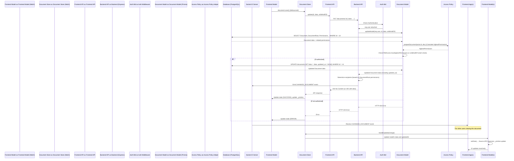

# Chapter 2: Document

In the previous chapter ([Chapter 1: User](01_user_.md)), we established the concept of a `User` as the actor within the `teaching-project` system. Now, we shift focus to what users primarily interact with: content.

The **Document** abstraction is the system's fundamental unit of content. Whether it's a student's text answer, a piece of instructor content, a configuration setting, or even metadata representing a file or directory, it is encapsulated as a `Document`.

## The Document Concept

Why abstract all these different types of content into a single concept?

Consider the core operations required for any piece of data in a collaborative or educational platform: creation, reading, updating, deletion (CRUD). Furthermore, access control (who can CRUD *what*) is paramount. By unifying all content under a common `Document` interface, the system can provide a single, consistent mechanism for handling CRUD operations and, crucially, permission checks, regardless of the content's specific nature (text, code, state, file metadata, etc.).

A central use case demonstrating the need for this abstraction is a student editing a response to an exercise. This involves:
1.  Fetching the student's existing response `Document`.
2.  Checking if the student has permission to read and edit this particular `Document`.
3.  Allowing the student to modify the `Document`'s content (`data`).
4.  Persisting the changes to the database.
5.  Notifying relevant parties (instructor, possibly collaborators) about the update.

The `Document` concept provides the standardized structure to manage these steps across all content types.

Key aspects of a `Document`:

*   **Unified Structure:** All content types share common metadata fields (`id`, `type`, `authorId`, `documentRootId`, `parentId`, `createdAt`, `updatedAt`).
*   **Flexible Payload:** The actual content is stored in a flexible `data` field (JSON). The `type` field indicates how `data` should be interpreted and which specific frontend/backend logic applies.
*   **Authorship:** Every `Document` is associated with a specific [`User`](01_user_.md) via `authorId`.
*   **Containment:** Each `Document` belongs to a single [`DocumentRoot`](03_document_root_.md) via `documentRootId`. This relationship is critical for defining permissions and scope (as covered in [Chapter 3: Document Root](03_document_root_.md) and [Chapter 5: Access Policy & Permissions](05_access_policy___permissions_.md)).
*   **Hierarchy:** `Documents` can form parent-child relationships via the optional `parentId` field, enabling tree structures like file systems or nested content blocks.
*   **Granularity:** It's the smallest unit that access control is typically applied to (though permissions are often inherited or defined at the [`DocumentRoot`](03_document_root_.md) or [`StudentGroup`](04_student_group_.md) level).

## Structure and Relationships

The structure of a `Document` in the database schema illustrates these points:

```prisma
// teaching-api\prisma\schema.prisma
model Document {
  id               String     @id @default(dbgenerated("gen_random_uuid()")) @db.Uuid
  authorId         String     @map("author_id") @db.Uuid // Link to User
  type             String     // Content type identifier
  data             Json       // Flexible content payload
  parentId         String?    @map("parent_id") @db.Uuid // Self-referential link for hierarchy
  documentRootId   String     @map("document_root_id") @db.Uuid // Link to DocumentRoot
  createdAt        DateTime   @default(now()) @map("created_at")
  updatedAt        DateTime   @default(now()) @updatedAt @map("updated_at")

  author         User         @relation("documents", fields: [authorId], references: [id], onDelete: Cascade)
  documentRoot   DocumentRoot @relation("documents", fields: [documentRootId], references: [id], onDelete: Cascade)
  parent         Document?    @relation("connected_documents", fields: [parentId], references: [id], onDelete: Cascade)
  children       Document[]   @relation("connected_documents") // Reverse relation

  // ... permission views ...

  @@index([authorId], map: "document_author_id_index")
  @@map("documents")
}
```

This schema confirms the core fields (`authorId`, `type`, `data`, `parentId`, `documentRootId`) and the key relationships to `User`, `DocumentRoot`, and itself for the parent-child structure.

The `type` field is crucial for frontend and backend logic to interpret the `data` payload correctly.

```typescript
// teaching-dev\src\api\document.ts
export enum DocumentType {
    Script = 'script', // e.g., code editor content
    ScriptVersion = 'script_version',
    TaskState = 'task_state', // e.g., checkbox state
    String = 'string', // e.g., simple text input
    QuillV2 = 'quill_v2', // e.g., rich text editor content
    Solution = 'solution', // Metadata document
    Dir = 'dir', // File system concept
    File = 'file', // File system concept
    // ... many more specific types
}

export interface StringData { text: string; }
export interface TaskStateData { state: StateType; }
export interface QuillV2Data { delta: Delta; }
// ... interfaces for other types ...

export interface TypeDataMapping {
    [DocumentType.String]: StringData;
    [DocumentType.TaskState]: TaskStateData;
    [DocumentType.QuillV2]: QuillV2Data;
    // ... mappings for all other types
}

export interface Document<Type extends DocumentType> {
    id: string;
    type: Type;
    // ... other fields ...
    data: TypeDataMapping[Type]; // The data payload specific to the type
    // ... other fields ...
}
```

The `DocumentType` enum and the `TypeDataMapping` illustrate how the `type` field dictates the expected structure of the JSON `data`. Frontend and backend code use this mapping to type-guard and process the content correctly.

## Using Documents (Use Case: Editing a Text Document)

Let's trace simplified steps for editing a `Document` in the UI (e.g., a text input mapped to a `String` document) and how it triggers a save.

1.  **Frontend Model:** A frontend model wraps the raw document data, providing computed properties and actions. The `iDocument` base class provides common functionality like tracking dirtiness and handling saving.

    ```typescript
    // teaching-dev\src\models\iDocument.ts (simplified)
    abstract class iDocument<Type extends DocumentType> {
        // ... observable properties from API Document object ...
        @observable.ref accessor _pristine: TypeDataMapping[Type];
        @observable accessor state: ApiState = ApiState.IDLE;

        // Debounced save action
        save = debounce(action(this._save), 1000, { maxWait: 5000 });

        abstract get data(): TypeDataMapping[Type]; // Concrete model implements this

        @action
        abstract setData(data: TypeDataMapping[Type], from: Source, updatedAt?: Date): void; // Concrete model implements this

        @computed
        get isDirty() { return !_.isEqual(this._pristine, this.data); }

        @computed
        get canEdit() {
            // Checks permissions based on linked DocumentRoot and current User
            if (!this.root) return false;
            // Simplification: checks RW access on root for author or shared
            if (this.authorId === this.store.root.userStore.current?.id) {
                 return RWAccess.has(this.root.permission); // Permission linked to user/group on this root
            }
            return RWAccess.has(this.root.sharedAccess) && RWAccess.has(this.root.permission);
            // Full logic in actual code checks specific access policy details
        }

        // ... _save action calls api call, updates state, updates _pristine on SUCCESS ...
    }
    ```

    The `iDocument` base class provides the `isDirty` computed property (comparing current `data` with the last saved `_pristine` state) and a debounced `save` action. The `canEdit` computed property checks if the current [`viewedUser`](01_user_.md) has necessary [`Access`](05_access_policy___permissions_.md) on the associated [`DocumentRoot`](03_document_root_.md) to modify this document.

2.  **UI Interaction:** When the user makes a change in a UI component (e.g., typing in a textarea), the component calls the `setData` action on the corresponding `iDocument` instance. This updates the observable `data`.

    ```typescript
    // Relevant part in a UI component (simplified)
    const document = useDocument<DocumentType.String>(documentId); // Custom hook to get model from store

    const handleTextChange = (event: React.ChangeEvent<HTMLInputElement>) => {
        if (document && document.canEdit) {
            document.setData({ text: event.target.value }, Source.LOCAL);
            document.save(); // Call the debounced save
        }
    };

    // ... render input with value={document?.data.text} and onChange={handleTextChange}
    ```

    The UI component retrieves the document model (using `useDocument`). On change, it checks `document.canEdit`, updates the model's `data` using `setData(..., Source.LOCAL)`, and calls `document.save()`. The `debounce` on `save` ensures multiple rapid changes only result in one API call after typing pauses.

3.  **Frontend Store:** The debounced `_save` action calls the `DocumentStore`'s `save` method.

    ```typescript
    // teaching-dev\src\stores\DocumentStore.ts (simplified)
    class DocumentStore extends iStore<any> {
        // ... observables and other methods ...

        @action
        save<Type extends DocumentType>(model: iDocument<Type>): Promise<any> {
             if (!model.isDirty || !model.root || model.root.isDummy || !this.root.sessionStore.isLoggedIn) {
                 return Promise.resolve(undefined);
             }

             // Permission check revisited - client-side validation
             if (!model.canEdit && !this.root.userStore.current?.isAdmin) {
                 // Should generally match model.canEdit, but explicitly checking admin override
                 console.warn('Insufficient client-side permissions to save', model.id);
                 return Promise.resolve('error');
             }

             const onBehalfOf = model.authorId !== this.root.userStore.current?.id &&
                                ADMIN_EDITABLE_DOCUMENTS.includes(model.type) &&
                                this.root.userStore.current?.isAdmin;

             // Call API update function
             return this.withAbortController(`save-${model.id}`, (sig) => {
                 return apiUpdate(model.id, model.data, onBehalfOf, sig.signal);
             })
             // Handle success: update savedAt, _pristine, state
             // Handle error: update state, potentially revert?
        }
        // ... other methods ...
    }
    ```
    The `DocumentStore.save` method performs a client-side permission check (redundant but good practice) and then calls the API function `apiUpdate`. Note the `onBehalfOf` logic allowing admins to edit certain documents authored by others (relevant forCMS content). The `withAbortController` handles request cancellation if a new save is triggered before the previous one completes – typical for debounced inputs.

## Internal Walkthrough: Saving a Document

When the frontend calls `apiUpdate`, the request travels to the backend.



## Internal Implementation Details

### Backend API Controller

The `/documents/:id` PUT endpoint handles updates. It receives the document ID and the new `data` payload in the request body.

```typescript
// teaching-api\src\controllers\documents.ts (simplified)
import { RequestHandler } from 'express';
import Document from '../models/Document'; // The backend model abstraction
import { RWAccess, NoneAccess } from '../helpers/accessPolicy';
import { IoEvent, RecordType } from '../routes/socketEventTypes'; // For Socket.IO notifications

export const update: RequestHandler<{ id: string }, any, { data: JsonObject }, { onBehalfOf?: 'true' }> =
    async (req, res, next) => {
        try {
            const { onBehalfOf } = req.query;
            // The req.user is from authentication middleware (Chapter 1)
            const model = await Document.updateModel(
                req.user!, // Actor performing the action
                req.params.id, // Target document ID
                req.body.data, // New data payload
                onBehalfOf === 'true'
            );

            // Prepare notifications for relevant users/groups
            const groupIds = model.documentRoot.rootGroupPermissions
                .filter((p) => !NoneAccess.has(p.access)).map((p) => p.studentGroupId);
            const userIds = model.documentRoot.rootUserPermissions // Direct user permissions
                .filter((p) => !NoneAccess.has(p.access)).map((p) => p.userId);
            const sharedAccessRooms = RWAccess.has(model.documentRoot.sharedAccess) ? ['all'] : []; // Or specific rooms

            res.notifications = [{
                event: IoEvent.CHANGED_DOCUMENT,
                message: { id: model.id, data: model.data, updatedAt: model.updatedAt }, // Send minimal data needed for update
                to: [...groupIds, ...userIds, ...sharedAccessRooms, 'admin', req.user!.id], // Recipients for Socket.IO (Chapter 9)
            }];

            res.status(204).send(); // Success, no content returned in body
        } catch (error) {
            next(error); // Pass error to error handling middleware
        }
    };
```
The controller delegates the core logic, including permission checks and the database update, to the `Document.updateModel` from the backend domain `models`. It then prepares a list of recipients based on the document's associated [`DocumentRoot`](03_document_root_.md) permissions (users/groups with RO/RW access) and the updater (`req.user`), to send real-time updates via Socket.IO ([Chapter 9: Socket.IO](09_socket_io_.md)).

### Backend Model Logic

The `Document` model handles the actual database interaction and server-side permission enforcement.

```typescript
// teaching-api\src\models\Document.ts (simplified)
import { Access, Document as DbDocument, PrismaClient, User } from '@prisma/client';
import prisma from '../prisma'; // Prisma client instance
import { HTTP403Error, HTTP404Error } from '../utils/errors/Errors';
import DocumentRoot, { AccessCheckableDocumentRoot } from './DocumentRoot'; // For related DocumentRoot logic
import { highestAccess, NoneAccess, RWAccess } from '../helpers/accessPolicy'; // Permission logic

type AccessCheckableDocument = DbDocument & {
    documentRoot: AccessCheckableDocumentRoot; // Include related permissions for check
};

const extractPermission = (actorId: string, document: AccessCheckableDocument): Access | null => {
     // Logic to determine the highest applicable permission for actor on this document
     // Takes into account author, shared access, user permissions, group permissions on DocumentRoot
     // See full code for details. Returns null if no access (None Access)
};

export const prepareDocument = (actorId: string, document: AccessCheckableDocument | null) => {
    if (!document) return null;
    const permission = extractPermission(actorId, document);
    if (!permission) return null; // User has no access

    const model: ApiDocument = { ...document };
    delete (model as Partial<AccessCheckableDocument>).documentRoot; // Clean up related objects before returning

    if (NoneAccess.has(permission)) {
        model.data = null; // Hide data if user only has None access
    }
    return { document: model, highestPermission: permission };
};

function Document(db: PrismaClient['document']) {
    return Object.assign(db, {
        async findModel(actor: User, id: string): Promise<DocumentWithPermission | null> {
            // Fetches document AND relevant permissions related to the actor
            const docWithPermissions = await db.findUnique({
                where: { id: id },
                include: {
                    documentRoot: {
                        include: {
                            // Filter permissions relevant to the actor (user or their groups)
                            rootGroupPermissions: { where: { studentGroup: { users: { some: { id: actor.id } } }}},
                            rootUserPermissions: { where: { user: actor }}
                        }
                    }
                }
            });
            // Use prepareDocument to calculate actor's highest permission against this document
            return prepareDocument(actor.id, docWithPermissions);
        },

        async updateModel(actor: User, id: string, docData: JsonObject, _onBehalfOf = false) {
            const onBehalfOf = _onBehalfOf && actor.isAdmin; // Admin override

            // Check authorization before updating
            if (!onBeGalvOf) {
                const record = await this.findModel(actor, id); // Get actor's permissions on the document
                if (!record) throw new HTTP404Error('Document not found or no permission');
                // Must have RW access to update unless admin onBehalfOf
                if (!RWAccess.has(record.highestPermission)) throw new HTTP403Error('Not authorized');
            }

            // Update operation
            const model = await db.update({
                where: { id: id },
                data: { data: docData }, // Only the 'data' field is allowed via this method
                // Include documentRoot and its permissions back for Socket.IO notification logic in controller
                include: { documentRoot: { include: { rootGroupPermissions: { select: { access: true, studentGroupId: true } }, rootUserPermissions: { select: { access: true, userId: true }} } } }
            });
            return model; // Return updated model including relation for controller
        },

        // ... createModel, deleteModel, all, other methods ...
    });
}
```

The `findModel` function fetches the document *along with* its associated [`DocumentRoot`](03_document_root_.md) and the permissions on that root *relevant to the acting user* (`actor.id`). `prepareDocument` is then used to consolidate these permissions and determine the single `highestPermission` the `actor` has on this specific `Document`. `updateModel` first *uses* `findModel` to check the acting user's permissions before attempting to update the database record. This ensures that only users with `RWAccess` (or admins via `onBehalfOf`) can modify the document's `data`. The `data` field is the *only* field updateable through this standard method, reinforcing the abstraction.

### Frontend Store Handling of Updates

When a `CHANGED_DOCUMENT` Socket.IO event is received ([Chapter 9: Socket.IO](09_socket_io_.md)), the `DocumentStore` processes it. This allows real-time updates across clients viewing the same document.

```typescript
// teaching-dev\src\stores\DocumentStore.ts (simplified)
class DocumentStore extends iStore<any> {
    // ... observables ...

    @action
    handleUpdate(change: ChangedDocument) {
        const model = this.find(change.id); // Find the local MobX model instance
        if (model) {
            // Update the local model's data and timestamp
            // Source.API prevents triggering the local save debounce
            model.setData(change.data as any, Source.API, new Date(change.updatedAt));
            console.log(`✅ Handled Socket.IO update for doc ${change.id}`);
        } else {
             // Handle case where the document isn't currently in the store (e.g., load it if appropriate)
             console.warn(`Socket.IO update for unknown doc ${change.id}. Ignoring or triggering load.`);
             // Potentially trigger loadModel if the user might have access to this documentRoot
             // This depends on DocumentRoot access policies and current context
        }
    }
    // ... other methods ...
}
```

The `handleUpdate` action is triggered by an incoming Socket.IO message. It finds the local `iDocument` instance by ID and calls its `setData` method, specifying `Source.API`. This tells the model that the update came from the server, preventing the local save mechanism (like debounce) from being triggered again. The UI, observing the model's `data` and `updatedAt`, automatically re-renders with the new content. If the document is not found in the store, the store may decide to fetch it, depending on the user's potential permissions.

## Conclusion

The `Document` abstraction effectively standardizes the representation and handling of diverse content types within the `teaching-project`. By encapsulating content within a structured object linked to an [`Author`](01_user_.md) and a [`DocumentRoot`](03_document_root_.md), the system gains a unified mechanism for CRUD operations and permission checks. The flexible `data` payload and the `type` field allow for extensibility to new content types, while the `parentId` enables hierarchical organization. Understanding `Document` is key to understanding how content is stored, accessed, and modified.

The next chapter delves into the container for `Documents`: the [`DocumentRoot`](03_document_root_.md).

[Next Chapter: Document Root](03_document_root_.md)

---

Generated by [AI Codebase Knowledge Builder](https://github.com/The-Pocket/Tutorial-Codebase-Knowledge)
