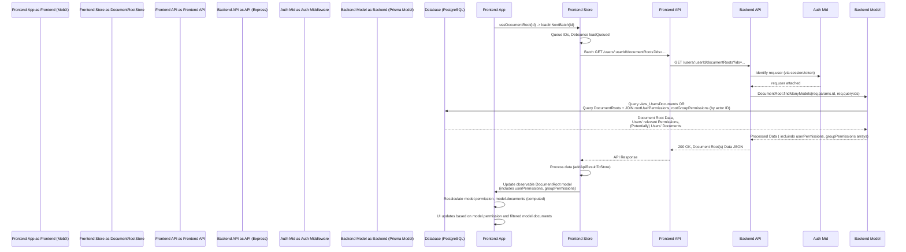

# Chapter 3: Document Root

Building upon the foundation laid in Chapter 2 ([Document](02_document_.md)), where we established the `Document` as the universal content unit, we now introduce the **Document Root**.

The `DocumentRoot` abstraction serves as a conceptual and functional container, grouping related [`Documents`](02_document_.md). Its primary purpose extends beyond simple aggregation: it acts as the central policy point for access control over the documents it contains.

Consider the scenario of a course module or a shared project folder. Permissions need to be managed for the *entire collection* of resources within that module or folder, not just individually for each file. When a user attempts to access any document within this container, the system must determine if they have permission for that specific resource, often inheriting or being influenced by the permissions set at the container level.

The `DocumentRoot` solves this by providing a single entity to apply broad access policies that govern the contained [`Documents`](02_document_.md).

## The Document Root Concept

A `DocumentRoot` represents a distinct, top-level collection of [`Document`](02_document_.md)s. Think of it as a logical boundary or domain within the application. Its significance lies in hosting the core access control configuration for its contents.

Key aspects:

*   **Containment:** A `DocumentRoot` holds a collection of [`Documents`](02_document_.md). Every `Document` must belong to exactly one `DocumentRoot`.
*   **Access Policy Anchor:** It is the designated place to define who ([`User`](01_user_.md)s) via what mechanism ([`Student Group`](04_student_group_.md)s, direct permissions) has what level of access ([`Access`](05_access_policy___permissions_.md)) to the documents within this root.
*   **Inheritance/Influence:** While individual documents *could* theoretically have their own permissions, in this architecture, permissions primarily cascade or are derived from the `DocumentRoot`'s configuration. A user's access to a `Document` is determined by their highest applicable permission on its containing `DocumentRoot`.
*   **State:** Beyond access settings, it doesn't typically hold content itself, but dictates the context and permissions for its child [`Documents`](02_document_.md).

## Structure and Relationships

The database schema defines the core structure and relationships of `DocumentRoot`:

```prisma
// teaching-api\prisma\schema.prisma (Simplified)
model DocumentRoot {
  id                              String                            @id @db.Uuid // Unique identifier for the root
  access                          Access                            @default(RW_DocumentRoot) // Default access level for the root itself
  sharedAccess                    Access                            @default(None_DocumentRoot) @map("shared_access") // Access level for documents within this root shared by *any* user (e.g. CMS content)
  documents                       Document[]                        @relation("documents") // Contains Documents
  rootGroupPermissions            RootGroupPermission[]             @relation("root_group_to_document_root_permission") // Group-specific permissions on this root
  rootUserPermissions             RootUserPermission[]              @relation("root_user_to_document_root_permission") // User-specific permissions on this root
  // ... permission views ...

  @@index([id], map: "document_root_id_index")
  @@map("document_roots")
}
```

The schema highlights:
*   `id`: The unique identifier. Note that unlike other models, the `@default(dbgenerated("gen_random_uuid()"))` is often *omitted* here, implying IDs might be assigned externally or in a more controlled manner during creation (e.g., linked to an external CMS ID).
*   `access`: A default access level applicable to the `DocumentRoot` itself or as a baseline.
*   `sharedAccess`: Crucially, this defines the access level for documents *within* this root that are considered "shared" or viewable beyond specific author or group permissions. This is key for content available publicly or to any user with basic access to the application context this root belongs to.
*   Relations: Explicit links (`documents`, `rootGroupPermissions`, `rootUserPermissions`) showcase how it contains [`Documents`](02_document_.md) and is associated with permissions defined for [`Users`](01_user_.md) and [`Student Groups`](04_student_group_.md).

## Using Document Roots (Use Case: Displaying Documents in a Course Module)

A common use case is displaying all documents relevant to the current [`viewedUser`](01_user_.md) within a specific course module, represented by a `DocumentRoot`. This involves:

1.  Identifying the `DocumentRoot` ID for the module.
2.  Fetching the `DocumentRoot` data and the [`Documents`](02_document_.md) it contains.
3.  Crucially, determining the current [`viewedUser`](01_user_.md)'s effective permission on this `DocumentRoot`.
4.  Filtering the list of contained [`Documents`](02_document_.md) to only show those the [`viewedUser`](01_user_.md) is permitted to see based on the calculated permission and the document's nature (e.g., author-specific vs. shared).
5.  Displaying the filtered [`Documents`](02_document_.md).

The frontend utilizes observables and computed properties on the `DocumentRoot` model to manage state and derive this information based on the currently loaded data and the [`viewedUser`](01_user_.md) from the [`UserStore`](01_user_.md).

```typescript
// teaching-dev\src\models\DocumentRoot.ts (Simplified)
import { computed } from 'mobx';
import { DocumentType, Access } from '@tdev-api/document';
import { highestAccess, NoneAccess, RWAccess } from './helpers/accessPolicy';
import { DocumentRootStore } from '@tdev-stores/DocumentRootStore';
import { TypeMeta } from './DocumentRoot';

class DocumentRoot<T extends DocumentType> {
    // ... observable properties like _access, _sharedAccess, isLoaded ...
    readonly store: DocumentRootStore;
    readonly id: string;
    readonly meta: TypeMeta<T>;
    readonly isDummy: boolean;

    constructor(props: any, meta: TypeMeta<T>, store: DocumentRootStore, isDummy?: boolean) {
        // ... assign properties ...
    }

    @computed
    get permission() {
        // Calculates highest permission for the CURRENTLY VIEWED USER
        // Considers:
        // 1. User's direct permissions on this root
        // 2. Permissions from groups the user is in, on this root
        // 3. The root's inherent 'access' property
        // 4. The root's meta access property (less common influence)
        const userPermissions = this.store.currentUsersPermissions(this.id);
        return highestAccess(new Set([
            this._access,
            ...(userPermissions.map(p => p.access)),
            ...(this.meta.access ? [this.meta.access] : [])
        ]));
    }

    @computed
    get hasRWAccess() {
        // Convenience getter based on calculated 'permission'
        return RWAccess.has(this.permission);
    }

    @computed
    get documents() {
        // Filters documents from DocumentStore based on permissions
        // Shows:
        // - All documents if isDummy (local dev/creation context)
        // - Documents authored by viewedUser if viewedUser has any permission
        // - Documents accessible via sharedAccess if sharedAccess grants RO/RW
        if (!this.viewedUserId && !this.isDummy) {
            return []; // Can't load documents without a viewed user (except dummies)
        }
        return this.store.root.documentStore.findByDocumentRoot(this.id).filter((d) => {
            return (
                this.isDummy || // Always show all for dummy roots
                d.authorId === this.viewedUserId || // Show if authored by viewed user
                !NoneAccess.has(highestAccess(new Set([this.permission]), this._sharedAccess)) // Show if shared access applies or user has explicit root permission
            );
        });
    }

    // ... other properties and methods ...
}
```

The `permission` computed property aggregates all relevant permission sources from the backend (root's own `access`, user's specific permissions, group permissions) as fetched by the store into a single effective `Access` level for the current `viewedUser` on this `DocumentRoot`. The `documents` computed property then uses this calculated `permission` and the `_sharedAccess` property to filter the documents loaded into the [`DocumentStore`](02_document_.md), ensuring the UI only displays what the `viewedUser` is allowed to see within this root.

Interacting with `DocumentRoot` instances from UI components typically involves subscribing to the `DocumentRootStore` or using a hook like `useDocumentRoot`:

```typescript
// teaching-dev\src\hooks\useDocumentRoot.ts (Simplified)
import { useEffect, useState } from 'react';
import DocumentRoot, { TypeMeta } from '@tdev-models/DocumentRoot';
import { useStore } from '@tdev-hooks/useStore';

export const useDocumentRoot = <Type extends DocumentType>(
    id: string | undefined, // Optional ID - implies creation or unknown state
    meta: TypeMeta<Type>, // Type metadata for documents within this root
    addDummyToStore: boolean = true, // Add a placeholder if not found
    accessConfig: any = {}, // Default access for potential creation
    skipCreate?: boolean // Don't auto-create if ID is provided but not found
) => {
    const documentRootStore = useStore('documentRootStore');
    // Creates a local, dummy DocumentRoot state immediately for quick UI rendering
    const [dummyDocumentRoot] = useState<DocumentRoot<Type>>(new DocumentRoot( /* dummy props */ ));

    useEffect(() => {
        // Check if a real DocumentRoot with this ID is already in the store
        const existingRoot = documentRootStore.find(dummyDocumentRoot.id);
        if (existingRoot) {
            // If found, do nothing here, the component will use the store instance
            return;
        }

        // If not found and we need a dummy for immediate rendering
        if (addDummyToStore) {
             // Add the dummy instance to the store so other parts can find it
            documentRootStore.addDocumentRoot(dummyDocumentRoot);
        }

        // If an ID exists, attempt to load the real data from the API
        if (id && documentRootStore.root.sessionStore.isLoggedIn) {
            // Queue the real data load in the store's batch loader
            documentRootStore.loadInNextBatch(id, meta, { skipCreate: !!skipCreate }, accessConfig);
        } else {
            // No ID or not logged in, mark dummy as loaded if needed
            dummyDocumentRoot.setLoaded();
        }

        // Cleanup: potentially remove dummy from store on unmount if it wasn't replaced by real data
        return () => {
             if (!documentRootStore.find(dummyDocumentRoot.id) || documentRootStore.find(dummyDocumentRoot.id) === dummyDocumentRoot) {
                 documentRootStore.removeFromStore(dummyDocumentRoot.id, false);
             }
        };
    }, [id, documentRootStore.root.sessionStore.isLoggedIn]); // Re-run if ID or login status changes

    // Return the real DocumentRoot from the store if it exists, otherwise the dummy
    return documentRootStore.find<Type>(dummyDocumentRoot.id) || dummyDocumentRoot;
};
```

The `useDocumentRoot` hook provides a pattern for components needing a `DocumentRoot`. It optimizes by first creating a local "dummy" placeholder allowing reactive UI elements to render instantly. It then uses `useEffect` to trigger an asynchronous fetch of the *real* `DocumentRoot` and its contents via `documentRootStore.loadInNextBatch` if an ID is provided and the user is logged in. The component observes the store, automatically switching from the dummy placeholder to the real data once loaded. This lazy-loading and initial dummy-rendering pattern is common for reactive UIs.

## Internal Walkthrough: Fetching a Document Root for a User

Fetching a `DocumentRoot` is more than just retrieving its basic properties; it involves assessing the requesting user's effective permissions.



This sequence highlights that fetching a `DocumentRoot` is tied to the *acting user*'s identity (`req.user` / `actorId`) because the backend query includes filtering permissions based *specifically* on that user and their group memberships. The `view_UsersDocuments` view (simplified model interaction in diagram) is specifically designed to optimize retrieval of roots *and* permissions relevant to a single user.

## Internal Implementation Details

### Backend API Controllers

Controllers orchestrate the request flow, passing necessary context (like the `actor` / `req.user`) to the backend model.

```typescript
// teaching-api\src\controllers\documentRoots.ts (Simplified)
import { RequestHandler } from 'express';
import DocumentRoot from '../models/DocumentRoot';

export const find: RequestHandler<{ id: string }> = async (req, res, next) => {
    try {
        // Pass the authenticated user (actor) to the model
        const document = await DocumentRoot.findModel(req.user!, req.params.id);
        res.json(document); // Returns DocumentRoot + relevant user/group permissions
    } catch (error) {
        next(error);
    }
};

export const findManyFor: RequestHandler<
    { id: string /** userId */ }, // Note: uses userId from URL, requires auth check
    any,
    any,
    { ignoreMissingRoots?: boolean; ids: string[] }
> = async (req, res, next) => {
    try {
        // Authorization check: only actor or admin can query roots *for* another user
        const canLoad = req.user!.id === req.params.id || req.user?.isAdmin;
        if (!canLoad) {
            throw new HTTP403Error('Not Authorized');
        }
        const ids = Array.isArray(req.query.ids) ? req.query.ids : [req.query.ids];
        if (ids.length === 0) return res.json([]);

        // Pass the *target* user ID (from URL) and root IDs to the model
        const documents = await DocumentRoot.findManyModels(
            req.params.id, // User ID whose permissions should be checked
            ids,
            !!req.query.ignoreMissingRoots // Flag for specific load scenarios
        );
        res.json(documents); // Returns DocumentRoots + target user's relevant permissions + their documents
    } catch (error) {
        next(error);
    }
};

// ... create, update, delete controllers (simplified in Chapter 1)
```

The `findManyFor` controller shows how the backend authorizes requests to fetch data "for" a specific user (`req.params.id`) ensuring only that user or an admin can do so. It then calls the model with the *target* `userId` and the list of `ids` requested by the frontend.

### Backend Model Logic

The `DocumentRoot` backend model encapsulates the database querying logic to retrieve `DocumentRoot` entities efficiently, often alongside the user's permissions.

```typescript
// teaching-api\src\models\DocumentRoot.ts (Simplified)
import prisma from '../prisma';
import { PrismaClient, User, DocumentRoot as DbDocumentRoot, RootGroupPermission, RootUserPermission } from '@prisma/client';
import { ApiDocument } from './Document'; // Frontend Document interface
import { ApiUserPermission } from './RootUserPermission'; // Frontend UserPermission interface
import { ApiGroupPermission } from './RootGroupPermission'; // Frontend GroupPermission interface

// Type combining DB model with necessary relations for permission checks
export type AccessCheckableDocumentRoot = DbDocumentRoot & {
    rootGroupPermissions: RootGroupPermission[];
    rootUserPermissions: RootUserPermission[];
};

// Type returned by API endpoint for a single DocumentRoot
export type ApiDocumentRoot = AccessCheckableDocumentRoot & {
    documents: ApiDocument[];
    userPermissions: ApiUserPermission[];
    groupPermissions: ApiGroupPermission[]; // User/Group permissions relevant to the ACTOR
};


function DocumentRoot(db: PrismaClient['documentRoot']) {
    return Object.assign(db, {
        async findModel(actor: User, id: string): Promise<ApiDocumentRoot | null> {
            // Uses a database view (view_UsersDocuments) optimized for fetching
            // document roots and permissions *for a specific user*
            const documentRoot = (await prisma.view_UsersDocuments.findUnique({
                where: {
                    id_userId: {
                        id: id,
                        userId: actor.id // Filter by the acting user
                    }
                }
            })) as ApiDocumentRoot | null;

            // Fallback: If the view yields nothing (maybe empty root or no user docs),
            // fetch the root directly but still filter permissions by user/group membership
            if (!documentRoot) {
                const docRoot = await db.findUnique({
                    where: { id: id },
                    include: {
                        rootUserPermissions: { where: { userId: actor.id }}, // Direct permissions for actor
                        rootGroupPermissions: { where: { studentGroup: { users: { some: { id: actor.id } } } } } // Permissions for groups actor is in
                    }
                });
                if (!docRoot) return null; // Root doesn't exist or actor has no connection

                return {
                    ...docRoot,
                    documents: [], // Documents not included in this fallback fetch
                    userPermissions: docRoot.rootUserPermissions.map(prepareUserPermission),
                    groupPermissions: docRoot.rootGroupPermissions.map(prepareGroupPermission)
                };
            }

            // If view worked, documents and already filtered permissions are included
            delete (documentRoot as any).userId; // Cleanup view specific field
            return documentRoot;
        },

        async findManyModels(
            actorId: string, // Target user ID to filter permissions by
            ids: string[],
            ignoreMissingRoots: boolean = false
        ): Promise<ApiDocumentRoot[] | null> {
             // Similar logic to findModel, but for multiple IDs using findMany on the view
            const documentRoots = (await prisma.view_UsersDocuments.findMany({
                where: {
                    id: { in: ids },
                    userId: actorId // Filter by the target user ID
                 },
                relationLoadStrategy: 'query' // Optimize view query
            })) as unknown as ApiDocumentRoot[];

            // Handle missing roots (those not found in the view for the target user)
            const missingDocumentRoots = ids.filter(
                (id) => !documentRoots.find((docRoot) => docRoot.id === id)
            );
            if (missingDocumentRoots.length > 0 && !ignoreMissingRoots) {
                // Fetch missing roots directly, filtering permissions by actorId
                 const docRoots = await db.findMany({ /* ... prisma query filtering permissions by actorId ... */ });
                // ... add to response ...
            }

            return documentRoots; // Modified results (including documents)
        },

        // ... createModel, updateModel, deleteModel, getPermissions ...
    });
}
```

The `findModel` and `findManyModels` demonstrate crucial backend logic. They don't just fetch a `DocumentRoot` by ID; they fetch it *in the context of a specific `actorId`*. This is achieved by leveraging database views (`view_UsersDocuments`) which pre-calculate the permissions relevant to each user on each document root, or by explicitly including and filtering related permission models in the Prisma query. This ensures that the API response for a `DocumentRoot` includes *only* the permissions relevant to the user making the request (or the `userId` specified in `findManyFor`).

### Frontend Store Management

The `DocumentRootStore` handles fetching, storing, and processing `DocumentRoot` data on the frontend. It also orchestrates the loading of associated data like permissions and documents.

```typescript
// teaching-dev\src\stores\DocumentRootStore.ts (Simplified)
import { action, observable } from 'mobx';
import { RootStore } from '@tdev-stores/rootStore';
import { computedFn } from 'mobx-utils';
import DocumentRoot from '@tdev-models/DocumentRoot'; // Frontend model
import { findManyFor as apiFindManyFor, DocumentRoot as ApiDocumentRoot } from '@tdev-api/documentRoot';
import iStore from '@tdev-stores/iStore';

export class DocumentRootStore extends iStore {
    readonly root: RootStore;
    documentRoots = observable.array<DocumentRoot<any>>([]);
    queued = new Map<string, any>(); // Batch loading queue

    constructor(root: RootStore) {
        super();
        this.root = root;
    }

    @action
    loadInNextBatch<Type extends DocumentType>(
        id: string,
        meta?: TypeMeta<Type>,
        loadConfig?: any,
        accessConfig?: any
    ) {
       // Queues DocumentRoot ID for batch loading
       // Prevents duplicate loads and manages debounce
       if (this.queued.has(id)) return;
       this.queued.set(id, { meta, load: loadConfig, access: accessConfig });
       this.loadQueued(); // Triggers debounced load
    }

    // Debounced method to actually fetch queued roots from the API
    loadQueued = debounce(action(this._loadQueued), 10, { /* ... config ... */ });

    @action
    _loadQueued() {
        const keys = [...this.queued.keys()].sort();
        const userId = this.root.userStore.viewedUserId;
        if (keys.length === 0 || !userId) return; // Don't load if nothing queued or no user

        this.withAbortController(`load-queued-${keys.join('--')}`, async (signal) => {
            // Call backend API findManyFor for the viewedUser and queued IDs
            const models = await apiFindManyFor(userId, keys, this.root.userStore.isUserSwitched, signal.signal);

            // Process the API response
            models.data.forEach(action((data) => {
                const config = this.queued.get(data.id);
                if (!config) return;
                this.addApiResultToStore(data, config); // Add to store and process relations
                this.queued.delete(data.id); // Remove from queue
            }));

            // Handle roots that weren't returned by the API (e.g., not found, no access)
            // ... potentially create dummy roots or mark as loaded ...
        });
    }

    @action
    addApiResultToStore(data: ApiDocumentRoot, config: any) {
        if (!config.meta) return;

        // 1. Add/Update the DocumentRoot model itself
        const documentRoot = new DocumentRoot(data, config.meta, this);
        this.addDocumentRoot(documentRoot, { cleanup: true, deep: false });

        // 2. Add associated User and Group Permissions to PermissionStore
        if (config.load?.groupPermissions) {
            data.groupPermissions.forEach((gp) => {
               // adds to PermissionStore
               this.root.permissionStore.addGroupPermission({ ...gp, documentRootId: documentRoot.id });
            });
        }
        if (config.load?.userPermissions) {
            data.userPermissions.forEach((up) => {
               // adds to PermissionStore
               this.root.permissionStore.addUserPermission({ ...up, documentRootId: documentRoot.id });
            });
         }

        // 3. Add associated Documents to DocumentStore
        if (config.load?.documents) {
            data.documents.forEach((doc) => {
                // adds to DocumentStore, ensures they link back to this DocumentRoot model
               this.root.documentStore.addToStore(doc);
            });
        }

        documentRoot.setLoaded(); // Mark the root as successfully loaded
        return documentRoot;
    }

    @action
    handleUpdate({ id, access, sharedAccess }: DocumentRootUpdate) {
        // Handles Socket.IO updates for DocumentRoot changes
        const model = this.find(id);
        if (model && this.root.userStore.current) {
            const oldPermission = model.permission; // Capture permission before update
            if (access !== model.rootAccess) model.setRootAccess(access);
            if (sharedAccess !== model.sharedAccess) model.setSharedAccess(sharedAccess);

            // If the user's access changed from None to something else, reload content
            const newPermission = model.permission;
            if (NoneAccess.has(oldPermission) && !NoneAccess.has(newPermission)) {
                 this.reload(model); // Trigger full reload of documents, permissions etc.
            }
        }
    }
    // ... other methods like reload, save, destroy ...
}
```

The `DocumentRootStore` is pivotal on the frontend. It manages the collection of `DocumentRoot` model instances. `loadInNextBatch` implements a debounced batch loading mechanism, crucial for performance when multiple components request roots simultaneously. `_loadQueued` fetches data from the backend using `apiFindManyFor`, specifically requesting data for the `viewedUser`. `addApiResultToStore` processes the response, not only creating/updating the `DocumentRoot` model but also pushing related `Permission` and `Document` data to their respective stores (`PermissionStore`, `DocumentStore`), ensuring the frontend state tree is consistent. `handleUpdate` reacts to real-time changes, updating the model and potentially triggering reloads if permissions change significantly.

## Conclusion

The `DocumentRoot` serves as a fundamental organizing and permission-boundary primitive in the `teaching-project`. By grouping related [`Documents`](02_document_.md) and acting as the primary anchor for `Access` control configurations defined via `RootUserPermission` and `RootGroupPermission`, it streamlines the management of content visibility and editability. The system calculates a user's effective `Access` level on a `DocumentRoot` by evaluating various permissions and applying a highest-wins logic, which then governs their interaction with the contained [`Documents`](02_document_.md). This concept is essential for understanding how content is scoped and secured within the application.

The next chapter delves deeper into one of the key mechanisms for assigning permissions to `DocumentRoot`s: the [Student Group](04_student_group_.md).

[Next Chapter: Student Group](04_student_group_.md)

---

Generated by [AI Codebase Knowledge Builder](https://github.com/The-Pocket/Tutorial-Codebase-Knowledge)
