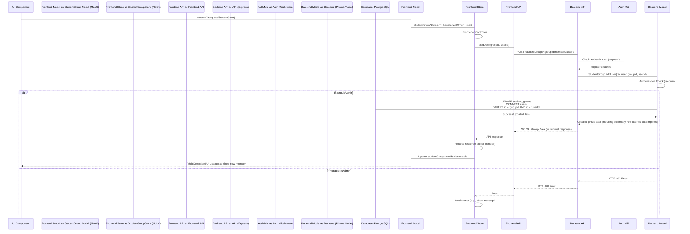

# Chapter 4: Student Group

Chapter 3 ([Document Root](03_document_root_.md)) established the `DocumentRoot` as the primary permission boundary in the `teaching-project`. While `RootUserPermission` allows assigning access directly to individual users on a `DocumentRoot`, managing this on a per-user basis for large cohorts like entire classes or project teams is inefficient.

The **Student Group** abstraction addresses this by allowing users to be organized into collections. Permissions can then be assigned to a `StudentGroup` via `RootGroupPermission` on a `DocumentRoot`, granting access implicitly to all users belonging to that group. This simplifies access control at scale.

Consider the problem of granting read/write access to a collection of course materials (a `DocumentRoot`) for an entire class of 50 students. Assigning 50 individual `RootUserPermission` records is cumbersome. Instead, create a `StudentGroup` for the class, add all 50 students to it, and assign one `RootGroupPermission` record linking the group to the course material's `DocumentRoot` with RW access.

## The Student Group Concept

A `StudentGroup` is a simple entity primarily representing a named set of [`User`](01_user_.md)s. Its value is realized through its relationship with `RootGroupPermission` and [`DocumentRoot`](03_document_root_.md).

Key characteristics:

*   **User Collection:** Holds a many-to-many relationship with the `User` model (`StudentGroupToUser` in schema). A user can be in multiple groups, and a group can have many users.
*   **Permission Target:** Can be assigned `RootGroupPermission`s on [`DocumentRoot`](03_document_root_.md)s.
*   **Hierarchy:** Supports nesting via an optional `parentId` field (self-referential relation). This allows organizing groups into structures (e.g., departments > courses > project teams). Permissions *do not* automatically inherit down the group hierarchy in the core logic, but the structure is present for organizational purposes or potential future extensions.
*   **Metadata:** Simple `name` and `description` fields for identification and context.

## Structure and Relationships

The `StudentGroup` structure in the schema defines its core properties and its key relationships:

```prisma
// teaching-api\prisma\schema.prisma
model StudentGroup {
  id                              String                            @id @default(dbgenerated("gen_random_uuid()")) @db.Uuid
  name                            String                            @default("")
  description                     String                            @default("")
  parentId                        String?                           @map("parent_id") @db.Uuid
  createdAt                       DateTime                          @default(now()) @map("created_at")
  updatedAt                       DateTime                          @default(now()) @updatedAt @map("updated_at")
  rootGroupPermissions            RootGroupPermission[]             @relation("root_group_to_student_group_permission") // Link to permissions on DocumentRoots
  parent                          StudentGroup?                     @relation("parent_student_group", fields: [parentId], references: [id], onDelete: Cascade) // For nesting
  children                        StudentGroup[]                    @relation("parent_student_group") // Reverse relation for nesting
  users                           User[]                            @relation("StudentGroupToUser") // Members of this group
  view_DocumentUserPermissions    view_DocumentUserPermissions[] // Views incorporating group membership
  view_AllDocumentUserPermissions view_AllDocumentUserPermissions[] // Views incorporating group membership

  @@map("student_groups")
}
```

The schema shows the `name`, `description`, and `parentId` fields. Crucially, it has relations linking it to `RootGroupPermission`s and directly to `User`s (`users`). The views (`view_...Permissions`) reference `StudentGroup`, indicating that group memberships are incorporated into the efficient permission calculation layers.

## Using Student Groups (Use Case: Managing Class Members)

Using `StudentGroup`s involves creating the groups and managing their members. The frontend interacts with dedicated API endpoints for these operations.

### Frontend API Interaction

The `teaching-dev/src/api/studentGroup.ts` defines functions for common group operations.

```typescript
// teaching-dev\src\api\studentGroup.ts (Simplified)
import api from './base';
import { AxiosPromise } from 'axios';

export interface StudentGroup {
    id: string;
    name: string;
    description: string;
    userIds: string[]; // API returns user IDs for members

    parentId: string | null;

    createdAt: string;
    updatedAt: string;
}

export function all(signal: AbortSignal): AxiosPromise<StudentGroup[]> {
    return api.get(`/studentGroups`, { signal });
}

export function create(data: Partial<StudentGroup> = {}, signal: AbortSignal): AxiosPromise<StudentGroup> {
    return api.post(`/studentGroups`, data, { signal });
}

// ... update, destroy functions ...

export function addUser(id: string, userId: string, signal: AbortSignal): AxiosPromise<StudentGroup[]> {
    return api.post(`/studentGroups/${id}/members/${userId}`, { signal });
}

export function removeUser(id: string, userId: string, signal: AbortSignal): AxiosPromise<StudentGroup[]> {
    return api.delete(`/studentGroups/${id}/members/${userId}`, { signal });
}
```

This API layer exposes calls like `apiCreate`, `apiAddUser`, and `apiRemoveUser` used by the frontend store and components. Note that the `StudentGroup` interface includes `userIds`, allowing the frontend to easily track group members.

### Frontend Store Management

The `StudentGroupStore` is responsible for fetching, managing, and updating the collection of `StudentGroup` models on the frontend.

```typescript
// teaching-dev\src\stores\StudentGroupStore.ts (Simplified)
import { action, observable } from 'mobx';
import { RootStore } from '@tdev-stores/rootStore';
import { computedFn } from 'mobx-utils';
import StudentGroup from '@tdev-models/StudentGroup'; // Frontend model
import {
    create as apiCreate,
    all as apiAll,
    addUser as apiAddUser,
    removeUser as apiRemoveUser
} from '../api/studentGroup'; // API functions
import User from '../models/User';

export class StudentGroupStore extends iStore<`members-${string}`> {
    readonly root: RootStore;
    studentGroups = observable.array<StudentGroup>([]);

    constructor(root: RootStore) {
        super();
        this.root = root;
        // ... load/initialize logic ...
    }

    @action
    load() {
         // Fetches all groups for the current user (or all if admin)
        return this.withAbortController('load-all', async (signal) => {
            return apiAll(signal.signal).then(
                action(({ data }) => {
                    const groups = data.map((group) => new StudentGroup(group, this));
                    this.studentGroups.replace(groups);
                    return groups;
                })
            ).catch(this.onError); // Handle errors via base store method
        });
    }

    find = computedFn(
        function (this: StudentGroupStore, id?: string | null): StudentGroup | undefined {
            if (!id) { return; }
            return this.studentGroups.find((d) => d.id === id);
        },
        { keepAlive: true }
    );

    @action
    create(name: string, description: string, parentId?: string) {
        return this.withAbortController(`create-${name}`, async (signal) => {
            return apiCreate({ name, description, parentId }, signal.signal).then(({ data }) => {
                // Add the newly created group to the store's collection
                const group = new StudentGroup(data, this);
                this.studentGroups.push(group);
                return group;
            }).catch(this.onError);
        });
    }

    @action
    addUser(studentGroup: StudentGroup, user: User) {
        // Calls API to add a user to a group
        return this.withAbortController(`members-add-${studentGroup.id}-${user.id}`, async (signal) => {
            // API returns the updated group (or response indicating success)
            return apiAddUser(studentGroup.id, user.id, signal.signal).then(
                action(({ data }) => {
                    // Update the local observable state
                     studentGroup.userIds.add(user.id); // Efficiently add user ID to observable set
                    return studentGroup;
                })
            ).catch(this.onError);
        });
    }

    @action
    removeUser(studentGroup: StudentGroup, user: User) {
         // Calls API to remove a user from a group
        return this.withAbortController(`members-rm-${studentGroup.id}-${user.id}`, async (signal) => {
             // API returns the updated group (or response indicating success)
            return apiRemoveUser(studentGroup.id, user.id, signal.signal).then(
                action(({ data }) => {
                    // Update the local observable state
                    studentGroup.userIds.delete(user.id); // Efficiently remove user ID from observable set
                    return studentGroup;
                })
            ).catch(this.onError);
        });
    }

    // ... save, destroy, cleanup methods ...
}
```

The `StudentGroupStore` handles fetching all groups (`load`), creating new ones (`create`), and managing memberships (`addUser`, `removeUser`). Actions like `addUser` update the local `studentGroup.userIds` observable set *after* a successful API call, keeping the UI instantly reactive while maintaining consistency with the backend.

### Frontend StudentGroup Model

The frontend `StudentGroup` model wraps the API data and provides useful computed properties and actions for the UI.

```typescript
// teaching-dev\src\models\StudentGroup.ts (Simplified)
import { action, computed, observable } from 'mobx';
import { StudentGroup as StudentGroupProps } from '@tdev-api/studentGroup';
import { StudentGroupStore } from '@tdev-stores/StudentGroupStore';
import User from '@tdev-models/User'; // Frontend User model
import _ from 'lodash'; // Used for sorting

class StudentGroup {
    readonly store: StudentGroupStore;

    readonly id: string;
    @observable accessor name: string;
    @observable accessor description: string;

    userIds = observable.set<string>([]); // Observable set of member user IDs

    @observable accessor parentId: string | null;

    readonly createdAt: Date;
    readonly updatedAt: Date;

    constructor(props: StudentGroupProps, store: StudentGroupStore) {
        this.store = store;
        this.id = props.id;

        // ... initialize other simple properties ...
        this.name = props.name;
        this.description = props.description;
        this.userIds.replace(props.userIds); // Initialize observable set

        this.parentId = props.parentId || null;
        // ... initialize dates ...
    }

    @computed
    get students() {
        // Computed property linking user IDs to actual User models from UserStore
        return this.store.root.userStore.users.filter((u) => this.userIds.has(u.id));
    }

    @computed
    get parent(): StudentGroup | undefined {
         // Convenience getter for the parent group model
        return this.store.find(this.parentId);
    }

    @computed
    get parentIds(): string[] {
        // Recursive getter for all parent IDs in the hierarchy
        return this.parent ? [this.parent.id, ...this.parent.parentIds] : [];
    }

    @computed
    get children() {
         // Computed property for nested child groups
        return _.orderBy(
            this.store.studentGroups.filter((g) => g.parentId === this.id),
            ['name'],
            ['asc']
        );
    }

    @action
    addStudent(student: User) {
        // Action to add a student, calls the store method
        return this.store.addUser(this, student);
    }

    @action
    removeStudent(student: User) {
         // Action to remove a student, calls the store method
        return this.store.removeUser(this, student);
    }

    // ... actions for updating group properties, saving, destroying ...
}

export default StudentGroup;
```

The `StudentGroup` model holds the member `userIds` in an observable set. The powerful `students` computed property efficiently retrieves the actual [`User`](01_user_.md) models from the [`UserStore`](01_user_.md) using these IDs, allowing UI components to easily display member details. `parent` and `children` computed properties leverage the `parentId` to provide a hierarchical view of groups within the store. `addStudent` and `removeStudent` actions delegate logic to the group store.

## Internal Walkthrough: Adding a User to a Group

Here is a simplified flow when a frontend action (e.g., clicking "Add Student") triggers adding a user to a group:



This flow emphasizes that membership changes require specific API calls and backend authorization checks (admin status in this case) to ensure only authorized users can modify group compositions.

## Internal Implementation Details

### Backend API Controllers

Controllers handle incoming requests, perform initial checks, and delegate to the model.

```typescript
// teaching-api\src\controllers\studentGroups.ts (Simplified)
import { RequestHandler } from 'express';
import StudentGroup from '../models/StudentGroup'; // Backend model

// ... other controllers (create, update, delete, all) ...

export const addUser: RequestHandler<{ id: string; userId: string }, any, any> = async (req, res, next) => {
    try {
        // actor (req.user) and target groupId/userId from URL
        const model = await StudentGroup.addUser(req.user!, req.params.id, req.params.userId);
        // Response might contain the updated group or just success status
        res.status(200).json(model);
    } catch (error) {
        next(error);
    }
};

export const removeUser: RequestHandler<{ id: string; userId: string }, any, any> = async (
    req,
    res,
    next
) => {
    try {
        // actor (req.user) and target groupId/userId from URL
        const model = await StudentGroup.removeUser(req.user!, req.params.id, req.params.userId);
        // Response might contain the updated group or just success status
        res.status(200).json(model);
    } catch (error) {
        next(error);
    }
};

export const all: RequestHandler = async (req, res, next) => {
    try {
        // Pass the actor (req.user) to filter the results
        const groups = await StudentGroup.all(req.user!);
        res.json(groups); // Returns groups the actor is in or all if admin
    } catch (error) {
        next(error);
    }
};
```

Controllers for `addUser` and `removeUser` extract IDs from the request parameters and pass them, along with the authenticated `req.user` (the actor), to the `StudentGroup` model. The `all` controller also passes `req.user`, as the backend model implements logic to restrict `all` to only groups the user is a member of, unless the user is an admin.

### Backend Model Logic

The backend `StudentGroup` model contains the logic for interacting with the database and enforcing business rules, like authorization for group modifications.

```typescript
// teaching-api\src\models\StudentGroup.ts (Simplified)
import { PrismaClient, StudentGroup as DbStudentGroup, User } from '@prisma/client';
import prisma from '../prisma'; // Prisma client
import { HTTP403Error, HTTP404Error } from '../utils/errors/Errors';

// Helper to format data returned by API (attaches userIds array)
type ApiStudentGroup = DbStudentGroup & {
    userIds: string[];
};
 const asApiRecord = (
    record: (DbStudentGroup & { users: { id: string }[] }) | null
): ApiStudentGroup | null => {
    if (!record) { return null; }
    const group = { ...record, userIds: record.users.map((user) => user.id) };
    delete (group as any).users; // Remove the joined 'users' objects
    return group;
};


function StudentGroup(db: PrismaClient['studentGroup']) {
    return Object.assign(db, {

        // Method to fetch a single group, always including member IDs
        async findModel(id: string): Promise<ApiStudentGroup | null> {
            const model = await db.findUnique({
                where: { id: id },
                include: { users: { select: { id: true } } } // Include member user IDs
            });
            return asApiRecord(model); // Format for API response
        },

        // Method to add a user to a group
        async addUser(actor: User, id: string, userId: string): Promise<DbStudentGroup> {
            // Authorization check: Only admin can add users to groups
            if (!actor.isAdmin) { throw new HTTP403Error('Not authorized'); }

            // Check if group exists (optional, Prisma handles non-existent relations gracefully but good practice)
            const record = await this.findModel(id);
            if (!record) { throw new HTTP404Error('Group not found'); }

             // Prisma many-to-many connect operation
            return db.update({
                where: { id: id },
                data: { users: { connect: { id: userId } } } // Connects the user to the group
            });
        },

        // Method to remove a user from a group
        async removeUser(actor: User, id: string, userId: string): Promise<DbStudentGroup> {
            // Authorization check: Only admin can remove users from groups
            if (!actor.isAdmin) { throw new HTTP403Error('Not authorized'); }

             // Check if group exists
            const record = await this.findModel(id);
            if (!record) { throw new HTTP404Error('Group not found'); }

             // Prisma many-to-many disconnect operation
            return db.update({
                where: { id: id },
                data: { users: { disconnect: { id: userId } } } // Disconnects the user from the group
            });
        },

        // Method to fetch all groups (filtered if not admin)
         async all(actor: User): Promise<ApiStudentGroup[]> {
            const all = await db.findMany({
                where: actor.isAdmin
                    ? undefined  // If admin, no filtering
                    : {
                          users: { some: { id: actor.id } } // If not admin, filter to groups the actor is in
                      },
                include: { users: { select: { id: true } } } // Always include member IDs
            });
            return all.map((group) => asApiRecord(group)!); // Format results
        },

        async createModel(
            name: string,
            description: string,
            parentId: string | null
        ): Promise<DbStudentGroup> {
            // Potential authorization check here (e.g., only admins can create) - simplified for demo
             return db.create({
                data: { name, description, parentId }
            });
        },

        // ... updateModel, deleteModel ...
    });
}

export default StudentGroup(prisma.studentGroup);
```

The backend model functions like `addUser` and `removeUser` execute the core database operations using Prisma's `connect` and `disconnect` methods on the `users` relation. Crucially, they perform an `actor.isAdmin` check to enforce that only system administrators can modify group memberships. The `all` method demonstrates filtering the results based on the acting user's privileges. `asApiRecord` is a utility to shape the database result into the desired API structure, including the `userIds` array.

## Conclusion

The `StudentGroup` abstraction provides a vital mechanism for organizing [`User`](01_user_.md)s into logical cohorts. By enabling many-to-many membership and potentially hierarchical structure, it offers a scalable alternative to managing permissions solely on an individual basis. Its primary function is to serve as a targetable entity for `RootGroupPermission`s, streamlining access control over [`DocumentRoot`](03_document_root_.md)s for groups of users. Managing group membership is restricted to administrators, ensuring control over the composition of user cohorts that receive bulk permissions.

With the core entities (`User`, `Document`, `DocumentRoot`, `StudentGroup`) defined, we now turn to how permissions linking these entities are established and evaluated. The next chapter details the [Access Policy & Permissions](05_access_policy___permissions_.md).

[Next Chapter: Access Policy & Permissions](05_access_policy___permissions_.md)

---

Generated by [AI Codebase Knowledge Builder](https://github.com/The-Pocket/Tutorial-Codebase-Knowledge)
