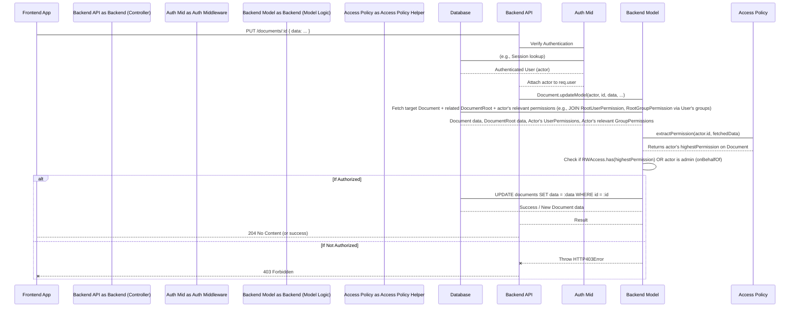

# Chapter 5: Access Policy & Permissions

In the preceding chapters, we've introduced the core entities of the `teaching-project`: the central actor ([Chapter 1: User](01_user_.md)), the fundamental content unit ([Chapter 2: Document](02_document_.md)), their containing structure and permission boundary ([Chapter 3: Document Root](03_document_root_.md)), and a key mechanism for grouping users to simplify access management ([Chapter 4: Student Group](04_student_group_.md)).

With these pieces in place, we can now define how the system determines what actions a specific [`User`](01_user_.md) is permitted to perform, particularly concerning [`DocumentRoot`](03_document_root_.md)s and the [`Document`](02_document_.md)s they contain. This is the role of the **Access Policy & Permissions** system.

## Concept

The access policy system governs visibility and mutability. It answers the question: "Can this [`User`](01_user_.md) perform this action (e.g., read, write) on this resource (`DocumentRoot`, `Document`)?".

A central use case illustrating this is a student accessing a course module's content. The system must determine if that student has permission to *view* the module's materials ([`Document`](02_document_.md)s) and, for activities like assignments, if they can *edit* their responses. This requires evaluating the student's relationship (direct or via a [`Student Group`](04_student_group_.md)) to the module's [`DocumentRoot`](03_document_root_.md) against defined permissions.

Key components of the system:

*   **`Access` Enum:** Defines the discrete levels of permission.
    *   `RO` (Read-Only): Can view content.
    *   `RW` (Read-Write): Can view and modify content.
    *   `None`: Explicitly denies access, overriding other permissions. (Or implicitly no access if no rules apply).
    These levels are qualified (e.g., `RO_DocumentRoot`, `RW_User`) to indicate the *source* of the permission, though the core meaning (`RO`/`RW`/`None`) is what matters for capabilities.
*   **`RootUserPermission`:** A direct link granting a specific `Access` level to a [`User`](01_user_.md) on a [`DocumentRoot`](03_document_root_.md).
*   **`RootGroupPermission`:** A link granting a specific `Access` level to a [`StudentGroup`](04_student_group_.md) on a [`DocumentRoot`](03_document_root_.md). All users in the group inherit this permission.
*   **`DocumentRoot` Properties:** The [`DocumentRoot`](03_document_root_.md) itself has `access` (a base level) and `sharedAccess` (access level for documents considered publicly available within that root). These also contribute to the effective permission.
*   **Highest Effective Permission:** For any given [`User`](01_user_.md) and [`DocumentRoot`](03_document_root_.md), the system calculates a single, highest applicable `Access` level by considering all relevant `RootUserPermission`s, `RootGroupPermission`s (via group membership), and the `DocumentRoot`'s `access` and `sharedAccess`. The logic typically follows a 'highest wins' principle, though `None` can explicitly deny access.

## Structure and Relationships

The `Access` enum and the permission relation models are defined in the Prisma schema:

```prisma
// teaching-api\prisma\schema.prisma (Relevant parts)

// Defines the permission levels
enum Access {
  RO_DocumentRoot
  RW_DocumentRoot
  None_DocumentRoot
  RO_StudentGroup
  RW_StudentGroup
  None_StudentGroup
  RO_User
  RW_User
  None_User
}

model DocumentRoot {
  id                   String                @id @db.Uuid
  access               Access                @default(RW_DocumentRoot) // Default access for the root
  sharedAccess         Access                @default(None_DocumentRoot) @map("shared_access") // Access for shared content
  rootGroupPermissions RootGroupPermission[] @relation("root_group_to_document_root_permission") // Groups with permission on this root
  rootUserPermissions  RootUserPermission[]  @relation("root_user_to_document_root_permission")  // Users with permission on this root
  // ... other fields and relations ...
}

model RootGroupPermission {
  id           String       @id @default(dbgenerated("gen\_random_uuid()")) @db.Uuid
  access       Access
  studentGroupId String     @map("student_group_id") @db.Uuid
  documentRootId String     @map("document_root_id") @db.Uuid
  documentRoot DocumentRoot @relation("root_group_to_document_root_permission", fields: [documentRootId], references: [id], onDelete: Cascade)
  studentGroup StudentGroup @relation("root_group_to_student_group_permission", fields: [studentGroupId], references: [id], onDelete: Cascade)

  @@map("root_group_permissions")
}

model RootUserPermission {
  id           String       @id @default(dbgenerated("gen\_random_uuid()")) @db.Uuid
  access       Access
  userId         String     @map("user_id") @db.Uuid
  documentRootId String     @map("document_root_id") @db.Uuid
  documentRoot DocumentRoot @relation("root_user_to_document_root_permission", fields: [documentRootId], references: [id], onDelete: Cascade)
  user         User         @relation("root_user_to_user_permission", fields: [userId], references: [id], onDelete: Cascade)

  @@map("root_user_permissions")
}

// Database views are used for efficient calculation of user permissions
view view_UsersDocuments { /* ... calculates effective permission for each user on roots ... */ }
// ... other permission views ...
```

This excerpt illustrates the explicit linking tables (`RootUserPermission`, `RootGroupPermission`) that tie `Access` levels to the relationship between [`Users`](01_user_.md)/[`Student Group`](04_student_group_.md)s and [`DocumentRoot`](03_document_root_.md)s. The `DocumentRoot` itself hosts base access (`access`, `sharedAccess`).

## Solving the Use Case: Frontend Interpretation

The frontend is responsible for interpreting permissions to control UI elements (e.g., showing/hiding an edit button) and user interactions. It does *not* enforce permissions on data modification requests; that's solely the backend's job.

The frontend models for [`DocumentRoot`](03_document_root_.md) and [`Document`](02_document_.md) contain computed properties that calculate the `viewedUser`'s effective permission based on the permission data fetched from the backend.

In the [`DocumentRoot`](03_document_root_.md) model, a computed property determines the highest effective permission for the current [`viewedUser`](01_user_.md):

```typescript
// teaching-dev\src\models\DocumentRoot.ts (Simplified)
class DocumentRoot<T extends DocumentType> {
    // ... observables and other properties ...

    @computed
    get permission() {
        // Calculates highest permission for the CURRENTLY VIEWED USER
        const userPermissions = this.store.currentUsersPermissions(this.id); // Get perms for viewed user
        const groupPermissions = this.store.currentGroupsPermissions(this.id); // Get perms for groups viewed user is in

        const allAccess = new Set([
            this._access, // Root's base access
            ...userPermissions.map(p => p.access), // User's direct perms
            ...groupPermissions.map(p => p.access) // User's group perms
        ]);

        // Returns the highest level considering all sources
        return highestAccess(allAccess); // Uses helper (see accessPolicy.ts)
    }

    // ... other properties and methods ...
}
```

The `permission` computed property uses a helper `highestAccess` (from frontend `accessPolicy.ts`) to find the most permissive level among the [`DocumentRoot`](03_document_root_.md)'s default access, the [`viewedUser`](01_user_.md)'s direct permissions, and permissions inherited from the [`viewedUser`](01_user_.md)'s [`Student Group`](04_student_group_.md) memberships on this specific root.

The `iDocument` base model then uses the containing [`DocumentRoot`](03_document_root_.md)'s permissions to determine editability:

```typescript
// teaching-dev\src\models\iDocument.ts (Simplified)
abstract class iDocument<Type extends DocumentType> {
    // ... observable properties ...

    @computed
    get canEdit() {
        // Checks if the viewed user has RW access on the linked DocumentRoot
        // Also considers authorship and sharedAccess for specific docs
        if (!this.root || !this.store.root.userStore.viewedUser) return false;

        const viewedUser = this.store.root.userStore.viewedUser;
        const effectiveRootPermission = this.root.permission; // Calculated on DocumentRoot model

        // Current logic simplification:
        // Author can edit if they have RW on the root, OR if root sharedAccess is RW
        // Other users can edit if they have RW on the root AND root sharedAccess is RW
        // A more complex policy could check doc-specific rules or parent permissions.
        const hasRwOnRoot = RWAccess.has(effectiveRootPermission);
        const hasRwViaShared = RWAccess.has(this.root.sharedAccess);

        if (this.authorId === viewedUser.id) {
             return hasRwOnRoot || hasRwViaShared;
        } else {
             return hasRwOnRoot && hasRwViaShared; // Example stricter rule for non-authors
        }
        // The actual implementation involves more nuances, but this is the core idea:
        // using the root's calculated permission and sharedAccess.
    }
}
```

The `canEdit` computed property leverages the `DocumentRoot` model's `permission` and `sharedAccess` properties. It then applies logic (which can vary based on document type or specific business rules) to determine if the [`viewedUser`](01_user_.md) can edit this specific [`Document`](02_document_.md). If `canEdit` is false, the UI should disable or hide edit controls.

The frontend manages `RootUserPermission` and `RootGroupPermission` records via the `PermissionStore`. This store fetches permissions related to loaded `DocumentRoot`s and provides methods for updating or creating permissions (typically only available to admins).

```typescript
// teaching-dev\src\stores\PermissionStore.ts (Simplified)
class PermissionStore extends iStore<`update-${string}`> {
    // ... other properties ...
    userPermissions = observable.array<UserPermission>([]); // Collection of direct user perms
    groupPermissions = observable.array<GroupPermission>([]); // Collection of group perms
    @observable accessor permissionsLoadedForDocumentRootIds = new Set<string>();

    // ... find/filter methods ...

    @action
    loadPermissions(documentRoot: DocumentRoot<any>) {
        // Fetches *all* user and group permissions for a specific DocumentRoot (admin view)
        if (this.permissionsLoadedForDocumentRootIds.has(documentRoot.id)) {
            return Promise.resolve();
        }
        return this.withAbortController(`load-permissions-${documentRoot.id}`, async (signal) => {
            // Calls API to get all permissions for this root
            return permissionsFor(documentRoot.id, signal.signal).then(
                action(({ data }) => {
                    // Adds fetched permissions to observable arrays
                    data.userPermissions.forEach((p) => {
                        this.addUserPermission(new UserPermission({ ...p, documentRootId: data.id }, this));
                    });
                    data.groupPermissions.forEach((p) => {
                        this.addGroupPermission(new GroupPermission({ ...p, documentRootId: data.id }, this));
                    });
                    this.permissionsLoadedForDocumentRootIds.add(documentRoot.id);
                })
            );
        });
    }
    // ... create, update, delete permission actions ...
}
```

The `PermissionStore.loadPermissions` fetches the *full* list of `RootUserPermission` and `RootGroupPermission` records for a given [`DocumentRoot`](03_document_root_.md) (this endpoint is typically admin-only). These are then added to the store's observable collections, which fuel the `permission` computed properties on `DocumentRoot` models. Components like the `PermissionsPanel` use this store to display and modify these granular permissions.

```typescript
// teaching-dev\src\components\PermissionsPanel\index.tsx (Simplified)
const PermissionsPanel = observer(({ documentRootId }: { documentRootId: string }) => {
    const userStore = useStore('userStore');
    const documentRootStore = useStore('documentRootStore');
    const permissionStore = useStore('permissionStore');

    // Only show panel if current user is admin and root is available
    if (!userStore.current?.isAdmin || !documentRootStore.find(documentRootId)) {
        return null;
    }

    const documentRoot = documentRootStore.find(documentRootId)!;

    // Load permissions when panel is opened
    const handleOpen = action(() => {
        permissionStore.loadPermissions(documentRoot);
        // ... set internal open state ...
    });

    // ... render UI using data from permissionStore, e.g.,
    // permissionStore.userPermissionsByDocumentRoot(documentRootId)
    // permissionStore.groupPermissionsByDocumentRoot(documentRootId)
    // Allow editing/adding/removing permissions, calling actions in permissionStore.
    // Allow editing root.access and root.sharedAccess calling actions on documentRoot.
    // For viewedUser (impersonation), show their calculated permission (root.permission)
});
```
The `PermissionsPanel` component demonstrates the UI layer interacting with the stores. It checks if the `currentUser` is an admin before rendering and uses `permissionStore.loadPermissions` to fetch granular permission data for the specific `DocumentRoot` when activated. It visualizes and allows modification of `RootUserPermission`, `RootGroupPermission`, and `DocumentRoot`'s own `access`/`sharedAccess` props. It also shows how the `viewedUser`'s perspective uses the *computed* `root.permission` to display their effective access without needing the full permission list.

## Internal Walkthrough: Backend Permission Enforcement

When a user attempts a data modification action (like saving a [`Document`](02_document_.md)), the backend *must* re-evaluate permissions authoritatively. This server-side check is distinct from frontend UI control and is the primary security boundary.



This flow highlights that the backend model logic receives the authenticated `actor` ([`User`](01_user_.md)) and explicitly fetches and evaluates permissions *during the request* before allowing sensitive operations (`UPDATE`, `DELETE`, etc.). This ensures that even if frontend checks are bypassed, unauthorized access is prevented.

## Internal Implementation Details

### Backend Access Policy Logic

The core logic for calculating the "highest access" resides in `accessPolicy.ts`. The `AccessLevels` map assigns numerical weights to the different `Access` enum values, allowing sorting to find the highest permission (e.g., `RW_User` > `RO_User` > `RW_DocumentRoot`).

```typescript
// teaching-api\src\helpers\accessPolicy.ts (Simplified)

// Sets for easy checking
export const NoneAccess = new Set<Access | undefined>([...]);
export const RWAccess = new Set<Access | undefined>([...]);
export const ROAccess = new Set<Access | undefined>([...]);

// Mapping Access levels to numbers for comparison (higher = more permissive)
export const AccessLevels = new Map<Access, number>([
    [Access.RO_DocumentRoot, 0],
    [Access.RW_DocumentRoot, 1],
    [Access.None_DocumentRoot, 2], // Note: None is often handled separately as a denial
    [Access.RO_StudentGroup, 3],
    [Access.RW_StudentGroup, 4],
    [Access.None_StudentGroup, 5],
    [Access.RO_User, 6],
    [Access.RW_User, 7],
    [Access.None_User, 8] // The order within each type group is RO < RW < None (for sorting 'None' to the top)
]);

// Helper to find the highest permission from a set
export const highestUserAccess = (permissions: Set<Access>): Access => {
    if (permissions.size === 0) {
        return Access.RO_DocumentRoot; // Default or lowest possible if no explicit rule? Depends on policy
    }
    // Sort by AccessLevels descending and pick the first one
    return [...permissions].sort((a, b) => AccessLevels.get(b)! - AccessLevels.get(a)!)[0];
};

// Combines user-specific permission with a potential maxAccess (like sharedAccess)
export const highestAccess = (permissions: Set<Access>, maxAccess?: Access): Access => {
    const userAccess = highestUserAccess(permissions);
    if (!maxAccess) {
        return userAccess;
    }
    // Compare user's highest permission with the max constraint (e.g., sharedAccess)
    // Return user's access if it's lower (more permissive), otherwise the max constraint
    if (AccessLevels.get(userAccess)! < AccessLevels.get(maxAccess)!) {
        return userAccess;
    }
    return maxAccess;
};
```
The `highestAccess` functions are key. `highestUserAccess` finds the single most permissive `Access` level from a set of permissions *relevant to a user* (direct or via groups). The second `highestAccess` function can optionally take a `maxAccess` parameter (like the `sharedAccess` field of the [`DocumentRoot`](03_document_root_.md)), allowing the policy to state "a user's effective access is their calculated permission, capped by this maximum level". Note the specific ordering in `AccessLevels` to make sorting work correctly with the `None` value.

### Backend Model Enforcement

The backend models fetching data or performing write operations (`Document.ts`, `DocumentRoot.ts`) are where the authoritative permission checks happen. They receive the `actor` (`User`) as an argument.

The `Document` model demonstrates how permissions are fetched and checked during a read (`findModel`) or write (`updateModel`).

```typescript
// teaching-api\src\models\Document.ts (Simplified)
import { Access, Document as DbDocument, PrismaClient, User } from '@prisma/client';
import prisma from '../prisma';
import { HTTP403Error, HTTP404Error } from '../utils/errors/Errors';
import DocumentRoot, { AccessCheckableDocumentRoot } from './DocumentRoot';
import { highestAccess, NoneAccess, RWAccess } from '../helpers/accessPolicy';

type AccessCheckableDocument = DbDocument & {
    documentRoot: AccessCheckableDocumentRoot; // Include related permissions for check
};

// Helper to calculate permission for a given actor and document
const extractPermission = (actorId: string, document: AccessCheckableDocument): Access | null => {
     // Logic described earlier: combines root.access, root.sharedAccess,
     // root.rootUserPermissions (for actor), root.rootGroupPermissions (for actor's groups)
     // Uses highestAccess helper. Returns null if explicitly None or no connection.
     // See full code for the detailed implementation.
};

// Prepares data for API response, calculating effective permission
// and possibly hiding data if permission is None
export const prepareDocument = (actorId: string, document: AccessCheckableDocument | null) => {
    if (!document) return null;
    const permission = extractPermission(actorId, document); // Calculate the permission!
    if (!permission || NoneAccess.has(permission)) {
        // If no permission or None access, return null or hide data
        // Current prepareDocument hides data for None, returns null if totally inaccessible.
         if (permission && NoneAccess.has(permission)) {
             const model: ApiDocument = { ...document };
             delete (model as Partial<AccessCheckableDocument>).documentRoot;
             model.data = null; // Hide sensitive data
             return { document: model, highestPermission: permission };
         }
        return null; // Completely inaccessible
    }

    const model: ApiDocument = { ...document };
    delete (model as Partial<AccessCheckableDocument>).documentRoot; // Clean up relation object

    return { document: model, highestPermission: permission };
};


function Document(db: PrismaClient['document']) {
    return Object.assign(db, {
        async findModel(actor: User, id: string): Promise<DocumentWithPermission | null> {
            // Fetch document, related DocumentRoot, AND permissions relevant to the actor
            const docWithPermissions = await db.findUnique({
                where: { id: id },
                include: {
                    documentRoot: { // Include the related root
                        include: {
                            rootUserPermissions: { where: { userId: actor.id }}, // Include actor's direct perms
                             // Include group perms ONLY for groups the actor is a member of
                            rootGroupPermissions: { where: { studentGroup: { users: { some: { id: actor.id } } } } }
                        }
                    }
                }
            }) satisfies (AccessCheckableDocument | null); // Type assertion for clarity

            // Use the helper to evaluate permissions and prepare the return structure
            return prepareDocument(actor.id, docWithPermissions);
        },

        async updateModel(actor: User, id: string, docData: JsonObject, _onBehalfOf = false) {
            const onBehalfOf = _onBehalfOf && actor.isAdmin; // Admin override flag

            if (!onBehalfOf) {
                // IMPORTANT: Fetch and check permissions for the actor on the target document
                const recordWithPermission = await this.findModel(actor, id);
                if (!recordWithPermission) throw new HTTP404Error('Document not found or no permission'); // findModel handles no-access
                // Must have RW access to update unless they are an admin using onBehalfOf
                if (!RWAccess.has(recordWithPermission.highestPermission)) {
                     throw new HTTP403Error('Not authorized');
                }
            } else {
                 // If admin is using onBehalfOf, just confirm doc exists
                 const record = await db.findUnique({ where: { id } });
                if (!record) throw new HTTP404Error('Document not found');
            }

            // If authorized (either via permission check or admin override), perform the update
            const model = await db.update({
                where: { id: id },
                data: { data: docData }, // Only allows updating 'data' field here
                // Include relations required by the controller for Socket.IO notifications
                include: { documentRoot: { include: { rootGroupPermissions: { /*...*/ }, rootUserPermissions: { /*...*/ } } } }
            });
            return model; // Return updated model
        },

        // deleteModel uses a similar pattern: findModel -> check RW access -> delete
    });
}
```

The `findModel` method is crucial; it doesn't just get the document but fetches the associated [`DocumentRoot`](03_document_root_.md) and specifically filters the `RootUserPermission`s and `RootGroupPermission`s to include *only* those relevant to the `actor`. `prepareDocument` then calculates the single `highestPermission` based on this fetched data. The `updateModel` method *calls `findModel` first* to get the actor's permission and *then* performs the `RWAccess.has()` check before executing the database `update`. The `onBehalfOf` flag allows admins to bypass the standard check. This pattern ensures robust server-side enforcement.

It's worth contrasting this with the `routeGuard` middleware (from `auth/guard.ts`).

```typescript
// teaching-api\src\auth\guard.ts (Simplified)
const routeGuard = (accessMatrix: AccessRegexRule[]) => {
    return (req: Request, res: Response, next: NextFunction) => {
        const reqPath = req.path.toLowerCase();
        // Basic check for authenticated user or public routes
        if (!req.user && ![...public routes check...]) {
            return res.status(HttpStatusCode.FORBIDDEN).json({ error: 'Authentication required' });
        }

        // Checks if path+method is allowed based on hardcoded matrix
        // Considers isAdmin flag from req.user
        if (!requestHasRequiredAttributes(accessMatrix, req.path, req.method, req.user?.isAdmin || false)) {
            return res
                .status(HttpStatusCode.FORBIDDEN)
                .json({ error: 'User does not have the role, method or path' });
        }

        next(); // If basic checks pass, proceed to controller/model
    };
};
```
The `routeGuard` provides a *coarse-grained* authorization layer. It checks if a user (or admin) is allowed to hit a specific API endpoint (`method` on `path`) *at all*, based on static rules configured for API routes. It does *not* check permissions on the specific resource (`Document` or `DocumentRoot`) being targeted by the request (e.g., `/documents/some-doc-id`). That finer-grained check is left to the model logic, as demonstrated in `Document.updateModel`. Both layers are necessary: the guard prevents unauthorized access to entire endpoint categories, while the model protects specific data instances.

## Conclusion

The Access Policy & Permissions system in `teaching-project` centers around [`DocumentRoot`](03_document_root_.md)s as policy anchors. Permissions are defined using the `Access` enum via direct `RootUserPermission`s or group-based `RootGroupPermission`s, complemented by `DocumentRoot`'s own `access` and `sharedAccess` properties. The system calculates a user's effective permission by consolidating these sources, with backend models strictly enforcing this permission during data operations (CRUD) and frontend components interpreting it to guide user interaction and UI presentation. This combined approach, leveraging database views for efficient query and explicit model-level checks, provides a robust and scalable authorization mechanism.

The next chapter will provide a comprehensive view of the database structure, illustrating how all these concepts are physically modeled and related.

[Next Chapter: Database Schema](06_database_schema_.md)
```

---

Generated by [AI Codebase Knowledge Builder](https://github.com/The-Pocket/Tutorial-Codebase-Knowledge)
