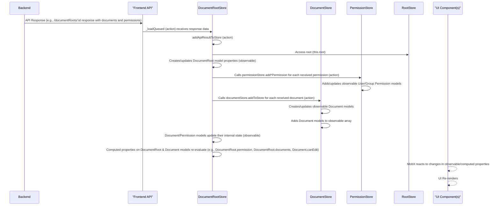

# Chapter 8: MobX Store Pattern

Having covered the backend's data schema in [Chapter 6: Database Schema](06_database_schema_.md) and the mechanism for client-server data exchange via the [API & Network Communication](07_api___network_communication_.md) layer, we now shift focus to the frontend. Managing application state on the client side—especially with complex, reactive UIs and potential real-time updates ([Chapter 9: Socket.IO](09_socket_io_.md))— requires a structured approach.

This is where the **MobX Store Pattern** comes into play. It provides a robust and predictable way to manage complex client-side data, ensuring UI components stay synchronized with the underlying state and react efficiently to changes.

## Concept

The MobX Store Pattern organizes the frontend application state into dedicated, observable containers called "stores". Each store encapsulates the state and logic related to a specific domain or feature (e.g., users, documents, settings).

A central use case demonstrating the need for this pattern is displaying content for a specific [`DocumentRoot`](03_document_root_.md). The UI needs to:
1.  Fetch the [`DocumentRoot`](03_document_root_.md) and its contained [`Document`](02_document_.md)s.
2.  Determine the [`viewedUser`](01_user_.md)'s effective permissions on that root ([Chapter 5: Access Policy & Permissions](05_access_policy___permissions_.md)), which may require referencing the [`UserStore`](01_user_.md) and [`PermissionStore`](05_access_policy___permissions_.md), incorporating [`Student Group`](04_student_group_.md) memberships from the [`StudentGroupStore`](04_student_group_.md).
3.  Filter the fetched [`Document`](02_document_.md)s based on these permissions and the document's nature (e.g., authorship, `sharedAccess`).
4.  Reactively update the displayed list of [`Document`](02_document_.md)s if the underlying data changes (via API response or Socket.IO) or if the [`viewedUser`](01_user_.md) or their permissions change.

The MobX Store Pattern provides the structure to make this interconnected state management manageable.

Key Elements:

*   **Stores:** Observable classes (`DocumentStore`, `UserStore`, etc.) holding state (`observable` properties/collections) and logic (`action` methods to mutate state).
*   **Models:** Observable classes (`User`, `Document`, `DocumentRoot`) representing individual data instances, typically wrapping raw API data. They often reside *within* stores and contain computed properties (`computed`) for derived data and `action`s for instance-specific logic.
*   **`RootStore`:** A single top-level store (`RootStore`) that holds instances of all other stores. This facilitates dependency injection and cross-store communication (stores access other stores via the `root` property).
*   **`iStore` Base Class:** Provides common functionality for stores, such as managing API request state (`ApiState`) and handling multiple concurrent requests via `AbortController` (`withAbortController`).
*   **Reactivity:** MobX observes changes to observables. Components using the `observer` wrapper automatically re-render when the observable data they depend on changes. Computed properties automatically re-calculate when their dependencies change.

## Solving the Use Case (Frontend)

Let's look at how a frontend component displaying documents in a `DocumentRoot` leverages this pattern.

```typescript file=teaching-dev/src/components/ExampleDocumentRootContent.tsx highlight=1,9,10,12,13,16,22
import React from 'react';
import { observer } from 'mobx-react-lite'; // MobX wrapper for reactive components
import { useStore } from '@tdev-hooks/useStore'; // Hook to access RootStore
import { useParams } from '@reach/router'; // Example router hook
import DocumentComponentMap from '@tdev-components/DocumentComponentMap'; // Maps document type to UI component

const ExampleDocumentRootContent = observer(() => { // 'observer' makes component reactive
    const { documentRootId } = useParams(); // Get root ID from URL
    const documentRootStore = useStore('documentRootStore'); // Access DocumentRootStore
    const userStore = useStore('userStore'); // Access UserStore

    // Fetch DocumentRoot and its related data (lazy/batched load handled by store hook)
    // The hook returns the observable DocumentRoot model instance (or a dummy)
    const documentRoot = useDocumentRoot(documentRootId, { /* meta config */ });

    // UI state depends on observable data from stores/models
    const isLoading = documentRoot.apiState === ApiState.SYNCING || !documentRoot.isLoaded;
    const canEditRoot = documentRoot.hasRWAccess; // Computed property on model, depends on viewedUser + permissions

    if (isLoading) {
        return <div>Loading...</div>; // Reactive loading state
    }

    if (!documentRoot.isLoaded) {
        return <div>Error or Not Found</div>; // Reactive error state
    }

    return (
        <div className="document-root-content">
            <h2>{/* Display info from documentRoot model */}</h2>
            {canEditRoot && <button>Add Document</button>} {/* UI reacts to canEditRoot */}
            <div className="document-list">
                {/* documentRoot.documents is a computed property filtering documents */}
                {documentRoot.documents.map(doc => (
                    // DocumentComponentMap maps doc type to specific component, passes the doc model
                    <DocumentComponentMap key={doc.id} document={doc} />
                ))}
            </div>
        </div>
    );
});

 export default ExampleDocumentRootContent;
```
This simplified component demonstrates accessing multiple stores (`documentRootStore`, `userStore`) via `useStore`. It uses the `useDocumentRoot` hook (which internally uses `DocumentRootStore`) to get the observable `DocumentRoot` model. The core of the reactivity comes from using properties computed on the `documentRoot` model, such as `isLoaded`, `apiState`, `hasRWAccess`, and `documents`. Because the component is wrapped in `observer`, it automatically re-renders whenever any of these observable properties or their underlying dependencies change. The filtering logic for `documentRoot.documents` resides *within* the `DocumentRoot` model, not the component.

The `DocumentRoot` model calculates its `documents` property by filtering the global collection of documents in the `DocumentStore`, relying on its own computed `permission` and the `viewedUser` from the `UserStore`:

```typescript file=teaching-dev/src/models/DocumentRoot.ts highlight=6,7,17,21,27,28
import { computed } from 'mobx';
// ... other imports
import { DocumentRootStore } from '@tdev-stores/DocumentRootStore'; // Parent store type
import { highestAccess, NoneAccess, RWAccess } from './helpers/accessPolicy'; // Permission logic helper
import { DocumentType } from '@tdev-api/document'; // Enum for document types

class DocumentRoot<T extends DocumentType> {
    // ... observable properties from API ...
    readonly store: DocumentRootStore; // Reference to parent store
    readonly root = this.store.root; // Direct access to RootStore

    // ... constructor ...

    @computed
    get permission() {
        // Calculates highest permission for the CURRENTLY VIEWED USER on this root
        // Depends on: this._access, this.root.permissionStore.userPermissions/groupPermissions, this.root.userStore.viewedUser
        const userPermissions = this.root.permissionStore.currentUsersPermissions(this.id); // Access PermissionStore via root
        // ... calculate combined access ...
        return highestAccess(/* ... set of relevant accesses ... */); // Uses helper
    }

    @computed
    get documents() {
        // Filters documents from the global DocumentStore
        // Depends on: this.root.documentStore.documents, this.root.userStore.viewedUserId, this.permission, this._sharedAccess
        if (!this.viewedUserId && !this.isDummy) {
            return [];
        }
        // Access DocumentStore via root to get ALL documents
        return this.root.documentStore.findByDocumentRoot(this.id).filter((d) => {
            // Filtering logic based on author, viewed user, and permissions
            return (
                this.isDummy ||
                d.authorId === this.viewedUserId ||
                !NoneAccess.has(highestAccess(new Set([this.permission]), this._sharedAccess))
            );
        });
    }

    // ... other properties and methods ...
}
```
This snippet shows how the `DocumentRoot` model, living within the `DocumentRootStore`, uses its `root` reference to access `UserStore`, `PermissionStore`, and `DocumentStore`. The `documents` computed property accesses the *entire collection* of documents managed by `DocumentStore` and filters them based on permissions derived from `PermissionStore` and the `viewedUser` info from `UserStore`. This keeps the filtering logic clean and reusable, tied to the `DocumentRoot` instance itself, and ensures the UI component observing `documents` automatically updates when any underlying data changes (e.g., new document added, permission changed, viewed user switched).

## Internal Walkthrough: Data Flow through Stores

When data arrives from the API (initial load or Socket.IO update), the data flows through the stores, causing reactive updates in the UI observing that data.



This shows a common flow: data arrives for one primary entity (`DocumentRoot`), but bundled related data (`Document`s, `Permission`s) is also received. The `DocumentRootStore` acts as the initial receiver and then distributes the related data to the appropriate stores (`DocumentStore`, `PermissionStore`) via `this.root`. Each store then updates its own collection of observable models. The reactive nature of MobX ensures that any component observing any of this updated data automatically re-renders.

## Internal Implementation

The core structure revolves around the `RootStore`, individual stores inheriting from `iStore`, and observable models.

### RootStore Centralization

The `RootStore` is the entry point for the entire frontend state tree. It's instantiated once.

```typescript file=teaching-dev/src/stores/rootStore.ts highlight=1,15,16,17,18,19,20,21,22
import React from 'react';
import { DocumentRootStore } from '@tdev-stores/DocumentRootStore';
import { UserStore } from '@tdev-stores/UserStore';
// ... other store imports
import { action } from 'mobx';
import { StudentGroupStore } from '@tdev-stores/StudentGroupStore';
import PermissionStore from '@tdev-stores/PermissionStore';
import DocumentStore from '@tdev-stores/DocumentStore';
import { PageStore } from '@tdev-stores/PageStore'; // Example other store

export class RootStore {
    documentRootStore: DocumentRootStore;
    userStore: UserStore;
    sessionStore: SessionStore; // Example authentication/session store
    socketStore: SocketDataStore; // Integrates Socket.IO updates
    studentGroupStore: StudentGroupStore;
    permissionStore: PermissionStore;
    documentStore: DocumentStore;
    pageStore: PageStore;
    adminStore: AdminStore;
    cmsStore: CmsStore;

    constructor() {
        // Instantiate all individual stores, passing 'this' (the RootStore instance)
        this.documentRootStore = new DocumentRootStore(this);
        this.sessionStore = new SessionStore(this);
        this.userStore = new UserStore(this);
        this.socketStore = new SocketDataStore(this);
        this.studentGroupStore = new StudentGroupStore(this);
        this.permissionStore = new PermissionStore(this);
        this.documentStore = new DocumentStore(this);
        this.pageStore = new PageStore(this);
        // ... instantiate other stores ...
    }

    // ... load/cleanup actions ...
}

// Create a single instance of the RootStore and a React Context to provide it
export const rootStore = Object.freeze(new RootStore());
export const storesContext = React.createContext(rootStore);
// StoresProvider is used at the top level of the React app tree
export const StoresProvider = storesContext.Provider;
```
The `RootStore` class holds a reference to every other store. In the constructor, it instantiates each store and passes `this` (the `RootStore` instance itself) to the child store constructor. This is crucial for enabling cross-store access via the `root` property on each child store. A React Context is also created to provide the single `rootStore` instance down the component tree, accessed via the `useStore` hook.

### iStore Base Functionality

The `iStore` abstract class provides common features needed by most stores interacting with asynchronous operations.

```typescript file=teaching-dev/src/stores/iStore.ts highlight=1,14,15,16,17,18,19,29
import { action, observable } from 'mobx';
import { computedFn } from 'mobx-utils';
import axios from 'axios';
import { RootStore } from '@tdev-stores/rootStore';

// Helper enum for mapping API operation state
export enum ApiState {
    IDLE = 'idle',
    SYNCING = 'syncing',
    ERROR = 'error',
    SUCCESS = 'success'
}

abstract class iStore<Api = ''> {
    // Every store MUST have a reference to the RootStore
    abstract readonly root: RootStore;

    abortControllers = new Map<Api | ApiAction, AbortController>(); // Manages AbortControllers for requests
    apiState = observable.map<Api | ApiAction, ApiState>(); // Tracks state per API operation

    // Wrapper around async operations (like API calls)
    withAbortController<T>(sigId: Api | ApiAction, fn: (ct: AbortController) => Promise<T>) {
        const sig = new AbortController();
        // Abort any previous request with the same ID
        if (this.abortControllers.has(sigId)) {
            this.abortControllers.get(sigId)?.abort();
        }
        this.abortControllers.set(sigId, sig); // Store the new controller
        this.apiState.set(sigId, ApiState.SYNCING); // Set state to syncing

        // Execute the provided function (usually an API call)
        return fn(sig)
            .then( // On success
                action((res) => {
                    this.apiState.set(sigId, ApiState.SUCCESS);
                    return res;
                })
            )
            .catch( // On error
                action((err) => {
                    if (axios.isCancel(err)) {
                        // Handle request cancellation (expected behavior for aborted requests)
                        return { data: null } as T; // Return empty data result for cancelled requests
                    } else {
                        // Handle other errors
                        this.apiState.set(sigId, ApiState.ERROR);
                    }
                    throw err; // Re-throw error for component/calling code to handle
                })
            )
            .finally(() => { // Regardless of success/error
                if (this.abortControllers.get(sigId) === sig) {
                    // Clean up controller only if it wasn't replaced by a new call
                    this.abortControllers.delete(sigId);
                }
                // Schedule delayed cleanup of state - keeps ERROR/SUCCESS visible briefly
                setTimeout(
                    action(() => {
                        if (this && !this.abortControllers.has(sigId)) {
                            this.apiState.delete(sigId); // Clear state if no new request happened
                        }
                    }),
                    1500 // API_STATE_RESET_TIMEOUT
                );
            });
    }

    // Computed property getter for API state of a specific operation
    apiStateFor = computedFn( /* ... implementation ...*/ );
}

export default iStore;
```
The `iStore` class requires a `root: RootStore` property. It provides the `withAbortController` utility, essential for managing asynchronous operations. By wrapping API calls, it automatically sets and clears `ApiState`, manages `AbortController`s to cancel previous requests (e.g., when a user types rapidly in a search box, only the last search request runs), and includes basic error handling for cancelled requests. This pattern is used widely throughout the stores.

### Individual Stores and Model Management

Specific stores extend `iStore` and define their own observable collections and actions. They interact with models and other stores via `this.root`.

```typescript file=teaching-dev/src/stores/UserStore.ts highlight=1,14,15,22,29,30,42,47,85
import { action, computed, observable } from 'mobx';
import { User as UserProps, all as apiAll, currentUser, update as apiUpdate } from '@tdev-api/user'; // API functions and types
import { RootStore } from '@tdev-stores/rootStore'; // RootStore type
import User from '@tdev-models/User'; // Frontend User model
// ... other imports
import iStore from '@tdev-stores/iStore'; // Base store class

export class UserStore extends iStore<`update-${string}`> { // Extends iStore
    readonly root: RootStore; // Required root reference

    @observable accessor _viewedUserId: string | undefined = undefined; // Observable state for viewed user ID
    users = observable<User>([]); // Observable array holding User model instances

    constructor(root: RootStore) {
        super();
        this.root = root; // Store the root reference
        // ... rehydration logic ...
    }

    // Helper to create a User model instance (used by load actions)
    createModel(data: UserProps): User {
        return new User(data, this); // Pass raw data and THIS store instance to model constructor
    }

    @action
    addToStore(data: UserProps) {
        // Handles raw API data, creates/replaces model in observable collection
        if (!data) { return; }
        const newUser = this.createModel(data);
        this.removeFromStore(newUser.id); // Remove old instance if exists
        this.users.push(newUser); // Add new/updated instance to observable array
        return newUser;
    }

    // Computed getter: returns the current User model based on session state from SessionStore
    @computed
    get current(): User | undefined {
        if (this.root.sessionStore?.authMethod === 'msal') { // Access SessionStore via root
          return this.users.find(/* ... find by email ... */);
        }
        return this.users.find((u) => u.id === this.root.sessionStore?.currentUserId);
    }

     // Computed getter: returns the ID of the user currently being viewed (handles admin switch)
    @computed
    get viewedUserId() {
        if (!this.current?.isAdmin) { // Access current user from this store
            return this.current?.id;
        }
        return this._viewedUserId || this.current?.id || this.root.sessionStore.userId;
    }

    // Action to switch the viewed user (for admins)
    @action
    switchUser(userId: string | undefined) {
        if (!this.current?.isAdmin || this._viewedUserId === userId) {
            return;
        }
        // Access other stores via root to handle side effects (Socket.IO rooms, reload data)
        if (this.root.documentRootStore.queued.size > 0) {
            this.root.documentRootStore.loadQueued.flush();
        }
        if (this._viewedUserId) {
            this.root.socketStore.leaveRoom(this._viewedUserId); // Access SocketStore via root
        }
        // ... update _viewedUserId ...
        if (userId) {
            this.root.socketStore.joinRoom(userId); // Access SocketStore via root
        }
    }

    @action
    loadCurrent() {
        // Action to fetch and add the current user
        return this.withAbortController('load-user', async (signal) => { // Use iStore's helper
             return currentUser(signal.signal).then(
                action((res) => {
                    const currentUser = this.addToStore(res.data); // Add received data to store
                    // ... persistence logic ...
                    return currentUser;
                })
            );
        }) // ... error handling ...
    }

    // ... load all users action ...
}
```
The `UserStore` demonstrates core store concepts: `root` reference injected in the constructor, `observable` properties (`_viewedUserId`), `observable` collections (`users`), `computed` properties(`current`, `viewedUserId`) deriving state from its own observables and other stores (via `root.sessionStore`), and `action`s (`switchUser`, `loadCurrent`). It manages a collection of `User` *models* (created via `createModel` and added via `addToStore`), passing `this` store instance to the model constructor so models can access their parent store and the root. It uses `withAbortController` for API interactions.

Models like `User` wrap the raw data and add UI/logic-specific computed properties, referencing the store and root.

```typescript file=teaching-dev/src\models\User.ts highlight=1,10,14,21
import { action, computed } from 'mobx';
import { User as UserProps } from '@tdev-api/user';
import { UserStore } from '@tdev-stores/UserStore'; // Parent store type
// ... other imports

export default class User { // Observable class (implicitly, via store)
    readonly store: UserStore; // Reference to parent store
    // ... readonly properties matching API UserProps ...

    constructor(props: UserProps, store: UserStore) {
        this.store = store; // Store the store reference
        // ... assign properties ...
    }

    @computed
    get studentGroups() {
        // Computed property accessing another store via the root reference in the parent store
        return this.store.root.studentGroupStore.studentGroups.filter((group) => group.userIds.has(this.id));
    }

    // ... other computed properties and actions ...
}
```
The `User` model stores a reference to its `UserStore`. Its `studentGroups` computed property navigates up to the `RootStore` (`this.store.root`) to access the `StudentGroupStore` and filter groups based on the user's ID. This is a common pattern for models to derive related data or context from other parts of the state tree managed by other stores.

### Handling Data Distribution

When a store fetches data that belongs to other domains, it's responsible for distributing that data correctly.

```typescript file=teaching-dev/src/stores/DocumentRootStore.ts highlight=114,115,116,122,126,130
    @action
    addApiResultToStore(data: ApiDocumentRoot, config: Omit<BatchedMeta, 'access'>) {
        if (!config.meta) { return; }

        // 1. Add/Update the DocumentRoot model itself
        const documentRoot = config.load.documentRoot
            ? new DocumentRoot(data, config.meta, this) // Create the DocumentRoot model
            : this.find(data.id);
        if (!documentRoot) { return; }
        if (config.load.documentRoot) {
            this.addDocumentRoot(documentRoot, { cleanup: true, deep: false }); // Add/replace in *this* store's collection
        }

        // 2. Distribute associated User and Group Permissions to PermissionStore
        if (config.load.groupPermissions) {
            data.groupPermissions.forEach((gp) => {
               // Access PermissionStore via root and add the incoming permission data
               this.root.permissionStore.addGroupPermission(
                   new GroupPermission({ ...gp, documentRootId: documentRoot.id }, this.root.permissionStore)
               );
            });
        }
        if (config.load.userPermissions) {
            data.userPermissions.forEach((up) => {
               // Access PermissionStore via root and add the incoming permission data
               this.root.permissionStore.addUserPermission(
                   new UserPermission({ ...up, documentRootId: documentRoot.id }, this.root.permissionStore)
               );
            });
         }

        // 3. Distribute associated Documents to DocumentStore
        if (config.load.documents) {
            data.documents.forEach((doc) => {
                // Access DocumentStore via root and add the incoming document data
               this.root.documentStore.addToStore(doc);
            });
        }

        documentRoot.setLoaded();
        return documentRoot;
    }
```
The `DocumentRootStore.addApiResultToStore` action, responsible for processing the `DocumentRoot` data fetched from the API (potentially including related documents and permissions), demonstrates cross-store data distribution. It creates/updates the `DocumentRoot` model itself, then iterates through the included `groupPermissions`, `userPermissions`, and `documents` arrays received from the API response and calls the appropriate `add*Permission` or `addToStore` actions/methods on the `PermissionStore` and `DocumentStore` (accessed via `this.root`). This ensures related data is managed by the correct store.

Finally, Socket.IO updates are typically handled by one store (e.g., `SocketDataStore`) which then pushes the changes to the relevant domain stores.

```typescript file=teaching-dev/src/stores/DocumentStore.ts highlight=142,143,144,145,146,147
    @action
    handleUpdate(change: ChangedDocument) {
        // This action is called from SocketDataStore when a document change event occurs
        const model = this.find(change.id); // Find the local observable model instance
        if (model) {
            // Update the local model's data and timestamp
            // Source.API tells the model this came from the server, prevents triggering local save
            model.setData(change.data as any, Source.API, new Date(change.updatedAt));
             // UI components observing model.data or model.updatedAt will auto-update
        }
    }
```
The `DocumentStore.handleUpdate` action is explicitly designed to receive real-time updates pushed from the Socket.IO layer. It finds the specific `Document` model instance by ID and calls its `setData` action with `Source.API`. This action on the model updates its observable properties (`data`, `updatedAt`), triggering MobX reactions in any component (`observer`-wrapped) displaying that document.

## Conclusion

The MobX Store Pattern in `teaching-project` provides a structured and reactive approach to frontend state management. By organizing state into domain-specific observable stores, providing cross-store access via a central `RootStore`, abstracting API interactions with `iStore`'s helpers, and using observable models for individual data instances, it enables clean separation of concerns and efficient UI updates. Components remain thin, relying on computed properties and reacting automatically via `observer` to changes in the observable state managed by the stores. This pattern is crucial for managing the complexity of synchronized, real-time client-side data.

The next chapter will delve into how real-time communication, facilitated by Socket.IO, integrates with this store pattern to push updates to the frontend.

[Next Chapter: Socket.IO](09_socket_io_.md)

---

Generated by [AI Codebase Knowledge Builder](https://github.com/The-Pocket/Tutorial-Codebase-Knowledge)
