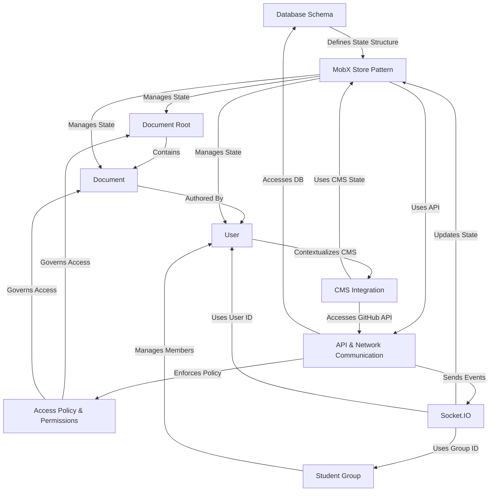

# Advanced Tutorial: teaching-project

The teaching-project is an educational platform focused on managing digital content (*Documents*) contained within administrative units (*Document Roots*). Access control is managed through flexible *Access Policies* assigned to **Users** and **Student Groups**.
The technical architecture features a backend interacting with a **Database Schema** via an **API**, with real-time updates pushed using **Socket.IO**, while the frontend utilizes the **MobX Store Pattern** for state management. A specific **CMS Integration** allows managing documentation directly from a GitHub repository.

**Source Repository:**

## Chapters

1. [User
](01_user_.md)
2. [Document
](02_document_.md)
3. [Document Root
](03_document_root_.md)
4. [Student Group
](04_student_group_.md)
5. [Access Policy & Permissions
](05_access_policy___permissions_.md)
6. [Database Schema
](06_database_schema_.md)
7. [API & Network Communication
](07_api___network_communication_.md)
8. [MobX Store Pattern
](08_mobx_store_pattern_.md)
9. [Socket.IO
](09_socket_io_.md)
10. [CMS Integration
](10_cms_integration_.md)

---

Generated by [AI Codebase Knowledge Builder](https://github.com/The-Pocket/Tutorial-Codebase-Knowledge)
