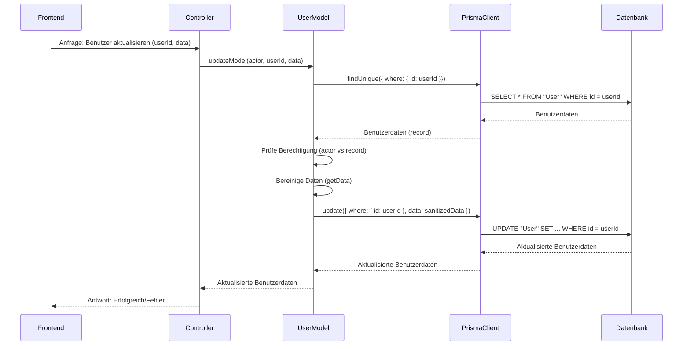

# Chapter 1: Backend-Datenmodelle (Prisma Models)


Willkommen zum ersten Kapitel unseres Tutorials! Bevor wir uns ins Detail stürzen, werfen wir heute einen Blick auf ein zentrales Konzept des Backends: die **Datenmodelle**.

Stellen Sie sich vor, ein Benutzer möchte sein Profil aktualisieren – zum Beispiel seinen Namen oder seine E-Mail-Adresse ändern. Was passiert im Backend, um diesen Wunsch zu erfüllen? Wir müssen die Benutzerdaten sicher abrufen, überprüfen, ob der Benutzer berechtigt ist, diese Änderungen vorzunehmen, ungültige Eingaben herausfiltern und schließlich die aktualisierten Daten in der Datenbank speichern.

Diese Aufgabe ist komplexer, als nur einen einfachen Datenbankbefehl abzusetzen. Hier kommt das Konzept der **Backend-Datenmodelle** ins Spiel.

## Was sind Backend-Datenmodelle?

Im Wesentlichen sind Backend-Datenmodelle Klassen oder Objekte im Backend-Code, die eine direkte Repräsentation (oder Abstraktion) der Entitäten in Ihrer Datenbank darstellen. Denken Sie an Entitäten wie `User` (Benutzer), `Document` (Dokument) oder `StudentGroup` (Studentengruppe).

Aber sie sind mehr als nur eine Kopie der Datenbanktabellen. Sie enthalten auch die **Geschäftslogik**, die für die Verarbeitung *dieser spezifischen* Datenobjekte auf der Serverseite notwendig ist. Sie definieren, *wie* mit den Daten dieser Entitäten interagiert werden soll, und kapseln dabei Operationen wie das Abrufen (Lesen), Erstellen, Aktualisieren und Löschen – oft angereichert mit Validierungen, Berechtigungsprüfungen oder Transformationen.

Stellen Sie sich ein Datenmodell wie einen **"Smart Data Object Manager"** vor. Anstatt direkt mit einem generischen Datenbankwerkzeug zu sprechen, sprechen Sie mit diesem spezifischen Manager für Benutzer (dem `UserModel`), für Dokumente (dem `DocumentModel`) usw. Jeder Manager weiß genau, wie er mit *seinen* Daten umgehen muss.

In unserem `teaching-project` verwenden wir `Prisma` als Object-Relational Mapper (ORM), um die Kommunikation mit der Datenbank zu erleichtern. Prisma generiert einen Teil des benötigten Codes für uns. Unsere Backend-Datenmodelle bauen auf diesem von Prisma generierten Code auf und erweitern ihn um die spezifische Anwendungslogik. Man kann sagen, die Prisma-Modelle (die in der Schemadatei definiert werden und die Prisma anhand dieser Datei generiert) bilden die Grundlage, und unsere Backend-Datenmodelle fügen die "Intelligenz" hinzu.

## Wie wir Datenmodelle im `teaching-project` nutzen

In diesem Projekt gibt es für jede wichtige Datenbank-Entität im **`teaching-api/src/models`Verzeichnis** ein entsprechendes Backend-Datenmodell. Beispiele sind:

*   `CmsSetting.ts`: Verwaltet CMS-spezifische Einstellungen, insbesondere im Zusammenhang mit der Github-Integration und Tokens.
*   `Document.ts`: Repräsentiert einzelne Inhalts-Dokumente und deren logische Operationen.
*   `DocumentRoot.ts`: Verwaltet den "Wurzelknoten" von Dokumenten, der Berechtigungen und Strukturinformationen enthält.
*   `RootGroupPermission.ts` & `RootUserPermission.ts`: Handeln die spezifischen Berechtigungen für Gruppen und einzelne Benutzer auf `DocumentRoot`-Ebene.
*   `StudentGroup.ts`: Modelle für Studentengruppen.
*   `User.ts`: Repräsentiert die Benutzer und deren spezifische Logik (z.B.isAdmin-Status).

Jedes dieser Models ist eine Abstraktion über die rohen Datenbankoperationen, die Prisma bereitstellt. Sie definieren Methoden, die von anderen Teilen der Anwendung (wie den Controllern) verwendet werden, um mit den Daten zu interagieren.

Schauen wir uns als Beispiel das `User` Model (`teaching-api/src/models/User.ts`) an, um zu verstehen, wie es aufgebaut ist und wie es unseren anfänglichen Anwendungsfall (Benutzerprofil aktualisieren) löst.

## Aufbau eines Datenmodells: Das `User` Beispiel

Öffnen Sie die Datei `teaching-api/src/models/User.ts`. Sie werden feststellen, dass fast jede Model-Datei einem ähnlichen Muster folgt:

```typescript
import { Prisma, PrismaClient, User as DbUser } from '@prisma/client';
import prisma from '../prisma';
import { HTTP403Error, HTTP404Error } from '../utils/errors/Errors';
import { createDataExtractor } from '../helpers/dataExtractor';

// Helper function to filter input data
const getData = createDataExtractor<Prisma.UserUncheckedUpdateInput>(['firstName', 'lastName'], ['isAdmin']);

function User(db: PrismaClient['user']) {
    return Object.assign(db, {
        // Custom methods go here...
        async findModel(id: string): Promise<DbUser | null> {
            // ... Implementierung ...
        },

        async updateModel(actor: DbUser, id: string, data: Partial<DbUser>): Promise<DbUser> {
           // ... Implementierung ...
        },

        // ... other methods
    });
}

export default User(prisma.user); // Export the extended prisma client instance
```

Lassen Sie uns die wesentlichen Teile durchgehen:

1.  **Importe (`import ...`):** Wir importieren notwendige Typen und den Prisma Client. `User as DbUser` ist eine gängige Praxis, um Namenskonflikte zu vermeiden – `DbUser` bezeichnet hier den rohen Typ, den Prisma anhand des Datenbankschemas generiert.
2.  **Hilfsfunktionen (`createDataExtractor`, etc.):** Oft gibt es Hilfsfunktionen, die spezifisch für dieses Model sind. `createDataExtractor` ist ein Beispiel, das hilft, eingehende Daten zu filtern. Das ist wichtig, um sicherzustellen, dass nur erlaubte Felder aktualisiert werden (z.B. soll ein normaler Benutzer nicht `isAdmin` ändern können).
3.  **Die Hauptfunktion (`function User(db: PrismaClient['user']) { ... }`):** Dies ist das Herzstück unseres Models. Es ist eine Funktion, die den spezifischen Teil des Prisma Clients für die `User`-Tabelle (`prisma.user`) als Argument (`db`) erhält.
4.  **Erweiterung des Prisma Clients (`Object.assign(db, { ... })`):** Wir erweitern das Prisma Client Objekt (`db`) um unsere eigenen benutzerdefinierten Methoden (wie `findModel`, `updateModel`, `all`). Das bedeutet, wir rufen später einfach `UserModel.findModel(...)` auf.
5.  **Benutzerdefinierte Methoden (`async findModel(...)`, `async updateModel(...)`, etc.):** Hier implementieren wir die Geschäftslogik. Diese Methoden verwenden die ursprünglichen Prisma-Methoden (verfügbar über das `db`-Argument) im Hintergrund.
6.  **Export (`export default User(prisma.user);`):** Schließlich exportieren wir die erweiterte Instanz des Prisma Clients für die `User`-Tabelle. Wenn ein anderer Teil des Codes das `User` Model importiert, erhält er dieses erweiterte Objekt.

## Lösungsansatz für den Anwendungsfall: Benutzerdetails aktualisieren

Nehmen wir an, wir möchten, dass ein Benutzer seine Details (Vorname, Nachname) aktualisieren kann. Wie würde das `UserModel` das handhaben?

Betrachten wir die `updateModel`-Methode im `teaching-api/src/models/User.ts`:

```typescript
// Aus teaching-api/src/models/User.ts
async updateModel(actor: DbUser, id: string, data: Partial<DbUser>): Promise<DbUser> {
    // 1. Benutzer finden, der aktualisiert werden soll
    const record = await db.findUnique({ where: { id: id } });
    if (!record) {
        throw new HTTP404Error('User not found'); // Benutzer nicht gefunden
    }

    // 2. Berechtigung prüfen: Darf der 'actor' (der agierende Benutzer) diesen Benutzer 'id' aktualisieren?
    // Erlaubt, wenn der 'actor' der Benutzer selbst ist ODER wenn der 'actor' ein Admin ist.
    if (!(record.id === actor.id || actor.isAdmin)) {
        throw new HTTP403Error('Not authorized'); // Nicht berechtigt
    }

    // 3. Eingehende Daten bereinigen/filtern: Nur erlaubte Felder zulassen (hier firstName, lastName),
    // verhindert z.B., dass ein normaler Benutzer isAdmin auf true setzt.
    // Wenn der actor isAdmin ist ODER der zu aktualisierende Benutzer der actor selbst ist,
    // darf isAdmin NICHT aktualisiert werden (zweiter Parameter auf false gesetzt).
    const sanitized = getData(data, false, record.id === actor.id ? false : actor.isAdmin);

    // 4. Datenbank aktualisieren mit bereinigten Daten
    return db.update({
        where: {
            id: id
        },
        data: sanitized
    });
}
```

Diese Methode erledigt viel mehr als nur ein Datenbank-Update:

*   Sie sucht zuerst den Benutzer, der aktualisiert werden soll.
*   Sie implementiert eine **Berechtigungsprüfung**: Nur der Benutzer selbst oder ein Administrator darf ein Profil aktualisieren.
*   Sie **bereinigt die eingehenden Daten**, um sicherzustellen, dass nur erlaubte Felder geändert werden (wir verwenden `getData` dafür, das auf `firstName` und `lastName` beschränkt ist, aber verhindert, dass ein Nicht-Admin das `isAdmin`-Feld ändert).
*   Erst dann ruft sie die tatsächliche Prisma-Update-Methode (`db.update`) auf.

Dies zeigt, wie das Model die Geschäftslogik (Autorisierung, Validierung/Bereinigung) kapselt und somit den Code, der das Model verwendet, sauberer hält.

## Unter der Haube: Wie ein Model arbeitet

Wie funktioniert das Ganze im Detail? Wenn eine Anfrage zum Aktualisieren eines Benutzers im Backend ankommt, durchläuft sie typischerweise folgende Schritte:

1.  Die API-Anwendung empfängt die Anfrage.
2.  Ein **Controller** (dazu mehr in [Kapitel 6: Backend-Controller](06_backend_controller_.md)) nimmt die Anfrage entgegen.
3.  Der Controller ruft die entsprechende Methode im **User-Model** (hier: `UserModel.updateModel`) auf.
4.  Das `UserModel` führt seine spezifische Logik aus (Benutzer finden, Berechtigung prüfen, Daten bereinigen).
5.  Das `UserModel` ruft die entsprechenden Methoden des **Prisma Clients** auf (hier: `db.findUnique`, `db.update`).
6.  Der **Prisma Client** übersetzt diese Aufrufe in Datenbankabfragen (SQL).
7.  Die **Datenbank** führt die Operationen aus und gibt Ergebnisse zurück.
8.  Der Prisma Client gibt die Ergebnisse an das `UserModel` zurück.
9.  Das `UserModel` verarbeitet das Ergebnis (z.B. bereitet es für die Rückgabe auf oder wirft einen Fehler) und gibt es an den Controller zurück.
10. Der Controller sendet eine Antwort an den Client.

Das können wir uns mit einem einfachen Sequenzdiagramm veranschaulichen:



Dieses Diagramm zeigt deutlich, wie das `UserModel` als Vermittler und Logik-Schicht zwischen dem Controller (der die Anfrage bearbeitet) und dem reinen Datenbankzugriff (über Prisma) agiert.

## Andere Model-Beispiele

Die Struktur und das Prinzip wiederholen sich bei anderen Models. Das `CmsSetting` Model zum Beispiel enthält komplexe Logik zur Verwaltung von Github-Tokens, inklusive *refreshing* und *invalidating*.

Betrachten wir einen kurzen Ausschnitt aus `teaching-api/src/models/CmsSetting.ts`:

```typescript
// Aus teaching-api/src/models/CmsSetting.ts
function CmsSetting(db: PrismaClient['cmsSettings']) {
    return Object.assign(db, {
        // Methode zum Invalidieren von Tokens
        async _invalidateTokens(userId: string): Promise<DbCmsSettings> {
            return db.update({
                where: { userId: userId },
                data: {
                    token: null,
                    tokenExpiresAt: null,
                    refreshToken: null,
                    refreshTokenExpiresAt: null
                }
            });
        },
        // Methode zum Aktualisieren oder Erstellen von Tokens
        async _updateTokens(userId: string, githubToken: GhResponse): Promise<DbCmsSettings> {
            return db.upsert({ // upsert = update OR insert
                where: { userId: userId },
                update: {
                    token: githubToken.access_token,
                    // ... weitere Logik zur Berechnung des Ablaufdatums ...
                },
                create: {
                    userId: userId,
                    token: githubToken.access_token,
                    // ... weitere Logik zur Berechnung des Ablaufdatums ...
                }
            });
        },
        // Methode zum Abrufen und Speichern eines neuen Github Tokens (ruft _updateTokens oder _invalidateTokens auf)
        async fetchToken(userId: string, code: string): Promise<ApiCmsSettings> {
            // ... Logik zur Kommunikation mit Github API ...
            const githubToken = await response.json();
            if (githubToken.error) {
                Logger.error(githubToken.error_description);
                const model = await this._invalidateTokens(userId); // Token invalidieren bei Fehler
                return prepareRecord(model);
            }
            const model = await this._updateTokens(userId, githubToken); // Token speichern
            return prepareRecord(model);
        },
        // ... weitere Methoden wie _refreshGithubToken, logout, findModel, updateModel
    });
}
// ... Export ...
```

Hier sehen Sie, wie das `CmsSetting` Model nicht nur einfache CRUD (Create, Read, Update, Delete) Operationen durchführt, sondern auch komplexere Abläufe wie die Kommunikation mit einer externen API (Github) orchestriert und die Geschäftslogik für das Token-Management (speichern, aktualisieren, invalidieren basierend auf Ablaufdaten und Fehlern) implementiert.

Die anderen Models wie `Document`, `DocumentRoot`, `StudentGroup`, `RootGroupPermission` und `RootUserPermission` verfolgen ebenfalls diesen Ansatz, indem sie datenbankspezifische Operationen mit der Anwendungslogik (z.B. Zugriffs- und Berechtigungsprüfungen im `Document` und `DocumentRoot` Model) kombinieren.

## Fazit

Datenmodelle sind eine grundlegende Abstraktion im Backend, die rohe Datenbankoperationen mit spezifischer Geschäftslogik verknüpfen. Sie kapseln, wie wir mit den Daten einer bestimmten Entität interagieren, indem sie Methoden für das Abrufen, Erstellen, Aktualisieren und Löschen bereitstellen und dabei Validierungen, Berechtigungen und andere notwendige Schritte durchführen. In unserem Projekt erweitern sie den von Prisma generierten Datenbankzugriff (`PrismaClient`).

Durch die Verwendung von Datenmodellen wird der Code, der auf sie zugreift (wie die Controller), sauberer und einfacher zu verstehen, da die Details der Datenverarbeitung im Model selbst verborgen sind.

Aber woher "wissen" die Models überhaupt, wie die Daten in der Datenbank strukturiert sind? Das liegt am **Datenbankschema**, das oft die Grundlage für die Erstellung dieser Models bildet. Im nächsten Kapitel werden wir uns genau ansehen, wie das Datenbankschema in Prisma definiert wird.

Weiter geht es mit [Kapitel 2: Datenbankschema (Prisma Schema)](02_datenbankschema__prisma_schema__.md).

---

Generated by [AI Codebase Knowledge Builder](https://github.com/The-Pocket/Tutorial-Codebase-Knowledge)
