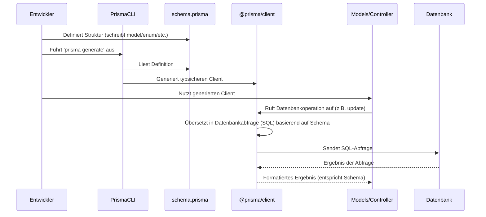

# Chapter 2: Datenbankschema (Prisma Schema)


Willkommen zurück zu unserem Tutorial! Im [Kapitel 1: Backend-Datenmodelle (Prisma Models)](01_backend_datenmodelle__prisma_models__.md) haben wir uns angesehen, wie unsere Backend-Datenmodelle (wie das `UserModel`) die Geschäftslogik kapseln und als Vermittler zwischen der Anwendung und der Datenbank agieren. Wir haben gelernt, dass diese Modelle auf von Prisma generiertem Code aufbauen, der wiederum weiß, wie die Daten in der Datenbank organisiert sind.

Aber woher kommt dieses Wissen über die Struktur der Daten? Wie "weiß" Prisma, welche Tabellen, Felder und Beziehungen existieren? Genau hier kommt das **Datenbankschema** ins Spiel. Es ist die zentrale "Quelle der Wahrheit" für die Struktur unserer Datenbank.

## Wozu brauchen wir ein Datenbankschema?

Stellen Sie sich vor, Sie bauen ein Haus. Bevor Sie Möbel auswählen und aufstellen (das wäre vergleichbar mit dem Arbeiten mit den Datenmodellen), brauchen Sie einen detaillierten **Bauplan**. Dieser Plan definiert die Fundamente, die Anzahl der Räume, wo die Wände stehen, wo Türen und Fenster sind und wie die verschiedenen Teile des Hauses (z.B. Küche und Esszimmer) miteinander verbunden sind.

Ein **Datenbankschema** ist genau dieser Bauplan für Ihre Datenbank. Es definiert:

*   Welche Arten von Daten gespeichert werden (z.B. Benutzer, Dokumente, Studentengruppen)
*   Welche Informationen jede Datenart enthält (z.B. ein Benutzer hat einen Namen, eine E-Mail-Adresse)
*   Wie diese Datenarten zueinander in Beziehung stehen (z.B. welche Dokumente gehören zu welchem Benutzer)
*   Welche Regeln für die Daten gelten (z.B. ist die E-Mail-Adresse eines Benutzers eindeutig)

Ohne diesen Plan wäre es unmöglich, die Datenbank konsistent zu verwenden und mit ihr zu interagieren. Frameworks wie Prisma nutzen diesen Plan, um den notwendigen Code (wie den `PrismaClient`) zu generieren, der es uns ermöglicht, typsicher und bequem mit der Datenbank zu sprechen, wie wir es im vorherigen Kapitel gesehen haben.

In unserem `teaching-project` wird das Datenbankschema primär durch die Datei `prisma/schema.prisma` definiert.

## Aufbau der `schema.prisma` Datei

Öffnen Sie die Datei `teaching-api/prisma/schema.prisma`. Sie werden feststellen, dass sie in mehrere Blöcke unterteilt ist:

```prisma
generator client {
  provider        = "prisma-client-js"
  previewFeatures = ["postgresqlExtensions", "views", "relationJoins"]
}

generator docs {
  provider = "node node_modules/prisma-docs-generator"
  output   = "../docs/prisma"
}

// Optional: DBML Generator block
generator dbml {
  provider = "prisma-dbml-generator"
}

datasource db {
  provider   = "postgresql"
  url        = env("DATABASE_URL")
  extensions = [pg_trgm, pgcrypto] // PostgreSQL-spezifische Erweiterungen
}

// Datenmodell Definitionen folgen hier...
// model User { ... }
// model Document { ... }
// ...

// Enum Definitionen
// enum Access { ... }

// View Definitionen
// view view_DocumentUserPermissions { ... }
// ...
```

Lassen Sie uns die wichtigsten Blöcke durchgehen:

1.  **`generator` Blöcke:** Diese teilen Prisma mit, welche Artefakte es basierend auf dem Schema generieren soll.
    *   `client`: Definiert den Haupt-Generator, der den **Prisma Client** generiert (`@prisma/client`), den wir im [Kapitel 1](01_backend_datenmodelle__prisma_models__.md) kennengelernt haben. Dieser Client ist das Herzstück für die Interaktion mit der Datenbank in unserem Code.
    *   `docs`: Generiert eine Dokumentation des Schemas, nützlich für das Verständnis der Datenstruktur.
    *   `dbml`: Generiert eine Beschreibung des Schemas im DBML-Format, das oft verwendet wird, um Datenbankdiagramme zu visualisieren.

2.  **`datasource` Block:** Dieser Block konfiguriert die Verbindung zu Ihrer Datenbank.
    *   `provider`: Gibt den Datenbanktyp an (hier `postgresql`, da wir eine PostgreSQL-Datenbank verwenden).
    *   `url`: Gibt die Verbindungs-URL zur Datenbank an. Sie wird üblicherweise aus einer Umgebungsvariable (`env("DATABASE_URL")`) gelesen, um sensible Daten nicht direkt im Code zu speichern.
    *   `extensions`: Listet optionale Datenbankerweiterungen auf, die benötigt werden (hier für PostgreSQL spezifische Textsuche und Kryptografie).

3.  **`model` Definitionen:** Dies sind die wichtigsten Definitionen im Schema. Jeder `model` Block repräsentiert eine Tabelle (oder ein **Datenmodell** im Sinne von Prisma, wie in Kapitel 1 besprochen) in Ihrer Datenbank.
    *   Beispiele aus der Datei: `model User { ... }`, `model Document { ... }`, `model StudentGroup { ... }`, etc.

4.  **`enum` Definitionen:** Ermöglichen die Definition von Aufzählungen, die als Feldtyp in den Modellen verwendet werden können (z.B. das `Access` Enum, das verschiedene Berechtigungsstufen definiert).

5.  **`view` Definitionen:** Repräsentieren Datenbank-Views. Prisma kann diese Views als schreibgeschützte "Modelle" behandeln (z.B. `view view_DocumentUserPermissions`, die komplexe Berechtigungslogik abbildet).

## Datenmodelle im Detail

Schauen wir uns beispielhaft die Definition des `User` Modells an:

```prisma
// Aus teaching-api/prisma/schema.prisma
model User {
  // Felder des Modells
  id                              String                            @id @default(dbgenerated("gen_random_uuid()")) @db.Uuid
  email                           String                            @unique
  firstName                       String                            @map("first_name")
  lastName                        String                            @map("last_name")
  isAdmin                         Boolean                           @default(false) @map("is_admin")
  createdAt                       DateTime                          @default(now()) @map("created_at")
  updatedAt                       DateTime                          @default(now()) @updatedAt @map("updated_at")

  // Definitionen der Beziehungen zu anderen Modellen
  documents                       Document[]                        @relation("documents")
  rootUserPermissions             RootUserPermission[]              @relation("root_user_to_user_permission")
  studentGroups                   StudentGroup[]                    @relation("StudentGroupToUser") // Implizite Many-to-Many-Beziehung
  view_DocumentUserPermissions    view_DocumentUserPermissions[]
  view_AllDocumentUserPermissions view_AllDocumentUserPermissions[]
  cmsSettings                     CmsSettings?                      // Optionale 1:1-Beziehung

  @@map("users") // Namen der entsprechenden Datenbanktabelle
}
```

Jede Zeile innerhalb des `model` Blocks definiert ein **Feld** (eine Spalte in der Datenbanktabelle). Jedes Feld hat:

*   Einen **Namen** (z.B. `id`, `email`, `firstName`). Dieser Name wird im **Prisma Client** und somit in unserem Code ([Kapitel 1](01_backend_datenmodelle__prisma_models__.md)) verwendet.
*   Einen **Typ** (z.B. `String`, `Boolean`, `DateTime`, `Json`). Das ist der Typ der Daten, die in diesem Feld gespeichert werden.
*   Optionale **Attribute**, die mit `@` beginnen. Diese Attribute fügen zusätzliche Informationen oder Einschränkungen hinzu:
    *   `@id`: Definiert dieses Feld als Primärschlüssel.
    *   `@unique`: Stellt sicher, dass jeder Wert in diesem Feld in der gesamten Tabelle eindeutig sein muss.
    *   `@default(...)`: Legt einen Standardwert für das Feld fest, wenn beim Erstellen eines Datensatzes kein Wert angegeben wird (z.B. `now()` für das aktuelle Datum/Zeit, `gen_random_uuid()` für eine generierte UUID).
    *   `@map("...")`: Ordnet den Namen des Feldes im Prisma Schema einem anderen Namen in der tatsächlichen Datenbankspalte zu (nützlich, wenn die Datenbankspalte eine andere Namenskonvention verwendet, z.B. `snake_case` statt `camelCase`).
    *   `@updatedAt`: Ein spezielles Attribut, das Prisma anweist, den Zeitstempel in diesem Feld automatisch zu aktualisieren, wenn der Datensatz geändert wird.
*   **Beziehungsfelder:** Felder, deren Typ ein anderes Modell ist (z.B. `documents Document[]` oder `cmsSettings CmsSettings?`). Das `[]` am Ende des Typs bedeutet, dass es sich um eine Many-Beziehung handelt (ein Benutzer kann viele Dokumente haben). Ohne `[]` ist es eine One-Beziehung (ein Benutzer hat potenziell ein `CmsSettings`-Objekt, dargestellt durch `?`, was bedeutet, dass es optional ist).

Unten im `model` Block finden Sie manchmal Zeilen, die mit `@@` beginnen. Diese wenden Attribute auf das gesamte Modell (die gesamte Tabelle) an:

*   `@@map("...")`: Ordnet den Namen des Modells im Prisma Schema einem anderen Namen der tatsächlichen Datenbanktabelle zu (hier wird das Prisma-Modell `User` auf die Tabelle `users` in der Datenbank abgebildet).
*   `@@index(...)`: Definiert einen Index auf diesem Feld in der Datenbank, um Suchvorgänge zu beschleunigen.
*   `@@unique(...)`: Definiert einen eindeutigen Constraint für eine Kombination von Feldern.

## Beziehungen zwischen Modellen (`@relation`)

Datenbanken sind oft relational, was bedeutet, dass Daten in verschiedenen Tabellen gespeichert und miteinander verknüpft sind. Im Prisma Schema definieren wir diese Beziehungen mit dem `@relation` Attribut.

Schauen wir uns das `Document` Modell an:

```prisma
// Aus teaching-api/prisma/schema.prisma
model Document {
  id                              String                            @id @default(dbgenerated("gen_random_uuid()")) @db.Uuid
  authorId                        String                            @map("author_id") @db.Uuid // Foreign Key zum User (Autor)
  type                            String
  data                            Json
  parentId                        String?                           @map("parent_id") @db.Uuid // Foreign Key zur Selbst-Referenz (Baumstruktur)
  documentRootId                  String                            @map("document_root_id") @db.Uuid // Foreign Key zum DocumentRoot
  createdAt                       DateTime                          @default(now()) @map("created_at")
  updatedAt                       DateTime                          @default(now()) @updatedAt @map("updated_at")

  // Beziehungen zu anderen Modellen
  author                          User                              @relation("documents", fields: [authorId], references: [id], onDelete: Cascade) // Beziehung zum Autor
  documentRoot                    DocumentRoot                      @relation("documents", fields: [documentRootId], references: [id], onDelete: Cascade) // Beziehung zum Dokumenten-Wurzel
  parent                          Document?                         @relation("connected_documents", fields: [parentId], references: [id], onDelete: Cascade) // Selbst-Referenzierende Beziehung (parent)
  children                        Document[]                        @relation("connected_documents") // Selbst-Referenzierende Beziehung (children)

  // ... (View-Beziehungen)
  view_DocumentUserPermissions    view_DocumentUserPermissions[]
  view_AllDocumentUserPermissions view_AllDocumentUserPermissions[]

  @@index([authorId], map: "document_author_id_index")
  @@map("documents")
}
```

Beachten Sie die Felder `authorId`, `parentId` und `documentRootId`. Dies sind sogenannte **Fremdschlüssel (Foreign Keys)**. Sie speichern die `id` eines Datensatzes in einer *anderen* Tabelle (oder derselben Tabelle, wie bei `parentId`). Das `@relation` Attribut verknüpft diese Fremdschlüsselfelder mit dem entsprechenden Primärschlüssel im Zielmodell:

*   `@relation("documents", fields: [authorId], references: [id], onDelete: Cascade)`:
    *   `"documents"`: Dies ist der *Name* der Beziehung. Wird benötigt, wenn zwei Modelle mehr als eine Beziehung zueinander haben (z.B. User und Document haben eine Beziehung als Autor (`documents`) und möglicherweise eine andere Beziehung als Bearbeiter).
    *   `fields: [authorId]`: Das lokale Feld in diesem Modell (`Document`), das den Fremdschlüssel speichert.
    *   `references: [id]`: Das Feld im *Zielmodell* (`User`), auf das der Fremdschlüssel verweist (der Primärschlüssel `id`).
    *   `onDelete: Cascade`: Spezifiziert, was passieren soll, wenn der verknüpfte Benutzer gelöscht wird. `Cascade` bedeutet, dass auch die abhängigen Dokumente gelöscht werden.

Auf der *anderen* Seite der Beziehung (im `User` Modell) gibt es das Feld `documents Document[] @relation("documents")`. Dies ist das inverse Beziehungsfeld, das es uns ermöglicht, von einem `User`-Objekt aus auf alle seine `Document`-Objekte zuzugreifen, die durch die `"documents"`-Beziehung verbunden sind.

Komplexe Strukturen wie Baumstrukturen (Dokumente können Eltern und Kinder haben) oder Many-to-Many-Beziehungen (ein Benutzer kann Mitglied in mehreren Studentengruppen sein, eine Studentengruppe kann viele Benutzer haben) werden ebenfalls im Schema definiert. Prisma generiert für implizite Many-to-Many-Beziehungen (wie zwischen `User` und `StudentGroup`) automatisch eine separate Zwischentabelle in der Datenbank, die wir im Schema nicht explizit als `model` definieren müssen, aber Prisma versteht die Beziehung basierend auf der Definition in den Modellen (`users User[]` und `studentGroups StudentGroup[]`).

## Views und Enums

Das Schema definiert auch Datenbank-Views (`view`) und benutzerdefinierte Enums (`enum`).

Ein Beispiel für ein `enum` ist `Access`:

```prisma
// Aus teaching-api/prisma/schema.prisma
enum Access {
  RO_DocumentRoot  // Leseberechtigung
  RW_DocumentRoot  // Lese-/Schreibberechtigung
  None_DocumentRoot // Keine Berechtigung
  // Weitere Werte für andere Entitäten
  RO_StudentGroup
  RW_StudentGroup
  None_StudentGroup
  RO_User
  RW_User
  None_User
}
```

Dieses Enum definiert eine begrenzte Menge erlaubter Werte für Felder wie `access` in den Modellen `DocumentRoot`, `RootGroupPermission` und `RootUserPermission`. Dies stellt sicher, dass nur gültige Berechtigungsstufen in der Datenbank gespeichert werden können und macht den Code lesbarer.

Datenbank-Views wie `view_DocumentUserPermissions` sind vordefinierte Abfragen, die wie virtuelle Tabellen agieren. Prisma kann diese in das Schema importieren und Ihnen erlauben, sie wie normale Modelle (aber oft nur zum Lesen) über den Prisma Client abzufragen.

```prisma
// Aus teaching-api/prisma/schema.prisma
view view_DocumentUserPermissions {
  // Felder, die der View zurückgibt
  documentRootId        String               @map("document_root_id") @db.Uuid
  userId                String               @map("user_id") @db.Uuid
  access                Access               @map("access") // Verwendet das Access Enum

  // ... weitere View-Felder

  // Verknüpfungen zu den zugrundeliegenden Modellen (für Relation Joins)
  documentRoot          DocumentRoot         @relation(fields: [documentRootId], references: [id])
  user                  User                 @relation(fields: [userId], references: [id])
  // ... weitere Relationen
}
```

Diese Views kapseln oft komplexe Logik zur Berechnung von Werten (hier: die effektiven Berechtigungen eines Benutzers auf ein Dokument) und können im Prisma Schema definiert und über den Client abgefragt werden.

## Wie das Datenbankschema den Anwendungsfall unterstützt

Kehren wir zu unserem Anwendungsfall aus Kapitel 1 zurück: Ein Benutzer möchte sein Profil aktualisieren.

Im [Kapitel 1](01_backend_datenmodelle__prisma_models__.md) haben wir gesehen, dass das `UserModel` die `updateModel`-Methode bereitstellt, die Daten wie `firstName` und `lastName` entgegennimmt. Das `UserModel` konnte dies tun, weil das **Prisma Schema** im `model User { ... }` Block klar definiert:

*   Dass es ein `User` Modell (und eine `users` Tabelle) gibt.
*   Welche Felder ein `User` hat (`id`, `email`, `firstName`, `lastName`, `isAdmin`, etc.).
*   Welchen Typ jedes Feld hat (z.B. `String` für Namen, `Boolean` für `isAdmin`).
*   Welche Felder eindeutig sein müssen (`email`).

Der von Prisma generierte Client (`@prisma/client`) nutzt diese Definitionen. Wenn das `UserModel` `prisma.user.update(...)` aufruft, weiß der Prisma Client dank des Schemas genau:

1.  Welche Tabelle (`users`) gemeint ist.
2.  Welche Felder (`firstName`, `lastName`) aktualisiert werden dürfen und welchen Typ sie haben müssen.
3.  Welches Feld (`id`) zum Filtern des zu aktualisierenden Datensatzes verwendet werden kann.

Das Schema stellt also sicher, dass der Code im `UserModel` (und überall sonst, wo der Prisma Client verwendet wird) typsicher ist und nur Operationen versucht, die mit der Datenbankstruktur kompatibel sind.

## Unter der Haube: Schema, Prisma Client und Datenbank

Wie interagieren das Schema, Prisma und die Datenbank?

1.  **Schema Definition:** Der Entwickler definiert die Datenbankstruktur in `prisma/schema.prisma`.
2.  **Prisma Generierung:** Wenn der Entwickler Befehle wie `prisma generate` ausführt, liest die Prisma CLI (Command Line Interface) die `schema.prisma` Datei.
3.  **Client-Generierung:** Basierend auf dem Schema generiert Prisma den **Prisma Client** im Verzeichnis `node_modules/.prisma/client` (daher der Import `@prisma/client`). Dieser Client ist eine typsichere API für die Datenbank, maßgeschneidert auf das definierte Schema.
4.  **Migrations (Strukturänderungen):** Wenn das Schema geändert wird (z.B. ein neues Feld hinzugefügt), nutzt Prisma Migrationen (`prisma migrate`) basierend auf dem Unterschied zwischen dem Schema und dem *aktuellen* Zustand der Datenbank, um die Datenbankstruktur anzupassen.
5.  **Anwendungscode:** Der Anwendungscode (z.B. die Datenmodelle aus Kapitel 1) importiert und verwendet den **Prisma Client**.
6.  **Datenbankinteraktion:** Wenn eine Methode des Prisma Clients (z.B. `prisma.user.update(...)`) aufgerufen wird, übersetzt der Client diesen Aufruf in eine spezifische Datenbankabfrage (SQL) basierend auf dem Schema und sendet sie an die Datenbank.
7.  **Ergebnisse:** Die Datenbank führt die Anfrage aus und sendet die Ergebnisse an den Prisma Client zurück, der sie in formatierte Objekte umwandelt, die unserem Schema entsprechen, und an den aufrufenden Code zurückgibt.

Hier ist ein einfaches Sequenzdiagramm, das diesen Fluss veranschaulicht:



Sie sehen, dass die `schema.prisma`-Datei das Fundament bildet, auf dem sowohl der generierte Prisma Client als auch der Migrationsprozess basieren.

## Schema und Code-Beispiele im Projekt

Das `teaching-project` verwendet die `schema.prisma`-Datei intensiv, um seine komplette Datenbanklogik zu definieren. Sie finden hier Definitionen für alle wesentlichen Entitäten und ihre Beziehungen:

*   **`User`**: Definition der Benutzer (email, firstName, lastName, isAdmin etc.) und deren Beziehungen zu Dokumenten, Gruppen und Berechtigungen. File: [`teaching-api/prisma/schema.prisma`](../teaching-api/prisma/schema.prisma#L22)
*   **`CmsSettings`**: Speichert CMS-spezifische Einstellungen pro Benutzer. File: [`teaching-api/prisma/schema.prisma`](../teaching-api/prisma/schema.prisma#L40)
*   **`StudentGroup`**: Definiert Studentengruppen, inklusive Eltern-Kind-Beziehungen für hierarchische Gruppen. File: [`teaching-api/prisma/schema.prisma`](../teaching-api/prisma/schema.prisma#L52)
*   **`Document`**: Definiert die Inhalts-Dokumente, deren Autor, Typ, Daten (als `Json`) und Struktur innerhalb eines `DocumentRoot`. File: [`teaching-api/prisma/schema.prisma`](../teaching-api/prisma/schema.prisma#L67)
*   **`DocumentRoot`**: Repräsentiert den Wurzelknoten von Dokumenten mit Zugriffsrechten (verwendet das `Access` Enum). File: [`teaching-api/prisma/schema.prisma`](../teaching-api/prisma/schema.prisma#L88)
*   **`RootGroupPermission` / `RootUserPermission`**: Definieren spezifische Berechtigungen für Gruppen oder einzelne Benutzer auf `DocumentRoot`-Ebene (verwenden ebenfalls das `Access` Enum). File: [`teaching-api/prisma/schema.prisma`](../teaching-api/prisma/schema.prisma#L99), [`teaching-api/prisma/schema.prisma`](../teaching-api/prisma/schema.prisma#L112)
*   **`AllowedAction`**: Eine einfache Tabelle zur Definition erlaubter Aktionen für verschiedene Dokumententypen. File: [`teaching-api/prisma/schema.prisma`](../teaching-api/prisma/schema.prisma#L81)
*   **`Sessions`**: Wird vom Session-Management-Middleware (connect-pg-simple) verwendet, um Benutzersitzungen in der Datenbank zu speichern. File: [`teaching-api/prisma/schema.prisma`](../teaching-api/prisma/schema.prisma#L127)
*   **Datenbank-Views**: Mehrere `view`-Definitionen am Ende, die komplexe Join-Operationen kapseln und als Basis für Berechnungen oder Abfragen dienen (z.B. `view_DocumentUserPermissions`). File: [`teaching-api/prisma/schema.prisma`](../teaching-api/prisma/schema.prisma#L136)

Diese Schema-Datei ist die *definitive* Beschreibung der Datenbankstruktur für das gesamte Projekt. Alle anderen Teile des Backends, die mit der Datenbank interagieren, tun dies indirekt über den von diesem Schema generierten Prisma Client oder vertrauen darauf, dass die Datenbank diesem Schema entspricht (mithilfe von Prisma Migrations).

## Fazit

Das Datenbankschema, dargestellt durch die `prisma/schema.prisma` Datei, ist der unverzichtbare Bauplan für unsere Datenbank. Es definiert die Struktur der Daten, die Beziehungen zwischen verschiedenen Datenarten und grundlegende Regeln.

Prisma nutzt dieses Schema als Grundlage, um den typsicheren und leistungsstarken Prisma Client zu generieren, der es uns ermöglicht, in unserem Code bequem mit der Datenbank zu interagieren. Es ist auch das Herzstück von Prismas Migrationssystem, das hilft, die Datenbankstruktur bei Änderungen des Schemas aktuell zu halten.

Ohne dieses klare Schema wäre es schwierig, die Komplexität der Datenhaltung zu managen. Nun, da wir wissen, *wie* die Daten strukturiert sind (Schema) und *wie* wir diese Struktur nutzen, um mit der Datenbank zu interagieren und Anwendungslogik hinzuzufügen (Datenmodelle), sind wir bereit, uns einem weiteren zentralen Thema zuzuwenden: Wer darf überhaupt welche Daten sehen oder ändern? Das führt uns zum nächsten Thema: Authentifizierung und Autorisierung.

Weiter geht es mit [Kapitel 3: Authentifizierung & Autorisierung](03_authentifizierung___autorisierung_.md).

---

Generated by [AI Codebase Knowledge Builder](https://github.com/The-Pocket/Tutorial-Codebase-Knowledge)
