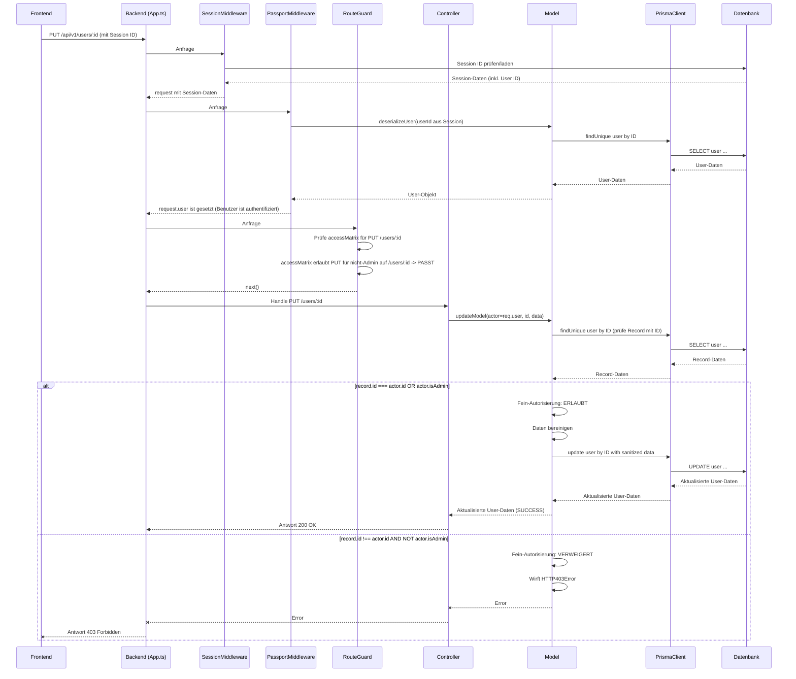

# Chapter 3: Authentifizierung & Autorisierung


Willkommen zurück! In den vorherigen Kapiteln haben wir uns mit dem **Datenbankschema** ([Kapitel 2: Datenbankschema (Prisma Schema)](02_datenbankschema__prisma_schema__.md)) beschäftigt, das den "Bauplan" unserer Datenbasis darstellt, und mit den **Backend-Datenmodellen** ([Kapitel 1: Backend-Datenmodelle (Prisma Models)](01_backend_datenmodelle__prisma_models__.md)), die diese Struktur nutzen, um Daten abzurufen, zu speichern und dabei Geschäftslogik anzuwenden.

Stellen Sie sich vor, Sie haben den Bauplan für ein Haus (Schema) und die "Smart Manager" für jeden Raum und Gegenstand darin (Datenmodelle). Das ist grossartig, um das Haus zu verwalten. Aber wer darf überhaupt eintreten? Und sobald jemand drin ist, welche Räume darf er betreten, und welche Gegenstände darf er anfassen oder verändern?

Genau hier kommt das Konzept der **Authentifizierung & Autorisierung** ins Spiel. Es ist das Sicherheitssystem des Hauses:

*   **Authentifizierung:** Wer bin ich? Zeige deinen Ausweis!
*   **Autorisierung:** Was darf ich tun? Basierend auf deinem Ausweis und den Regeln, darfst du in die Küche, aber nicht ins Büro des Hausherrn, es sei denn, du bist Administratoren-Personal.

In unserer Anwendung löst dieses Konzept die zentrale Frage: **Wer kann auf die Anwendung zugreifen (login) und welche Aktionen dürfen angemeldete Benutzer durchführen?**

## Was sind Authentifizierung & Autorisierung?

Obwohl die Begriffe oft zusammen genannt werden, sind sie klar voneinander getrennt:

1.  **Authentifizierung (Authentication):**
    *   **Zweck:** Überprüft die Identität eines Benutzers.
    *   **Frage:** "Bist du wirklich der, für den du dich ausgibst?"
    *   **Wie:** Oft durch die Überprüfung von Anmeldedaten (Benutzername/Passwort), Token, Zertifikaten oder Single Sign-On (SSO)-Methoden (wie z.B. Anmelden mit Google, Microsoft, etc.).
    *   **Ergebnis:** Der Benutzer ist als eine bestimmte Identität (z.B. ein Benutzer mit einer spezifischen ID oder E-Mail) im System bekannt und vertrauenswürdig.

2.  **Autorisierung (Authorization):**
    *   **Zweck:** Bestimmt, welche Aktionen ein **authentifizierter** Benutzer durchführen darf.
    *   **Frage:** "Da wir wissen, wer du bist, was bist du berechtigt zu tun?"
    *   **Wie:** Basierend auf der Identität des Benutzers, seinen Rollen (z.B. Admin, Student, Teacher), Berechtigungen oder Eigenschaften (z.B. ist der Besitzer des Dokuments).
    *   **Ergebnis:** Erlaubnis oder Verweigerung des Zugriffs auf bestimmte Ressourcen (Daten) oder Funktionalitäten (z.B. Dokument erstellen, Benutzer löschen, Einstellungen ändern).

Man kann also nicht autorisiert werden, ohne vorher authentifiziert worden zu sein. Die Authentifizierung ist der erste Schritt, die Autorisierung folgt danach.

## Authentifizierung im `teaching-project`

Unser Projekt nutzt das bekannte Passport.js Framework für die Authentifizierung. Passport.js ist sehr flexibel, da es unterschiedliche "Strategien" für die Authentifizierung unterstützt (z.B. lokale Strategie mit Benutzername/Passwort, OAuth, OpenID Connect, etc.).

Im `teaching-project` verwenden wir je nach Umgebung unterschiedliche Strategien:

*   **Mock-Strategie:** In Test- oder Nicht-Produktionsumgebungen, wenn die `NO_AUTH` Umgebungsvariable gesetzt ist. Ermöglicht einfaches "Einloggen" durch Senden einer Benutzer-ID oder E-Mail im Header, was das Testen vereinfacht.
*   **Azure AD B2C Strategie:** In Produktions- und anderen Umgebungen (`BearerStrategy` von `passport-azure-ad`). Nutzt Microsoft Entra ID (früher Azure AD) als Identitätsprovider für echtes Single Sign-On.

Die Auswahl der Strategie wird zentral in `teaching-api/src/auth/index.ts` gehandhabt:

```typescript
// Aus teaching-api/src/auth/index.ts
import Logger from '../utils/logger';
import { getStrategy as mockStrategy } from './mock';
import { getStrategy } from './azureAD';

export const strategyForEnvironment = () => {
    // In Test oder wenn NO_AUTH gesetzt ist (nicht in Produktion)
    if (process.env.NODE_ENV === 'test' || (process.env.NO_AUTH && process.env.NODE_ENV !== 'production')) {
        // ... Log-Ausgabe für NO_AUTH ...
        if (process.env.NODE_ENV !== 'test') {
             Logger.info(`NODE_ENV: ${process.env.NODE_ENV}`);
             Logger.info('USING MOCK STRATEGY');
        }
        return mockStrategy(); // Nutze die Mock-Strategie
    }
    /* istanbul ignore next */ // Ignoriere dies in der Testabdeckung, da es Umgebungsabhängig ist
    return getStrategy(); // Nutze die Azure AD Strategie
};
```

Dieser Mechanismus bestimmt, welche Authentifizierungslogik von Passport.js verwendet wird.

### Passport.js und Sessions

Nachdem ein Benutzer authentifiziert wurde (z.B. durch erfolgreiche Überprüfung seiner Anmeldedaten), müssen wir seinen Anmeldestatus für nachfolgende Anfragen speichern. Hierfür nutzen wir HTTP-Sessions.

Passport.js arbeitet eng mit Session-Management-Middleware zusammen (im `teaching-project` `express-session` mit `connect-pg-simple` zur Speicherung in der Datenbank). Sobald die Authentifizierung erfolgreich ist, speichert Passport.js Informationen über den Benutzer in der Session. In einfachen Fällen ist dies üblicherweise die Benutzer-ID.

Dafür gibt es zwei wichtige Funktionen, die wir für Passport.js *konfigurieren* müssen:

*   **`serializeUser`:** Wird aufgerufen, nachdem die Authentifizierung erfolgreich war. Entnimmt dem Benutzerobjekt die minimalen Informationen, die in der Session gespeichert werden sollen (hier: die Benutzer-ID, `user.id`).

*   **`deserializeUser`:** Wird bei jeder nachfolgenden Anfrage (mit einer übermittelten Session-ID) aufgerufen. Nimmt die in der Session gespeicherte ID und lädt das vollständige Benutzerobjekt aus der Datenbank. Dieses Benutzerobjekt wird dann an das `request`-Objekt angehängt (`req.user`), sodass wir im Rest der Anwendung wissen, wer die Anfrage gestellt hat.

Diese Konfiguration findet sich in `teaching-api/src/app.ts`:

```typescript
// Aus teaching-api/src/app.ts (vereinfacht)
 app.use(sessionMiddleware); // Express Session Middleware einbinden
 app.use(passport.initialize()); // Passport.js initialisieren
 app.use(passport.session()); // Passport.js Session Middleware einbinden

 passport.use(strategyForEnvironment()); // Die ausgewählte Strategie nutzen

 // Nach erfolgreicher Authentifizierung nur die Benutzer-ID in der Session speichern
 passport.serializeUser((user, done) => {
     done(null, user.id);
 });

 // Bei jeder Anfrage mit Session die Benutzer-ID lesen und den User aus der DB laden
 passport.deserializeUser(async (id: string, done) => {
     const user = await prisma.user.findUnique({ where: { id: id } });
     done(null, user); // Hängt den geladenen User an req.user an
 });

 // ... später wird die API-Route mit einem Authentifizierungs-Check versehen
 app.use(
     `${API_URL}`,
     (req, res, next) => {
         if (req.isAuthenticated()) { // Prüft, ob deserializeUser erfolgreich war und req.user existiert
             return next();
         }
         // Versucht, den Benutzer über die Azure AD Strategie zu authentifizieren,
         // falls keine Session existiert (z.B. für API-Token)
         passport.authenticate('oauth-bearer', { session: true }, (err, user, info) => {
             // ... Fehlerbehandlung und Benutzer setzen ...
         })(req, res, next);
     },
     // ... routeGuard und Router folgen ...
 );
```

Das Wichtigste hier ist: Dank `deserializeUser` steht uns in allen geschützten Routen das authentifizierte Benutzerobjekt (`req.user`) zur Verfügung. Dieses Objekt enthält Informationen über den Benutzer (z.B. ID, ob er Admin ist) und ist entscheidend für den nächsten Schritt: die Autorisierung.

## Autorisierung im `teaching-project`

Sobald wir wissen, *wer* die Anfrage stellt (dank Authentifizierung und `req.user`), müssen wir prüfen, *ob* er Zugriff auf die angeforderte Ressource oder Aktion hat. Dies ist Aufgabe der Autorisierung.

Im `teaching-project` wird die Autorisierung auf zwei Ebenen gehandhabt:

1.  **Groben-Autorisierung (Route/Methoden-basiert):** Eine Middleware (`routeGuard`) prüft anhand einer zentralen Konfiguration (`accessMatrix`), ob *überhaupt* ein beliebiger authentifizierter Benutzer oder spezifisch ein Administrator die Kombination aus angefragtem API-Pfad und HTTP-Methode (GET, POST, PUT, DELETE) nutzen darf. Dies verhindert, dass unberechtigte Benutzer versuchen, auf Endpunkte zuzugreifen.

2.  **Fein-Autorisierung (Daten-basiert):** Die Datenmodelle ([Kapitel 1: Backend-Datenmodelle (Prisma Models)](01_backend_datenmodelle__prisma_models__.md)) enthalten spezifische Logik, um zu prüfen, ob der aktuell authentifizierte Benutzer (`req.user`, oft als `actor` bezeichnet) berechtigt ist, auf *dieses spezielle* Datenobjekt (z.B. Dokument ID 123, Benutzer Profil ID 456) die angeforderte Operation durchzuführen.

### Die `accessMatrix` (Grobe Autorisierungskonfiguration)

Die zentrale Konfiguration für die Groben-Autorisierung befindet sich in `teaching-api/src/routes/authConfig.ts` in der Variable `accessMatrix`:

```typescript
// Aus teaching-api/src/routes/authConfig.ts (vereinfacht)
export interface AccessMatrix {
    [key: string]: { // Ein logischer Name für die Regel
        path: string; // Der API-Pfad (kann Parameter wie :id enthalten)
        access: {
            methods: ('GET' | 'POST' | 'PUT' | 'DELETE')[]; // Erlaubte HTTP-Methoden
            adminOnly: boolean; // Ist diese Regel nur für Admins?
        }[];
    };
}

const authConfig: Config = {
    // ... andere Konfigurationen ...
    accessMatrix: {
        // Beispiel: Zugriff auf den "/checklogin" Pfad per GET
        checklogin: {
            path: '/checklogin',
            access: [{ methods: ['GET'], adminOnly: false }] // Jeder (nicht-Admin & Admin) darf per GET darauf zugreifen
        },
        // Beispiel: Zugriff auf den "/user" Pfad
        user: {
            path: '/user',
            access: [{ methods: ['GET', 'POST'], adminOnly: false }] // Jeder darf GET und POST
        },
        // Beispiel: Zugriff auf den "/admin" Pfad
        admin: {
            path: '/admin',
            access: [{ methods: ['DELETE', 'GET', 'POST', 'PUT'], adminOnly: true }] // Nur Admins dürfen irgendwas
        },
         // Beispiel: Zugriff auf "/users/:id" (spezifischer Benutzer)
        userFind: {
            path: '/users/:id',
            access: [
                { methods: ['GET', 'PUT'], adminOnly: false } // Jeder darf GET/PUT auf einen spezifischen User
            ]
        },
        // ... weitere Regeln für diverse Pfade
    }
};

export default authConfig;
```

Diese Matrix definiert Regeln für verschiedene API-Endpunkte. Für `/users/:id` per `PUT` (unser Beispiel "Benutzerprofil aktualisieren") besagt die Regel `userFind`, dass jeder (`adminOnly: false`) per `PUT` auf diesen Pfad zugreifen darf. *Aber Achtung:* Das ist nur die *erste Ebene* der Autorisierung! Der `routeGuard` lässt die Anfrage passieren, aber die tatsächliche Prüfung, ob man *ein bestimmtes* Profil aktualisieren darf, kommt später im Model.

### Der `routeGuard` Middleware

Der `routeGuard` (`teaching-api/src/auth/guard.ts`) ist eine Express-Middleware, die *nach* der Authentifizierung, aber *vor* dem eigentlichen Routen-Handler (typischerweise ein Controller), ausgeführt wird. Sie nutzt die `accessMatrix` (die beim Start des Servers in ein effizienteres Format mit Regex umgewandelt wird), um die Berechtigung zu prüfen.

```typescript
// Aus teaching-api/src/auth/guard.ts (vereinfacht)

// Helferfunktion, die die accessMatrix in ein regex-basiertes Format umwandelt
export const createAccessRules = (accessMatrix: AccessMatrix): AccessRegexRule[] => {
    // ... Umwandlungslogik, erstellt Regex für Pfade mit Parametern (:id) und weist ein Gewicht zu ...
    // Gibt sortierte Regeln zurück, um die spezifischste Regel zuerst zu finden
};

const routeGuard = (accessMatrix: AccessRegexRule[]) => {
    // Dies ist die eigentliche Middleware-Funktion
    return (req: Request, res: Response, next: NextFunction) => {
        const reqPath = req.path.toLowerCase();
        // Stellen Sie sicher, dass req.user existiert (der Benutzer ist authentifiziert),
        // ausser es handelt sich um einen speziell erlaubten öffentlichen Pfad (wie /logout)
        if (
            !req.user &&
            !(PUBLIC_GET_ACCESS.has(reqPath) || PUBLIC_GET_ACCESS_REGEX.some((regex) => regex.test(reqPath)))
        ) {
            return res.status(HttpStatusCode.FORBIDDEN).json({ error: 'No roles claim found!' }); // 403 Forbidden
        }

        // Prüfe gegen die erstellten Regeln (accessMatrix), ob der Benutzer mit seinem isAdmin-Status
        // die angefragte Methode auf diesem Pfad nutzen darf.
        if (!requestHasRequiredAttributes(accessMatrix, req.path, req.method, req.user?.isAdmin || false)) {
            return res
                .status(HttpStatusCode.FORBIDDEN)
                .json({ error: 'User does not have the role, method or path' }); // 403 Forbidden
        }

        next(); // Wenn die Prüfung erfolgreich ist, gehe zum nächsten Handler (Controller)
    };
};

/**
 * Diese Methode prüft, ob die Anfrage die korrekten Rollen, Pfade und Methoden hat
 */
const requestHasRequiredAttributes = (
    accessMatrix: AccessRegexRule[],
    path: string,
    method: string,
    isAdmin: boolean
) => {
    // Findet die passendste Regel anhand des Pfads mit regex (bevorzugt spezifische Pfade)
    const accessRule = accessMatrix
        .filter((accessRule) => accessRule.regex.test(path))
        .sort((a, b) => b.path.length - a.path.length)[0]; // Sortiert nach spezifischster Regel

    /* istanbul ignore if */
    if (!accessRule) {
        // Wenn keine Regel für diesen Pfad existiert, verweigere den Zugriff
        return false;
    }

    // Prüft, ob eine der Access-Definitionen in der Regel zum angefragten Methode UND Admin-Status passt
    const hasAccess = accessRule.access.some(
        (rule) =>
            (isAdmin || !rule.adminOnly) && rule.methods.includes(method as 'GET' | 'POST' | 'PUT' | 'DELETE')
    );

    Logger.info(
        `${hasAccess ? '✅' : '❌'} Access Rule for ${isAdmin ? 'Admin' : 'User'}: [${method}:${path}] ${JSON.stringify(accessRule.path)}`
    );
    return hasAccess;
};

export default routeGuard;
```

Der `routeGuard` ist also eine vorgelagerte Sicherheitsbarriere. Er verhindert, dass z.B. ein normaler Benutzer überhaupt versucht, eine `/admin`-Route aufzurufen, oder dass jemand versucht, Daten per `DELETE` von einem Endpunkt abzurufen, der nur `GET` erlaubt. Er nutzt dafür die `/api/v1/...`-Pfade und HTTP-Methoden als Kriterien.

### Fein-Autorisierung in den Datenmodellen

Wie bereits erwähnt, ist die Autorisierung auf Route/Methoden-Ebene nur die *erste Ebene*. Die **Fein-Autorisierung**, d.h. die Prüfung, ob der authentifizierte Benutzer (`actor`) berechtigt ist, **dieses spezifische Datum** zu manipulieren, findet in den Datenmodellen ([Kapitel 1: Backend-Datenmodelle (Prisma Models)](01_backend_datenmodelle__prisma_models__.md)) statt.

Denken Sie an das Beispiel aus Kapitel 1: Benutzerprofil aktualisieren (`UserModel.updateModel`). Dort haben wir gesehen:

```typescript
// Aus teaching-api/src/models/User.ts (Ausschnitt)
async updateModel(actor: DbUser, id: string, data: Partial<DbUser>): Promise<DbUser> {
    // ... Benutzer finden ...

    // 2. Berechtigung prüfen: Darf der 'actor' (der agierende Benutzer) diesen Benutzer 'id' aktualisieren?
    // Erlaubt, wenn der 'actor' der Benutzer selbst ist ODER wenn der 'actor' ein Admin ist.
    if (!(record.id === actor.id || actor.isAdmin)) {
        throw new HTTP403Error('Not authorized'); // Nicht berechtigt (403 Forbidden)
    }

    // ... Daten bereinigen und speichern ...
}
```

Hier findet die **eigentliche, daten-spezifische Autorisierungsprüfung** statt. Der `routeGuard` hat nur zugelassen, dass jemand die Route `/users/:id` per `PUT` aufruft, weil die `accessMatrix` das für alle Benutzer (`adminOnly: false`) erlaubt. Aber das `UserModel` prüft nun spezifisch nach: Ist der `actor` (der eingeloggte Benutzer, `req.user`) identisch mit dem Benutzer (`record`) mit der angefragten `id`, oder ist der `actor` ein Administrator (`actor.isAdmin`)? Nur wenn eine dieser Bedingungen wahr ist, wird die Aktualisierung erlaubt. Ansonsten wird ein `HTTP403Error` (Forbidden) geworfen.

Diese Kombination aus grober `routeGuard`-Autorisierung und feiner Model-Autorisierung ist ein übliches und robustes Muster.

## Anwendungsfall revisited: Benutzerprofil aktualisieren

Nehmen wir wieder unser Beispiel: Ein authentifizierter Benutzer möchte sein *eigenes* Profil aktualisieren.

1.  **Frontend:** Der Browser sendet eine `PUT`-Anfrage an `/api/v1/users/ihre-benutzer-id` mit den neuen Profildaten. Die Anfrage enthält ein Cookie oder einen Header, der es der Session-Middleware ermöglicht, die Session zu identifizieren und den Benutzer zu authentifizieren.

2.  **Backend (Express App - `teaching-api/src/app.ts`):**
    *   Die Anfrage kommt an.
    *   `sessionMiddleware` wird ausgeführt, identifiziert die Session.
    *   `passport.initialize()` und `passport.session()` bereiten Passport vor.
    *   `passport.deserializeUser` wird aufgerufen: Die Benutzer-ID aus der Session wird gelesen, der Benutzer aus der Datenbank geladen und an `req.user` angehängt.
    *   Die selbstdefinierte Authentifizierungs-Middleware (die nach `passport.session()` kommt) prüft `req.isAuthenticated()` (was prüft, ob `req.user` existiert). Da `deserializeUser` erfolgreich war, ist der Benutzer authentifiziert, und die Middleware ruft `next()` auf.
    *   `routeGuard(AccessRules)` Middleware wird aufgerufen. Sie prüft die Anfrage: `PUT /api/v1/users/:id`. Sie schlägt in der `accessMatrix` nach der Regel für `/users/:id` (`userFind`). Diese erlaubt `PUT` für `adminOnly: false`. Da der Benutzer *nicht* explizit ein Admin sein muss und per `PUT` zugreift, erlaubt der `routeGuard` den Zugriff und ruft `next()` auf.
    *   Der Router (`router`) findet den zuständigen Handler (einen Controller) basierend auf `PUT /api/v1/users/:id`.

3.  **Controller:** Der Controller empfängt die Anfrage, extrahiert die Benutzer-ID aus dem Pfad (`req.params.id`) und die Aktualisierungsdaten aus dem Body (`req.body`). Er ruft die entsprechende Methode im `UserModel` auf und übergibt den authentifizierten Benutzer (`req.user` als `actor`), die Ziel-ID (`req.params.id`) und die Daten (`req.body`).

    ```typescript
    // Beispielhafter (fiktiver) Controller-Code für users/:id PUT
    // Würde in teaching-api/src/controllers/userController.ts (oder ähnlich) liegen
    import UserModel from '../models/User'; // Importiert unser erweitertes User Model
    import { Request, Response, NextFunction } from 'express';

    // ... andere Controller-Methoden ...

    export const updateUser = async (req: Request, res: Response, next: NextFunction) => {
        const userId = req.params.id;
        const updateData = req.body;
        const actor = req.user; // Der authentifizierte Benutzer

        try {
            // Rufe die updateModel Methode im UserModel auf
            const updatedUser = await UserModel.updateModel(actor, userId, updateData);
            res.status(200).json(updatedUser); // Sende aktualisierten Benutzer zurück
        } catch (error) {
            // Fehler (z.B. HTTP403Error vom Model) wird vom zentralen Error Handler behandelt
            next(error);
        }
    };
    ```

4.  **UserModel (`teaching-api/src/models/User.ts`):** Das `updateModel` wird mit `actor` (ihr Benutzerobjekt), `id` (ihre Benutzer-ID) und `data` (die neuen Profiledaten) aufgerufen.
    *   Das Model findet den Benutzer mit der `id`.
    *   Es führt die Fein-Autorisierungsprüfung durch: `record.id === actor.id || actor.isAdmin`. Da `id` und `actor.id` *identisch* sind (Sie aktualisieren Ihr *eigenes* Profil), ist die Bedingung wahr, und die Prüfung ist erfolgreich.
    *   Das Model bereinigt die Daten und ruft die Prisma-Methode zum Aktualisieren in der Datenbank auf.
    *   Das Model gibt den aktualisierten Benutzer zurück.

5.  **Backend (Controller & Express App):** Der Controller erhält den aktualisierten Benutzer, sendet eine 200 OK Antwort an den Frontend.

Wäre der Benutzer *nicht* der Besitzer des Profils und auch *kein* Admin, würde die Prüfung im `UserModel` fehlschlagen, ein `HTTP403Error` geworfen und der Controller (oder der zentrale Error Handler) würde diesen abfangen und eine 403 Forbidden Antwort an den Client senden.

## Unter der Haube: Der Fluss der Sicherheit

Das Zusammenspiel der verschiedenen Komponenten lässt sich gut visualisieren:



Die Middleware in `app.ts` (speziell Session, Passport und RouteGuard) kümmern sich um die *grundlegende* Identifizierung und den *groben* Check gegen die `accessMatrix`, bevor die Anfrage an den Controller weitergeleitet wird. Die fein-granulare Prüfung, die auf dem *spezifischen* Datum (hier: das User-Profil mit der angefragten ID) basiert, findet dann im zuständigen Datenmodell ([Kapitel 1](01_backend_datenmodelle__prisma_models__.md)) statt.

Dieses mehrschichtige Vorgehen ermöglicht eine klare Trennung der Zuständigkeiten:

*   **Middleware & `authConfig`:** Kümmern sich um den "Wer darf generell auf diesen Endpunkt/diese Methode zugreifen" Check und die Authentifizierung.
*   **Datenmodelle:** Kümmern sich um den "Darf dieser spezifische Benutzer (actor) diese spezifische Operation auf *diesem bestimmten Datum* durchführen?" Check.

## Fazit

Authentifizierung und Autorisierung sind wesentliche Säulen der Anwendungssicherheit. Sie stellen sicher, dass nur bekannte Benutzer Zugang erhalten und dass diese Benutzer nur die Aktionen durchführen dürfen, für die sie berechtigt sind.

Im `teaching-project` wird die **Authentifizierung** hauptsächlich durch Passport.js mit anpassbaren Strategien (Mock oder Azure AD) und durch Session-Management (gespeichert in der Datenbank) realisiert. Der authentifizierte Benutzer ist über `req.user` im Request-Objekt verfügbar.

Die **Autorisierung** erfolgt auf zwei Ebenen: eine **grobe** Prüfung per `routeGuard` Middleware anhand einer Konfigurationsmatrix (`accessMatrix`), die bestimmt, welche API-Pfade/Methoden für Authentifizierte oder Admins erlaubt sind, und eine **feine**, daten-spezifische Prüfung innerhalb der Datenmodelle ([Kapitel 1: Backend-Datenmodelle (Prisma Models)](01_backend_datenmodelle__prisma_models__.md)), die prüft, ob der agierende Benutzer die nötigen Berechtigungen für das spezifische Datum hat.

Diese Kombination bietet eine robuste und flexible Grundlage für die Verwaltung von Benutzerzugriffen und Berechtigungen innerhalb der Anwendung.

Nachdem wir nun geklärt haben, wer die Anwendung betreten und welche Türen öffnen darf, können wir uns dem Kerninhalt zuwenden: den **Dokumenten** oder Content Units, die in der Anwendung verwaltet werden.

Weiter geht es mit [Kapitel 4: Dokumente (Content Units)](04_dokumente__content_units__.md).

---

Generated by [AI Codebase Knowledge Builder](https://github.com/The-Pocket/Tutorial-Codebase-Knowledge)
