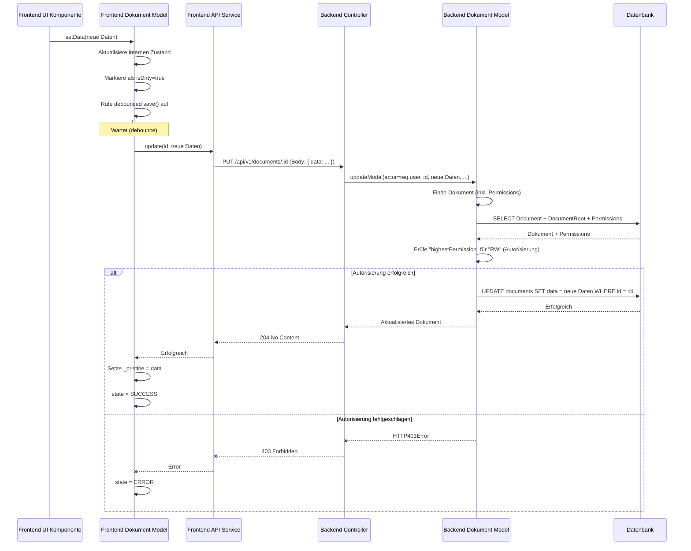

# Chapter 4: Dokumente (Content Units)


Willkommen zurück zu unserem Tutorial! In den letzten Kapiteln haben wir die Grundlagen der Datenhaltung betrachtet: das **Datenbankschema** ([Kapitel 2: Datenbankschema (Prisma Schema)](02_datenbankschema__prisma_schema__.md)) als Bauplan und die **Backend-Datenmodelle** ([Kapitel 1: Backend-Datenmodelle (Prisma Models)](01_backend_datenmodelle__prisma_models__.md)) als intelligente Verwalter dieser Daten. Ausserdem haben wir uns mit **Authentifizierung & Autorisierung** ([Kapitel 3: Authentifizierung & Autorisierung](03_authentifizierung___autorisierung_.md)) beschäftigt und gelernt, wer überhaupt mit unseren Daten interagieren darf.

Nachdem das Fundament steht und die Sicherheit gewährleistet ist, wenden wir uns nun dem Herzen der Anwendung zu: den eigentlichen **Inhalten**. In unserer Anwendung nennen wir diese Inhalte **Dokumente**, oft auch als **Content Units** bezeichnet.

Stellen Sie sich vor, ein Dozent möchte Lehrmaterial erstellen. Dieses Material könnte aus verschiedenen Elementen bestehen: einem Stück Code, das Student:innen ausführen sollen, einer Textfrage, die beantwortet werden muss, einer Notiz oder einem Bild. Jedes dieser Elemente ist ein *spezifisches Stück Inhalt*.

Das Problem: Ein Code-Snippet verhält sich ganz anders als ein Bild oder ein einfacher Text. Sie müssen unterschiedlich gespeichert, bearbeitet und im Frontend dargestellt werden. Wie können wir diese Vielfalt an Inhalten in einem konsistenten System verwalten?

Hier kommt das Konzept der **Dokumente (Content Units)** ins Spiel. Ein Dokument ist nicht nur ein Datensatz in der Datenbank; es ist eine Abstraktion, die ein spezifisches, eigenständiges Stück Inhalt repräsentiert, unabhängig von seiner genauen Natur (Code, Text, Bild, etc.).

## Was ist ein Dokument (Content Unit)?

Ein Dokument im `teaching-project` ist der grundlegende Baustein für Inhalt. Es ist eine Datenbankentität (siehe [Kapitel 2: Datenbankschema (Prisma Schema)](02_datenbankschema__prisma_schema__.md) für die Datenbankstruktur), die aber im Anwendungs-Code (sowohl Backend-Model [Kapitel 1: Backend-Datenmodelle (Prisma Models)](01_backend_datenmodelle__prisma_models__.md) als auch Frontend-Modelle) mit zusätzlicher Logik angereichert wird.

Jedes Dokument hat folgende Schlüsselmerkmale:

1.  **Eine eindeutige ID:** Identifiziert das Dokument.
2.  **Einen Autor (`authorId`):** Der Benutzer, der dieses Dokument erstellt hat.
3.  **Einen Typ (`type`):** Dieser ist entscheidend! Er definiert, *welche Art* von Inhalt das Dokument repräsentiert (z.B. "Code", "Rich Text", "Bild", "Aufgabenstatus") und bestimmt, wie die eigentlichen Daten strukturiert sind und wie das Dokument im Frontend dargestellt wird.
4.  **Die eigentlichen Daten (`data`):** Der Kerninhalt selbst, gespeichert als flexibles `JSON`-Objekt in der Datenbank. Der *Typ* des Dokuments bestimmt die erwartete Struktur dieses JSON-Objekts.
5.  **Beziehungen zu anderen Dokumenten (`parentId`):** Dokumente können hierarchisch organisiert sein (z.B. ein Textblock gehört zu einem grösseren Kapitel), was durch eine Referenz auf ein Eltern-Dokument (`parentId`) abgebildet wird. (Mehr dazu in [Kapitel 5: Dokumentenbaum (Document Root)](05_dokumentenbaum__document_root_.md)).
6.  **Zugehörigkeit zu einem Dokumentenbaum (`documentRootId`):** Jedes Dokument gehört zu einem bestimmten Wurzelknoten, der die Berechtigungen und den Kontext für eine Sammlung von Dokumenten definiert. (Mehr dazu in [Kapitel 5: Dokumentenbaum (Document Root)](05_dokumentenbaum__document_root_.md)).
7.  **Zeitstempel (`createdAt`, `updatedAt`):** Wann das Dokument erstellt und zuletzt geändert wurde.

## Der Schlüssel: Typ und Daten (`type` & `data`)

Das Konzept des Dokuments ist mächtig, weil es eine gemeinsame Struktur für sehr unterschiedliche Inhalte bietet. Die Magie liegt in der Kombination aus dem `type`-Feld (ein einfacher String wie "script", "string", "quill_v2") und dem `data`-Feld (dem `JSON`-Inhalt).

Die Datenbank (PostgreSQL mit Prisma [Kapitel 2]) speichert einfach einen Datensatz mit einer ID, einem String für den Typ und einem JSON-Blob für die Daten. Sie "versteht" nicht, dass ein Dokument vom Typ "script" ein Feld `code` im JSON haben sollte. Das ist Aufgabe der *Anwendungsebene*.

Das Frontend und das Backend definieren gemeinsam, welche Dokumententypen existieren und welche Datenstrukturen ihnen zugeordnet sind.

Schauen wir uns `teaching-dev\src\api\document.ts` im Frontend-Code an:

```typescript
// Aus teaching-dev/src/api/document.ts (vereinfacht)

// Definition der Dokumententypen als Enum
export enum DocumentType {
    Script = 'script', // Für Code-Snippets
    TaskState = 'task_state', // Für den Status einer Aufgabe (erledigt, Frage, etc.)
    String = 'string', // Für einfache Textfelder
    QuillV2 = 'quill_v2', // Für Rich-Text (verwendet Quill Editor)
    // ... weitere Typen (Lösung, Datei, Verzeichnis, etc.)
    Dir = 'dir',
    File = 'file',
    // ...
}

// Mapping zwischen Dokumententyp und der erwarteten Datenstruktur im 'data' Feld
export interface TypeDataMapping {
    [DocumentType.Script]: ScriptData; // Script = { code: string }
    [DocumentType.TaskState]: TaskStateData; // TaskState = { state: StateType (enum) }
    [DocumentType.String]: StringData; // String = { text: string }
    [DocumentType.QuillV2]: QuillV2Data; // QuillV2 = { delta: Delta (Rich Text Struktur) }
    // ...
}

// Beispiel: Datenstruktur für einen einfachen Text
export interface StringData {
    text: string;
}

// Beispiel: Datenstruktur für ein Code-Snippet
export interface ScriptData {
    code: string;
}

// Definition der grundlegenden Dokumenten-Schnittstelle
export interface Document<Type extends DocumentType> {
    id: string;
    type: Type; // Der Typ
    authorId: string;
    parentId: string | null | undefined;
    documentRootId: string;
    data: TypeDataMapping[Type]; // Typ-spezifische Datenstruktur
    createdAt: string;
    updatedAt: string;
}

// ... API Funktionen (find, create, update, etc.) folgen ...
```

Dieses Frontend-Code definiert klar:
*   Welche `DocumentType`s es gibt.
*   Welches TypeScript-Interface (z.B. `StringData`, `ScriptData`) der `data`-Payload für jeden `DocumentType` haben sollte (`TypeDataMapping`).
*   Die Basisstruktur (`Document<Type>`), die für alle Dokumente gilt.

Wenn das Frontend ein Dokument lädt, schaut es auf das `type`-Feld und weiss dann, wie es die `data`-Daten interpretieren und welche UI-Komponente es zur Darstellung verwenden soll.

## Anwendungsfall: Eine Textfrage in einer Lektion bearbeiten

Stellen Sie sich den Fall vor: Sie bearbeiten als Dozent eine Lektion. In dieser Lektion gibt es verschiedene Inhalte, darunter eine einfache Textfrage. Diese Textfrage wird intern als **Dokument** vom Typ `string` (oder vielleicht `quill_v2` für Rich Text) repräsentiert.

Sie möchten den Text der Frage ändern. Wie funktioniert das Zusammenspiel der Dokumenten-Konzepte?

1.  **Frontend (UI):** Die im Frontend dargestellte Textfrage ist an ein **Frontend Dokumenten-Model** gebunden (speziell eine Instanz einer Klasse, die von `iDocument` ableitet, wie z.B. `String` oder `QuillV2` Model, definiert in `teaching-dev\src\models\documents\`). Dieses Model repräsentiert den Zustand *dieses spezifischen* Dokuments im Client.

2.  **Benutzer bearbeitet Text:** Sie klicken in das Textfeld und ändern den Text. Die UI-Komponente (z.B. ein Input-Feld oder Quill Editor) informiert das zugehörige Frontend Dokumenten-Model über die Änderung (typischerweise durch Aufruf einer `setData`-Methode im Model).

3.  **Frontend Dokumenten-Model (`iDocument` Nachfahre):**
    *   Die `setData`-Methode wird aufgerufen. Sie aktualisiert den internen `data`-Zustand des Models (z.B. das `text`-Feld im `String`-Model oder `delta` im `QuillV2`-Model).
    *   Das Model erkennt, dass der aktuelle Zustand (`data`) vom ursprünglichen Zustand (`_pristine`, der beim Laden erhalten wurde) abweicht (`isDirty`-Computed Property wird true).
    *   Das Model ruft eine *debouncete* `save`-Methode auf. Das "Debouncing" wartet eine kurze Zeit (z.B. 1 Sekunde), bevor es tatsächlich speichert. Wenn Sie schnell hintereinander tippen, wird der Speichervorgang immer wieder verzögert, bis Sie eine kurze Pause machen. Dies reduziert unnötige API-Aufrufe während der Eingabe.
    *   Nach der Debounce-Zeit ruft die *tatsächliche* Speichermethode (`_save`) die Frontend API auf, um das Dokument zu speichern.

4.  **Frontend API (`teaching-dev\src\api\document.ts`):** Der `save` Ruf des Frontend Models führt zu einem Aufruf der `update` Funktion in der API-Schicht.

    ```typescript
    // Aus teaching-dev/src/api/document.ts (vereinfacht)
    export function update<Type extends DocumentType>(
        id: string, // ID des zu aktualisierenden Dokuments
        data: TypeDataMapping[Type], // Die aktualisierten Dokumentendaten (typ-spezifisch)
        onBehalfOf: boolean, // Flag für Admin-Aktionen
        signal: AbortSignal // Standardparameter für Abbruch
    ): AxiosPromise<Document<Type>> {
        // Sendet eine PUT Anfrage an den Backend-Endpunkt
        return api.put(`/documents/${id}${onBe behalfOf ? '?onBehalfOf=true' : ''}`, { data }, { signal });
    }
    ```
    Diese Funktion sendet eine `PUT` HTTP-Anfrage an den Backend-Server, typischerweise an den Endpunkt `/api/v1/documents/:id`. Die aktualisierten Daten (`data`) werden im Body der Anfrage gesendet.

5.  **Backend Controller (`teaching-api\src\controllers\documents.ts`):** Der Express-Router leitet die `PUT /api/v1/documents/:id` Anfrage an den `update` Controller-Handler weiter.

    ```typescript
    // Aus teaching-api/src/controllers/documents.ts (vereinfacht)
    import DocumentModel from '../models/Document'; // Importiert unser Backend Document Model
    import { RequestHandler } from 'express';
    import { JsonObject } from '@prisma/client/runtime/library';
    import { HTTP403Error, HTTP404Error } from '../utils/errors/Errors';
    // ... andere Importe

    export const update: RequestHandler<
        { id: string }, // Parameter aus dem Pfad (:id)
        any, // Antwort-Typ
        { data: JsonObject }, // Request Body Struktur
        { onBehalfOf?: 'true' } // Query Parameter
    > = async (req, res, next) => {
        try {
            const { onBehalfOf } = req.query;
            const documentId = req.params.id;
            const docData = req.body.data as JsonObject; // Die JSON-Daten aus dem Request Body
            const actor = req.user!; // Der authentifizierte Benutzer (req.user kommt von Passport.js)

            // Ruft die updateModel Methode im Backend Document Model auf
            const model = await DocumentModel.updateModel(
                actor, // Der agierende Benutzer für die Autorisierung
                documentId, // Die ID des zu aktualisierenden Dokuments
                docData, // Die aktualisierten Daten
                onBehalfOf === 'true' // Info für Admins
            );

            // ... Logik für Echtzeit-Notifications (z.B. über Socket.IO, siehe Kapitel 8) ...
            res.status(204).send(); // Erfolgreiche Aktualisierung, kein Inhalt zurück
        } catch (error) {
            next(error); // Fehlerbehandlung (z.B. 403 Forbidden vom Model)
        }
    };
    ```
    Der Controller extrahiert die ID und die Daten aus der Anfrage und ruft die `updateModel`-Methode des **Backend Document Models** ([Kapitel 1: Backend-Datenmodelle (Prisma Models)](01_backend_datenmodelle__prisma_models__.md)) auf, wobei er auch den authentifizierten Benutzer (`req.user`) übergibt.

6.  **Backend Dokumenten-Model (`teaching-api\src\models\Document.ts`):** Die `updateModel` Methode ist das Herzstück der serverseitigen Logik für die Aktualisierung.

    ```typescript
    // Aus teaching-api/src/models/Document.ts (vereinfacht)
    import { Access, Document as DbDocument, PrismaClient, User } from '@prisma/client';
    import { HTTP403Error, HTTP404Error } from '../utils/errors/Errors';
    import { JsonObject } from '@prisma/client/runtime/library';
    import DocumentRoot, { AccessCheckableDocumentRoot } from './DocumentRoot'; // Importiert DocumentRoot für Permissions
    import { highestAccess, NoneAccess, RWAccess } from '../helpers/accessPolicy'; // Hilfsfunktionen für Berechtigungen
    // ... andere Importe

    // Helfer-Typ, der das Prisma Document-Objekt mit eingeschlossener DocumentRoot und Permissions kombiniert
    type AccessCheckableDocument = DbDocument & {
        documentRoot: AccessCheckableDocumentRoot;
    };

    // Helferfunktion zum Extrahieren der höchsten effektiven Berechtigung für einen Benutzer auf ein Dokument
    const extractPermission = (actorId: string, document: AccessCheckableDocument): Access | null => {
        // ... Logik zur Berechnung der Berechtigung basierend auf Autor, Shared Access, Gruppen- und Benutzerberechtigungen ...
        // Diese Logik ist komplex und berücksichtigt den DocumentRoot (siehe Kapitel 5)
        const permissions = new Set([
             document.documentRoot.access,
             ...document.documentRoot.rootGroupPermissions.map((p) => p.access),
             ...document.documentRoot.rootUserPermissions.map((p) => p.access)
         ]);
         const usersPermission = highestAccess(permissions);
         // ... weitere Berechnungslogik ...
         return usersPermission; // Gibt die höchste gefundene Berechtigung zurück (z.B. RO, RW, None)
    };


    function Document(db: PrismaClient['document']) {
        return Object.assign(db, {
            // ... findModel, createModel, deleteModel, all, allOfDocumentRoots methoden ...

            async updateModel(
                actor: User, // Der agierende Benutzer
                id: string, // ID des Dokuments
                docData: JsonObject, // Die neuen Daten (JSON)
                _onBehalfOf = false // Flag für Admin "im Namen von"
            ) {
                const onBehalfOf = _onBehalfOf && actor.isAdmin; // Nur Admins dürfen 'onBehalfOf' nutzen

                if (onBehalfOf) {
                    // Wenn Admin "im Namen von" handelt, finde Dokument einfach (Autorisierung einfacher)
                    const record = await db.findUnique({ where: { id: id } });
                    if (!record) {
                        throw new HTTP404Error('Document not found');
                    }
                } else {
                    // Wenn normaler Benutzer oder Admin für sich selbst handelt, findModel verwenden (holt auch Permissions)
                    const recordWithPermissions = await this.findModel(actor, id);
                    if (!recordWithPermissions) {
                        throw new HTTP404Error('Document not found');
                    }
                    // *** AUTORISIERUNGSPRÜFUNG! ***
                    // Nur erlauben, wenn Benutzer RW (Read/Write) Access hat ODER (für Admins) wenn onBehalfOf true ist
                    const canWrite = RWAccess.has(recordWithPermissions.highestPermission);
                    if (!canWrite && !onBehalfOf) {
                        // Wenn keine Schreibberechtigung UND nicht Admin 'onBehalfOf' -> FEHLER 403
                        throw new HTTP403Error('Not authorized');
                    }
                     // Hier könnte auch eine zusätzliche Prüfung stattfinden,
                     // z.B. welcher Teil des 'data' JSON aktualisiert werden darf,
                     // aber im Projekt wird das 'data' Feld als Ganzes aktualisiert.
                }

                // Wenn Autorisierung erfolgreich war, führe das Update in der Datenbank aus
                const model = (await db.update({
                    where: { id: id },
                    data: { data: docData }, // Aktualisiere nur das 'data' Feld
                    // ... includes für Notifications (holt Document Root und Permissions) ...
                     include: {
                         documentRoot: {
                             include: {
                                 rootGroupPermissions: {
                                     select: { access: true, studentGroupId: true }
                                 },
                                 rootUserPermissions: {
                                     select: { access: true, userId: true }
                                 }
                             }
                         }
                     }
                })) satisfies DbDocument;
                return model; // Gib das aktualisierte DB-Objekt zurück
            },

            // ... andere Methoden ...
        });
    }

    export default Document(prisma.document); // Exportiere das erweiterte Prisma Client Objekt
    ```
    Das Backend Model (`Model`) findet zuerst das Dokument (ggf. inklusive seiner Berechtigungen über den zugehörigen Document Root, siehe [Kapitel 5: Dokumentenbaum (Document Root)](05_dokumentenbaum__document_root_.md)). Dann führt es eine **Autorisierungsprüfung** durch: Hat der `actor` (unser eingeloggter Benutzer) die notwendige Berechtigung, dieses spezifische Dokument zu aktualisieren? Hier wird die über `findModel` ermittelte `highestPermission` (die höchste effektive Berechtigung auf das Dokument, z.B. Read-Only, Read/Write) geprüft. Nur wenn `RWAccess.has(permission)` true ist (oder der agierende Admin das `onBehalfOf`-Flag gesetzt hat), wird die Aktualisierung erlaubt. Andernfalls wird ein `HTTP403Error` geworfen.
    Wenn die Prüfung erfolgreich ist, verwendet das Model den ungefilterten `docData` JSON Payload aus der Anfrage, um das `data`-Feld des Dokuments in der **Datenbank** über den Prisma Client (`db.update`) zu aktualisieren.

7.  **Datenbank (PostgreSQL):** Prisma führt die SQL `UPDATE` Anweisung aus, die das JSON-Feld in der `documents`-Tabelle für den Datensatz mit der entsprechenden ID ändert.

8.  **Rückgabe:** Das aktualisierte Dokument wird von Prisma an das Backend Model zurückgegeben, vom Model an den Controller, und der Controller sendet eine 204 (No Content) Antwort an das Frontend (was anzeigt, dass die Aktualisierung erfolgreich war).

## Unter der Haube: Datenfluss beim Speichern eines Dokuments

Hier ist der Ablauf visualisiert:



Dieses Diagramm zeigt, wie die Änderung im Frontend beginnt, über die API zum Backend transportiert wird, wo das Backend Document Model die entscheidende Autorisierungsprüfung durchführt, bevor die Änderung schliesslich in der Datenbank gespeichert wird.

## Frontend Dokumenten-Modelle und ihre Typen

Wie im obigen Schema zu sehen, hat *jedes* Dokument im Frontend auch ein entsprechendes **Frontend Dokumenten-Model** (implementiert in `teaching-dev\src\models\documents\`). Diese Modelle erweitern die Basisklasse `iDocument` (`teaching-dev\src\models\iDocument.ts`) und fügen typspezifische Logik hinzu:

*   **Speicherung der Daten:** Jedes Model hat observable Properties, die direkt mit den im `data` JSON gespeicherten Werten korrespondieren (z.B. `code: string` im `Script`-Model, `text: string` im `String`-Model). Die `setData` Methode aktualisiert diese Properties.
*   **Computeds:** Modelle können berechnete ('computed') Properties haben, die auf den Daten basieren (z.B. `hasGraphicsOutput` im `Script`-Model, das den Code nach bestimmten Imports parst).
*   **Methoden:** Modelle können Methoden für typspezifische Aktionen haben (z.B. `execScript` im `Script`-Model, `checkAnswer` im `String`-Model).
*   **`meta` Information:** Frontend Modelle greifen oft auf Konfigurationen zu, die im zugehörigen `DocumentRoot` gespeichert sind (`meta` Property), um Darstellungs- oder Verhaltensweisen anzupassen (z.B. ob ein Script Read-Only ist, welcher Toolbar ein Quill-Dokument hat).
*   **Persistenz-Logik:** Die Basisklasse `iDocument` stellt die Kernlogik für `isDirty`, `save` (debounced Speicherung) und `_save` (API-Aufruf) bereit.

Schauen wir kurz in ein spezifisches Frontend Model, z.B. das für einfache Texte:

```typescript
// Aus teaching-dev/src/models/documents/String.ts (vereinfacht)
import iDocument, { Source } from '@tdev-models/iDocument';
import { DocumentType, Document as DocumentProps, TypeDataMapping } from '@tdev-api/document';
// ... weitere Importe

// Definiert das Frontend Model für den Typ 'string'
class String extends iDocument<DocumentType.String> {
    // Observable Property, die das 'text' Feld aus dem 'data' JSON hostet
    @observable accessor text: string;

    constructor(props: DocumentProps<DocumentType.String>, store: DocumentStore) {
        // Rufe den Konstruktor der Basisklasse auf
        super(props, store);
        // Initialisiere das 'text' Property aus dem 'data' JSON (oder leeren String)
        this.text = props.data?.text || '';
    }

    // Implementiert die abstrakte setData Methode aus iDocument
    @action
    setData(data: TypeDataMapping[DocumentType.String], from: Source, updatedAt?: Date): void {
        // Aktualisiere das interne 'text' Property
        this.text = data.text;

        // Wenn die Änderung lokal (vom Benutzer) kam, starte den Speicherprozess
        if (from === Source.LOCAL) {
            this.save(); // save ist die debouncete Methode von iDocument
        }
        // Aktualisiere den Zeitstempel, wenn über API aktualisiert wurde
        if (updatedAt) {
            this.updatedAt = new Date(updatedAt);
        }
    }

    // Implementiert die abstrakte data Getter Methode aus iDocument
    // Gibt die aktuellen Daten im Format für die API zurück
    get data(): TypeDataMapping[DocumentType.String] {
        return {
            text: this.text // Gibt die gespeicherten Daten im erwarteten JSON-Format zurück
        };
    }

    // ... andere typspezifische Methoden und computeds (z.B. checkAnswer, meta) ...
}

export default String;
```
Dieses einfache Beispiel zeigt, wie das `String`-Model das typspezifische `text` Property verwaltet und die generische `setData`/`data` Schnittstelle von `iDocument` implementiert, um die Daten mit dem zugrundeliegenden `data` JSON-Blob zu synchronisieren und den Speichermechanismus (`this.save()`) zu triggern.

Andere Modelle wie `Script` oder `QuillV2` haben ähnliche Strukturen, aber verwalten unterschiedliche Properties (`code`, `delta`) und implementieren typspezifische Logik. Das `TaskState`-Model (`teaching-dev\src\models\documents\TaskState.ts`) ist interessant, da es `setData` überschreibt, um die Autorisierung nochmal am Frontend zu *prüfen* (auch wenn das Backend die definitive Quelle ist), um unnötige Speichervorgänge zu vermeiden.

## Fazit

Dokumente (Content Units) sind die zentralen Bausteine für Inhalte in der Anwendung. Sie bieten eine flexible Struktur, die es ermöglicht, sehr unterschiedliche Arten von Inhalt (Code, Text, Bilder, etc.) über ein gemeinsames Modell und eine gemeinsame Schnittstelle zu verwalten.

Der Schlüssel liegt in der Kombination aus einem **Dokumententyp** (`type`), der die Natur des Inhalts deklariert, und einem flexiblen **Daten-Payload** (`data`), der den eigentlichen Inhalt als JSON speichert. Die Anwendung (Frontend und Backend) muss diesen Typ verstehen, um die Daten korrekt zu interpretieren, darzustellen und typspezifische Logik anzuwenden.

Der Prozess des Speicherns eines Dokuments zeigt das Zusammenspiel: Das Frontend Dokumenten-Model erkennt Änderungen, startet einen debouncten Speichervorgang, die Frontend API sendet die Daten an das Backend, das Backend Document Model führt eine strenge Autorisierungsprüfung auf Basis von Benutzerberechtigungen und Document Root durch, bevor es die Daten schliesslich über Prisma in der Datenbank aktualisiert.

Nachdem wir nun die einzelnen Inhalts-Einheiten – die Dokumente – verstanden haben, müssen wir uns fragen, wie diese Dokumente strukturiert und organisiert werden. Dokumente existieren selten isoliert; sie sind Teil einer Lektion, eines Kurses oder einer anderen Sammlung. Hier kommen die **Dokumentenbäume (Document Roots)** ins Spiel.

Weiter geht es mit [Kapitel 5: Dokumentenbaum (Document Root)](05_dokumentenbaum__document_root_.md).

---

Generated by [AI Codebase Knowledge Builder](https://github.com/The-Pocket/Tutorial-Codebase-Knowledge)
