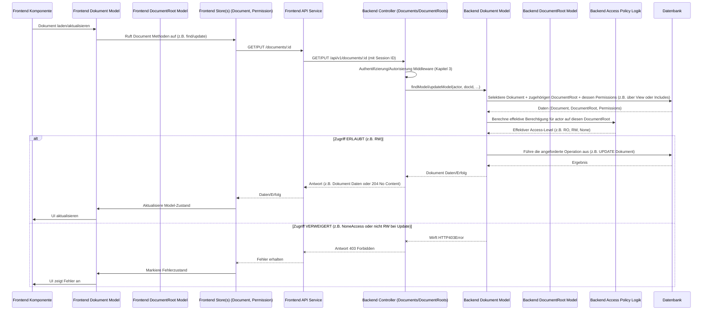

# Chapter 5: Dokumentenbaum (Document Root)


Stellen Sie sich nun vor, wir haben viele einzelne Dokumente: eine Lektion über Algebra, eine Übungsaufgabe zu Funktionen, ein Bild, das ein Diagramm zeigt, ein Code-Snippet für eine Berechnung. Diese Dokumente sind selten isoliert, sondern gehören oft zu einer grösseren Einheit – zum Beispiel einem bestimmten Kurs, einer spezifischen Lektionenserie oder einem Projekt.

Wir brauchen einen Weg, diese zusammengehörigen Dokumente logisch zu gruppieren. Mehr noch, wir müssen die Berechtigungen für diese gesamte Sammlung von Dokumenten an *einer zentralen Stelle* verwalten. Es wäre unpraktisch, die Zugriffsrechte für jedes einzelne Dokument separat über eine lange Liste von Benutzern und Gruppen zu regeln.

Genau dieses Problem löst das Konzept des **Dokumentenbaums (Document Root)**. Es dient als der Wurzelknoten oder Container, der eine Sammlung von Dokumenten zusammenhält und vor allem die Zugriffsrechte für diese Sammlung definiert.

## Was ist ein Dokumentenbaum (Document Root)?

Ein **Dokumentenbaum** (`DocumentRoot`) ist im Kern ein spezieller Datensatz in unserer Datenbank, der folgende Hauptzwecke erfüllt:

1.  **Container:** Er definiert eine Menge von Dokumenten ([Kapitel 4: Dokumente (Content Units)](04_dokumente__content_units__.md)), die logisch zusammengehören (z.B. alle Dokumente, die zu einem bestimmten Kursabschnitt gehören). Jedes Dokument ist einem (`documentRootId`) und genau einem `DocumentRoot` zugeordnet.
2.  **Berechtigungszentrale:** Das ist seine wichtigste Funktion. Anstatt Berechtigungen auf individueller Dokumentenebene zu verwalten (obwohl das prinzipiell möglich wäre), werden die Hauptzugriffsrechte für *alle* Dokumente unterhalb eines `DocumentRoot` an diesem `DocumentRoot` selbst festgelegt.
3.  **Strukturanker:** Obwohl Dokumente *untereinander* hierarchisch organisiert sein können (durch `parentId` in [Kapitel 4](04_dokumente__content_units__.md)), bildet der `DocumentRoot` den obersten Ankerpunkt für eine solche Baumstruktur.

Betrachten Sie einen `DocumentRoot` als den **Hauptordner mit zentraler Zugriffskontrolle** für eine Sammlung von Dateien (Dokumenten). Die Berechtigungen, die auf den Ordner angewendet werden, gelten standardmässig für alle darin enthaltenen Dateien und Unterordner.

### Komponenten des `DocumentRoot`

Gemäss unserem Datenbankschema ([Kapitel 2: Datenbankschema (Prisma Schema)](02_datenbankschema__prisma_schema__.md)) und dem Backend-Datenmodell ([Kapitel 1: Backend-Datenmodelle (Prisma Models)](01_backend_datenmodelle__prisma_models__.md)) hat ein `DocumentRoot` folgende entscheidende Eigenschaften und Beziehungen:

*   **`id`:** Eine eindeutige ID.
*   **`access`:** Definiert den Standard-Zugriffslevel für **alle** Benutzer und Gruppen, die *keine* spezifischen Berechtigungen für diesen `DocumentRoot` haben. Dies ist typischerweise ein `Access`-Enum Wert ([Kapitel 2](02_datenbankschema__prisma_schema__.md)), wie z.B. `RW_DocumentRoot` (Lese-/Schreibzugriff), `RO_DocumentRoot` (Nur-Lesezugriff) oder `None_DocumentRoot` (Kein Zugriff).
*   **`sharedAccess`:** Ein weiterer `Access`-Level, der für den *shared access* Mechanismus verwendet wird. Dieser wird relevant, wenn Dokumente innerhalb des Baums *direkt* geteilt werden (z.B. über einen Link). Die Logik zur Berechnung der effektiven Berechtigung berücksichtigt sowohl `access` als auch `sharedAccess`.
*   **Beziehung zu Dokumenten (`documents`):** Viele `Document`s können mit einem `DocumentRoot` verknüpft sein.
*   **Beziehungen zu Berechtigungen:**
    *   `rootUserPermissions`: Eine Beziehung zu `RootUserPermission`-Datensätzen. Jeder dieser Datensätze definiert eine spezifische `Access`-Berechtigung für *einen einzelnen Benutzer* auf *diesen spezifischen* `DocumentRoot`.
    *   `rootGroupPermissions`: Eine Beziehung zu `RootGroupPermission`-Datensätzen. Jeder dieser Datensätze definiert eine spezifische `Access`-Berechtigung für *eine Studentengruppe* ([Kapitel 1, 2]) auf *diesen spezifischen* `DocumentRoot`.

Die kombinierte Logik aus dem `access`-Feld des `DocumentRoot` selbst, den `sharedAccess` Wert sowie den expliziten `RootUserPermission` und `RootGroupPermission` Datensätzen bestimmt die effektive Berechtigung eines Benutzers auf *jedes* Dokument innerhalb dieses Baums.

## Anwendungsfall: Zugriff auf die Dokumente eines Kurses prüfen

Stellen Sie sich vor, ein Student versucht, eine Lektion (die als `Document` vom Typ `dir` und darin geschachtelte andere Dokumente wie `script`, `quill_v2` etc. repräsentiert wird) in einem unserer Kurs anzusehen (im Frontend dargestellt). Diese Lektion gehört zu einem spezifischen `DocumentRoot`, der diesen Kursabschnitt repräsentiert.

Bevor der Student die Dokumente sehen kann, muss das System prüfen: Darf dieser Student auf diesen `DocumentRoot` zugreifen und somit die zugehörigen Dokumente ansehen?

Dieser Check passiert im Backend, typischerweise im Backend **Document Model** oder **DocumentRoot Model** ([Kapitel 1]), wenn versucht wird, die Dokumente oder den DocumentRoot selbst zu laden oder zu manipulieren. Das System muss die effektive Berechtigung für den *agierenden Benutzer* (`actor` aus [Kapitel 3]) auf den *relevanten DocumentRoot* berechnen.

### Berechnung der effektiven Berechtigung

Die effektive Berechtigung eines Benutzers auf einen `DocumentRoot` (und damit auf die zugehörigen Dokumente) ist das Ergebnis einer komplexen Logik, die verschiedene Faktoren berücksichtigt, vom höchsten zum niedrigsten:

1.  **Admin-Status:** Ist der Benutzer ein Administrator (`actor.isAdmin`)? Wenn ja, hat er in der Regel volle `RW_DocumentRoot`-Berechtigung, unabhängig von anderen Einstellungen (es sei denn, spezielle Admin-Funktionen erfordern das `onBehalfOf`-Flag z.B. für Audit-Trails).
2.  **Direkte Benutzerberechtigung (`RootUserPermission`):** Gibt es einen `RootUserPermission`-Datensatz, der speziell diesem Benutzer (`actor`) und diesem `DocumentRoot` zugeordnet ist? Wenn ja, wird diese Berechtigung berücksichtigt. Eine spezifische Berechtigung für einen Benutzer überschreibt potenziell Gruppenberechtigungen oder den Standard-Baumzugriff.
3.  **Gruppenberechtigungen (`RootGroupPermission`):** Ist der Benutzer Mitglied einer oder mehrerer Studentengruppen, für die `RootGroupPermission`-Datensätze für diesen `DocumentRoot` existieren? Wenn ja, werden alle relevanten Gruppenberechtigungen berücksichtigt, und die *höchste* Berechtigung unter diesen Gruppen wird ausgewählt.
4.  **Standard-Baumzugriff (`DocumentRoot.access`):** Wenn keine spezifische Benutzer- oder Gruppenberechtigung gefunden wurde, gilt der Standard `access`-Wert des `DocumentRoot`.
5.  **Shared Access (`DocumentRoot.sharedAccess`):** Zusätzlich zum oben genannten kann der `sharedAccess` des `DocumentRoot` eine weitere Berechtigungsstufe definieren, die über einen direkten Link gewährt wird, selbst wenn ein Benutzer formal keine andere direkte/Gruppenberechtigung hat. Die endgültige Berechtigung ist die *höchste* aus allen relevanten Quellen (`access`, `sharedAccess`, `RootUserPermission`, `RootGroupPermission`), unter Berücksichtigung des Admin-Status.

Diese Logik ist im Backend in den Datenmodellen ([Kapitel 1]), spezifisch im `DocumentRoot` Model und Helferfunktionen (wie in `teaching-api\src\helpers\accessPolicy.ts`) implementiert.

## Implementierung im Code

Schauen wir uns an, wie der `DocumentRoot` in unserem Projekt umgesetzt ist.

### Datenbankschema (`schema.prisma`)

Hier ist die Definition des `DocumentRoot` Modells im Prisma Schema:

```prisma
// Aus teaching-api/prisma/schema.prisma
model DocumentRoot {
  id                              String                            @id @db.Uuid // Eindeutige ID (oft von aussen gesetzt)
  access                          Access                            @default(RW_DocumentRoot) // Standard-Zugriff
  sharedAccess                    Access                            @default(None_DocumentRoot) @map("shared_access") // Shared Access Level

  documents                       Document[]                        @relation("documents") // Beziehung zu den zugehörigen Dokumenten
  rootGroupPermissions            RootGroupPermission[]             @relation("root_group_to_document_root_permission") // Beziehung zu Gruppenberechtigungen
  rootUserPermissions             RootUserPermission[]              @relation("root_user_to_document_root_permission") // Beziehung zu Benutzerberechtigungen

  // Views, die Berechtigungen berechnen (komplex, nutzen die obigen Relationen)
  view_DocumentUserPermissions    view_DocumentUserPermissions[]
  view_AllDocumentUserPermissions view_AllDocumentUserPermissions[]

  @@index([id], map: "document_root_id_index")
  @@map("document_roots") // Datenbanktabelle heisst 'document_roots'
}

// Definitionen der zugehörigen Berechtigungsmodelle und des Access Enum
model RootGroupPermission {
    id                              String                            @id @default(dbgenerated("gen_random_uuid()")) @db.Uuid
    access                          Access // Berechtigungslevel für diese Gruppe
    studentGroupId                  String                            @map("student_group_id") @db.Uuid // Fremdschlüssel zur Studentengruppe
    documentRootId                  String                            @map("document_root_id") @db.Uuid // Fremdschlüssel zum DocumentRoot
    documentRoot                    DocumentRoot                      @relation("root_group_to_document_root_permission", fields: [documentRootId], references: [id], onDelete: Cascade) // Relation zum DocumentRoot
    studentGroup                    StudentGroup                      @relation("root_group_to_student_group_permission", fields: [studentGroupId], references: [id], onDelete: Cascade) // Relation zur Studentengruppe
    // ... Views ...
    @@map("root_group_permissions")
  }

model RootUserPermission {
    id                              String                            @id @default(dbgenerated("gen_random_uuid()")) @db.Uuid
    access                          Access // Berechtigungslevel für diesen Benutzer
    userId                          String                            @map("user_id") @db.Uuid // Fremdschlüssel zum Benutzer
    documentRootId                  String                            @map("document_root_id") @db.Uuid // Fremdschlüssel zum DocumentRoot
    documentRoot                    DocumentRoot                      @relation("root_user_to_document_root_permission", fields: [documentRootId], references: [id], onDelete: Cascade) // Relation zum DocumentRoot
    user                            User                              @relation("root_user_to_user_permission", fields: [userId], references: [id], onDelete: Cascade) // Relation zum Benutzer
    // ... Views ...
    @@map("root_user_permissions")
}

enum Access {
    RO_DocumentRoot  // Read-Only Zugriff für DocumentRoot
    RW_DocumentRoot  // Read-Write Zugriff für DocumentRoot
    None_DocumentRoot // Kein Zugriff für DocumentRoot
    // ... weitere Access-Werte für andere Entitäten ...
}
```

Dieses Schema zeigt die zentralen Felder (`access`, `sharedAccess`) und die entscheidenden Beziehungen zu den Dokumenten (`documents`) sowie den spezifischen Benutzer- (`rootUserPermissions`) und Gruppenberechtigungen (`rootGroupPermissions`). Das `Access`-Enum definiert die möglichen Werte für `access` und `sharedAccess`.

### Backend Dokumentenbaum Model (`DocumentRoot.ts`)

Das Backend `DocumentRoot` Model ([Kapitel 1]) in `teaching-api\src\models\DocumentRoot.ts` erweitert den Prisma Client um Methoden, die die CRUD-Operationen auf `DocumentRoot`-Datensätzen kapseln und, wichtiger noch, Logik zur Berechnung und Abfrage von Berechtigungen enthalten.

Die `findModel` Methode in diesem Model ist besonders relevant, da sie versucht, den `DocumentRoot` zusammen mit den für den *agierenden Benutzer* relevanten Benutzer- und Gruppenberechtigungen zu laden:

```typescript
// Aus teaching-api/src/models/DocumentRoot.ts (vereinfacht)
// ... Importe (PrismaClient, Access, etc.) ...
// ... Typdefinitionen (ApiDocumentRoot, AccessCheckableDocumentRoot, etc.) ...

function DocumentRoot(db: PrismaClient['documentRoot']) {
    return Object.assign(db, {
        async findModel(actor: User, id: string): Promise<ApiDocumentRoot | null> {
            // Versucht zuerst, den DocumentRoot ÜBER EINE SPEZIELLE DATENBANK-VIEW zu laden.
            // Diese View (view_UsersDocuments) berechnet bereits die kombinierten Berechtigungen.
            const documentRoot = (await prisma.view_UsersDocuments.findUnique({
                where: {
                    id_userId: { // Die View ist über eine zusammengesetzte ID aus documentRootId und userId eindeutig
                        id: id,
                        userId: actor.id // Lädt nur Daten für den AKTUELLE Benutzer
                    }
                }
            })) as ApiDocumentRoot | null;

            if (!documentRoot) {
                // Wenn die View keinen Eintrag gefunden hat, bedeutet dies, dass der Benutzer
                // KEINEM Dokument in diesem DocumentRoot zugeordnet ist.
                // In diesem Fall laden wir den DocumentRoot OHNE Dokumente, aber INKLUSIVE
                // der spezifischen Benutzer- und Gruppenberechtigungen für den Benutzer.
                const docRoot = await db.findUnique({ // Nutzt den rohen Prisma Client
                    where: { id: id },
                    include: {
                        rootUserPermissions: {
                            where: { userId: actor.id } // Nur Berechtigungen für DIESEN Benutzer
                        },
                        rootGroupPermissions: {
                            where: {
                                studentGroup: {
                                    users: {
                                        some: { id: actor.id } // Nur Gruppenberechtigungen für Gruppen, in denen DERZEIT ist
                                    }
                                }
                            }
                        }
                    }
                });
                if (!docRoot) {
                    return null; // DocumentRoot existiert nicht oder Benutzer hat keinerlei Beziehung (auch keine Berechtigungen)
                }
                // Bereinige und gib das Ergebnis zurück
                return {
                    ...docRoot,
                    documents: [], // Keine Dokumente geladen, weil sie nicht über die View geladen wurden
                    userPermissions: docRoot.rootUserPermissions.map((p) => prepareUserPermission(p)),
                    groupPermissions: docRoot.rootGroupPermissions.map((p) => prepareGroupPermission(p))
                };
            }

            // Wenn die View einen Eintrag gefunden hat, gib diesen zurück (enthält bereits Dokumente)
            delete (documentRoot as any).userId; // Aufräumen der View-spezifischen Felder
            return documentRoot;
        },

        // ... weitere Methoden wie createModel, updateModel, deleteModel ...

        async getPermissions(actor: User, id: string): Promise<Permissions> {
             // Methode, um NUR die spezifischen Berechtigungen für einen DocumentRoot zu holen.
             // *** Wichtige Autorisierungsprüfung ***
             if (!actor.isAdmin) { // Nur Admins dürfen ALLE Berechtigungen eines DocumentRoots sehen
                 throw new HTTP403Error('Not authorized');
             }
             // Lade spezifische Benutzer- und Gruppenberechtigungen vom DocumentRoot
             const userPermissions = await prisma.rootUserPermission.findMany({ where: { documentRootId: id }});
             const groupPermissions = await prisma.rootGroupPermission.findMany({ where: { documentRootId: id }});

             return {
                 id: id,
                 userPermissions: userPermissions.map(prepareUserPermission),
                 groupPermissions: groupPermissions.map(prepareGroupPermission)
             };
         },
    });
}

export default DocumentRoot(prisma.documentRoot); // Exportiere das erweiterte Prisma Client Objekt
```

Die Methode `findModel` versucht geschickt, einen Datenbank-View (`view_UsersDocuments`) zu nutzen, der effizient den `DocumentRoot` *zusammen mit allen* Dokumenten lädt, auf die der Benutzer eine Berechtigung hat. Wenn die View nichts zurückgibt (weil der Benutzer keinem Dokument zugeordnet ist), lädt sie stattdessen nur den `DocumentRoot` selbst und die spezifischen Berechtigungen für den Benutzer. Dies stellt sicher, dass das Frontend die notwendige `DocumentRoot`-Information und die relevanten Berechtigungen erhält, auch wenn noch keine Dokumente für diesen Benutzer existieren.

Die `getPermissions`-Methode zeigt eine klare Autorisierungsregel: Nur Administratoren dürfen die komplette Liste der expliziten Benutzer- und Gruppenberechtigungen für einen `DocumentRoot` abrufen (`if (!actor.isAdmin) ... throw HTTP403Error`). Normale Benutzer erhalten ihre Berechtigungen über andere Wege (wie die `findModel` View-Abfrage).

### Frontend Dokumentenbaum Model (`DocumentRoot.ts`)

Auf der Frontend-Seite in `teaching-dev\src\models\DocumentRoot.ts` gibt es ebenfalls ein `DocumentRoot` Model. Dieses Model repräsentiert den Zustand eines `DocumentRoot` im Client und macht die geladenen Informationen (inklusive Access-Level und zugehörige Dokumente) über Observable Properties und Computeds zugänglich.

```typescript
// Aus teaching-dev/src/models/DocumentRoot.ts (vereinfacht)
import { action, computed, observable } from 'mobx';
import { DocumentRootBase as DocumentRootProps } from '@tdev-api/documentRoot';
import { DocumentRootStore } from '@tdev-stores/DocumentRootStore'; // Store für DocumentRoots
import { Access, DocumentType } from '@tdev-api/document';
import { highestAccess, NoneAccess, RWAccess } from './helpers/accessPolicy'; // Hilfsfunktionen für Berechnungen

class DocumentRoot<T extends DocumentType> {
    // ... store, id, meta, isDummy properties ...

    @observable accessor _access: Access; // Standard-Zugriff vom Backend
    @observable accessor _sharedAccess: Access; // Shared Access vom Backend

    // ... constructor und setter ...

    // Gibt den 'access' Wert vom Backend zurück
    get rootAccess() {
      return this._access;
    }

    // Gibt den 'sharedAccess' Wert vom Backend zurück
    get sharedAccess() {
      return this._sharedAccess;
    }

    // Berechnetes Property, das sich die spezifischen Benutzerberechtigungen vom PermissionStore holt
    get userPermissions() {
        return this.store.root.permissionStore.userPermissionsByDocumentRoot(this.id);
    }

    // Berechnetes Property, das sich die spezifischen Gruppenberechtigungen vom PermissionStore holt
    get groupPermissions() {
        return this.store.root.permissionStore.groupPermissionsByDocumentRoot(this.id);
    }

    @computed
    // Alle spezifischen Berechtigungen (User & Group) für DIESEN DocumentRoot für den aktiven Benutzer
    get permissions() {
        return [...this.store.currentUsersPermissions(this.id)];
    }

    @computed
    // DIE HÖCHSTE effektive Berechtigung für den aktiven Benutzer auf DIESEN DocumentRoot
    // Diese Logik spiegelt die Berechnung im Backend wider
    get permission() {
        return highestAccess(new Set([...this.permissions.map((p) => p.access), this.access]));
        // berücksichtigt: spezifische UserPermissions ODER GroupPermissions ODER DocumentRoot.access
    }

    // Berechnetes Property: Hat der aktuelle Benutzer RW (Read/Write) Zugriff auf diesen DocumentRoot?
    @computed
    get hasRWAccess() {
        // Prüfe die berechnete 'permission' Eigenschaft
        return RWAccess.has(this.permission);
    }

    // Berechnetes Property: Hat der aktuelle Benutzer RW oder Admin-RW Zugriff?
    @computed
    get hasAdminRWAccess() {
        return this.hasRWAccess || !!this.store.root.userStore.current?.isAdmin;
    }

    // ... Methoden zum Speichern (save, _save) ...

    // Liste der Dokumente unter DIESEM DocumentRoot (filtert je nach Berechtigung und ViewedUser)
    get documents() {
        // ... Zugriff auf this.store.root.documentStore.findByDocumentRoot(this.id) ...
        // ... Filterlogik basierend auf this.isDummy, this.viewedUserId und this.permission/this.sharedAccess ...
    }
    // ... weitere Properties (mainDocuments, viewedUserId etc.) ...
}
// ... Export ...
```
Das Frontend `DocumentRoot` Model bezieht die Berechtigungsdaten (`userPermissions`, `groupPermissions`) aus dem zentralen `PermissionStore` (Teil des Frontend-Zustandsspeichers, siehe [Kapitel 9: Frontend-Zustandsspeicher (Stores)](09_frontend_zustandsspeicher__stores__.md)). Es hat dann ein `computed` Property (`permission`), das die *höchste effektive* Berechtigung für den aktuell eingeloggten Benutzer auf diesen Baum berechnet, indem es die Logik aus dem Backend nachbildet. Properties wie `hasRWAccess` machen diese Information einfach konsumierbar für die UI, um z.B. Schaltflächen zum Bearbeiten von Dokumenten ein-/auszublenden.

Die `documents` Eigenschaft filtert die Dokumente aus dem `DocumentStore` basierend auf der berechneten `permission` des Benutzers auf diesen `DocumentRoot`.

### Unter der Haube: Wie ein Dokument geladen wird und Berechtigungen greifen

Um zu verstehen, wie der `DocumentRoot` im Zusammenspiel mit Dokumenten und Berechtigungen funktioniert, betrachten wir den Prozess, wenn das Frontend versucht, ein Dokument zu laden oder zu bearbeiten:


Dieser Fluss zeigt die entscheidende Rolle des `DocumentRoot` (und seiner zugehörigen Berechtigungsdatensätze) bei *jeder* Interaktion mit einem Dokument. Das Backend **Document Model** ist dafür verantwortlich, die notwendigen `DocumentRoot` und Permission-Daten zusammen mit dem Dokument zu laden und dann die effektive Berechtigung zu berechnen, bevor es die Operation durchführt. Das Frontend **DocumentRoot Model** (und die Stores) spiegeln diese Information, um die UI korrekt darzustellen.

## Fazit

Der **Dokumentenbaum (Document Root)** ist mehr als nur ein Container; er ist die zentrale Verwaltungsstelle für die Zugriffsrechte auf eine Sammlung von Dokumenten. Durch das Setzen von Standard-Zugriffsebenen (`access`, `sharedAccess`) und das Hinzufügen spezifischer Berechtigungen für Benutzer (`RootUserPermission`) oder Gruppen (`RootGroupPermission`) an diesem Wurzelknoten, wird die Berechtigungsverwaltung einer ganzen Document-Sammlung deutlich vereinfacht und zentralisiert.

Die effektive Berechtigung eines Benutzers für ein Dokument innerhalb eines DocumentRoot wird durch eine kombinierte Logik im Backend berechnet. Das Backend `DocumentRoot` Model und das Backend `Document` Model sind entscheidend für das Laden der relevanten Berechtigungsdaten und die Durchführung dieser Prüfung. Das Frontend `DocumentRoot` Model macht diese Berechtigungsinformationen für die Benutzeroberfläche nutzbar.

Nachdem wir nun die Struktur, die einzelnen Inhaltseinheiten (Dokumente) und ihren übergeordneten Container für die Berechtigungsverwaltung (Dokumentenbaum) verstanden haben, widmen wir uns dem Baustein, der die eingehenden Anfragen von aussen entgegennimmt und die Logik in den Modellen aufruft: den **Backend-Controllern**.

Weiter geht es mit [Kapitel 6: Backend-Controller](06_backend_controller_.md).

---

Generated by [AI Codebase Knowledge Builder](https://github.com/The-Pocket/Tutorial-Codebase-Knowledge)
