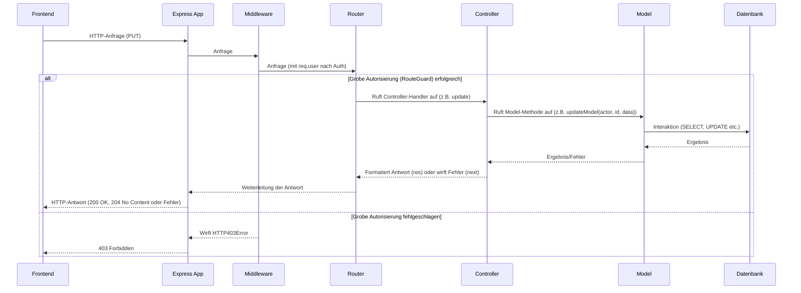

# Chapter 6: Backend-Controller


Stellen Sie sich vor, das Frontend (der Teil der Anwendung, den der Benutzer im Browser sieht) möchte etwas vom Backend machen lassen. Zum Beispiel:

*   Die Liste aller Benutzer abrufen.
*   Ein neues Dokument erstellen.
*   Ein bestehendes Dokument aktualisieren.
*   Das eigene Benutzerprofil speichern.

Diese Anfragen kommen vom Frontend über das Internet zum Backend. Aber wie empfängt das Backend diese Anfragen? Wer entscheidet, welche Logik ausgeführt werden soll, basierend auf der angefragten URL und HTTP-Methode (GET, POST, PUT, DELETE)?

Hier kommen die **Backend-Controller** ins Spiel. Sie sind quasi die "Empfangsmitarbeiter" des Backends. Wenn eine Anfrage ankommt, landet sie zuerst bei einem Controller, der speziell für den angefragten Endpunkt zuständig ist.

## Was ist ein Backend-Controller?

Ein **Backend-Controller** ist eine Funktion oder eine Klasse (in unserem Projekt meist eine Funktion), die die Verantwortung hat, **eingehende Anfragen von einem spezifischen API-Endpunkt zu verarbeiten**.

Stellen Sie sich das Backend wie ein Bürogebäude vor. Die Anfragen vom Frontend sind Besucher, die etwas erledigen wollen.

*   Die **API-Anwendung** ([Kapitel 7: API-Anwendung (Express App)](07_api_anwendung__express_app__.md)) ist das Gebäude selbst.
*   Der **Router** (verwaltet im [Kapitel 7](07_api_anwendung__express_app__.md)) ist der Pförtner oder die Telefonzentrale, die die Anfrage (den Besucher) an die richtige Abteilung weiterleitet.
*   Die **Controller** sind die Sachbearbeiter in diesen Abteilungen. Sie nehmen die Anfrage entgegen, verstehen, was der Besucher will, holen sich die nötigen Informationen von den zuständigen Fachleuten (den **Datenmodellen** [Kapitel 1: Backend-Datenmodelle (Prisma Models)](01_backend_datenmodelle__prisma_models__.md)), verarbeiten das Ergebnis und geben dem Besucher eine Antwort mit.

Die Hauptaufgaben eines Controllers im `teaching-project` sind typischerweise:

1.  **Anfrage entgegennehmen:** Er empfängt die HTTP-Anfrage (`req`), die alle Informationen wie Pfad, Methode, Header, Query-Parameter und den Body (mit Daten) enthält.
2.  **Daten extrahieren:** Er entnimmt der Anfrage die relevanten Daten, die für die gewünschte Operation benötigt werden (z.B. eine ID aus der URL, neue Daten aus dem Request-Body).
3.  **Authentifizierten Benutzer identifizieren:** Er erhält Zugriff auf den authentifizierten Benutzer über `req.user`, der von den Authentifizierungs-Middleware ([Kapitel 3: Authentifizierung & Autorisierung](03_authentifizierung___autorisierung_.md)) bereitgestellt wurde.
4.  **Model aufrufen:** Er ruft die entsprechende Methode im zuständigen **Datenmodell** auf ([Kapitel 1: Backend-Datenmodelle (Prisma Models)](01_backend_datenmodelle__prisma_models__.md)), wobei er die extrahierten Daten und den authentifizierten Benutzer als Argumente übergibt. Die Geschäftslogik und Datenbankinteraktion liegen *nicht* im Controller, sondern im Model.
5.  **Antwort formatieren:** Er empfängt das Ergebnis vom Model, formatiert die HTTP-Antwort (`res`) (z.B. setzt den Statuscode wie 200 OK, 201 Created, 204 No Content oder 404 Not Found) und fügt die zurückgegebenen Daten hinzu.
6.  **Fehlerbehandlung:** Wenn während der Verarbeitung ein Fehler auftritt (oft vom Model zurückgegeben, z.B. ein `HTTP403Error` für fehlende Berechtigungen oder `HTTP404Error` wenn etwas nicht gefunden wurde), leitet der Controller diesen Fehler an die zentrale Fehlerbehandlungs-Middleware (siehe [Kapitel 7: API-Anwendung (Express App)](07_api_anwendung__express_app__.md)) weiter (`next(error)`).
7.  **Notifications senden:** (Optional, spezifisch für unser Projekt) Bereiten Nachrichten für die Echtzeit-Kommunikation (Socket.IO, [Kapitel 8: Echtzeit-Kommunikation (Socket.IO)](08_echtzeit_kommunikation__socket_io__.md)) vor, die an relevante Clients gesendet werden sollen.

Controller sind also die dünne Schicht, die den Eingangspunkt einer API-Anfrage darstellt, die notwendigen Daten sammelt und die eigentliche Arbeit an die Models delegiert.

## Anwendungsfall: Ein Benutzerprofil aktualisieren

Kehren wir zu unserem bekannten Anwendungsfall zurück: Ein authentifizierter Benutzer möchte sein *eigenes* Profil aktualisieren. Wir haben in [Kapitel 3: Authentifizierung & Autorisierung](03_authentifizierung___autorisierung_.md) und [Kapitel 1: Backend-Datenmodelle (Prisma Models)](01_backend_datenmodelle__prisma_models__.md) gesehen, wie die Authentifizierung, RouteGuard und das `UserModel.updateModel` die Sicherheit und Logik handhaben. Aber wer ist der erste Ansprechpartner, wenn die `PUT`-Anfrage an `/api/v1/users/:id` im Backend ankommt?

Das ist die Aufgabe des **User Controllers**, speziell der Funktion, die für `PUT /users/:id` zuständig ist.

Schauen wir uns den zugehörigen Codeausschnitt aus `teaching-api/src/controllers/users.ts` an:

```typescript
// Aus teaching-api/src/controllers/users.ts
import { User as DbUser } from '@prisma/client';
import { RequestHandler } from 'express';
import User from '../models/User'; // Importiert unser erweitertes User Model
import Logger from '../utils/logger'; // Ein Logger-Helfer

// Definition des Handlers für die PUT /users/:id Route
export const update: RequestHandler<{ id: string }, any, { data: Partial<DbUser> }> = async (req, res, next) => {
    try {
        // 1. Daten extrahieren:
        //    - id aus den URL-Parametern (z.B. `/users/123` -> req.params.id = '123')
        //    - aktualisierte Profildaten aus dem Request-Body
        const userId = req.params.id;
        const updateData = req.body.data;

        // 2. Authentifizierten Benutzer identifizieren:
        //    Der authentifizierte Benutzer (`req.user`) wurde von der Passport-Middleware angehängt (Kapitel 3).
        //    Wir brauchen ihn als 'actor' (agierender Benutzer) für die Autorisierungsprüfung im Model.
        const actor = req.user; // req.user hat den Typ 'User' | undefined

        // 3. Model aufrufen:
        //    Delegieren die eigentliche Logik (Suchen, Autorisierung, Daten bereinigen, Speichern) an das User Model.
        //    !! Der Controller selbst prüft NICHT die detaillierten Berechtigungen auf diesem spezifischen Record !!
        const model = await User.updateModel(actor!, userId, updateData); // Übergeben actor, ID und Daten

        // 4. Antwort formatieren:
        //    Wenn das Model erfolgreich zurückkehrt, ist alles OK.
        //    Senden einen 200 OK Status und optional die aktualisierten Benutzerdaten zurück.
        //    (Dieses Beispiel sendet das Model zurück, manchmal sendet man auch nur 204 No Content)
        res.status(200).json(model);
    } catch (error) {
        // 5. Fehlerbehandlung:
        //    Wenn das Model einen Fehler wirft (z.B. HTTP403Error für fehlende Berechtigung),
        //    leiten wir den Fehler an die Express-Fehlerbehandlung weiter.
        next(error);
    }
};

// ... andere Controller-Handler für /users
```

Diese `update`-Funktion ist ein klassischer Controller-Handler. Sie ist relativ kurz und delegiert die "schwere Arbeit" an das `UserModel`. Ihre Hauptaufgabe ist das Sammeln der benötigten Informationen aus der Anfrage (`req`) und das Übergeben dieser Informationen an die korrekte Stelle (das Model).

Betrachten wir ein einfacheres Beispiel, das nur Daten abruft: `/api/v1/users`. Diesen Endpunkt könnte ein Administrator nutzen, um eine Liste aller Benutzer zu sehen.

```typescript
// Aus teaching-api/src/controllers/users.ts
// ... Importe ...
// ... andere Controller-Handler ...

// Definition des Handlers für die GET /users/ Route
export const all: RequestHandler = async (req, res, next) => {
    try {
        // 1. Authentifizierten Benutzer identifizieren (für Autorisierung im Model)
        const actor = req.user;

        // 2. Model aufrufen:
        //    Delegieren Sie das Abrufen der Daten an das User Model.
        //    Das Model kümmert sich um die Autorisierung (darf der Actor alle Benutzer sehen?)
        const users = await User.all(actor!);

        // 3. Antwort formatieren:
        //    Senden eine 200 OK Status und die Liste der Benutzer zurück.
        res.json(users); // Express setzt standardmässig Status 200 bei res.json
    } catch (error) {
        // 4. Fehlerbehandlung:
        //    Weiterleiten von Fehlern, z.B. HTTP403Error falls der Actor kein Admin ist.
        next(error);
    }
};
```

Auch hier sehen wir dasselbe Muster: Identifiziere den agierenden Benutzer (`actor`), rufe das entsprechende Model für die Datenoperation auf (`User.all(actor!)`) und sende das Ergebnis zurück (`res.json(users)`). Der Controller ist dünn und fokussiert auf die Koordination.

## Unter der Haube: Der Weg einer Anfrage durch den Controller

Wie passt der Controller in den Gesamtfluss einer Anfrage im Backend?

Basierend auf dem Fluss, den wir in [Kapitel 3: Authentifizierung & Autorisierung](03_authentifizierung___autorisierung_.md) und [Kapitel 5: Dokumentenbaum (Document Root)](05_documentenbaum__document_root_.md) gesehen haben, sieht der Weg mit dem Controller als neuem Schritt so aus:

1.  **Frontend** sendet HTTP-Anfrage (z.B. `PUT /api/v1/users/ihre-id` mit Daten).
2.  Die **Express App** ([Kapitel 7: API-Anwendung (Express App)](07_api_anwendung__express_app__.md)) empfängt die Anfrage.
3.  Verschiedene **Middleware** laufen durch:
    -   Session-Middleware identifiziert die Session.
    -   Passport-Middleware (mit `deserializeUser`) authentifiziert den Benutzer und fügt `req.user` hinzu.
    -   `routeGuard` Middleware ([Kapitel 3]) führt eine **grobe Autorisierung** auf Basis von Pfad/Methode und `req.user?.isAdmin` durch. Wenn dieser Check fehlschlägt, wird hier eine 403 Forbidden Antwort gesendet, und der Rest der Kette wird nicht ausgeführt.
4.  Wenn der `routeGuard` die Anfrage durchlässt, matcht der **Express Router** die URL und die HTTP-Methode mit einem registrierten **Controller-Handler**.
5.  Der zuständige **Controller-Handler** (z.B. `update` in `users.ts`) wird aufgerufen.
6.  Der Controller **extrahiert** relevante Daten aus `req` (`req.params`, `req.body`, `req.query`).
7.  Der Controller ruft die entsprechende Methode im **Backend-Datenmodell** ([Kapitel 1]) auf (z.B. `UserModel.updateModel`), wobei er typischerweise `req.user` und die extrahierten Daten übergibt.
8.  Das Model führt die **Geschäftslogik** aus, einschliesslich der **fein-granularen Autorisierung** auf Basis der spezifischen Daten ([Kapitel 1, 3, 5]), Validierung und Interaktion mit der **Datenbank** (via Prisma, [Kapitel 2]).
9.  Das Model gibt das Ergebnis (Daten oder Fehler) an den **Controller** zurück.
10. Der Controller **formatiert die Antwort** (`res`) basierend auf dem Ergebnis des Models (setzt Statuscode, fügt Body hinzu).
11. Der Controller ruft `next()` auf oder Express sendet die formatierte **Antwort** an das **Frontend**. Wenn der Controller einen Fehler an `next()` übergibt, übernimmt die zentrale Fehlerbehandlungs-Middleware die Formatierung der Fehlerantwort.

Hier ist ein vereinfachtes Sequenzdiagramm, das diesen Fluss illustriert:



Der Controller ist nur ein kleiner, aber wichtiger Teil dieser Kette. Er empfängt nicht direkt vom Frontend (die Express App und Middleware sind davor), er spricht nicht direkt mit der Datenbank (das Model und Prisma sind dazwischen), und er beherbergt nicht die Hauptgeschäftslogik (die ist im Model). Er ist der **Koordinator** für eine spezifische API-Operation.

### Code-Beispiele für verschiedene Controller

Ein Blick in das Verzeichnis `teaching-api/src/controllers` zeigt viele Beispiele für Controller. Sie folgen alle einem ähnlichen Muster:

**Beispiel: findone DocumentRoot (`teaching-api/src/controllers/documentRoots.ts`)**

```typescript
// Aus teaching-api/src/controllers/documentRoots.ts
import { RequestHandler } from 'express';
import DocumentRoot, { Config as CreateConfig, UpdateConfig } from '../models/DocumentRoot'; // Importiert DocumentRoot Model
// ... andere Importe

// Handler für GET /document-roots/:id
export const find: RequestHandler<{ id: string }> = async (req, res, next) => {
    try {
        // Extrahiere ID aus Pfad, nutze req.user
        const document = await DocumentRoot.findModel(req.user!, req.params.id);
        // Sende das Ergebnis zurück
        res.json(document);
    } catch (error) {
        // Leite Fehler weiter
        next(error);
    }
};

// ... andere Controller-Handler für DocumentRoots (create, update, destroy, permissions etc.)
```
Muster: Extrahiere `id`, rufe `DocumentRoot.findModel(req.user!, id)` auf, sende `res.json(...)`.

**Beispiel: create StudentGroup (`teaching-api/src/controllers/studentGroups.ts`)**

```typescript
// Aus teaching-api/src/controllers/studentGroups.ts
import { StudentGroup as DbStudentGroup } from '@prisma/client';
import { RequestHandler } from 'express';
import Logger from '../utils/logger'; // Ein Logger-Helfer
import StudentGroup from '../models/StudentGroup'; // Importiert StudentGroup Model

// Handler für POST /student-groups
export const create: RequestHandler<any, any, Partial<DbStudentGroup>> = async (req, res, next) => {
    try {
        // Extrahiere Daten aus dem Request Body
        const { name, description, parentId } = req.body;
        // Rufe Model Methode auf. createModel braucht hier nicht req.user
        const model = await StudentGroup.createModel(name!, description, parentId);
        // Sende Ergebnis und Status 200 zurück
        res.status(200).json(model);
    } catch (error) {
        // Leite Fehler weiter
        next(error);
    }
};

// ... andere Controller-Handler für StudentGroups
```
Muster: Extrahiere Daten aus `req.body`, rufe `StudentGroup.createModel(...)` auf, sende `res.status(200).json(...)`.

**Beispiel: githubToken in CmsSettings (`teaching-api/src/controllers/cmsSettings.ts`)**

```typescript
// Aus teaching-api/src/controllers/cmsSettings.ts
import { RequestHandler } from 'express';
import CmsSettings from '../models/CmsSetting'; // Importiert CmsSetting Model
// ... andere Importe

// Handler für GET /cms-settings/github-token (mit Query Param ?)
export const githubToken: RequestHandler<any, any, any, { code: string }> = async (req, res, next) => {
    try {
        // Extrahiere 'code' aus den Query-Parametern (z.B. ?code=...)
        const { code } = req.query;
        // Rufe Model-Methode auf (Model führt Kommunikation mit externer API durch)
        const model = await CmsSettings.fetchToken(req.user!.id, code);

        // Bereite Notification vor (spezifisch für diesen Controller/Fall)
        // (Details zu Notifications in Kapitel 8)
        const change: ChangedRecord<RecordType.CmsSettings> = { /* ... */ };
        res.notifications = [
            {
                event: IoEvent.CHANGED_RECORD,
                message: change,
                to: [req.user!.id] // Sende nur an den aktuellen Benutzer
            }
        ];

        // Sende Ergebnis und Status 200 zurück
        res.status(200).json(model);
    } catch (error) {
        // Leite Fehler weiter
        next(error);
    }
};
// ... andere Controller-Handler für CmsSettings
```
Muster: Extrahiere Query-Parameter, rufe `CmsSettings.fetchToken(req.user!.id, ...)` auf, bereite Notifications vor, sende `res.status(200).json(...)`. Dieses Beispiel zeigt, dass Controller auch für komplexere Abläufe wie externe API-Kommunikation initiiert durch das Model zuständig sein können und spezifische Antwort-Logik (Notifications) enthalten können.

Diese Beispiele illustrieren das einheitliche Muster: Controller extrahieren, delegieren an Models, formatieren die Antwort.

## Vorteile der Controller-Schicht

Das Design mit Controllern als dünner Schicht bietet mehrere Vorteile:

*   **Trennung der Belange:** Die Verantwortlichkeiten sind klar getrennt. Controller kümmern sich um den HTTP-Ein- und Ausgang und das Routing, Models um Geschäftslogik und Daten. Dies macht den Code sauberer und einfacher zu warten.
*   **Testbarkeit:** Man kann die Geschäftslogik in den Models isoliert testen, ohne eine vollständige HTTP-Anfrage simulieren zu müssen. Controller können ebenfalls getestet werden, aber die Komplexität beschränkt sich auf das Extrahieren von Request-Daten und das korrekte Aufrufen der Models.
*   **Wiederverwendbarkeit:** Die Logik in den Models kann einfacher von verschiedenen Controllern wiederverwendet werden (obwohl in unserem Projekt meist ein Controller 1:1 zu einem Model passt), und die Datenbankinteraktionslogik in den Models ist von allen Controllern nutzbar.

## Fazit

Backend-Controller sind die Eingangslogik für spezifische API-Endpunkte im Backend. Sie agieren als Koordinatoren, die eingehende HTTP-Anfragen von der API-Anwendung entgegennehmen, relevante Daten extrahieren, den authentifizierten Benutzer identifizieren und dann die eigentliche Arbeit an die zuständigen Backend-Datenmodelle delegieren. Nachdem das Model die Geschäftslogik (inklusive Autorisierung und Datenbankzugriff) ausgeführt hat, erhält der Controller das Ergebnis zurück, formatiert die HTTP-Antwort und sendet sie zurück an den Client.

Durch die klare Trennung der Zuständigkeiten zwischen Routing, Controllern und Models bleibt das Backend übersichtlich und wartbar. Die Controller bilden die Schnittstelle, über die das Frontend mit der serverseitigen Logik interagiert.

Aber wie ist das Routing genau konfiguriert? Wie wird die gesamte Kette von Middleware, Routing und Controllern zusammengeführt, um die gesamte API zu bilden? Das erfahren wir im nächsten Kapitel über die API-Anwendung.

Weiter geht es mit [Kapitel 7: API-Anwendung (Express App)](07_api_anwendung__express_app__.md).

---

Generated by [AI Codebase Knowledge Builder](https://github.com/The-Pocket/Tutorial-Codebase-Knowledge)
