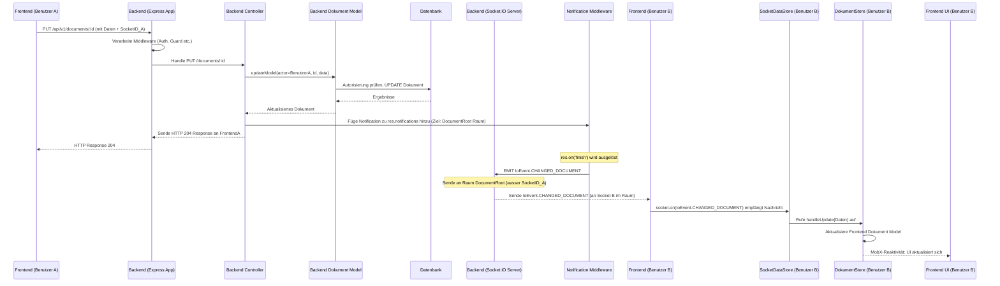

# Chapter 8: Echtzeit-Kommunikation (Socket.IO)


Willkommen zurück! In den vorherigen Kapiteln haben wir uns auf die traditionelle Art der Kommunikation zwischen Frontend und Backend konzentriert: **HTTP-Anfragen und Antworten**. Wir haben gelernt, wie die **API-Anwendung (Express App)** ([Kapitel 7: API-Anwendung (Express App)](07_api_anwendung__express_app__.md)) diese Anfragen empfängt, wie die **Middleware** ([Kapitel 7: API-Anwendung (Express App)](07_api_anwendung__express_app__.md)) die Authentifizierung und Autorisierung regelt ([Kapitel 3: Authentifizierung & Autorisierung](03_authentifizierung___autorisierung_.md)), wie **Controller** ([Kapitel 6: Backend-Controller](06_backend_controller_.md)) die Anfragen an die **Datenmodelle** ([Kapitel 1: Backend-Datenmodelle (Prisma Models)](01_backend_datenmodelle__prisma_models__.md)) weiterleiten, die wiederum mit dem **Datenbankschema** ([Kapitel 2: Datenbankschema (Prisma Schema)](02_datenbankschema__prisma_schema__.md)) interagieren, um **Dokumente** ([Kapitel 4: Dokumente (Content Units)](04_dokumente__content_units__.md)) und **Dokumentenbäume** ([Kapitel 5: Dokumentenbaum (Document Root)](05_documentenbaum__document_root_.md)) zu verwalten.

Diese Abfolge funktioniert hervorragend für Anfragen, bei denen der Client das Backend um etwas bittet und auf eine Antwort wartet (z. B. "Gib mir alle Benutzer", "Erstelle ein neues Dokument", "Aktualisiere mein Profil"). Aber was passiert, wenn das Backend dem Frontend mitteilen muss, dass sich etwas geändert hat, *ohne* dass das Frontend explizit danach gefragt hat?

Stellen Sie sich vor, zwei Benutzer arbeiten gleichzeitig am selben Dokument. Wenn der eine Benutzer eine Änderung vornimmt, soll der andere Benutzer diese Änderung sofort sehen, als ob sie "live" passiert. Oder denken Sie an eine Chat-Anwendung: Wenn jemand eine neue Nachricht sendet, soll diese bei allen anderen Teilnehmern sofort erscheinen. Mit reinem HTTP müsste das Frontend ständig das Backend fragen: "Gibt es neue Änderungen für dieses Dokument?" oder "Gibt es neue Chat-Nachrichten?". Das nennt man **Polling**, und es ist sehr ineffizient: Entweder fragt der Client zu selten und die Updates sind verzögert, oder er fragt zu oft, was Server und Netzwerk unnötig belastet.

Wir brauchen einen Mechanismus, der **Echtzeit-Kommunikation** ermöglicht; eine dauerhafte Verbindung, über die der Server Daten an den Client "pushen" kann, sobald sie verfügbar sind. Hierfür nutzen wir **Socket.IO**.

## Was ist Echtzeit-Kommunikation und Socket.IO?

**Echtzeit-Kommunikation** bezieht sich auf die Fähigkeit einer Anwendung, Daten sofort zu übertragen, sobald sie verfügbar sind, ohne dass der Empfänger aktiv nach den Daten fragen muss.

**Socket.IO** ist eine beliebte Bibliothek, die Echtzeit-, bidirektionale und ereignisbasierte Kommunikation zwischen Webclients und einem Server ermöglicht. Sie baut in erster Linie auf dem **WebSocket-Protokoll** auf, bietet aber eine Rückfalllösung (Fallback) für ältere Browser oder eingeschränkte Netzwerke, indem sie Techniken wie langes Polling verwendet. Für uns als Entwickler abstrahiert Socket.IO diese Komplexität und bietet eine einfache API für die ereignisbasierte Kommunikation.

Die Kernkonzepte von Socket.IO sind:

1.  **Dauerhafte Verbindung (Persistent Connection):** Im Gegensatz zu HTTP, bei dem jede Anfrage eine separate Verbindung herstellt und wieder trennt, baut Socket.IO (mittels WebSockets) eine einzige, dauerhafte Verbindung zwischen Client und Server auf. Diese Verbindung bleibt offen, solange Client und Server verbunden sind.
2.  **Ereignisse (Events):** Die Kommunikation erfolgt über benannte Ereignisse. Der Server kann ein Ereignis an den Client **emittieren** (`emit`), und der Client kann auf Ereignisse vom Server **lauschen** (`on`). Umgekehrt kann der Client ebenfalls Ereignisse an den Server emittieren, und der Server kann darauf lauschen. Der "Name" des Ereignisses (z. B. `'document update'`, `'new chat message'`) definiert, um welche Art von Information es sich handelt.
3.  **Räume (Rooms):** Socket.IO ermöglicht es Clients, **Räumen** beizutreten (`socket.join('roomName')`) und Nachrichten an alle Clients in einem bestimmten Raum zu senden (`io.to('roomName').emit('eventName', data)`). Dies ist entscheidend, um Nachrichten nur an eine relevante Untergruppe von Clients zu senden (z. B. alle Benutzer, die gerade dasselbe Dokument bearbeiten).
4.  **Bidirektionalität:** Sowohl Server als auch Client können jederzeit Ereignisse senden oder empfangen.

Socket.IO löst das Polling-Problem, indem es dem Server erlaubt, Updates sofort an die Clients zu "pushen", sobald sie auftreten.

## Socket.IO im `teaching-project`

Im `teaching-project` wird Socket.IO hauptsächlich verwendet, um **Änderungen von Daten im Backend in Echtzeit an alle relevanten, verbundenen Frontend-Clients zu senden**. Dieser Mechanismus wird als **Notifications** bezeichnet (nicht zu verwechseln mit Benachrichtigungen an den Benutzer, obwohl er dafür verwendet werden kann).

Diese Echtzeit-Updates sind entscheidend für Features wie:

*   Live-Aktualisierung von Dokumentinhalten, wenn andere Benutzer sie bearbeiten.
*   Echtzeit-Änderungen an Benutzerberechtigungen oder Gruppenzugehörigkeiten, die sich sofort auf die UI auswirken.
*   Anzeigen, welche anderen Benutzer gerade "online" sind oder einen Raum betreten/verlassen.

### Serverseitige Einrichtung (`server.ts`)

Die Einrichtung des Socket.IO-Servers findet in `teaching-api/src/server.ts` statt, wo der Express HTTP-Server gestartet wird. Der bestehende HTTP-Server wird verwendet, um den Socket.IO-Server darauf aufzubauen.

```typescript
// Aus teaching-api/src/server.ts (vereinfacht)
import app, { configure, sessionMiddleware } from './app';
import http from 'http';
import Logger from './utils/logger';
import { Server } from 'socket.io'; // Socket.IO Server Klasse
import { ClientToServerEvents, IoEvent, ServerToClientEvents } from './routes/socketEventTypes'; // Typdefinitionen für Events
import passport from 'passport';
import EventRouter from './routes/socketEvents'; // Unser Handler für Socket-Events
import { NextFunction, Request, Response } from 'express';
// ... andere Importe

const PORT = process.env.PORT || 3002;

// Erstelle einen Standard HTTP-Server aus der Express App
const server = http.createServer(app);

// Konfiguriere CORS für Socket.IO separat (muss mit den Frontend-Origins übereinstimmen)
const corsOrigin = process.env.WITH_DEPLOY_PREVIEW
    ? [process.env.FRONTEND_URL || true, /https:\/\/deploy-preview-\d+--teaching-dev.netlify.app/]
    : process.env.FRONTEND_URL || true;

// Erstelle einen neuen Socket.IO Server, der auf dem HTTP-Server läuft
const io = new Server<ClientToServerEvents, ServerToClientEvents>(server, {
    cors: {
        origin: corsOrigin, // Definiert erlaubte Ursprünge für Socket.IO Verbindungen
        credentials: true,
        methods: ['GET', 'POST', 'PUT', 'DELETE'] // Erlaubte HTTP-Methoden für den Handshake
    },
    // ... weitere Konfigurationen (ping intervals, transports) ...
});

// Wichtig: Adapitiere Express Middleware für Passport-Authentifizierung,
// damit sie auch für Socket.IO Verbindungen ausgeführt werden
io.use((socket, next) => {
    sessionMiddleware(socket.request as Request, {} as Response, next as NextFunction);
});
io.use((socket, next) => {
    // Initialisiere Passport für diese Socket-Anfrage
    passport.initialize()(socket.request as Request, {} as Response, next as NextFunction);
});
io.use((socket, next) => {
    // Nutze Passport Session, um den Benutzer zu laden - req.user wird am socket.request angehängt
    passport.session()(socket.request as Request, {} as Response, next as NextFunction);
});

// Leite eingehende Socket-Ereignisse an den EventRouter weiter
EventRouter(io);

// NUR authentifizierte Benutzer ZULASSEN
io.use((socket, next) => {
    // Wenn req.user am request Objekt hängt (von passport.session() gesetzt), ist der Benutzer authentifiziert
    if ((socket.request as any).user) {
        next(); // Erlaube die Verbindung
    } else {
        next(new Error('unauthorized')); // Verweigere die Verbindung bei fehlender Authentifizierung
    }
});

// Mache das Socket.IO Server Objekt IO auch in den HTTP Request Handlern (Controllern) verfügbar
app.use((req: Request, res, next) => {
    req.io = io; // Hängt die IO Instanz an das req Objekt an
    next();
});

// Konfiguriere die Haupt Express App (inklusive Routing etc. - Kapitel 7)
configure(app);

// Starte den Server
server.listen(PORT || 3002, () => {
    Logger.info(`application is running at: http://localhost:${PORT}`);
    Logger.info('Press Ctrl+C to quit.');
});
```

Dieser Code zeigt:
1.  Wir erstellen einen Socket.IO Server (`io`) und binden ihn an unseren bestehenden HTTP-Server (`server`).
2.  Das **`cors`**-Objekt ist wichtig, um Socket.IO-Verbindungen vom Frontend zu erlauben, wenn Frontend und Backend auf unterschiedlichen Adressen laufen.
3.  Die `io.use(...)` Middleware stellt sicher, dass die **Express-Middleware für Session und Passport auch für jeden eingehenden Socket.IO-Verbindungsversuch ausgeführt wird**. Dadurch wird der authentifizierte Benutzer (`req.user`) an das `socket.request`-Objekt gehängt, genau wie bei HTTP-Anfragen ([Kapitel 3: Authentifizierung & Autorisierung](03_authentifizierung___autorisierung_.md)).
4.  Die letzte `io.use(...)` Middleware **verweigert die Socket.IO-Verbindung, wenn der Benutzer nicht authentifiziert ist**. Dies ist ein grundlegender Sicherheitsmechanismus.
5.  Die `app.use((req: Request, res, next) => { req.io = io; next(); });` Middleware **fügt die Socket.IO Server-Instanz (`io`) zu jedem Express `req`-Objekt hinzu**. Dies ist entscheidend, denn so können unsere **Controller** ([Kapitel 6: Backend-Controller](06_backend_controller_.md)) oder andere Teile des Backends auf die Socket.IO-Instanz zugreifen, um Ereignisse zu emittieren.

### Serverseitiges Event Handling (`socketEvents.ts`)

Im `teaching-api/src/routes/socketEvents.ts` werden die Handler für *vom Client gesendete* Socket.IO-Ereignisse definiert. Derzeit sind das hauptsächlich Ereignisse zum Beitreten und Verlassen von Räumen.

```typescript
// Aus teaching-api/src/routes/socketEvents.ts (vereinfacht)
import type { User } from '@prisma/client';
import { Server } from 'socket.io';
import Logger from '../utils/logger';
import { ClientToServerEvents, IoEvent, IoClientEvent, ServerToClientEvents } from './socketEventTypes'; // Typdefinitionen
import StudentGroup from '../models/StudentGroup'; // Beispielhaftes Model

// Definiert Standard-Räume
export enum IoRoom {
    ADMIN = 'admin',
    ALL = 'all'
}

const EventRouter = (io: Server<ClientToServerEvents, ServerToClientEvents>) => {
    // Lausche auf neue Verbindungen ('connection' ist ein vordefiniertes Socket.IO Ereignis)
    io.on('connection', async (socket) => {
        // user ist verfügbar, weil passport.session() aufgerufen wurde (siehe server.ts)
        const user = (socket.request as { user?: User }).user;
        // Zusätzliche Sicherheit: Wenn kein Benutzer da, Verbindung trennen (sollte durch io.use() vorher abgefangen werden, aber sicher ist sicher)
        if (!user) {
            return socket.disconnect();
        }
        Logger.info(`Socket.io connect ${user.email}`); // Logge neue Verbindung

        // Füge den Benutzer einem Raum bei, der seiner eigenen Benutzer-ID entspricht
        // Ermöglicht das Senden von Nachrichten direkt an DIESEN Benutzer
        socket.join(user.id);

        // Wenn der Benutzer Admin ist, füge ihn dem Admin-Raum bei
        if (user.isAdmin) {
            socket.join(IoRoom.ADMIN);
            // Lausche auf JOIN_ROOM Ereignisse vom Admin-Client
            socket.on(IoClientEvent.JOIN_ROOM, (roomId: string, callback: () => void) => {
                socket.join(roomId); // Admin kann JEDEN Raum betreten/verlassen
                callback(); // Bestätige dem Client
            });
            // Lausche auf LEAVE_ROOM Ereignisse vom Admin-Client
            socket.on(IoClientEvent.LEAVE_ROOM, (roomId: string, callback: () => void) => {
                socket.leave(roomId);
                callback(); // Bestätige dem Client
            });
             // Sende Admin-Clients eine Liste aller verbundenen Clients und Räume
             const rooms = [...io.sockets.adapter.rooms.keys()].map(/* ... */);
             io.to(IoRoom.ADMIN).emit(IoEvent.CONNECTED_CLIENTS, { rooms: rooms, type: 'full' });
        }

        // Füge alle Benutzer einem allgemeinen "ALL"-Raum bei
        socket.join(IoRoom.ALL);

        // Füge den Benutzer Räumen bei, die seinen Studentengruppen entsprechen
        // (ermöglicht das Senden von Updates an alle Mitglieder einer Gruppe)
        const groups = await StudentGroup.all(user);
        const groupIds = groups.map((group) => group.id);
        if (groupIds.length > 0) {
            socket.join(groupIds);
        }

        // ... Weitere Listener für 'disconnect', 'error', 'reconnect' etc. ...

        // Listener auf dem Adapter, um Änderungen in den Räumen (join/leave) zu erkennen
        io.of('/').adapter.on('join-room', (room, id) => {
             // Sende Updates über Raum-Änderungen an Admins und den betroffenen Raum
             const size = io.sockets.adapter.rooms.get(room)?.size || 0;
             io.to([room, IoRoom.ADMIN]).emit(IoEvent.CONNECTED_CLIENTS, {
                 rooms: [[room, size]],
                 type: 'update'
             });
         });
         io.of('/').adapter.on('leave-room', (room, id) => {
             // Sende Updates über Raum-Änderungen an Admins und den betroffenen Raum
             const size = io.sockets.adapter.rooms.get(room)?.size || 0;
             io.to([room, IoRoom.ADMIN]).emit(IoEvent.CONNECTED_CLIENTS, {
                 rooms: [[room, size]],
                 type: 'update'
             });
         });
    });

    // ... andere globale Ereignisse ('disconnect', 'error')
};

export default EventRouter;
```

Jeder neu verbundene Client erhält ein einzigartiges `socket`-Objekt. Dieses Objekt wird automatisch Räumen beitreten, sobald der Benutzer authentifiziert ist:
*   Dem Raum mit der ID des Benutzers (`user.id`) – für Direktnachrichten an diesen Benutzer.
*   Dem Raum `'admin'` – wenn der Benutzer ein Administrator ist.
*   Dem Raum `'all'` – für allgemeine Benachrichtigungen.
*   Räumen, die den IDs der Studentengruppen entsprechen, in denen der Benutzer Mitglied ist – für gruppenbezogene Updates.

Admins können über die Client-Ereignisse `JOIN_ROOM` und `LEAVE_ROOM` explizit beliebige Räume betreten oder verlassen, um z. B. die Aktivität in bestimmten Dokumenten zu verfolgen.

Die `IoEvent`-Typen definieren die Namen der Ereignisse, die Server und Client einander senden/empfangen können. `IoClientEvent` sind vom Client initiierte Events, `IoEvent` sind vom Server initiierte Events.

### Serverseitige Benachrichtigungen (Notifications Middleware in `app.ts`)

Wie sendet das Backend nun eine Benachrichtigung an den Frontend-Client, *nachdem* eine HTTP-Anfrage verarbeitet wurde (z. B. ein Dokument gespeichert wurde)? Hier kommt die spezielle **Notification Middleware** ins Spiel, die wir in **[Kapitel 7: API-Anwendung (Express App)](07_api_anwendung__express_app__.md)** kurz erwähnt haben.

Diese Middleware befindet sich in `teaching-api/src/app.ts` und lauscht auf das `finish`-Ereignis des `res`-Objekts (Antwort).

```typescript
// Aus teaching-api/src/app.ts (Ausschnitt aus configure)
// ... Importe ...
// ... andere Middleware ...

export const configure = (_app: typeof app) => {
    /**
     * Notification Middleware
     * when the response `res` contains a `notifications` property, the middleware will
     * send the notification over SocketIO to the specififed rooms.
     */
    _app.use((req: Request, res, next) => {
        // Hängt sich an das 'finish' Ereignis der Response
        // Dies wird ausgeführt, NACHDEM die HTTP-Antwort vollständig an den Client gesendet wurde.
        res.on('finish', async () => {
            // Sende nur Notifications bei erfolgreichen HTTP-Statuscodes (unter 400)
            if (res.statusCode >= 400) {
                return;
            }
            // Holt die Socket.IO Server Instanz, die zuvor an req.io angehängt wurde
            const io = req.io as Server<ClientToServerEvents, ServerToClientEvents>;

            // Prüfe, ob im Controller Notifications an res.notifications angehängt wurden UND die IO Instanz verfügbar ist
            if (res.notifications && io) {
                // Durchlaufe alle gesammelten Notifications
                res.notifications.forEach((notification) => {
                    // Bestimme, welche Sockets von der Benachrichtigung ausgenommen werden sollen (z.B. der sendende Client selbst)
                    const except: string[] = [];
                    if (!notification.toSelf) {
                        const socketID = req.headers['x-metadata-socketid'] as string; // Erwarte die SocketID im Header
                        if (socketID) {
                            except.push(socketID); // Schliesse den sendenden Client aus, wenn nicht toSelf gewünscht
                        }
                    }
                    // EMITTIERE das Socket.IO Ereignis!
                    // io.except(except) : Schliesst bestimmte Sockets aus
                    // .to(notification.to): Sendet NUR an die angegebenen Räume/Socket-IDs
                    // .emit(notification.event, notification.message): Emittiert das Ereignis mit dem Namen und den Daten
                    io.except(except)
                        .to(notification.to) // notification.to kann eine einzelne Raum ID (String) oder ein Array von Raum IDs (String[]) sein
                        .emit(notification.event, notification.message as any); // event & message sind aus socketEventTypes.ts
                });
            }
        });
        next(); // Wichtig: Diese Middleware ruft sofort next() auf, damit die normale Request-Verarbeitung weiterläuft.
              // Das Senden der Socket-Nachrichten passiert asynchron im 'finish' Handler.
    });

    // ... API Routen mit RouteGuard und Router folgen ...
};
```

Damit diese Middleware funktioniert, muss ein **Controller** ([Kapitel 6: Backend-Controller](06_backend_controller_.md)) bei Bedarf eine oder mehrere Notifications am `res`-Objekt anhängen. Zum Beispiel der `update` Controller für Dokumente in `teaching-api/src/controllers/documents.ts`:

```typescript
// Aus teaching-api/src/controllers/documents.ts (Ausschnitt)
// ... Importe ...
import DocumentModel, { ApiDocument } from '../models/Document';
import { ChangedDocument, IoEvent, RecordType } from '../routes/socketEventTypes'; // Importiere Event-Typen
// ... andere Importe

export const update: RequestHandler<
    { id: string },
    any,
    { data: JsonObject },
    { onBehalfOf?: 'true' }
> = async (req, res, next) => {
    try {
        // ... Authentifizierung / Autorisierung durch Model.updateModel (Kapitel 4, 5) ...
        const model: ApiDocument = await DocumentModel.updateModel(
            req.user!, // agierender Benutzer
            documentId, // zu aktualisierendes Dokument
            docData, // neue Daten
            onBehalfOf === 'true' // Admin Flag
        );

        // *** HIER werden Notifications angehängt! ***
        // Erstelle die Nachricht, die gesendet werden soll (nur die ID, Daten und Update-Zeit)
        const change: ChangedDocument = {
            id: model.id,
            data: model.data,
            updatedAt: model.updatedAt
        };
         // Hänge die Notification an res.notifications an
         // notification.to sind die Räume/Clients, die die Nachricht empfangen sollen.
         // notification.event ist der Event-Name ('CHANGED_DOCUMENT').
         req.res.notifications = [
            {
                event: IoEvent.CHANGED_DOCUMENT, // Ereignisname
                message: change, // Die Daten für das Ereignis
                to: [model.documentRootId], // Sende an den Raum des zugehörigen DocumentRoots
                toSelf: false // Sende NICHT an den Client, der die Änderung gesendet hat (der hat sie schon im Frontend)
            }
        ];
        // Optional: Sende eine zusätzliche Benachrichtigung an Admins, wenn ein Nicht-Admin ändert
         if (!req.user?.isAdmin) {
              req.res.notifications.push({
                 event: IoEvent.CHANGED_RECORD,
                 message: { type: RecordType.Document, record: model },
                 to: [IoRoom.ADMIN] // Sende an den Admin Raum
             });
         }


        // Sende die HTTP-Antwort (204 No Content)
        res.status(204).send();
    } catch (error) {
        next(error); // Leite Fehler weiter
    }
};
```
Der Controller hängt einfach ein Array von `Notification`-Objekten (wie in `teaching-api/src/routes/socketEventTypes.ts` definiert) an `res.notifications` an. Die Notification Middleware erledigt den eigentlichen Versand über Socket.IO nach dem HTTP-Response.

Typdefinitionen in `socketEventTypes.ts` sind sehr hilfreich, um Konsistenz zwischen Server und Client bezüglich der Event-Namen (`IoEvent`, `IoClientEvent`) und der Struktur der gesendeten Nachrichten (`NewRecord`, `ChangedRecord`, `DeletedRecord`, `ChangedDocument` etc.) sicherzustellen.

### Clientseitiges Event Handling (`SocketDataStore.ts`)

Auf der Frontend-Seite im `teaching-dev` Projekt kümmert sich der `SocketDataStore` in `teaching-dev\src\stores\SocketDataStore.ts` um die Verbindung zum Socket.IO-Server und das Empfangen von Ereignissen. Er ist Teil des zentralen Zustandsmanagements (Stores), dazu mehr in [Kapitel 9: Frontend-Zustandsspeicher (Stores)](09_frontend_zustandsspeicher__stores__.md).

```typescript
// Aus teaching-dev/src\stores\SocketDataStore.ts (vereinfacht)
import { RootStore } from '@tdev-stores/rootStore'; // Der zentrale Root Store
import { io, Socket } from 'socket.io-client'; // Socket.IO Client Bibliothek
import { action, observable, reaction } from 'mobx'; // MobX für Zustand
import { checkLogin as pingApi, default as api } from '@tdev-api/base'; // API Helfer
import iStore from '@tdev-stores/iStore'; // Basisklasse für Stores
import {
    ChangedDocument,
    ChangedRecord,
    ClientToServerEvents,
    ConnectedClients,
    DeletedRecord,
    IoClientEvent,
    IoEvent, // Event Namen vom Server
    NewRecord,
    RecordType,
    ServerToClientEvents // Typen für gesendete/empfangene Events
} from '../api/IoEventTypes'; // Importiere Typdefinitionen vom Backend (gemeinsamer Code)

type TypedSocket = Socket<ServerToClientEvents, ClientToServerEvents>;

export class SocketDataStore extends iStore<'ping'> {
    readonly root: RootStore;

    @observable.ref accessor socket: TypedSocket | undefined = undefined;
    @observable accessor isLive: boolean = false; // Status der Socket-Verbindung

    constructor(root: RootStore) {
        super();
        this.root = root;

        // Interceptor: Wenn eine API-Anfrage (HTTP) 401 zurückgibt, trenne die Socket-Verbindung
        api.interceptors.response.use(/* ... handle 401 to disconnect ... */);
         // Reaktion auf isLive Änderung (z.B. Logging)
        reaction(() => this.isLive, action((isLive) => { console.log('Socket.IO live:', isLive); }));
    }

    // Methode zum Aufbau der Socket.IO Verbindung
    connect() {
        if (this.socket?.connected) {
            return; // Bereits verbunden
        }
        const ws_url = BACKEND_URL; // URL des Backend
        // Erstelle die Socket.IO Client Instanz
        this.socket = io(ws_url, {
            withCredentials: true, // Wichtig für Cookies und Session-Authentifizierung
            transports: ['websocket', 'webtransport'] // Bevorzugte Transportmethoden
        });
        this._socketConfig(); // Konfiguriere Event Listener
        this.socket.connect(); // Starte den Verbindungsaufbau
    }

    // Konfiguriert die Listener für server-side Events
    _socketConfig() {
        if (!this.socket) { return; }

        // Listener für Verbindungsaufbau
        this.socket.on('connect', () => {
             // Sende die eigene Socket ID mit Outgoing HTTP Requests (für Notification Middleware excludeSelf)
             api.defaults.headers.common['x-metadata-socketid'] = this.socket!.id;
            this.setLiveState(true); // Setze Status auf verbunden
        });

        // Listener für Verbindungsabbau und Fehler
        this.socket.on('disconnect', () => { this.setLiveState(false); });
        this.socket.on('connect_error', (err) => {
            this.setLiveState(false);
             // Bei Verbindungsfehler, prüfe ob Session noch gültig ist, versuche ggf. Reconnect
             this.checkLogin().then((reconnect) => { if (reconnect) { this.reconnect(); } });
        });

        // *** HIER WERDEN SERVER-SEITIGE NOTIFICATIONS EMPFANGEN! ***
        // Listener für NEUE Datensätze
        this.socket.on(IoEvent.NEW_RECORD, this.createRecord.bind(this));
        // Listener für GEÄNDERTE Dokumente (spezielles Format)
        this.socket.on(IoEvent.CHANGED_DOCUMENT, this.updateDocument.bind(this));
        // Listener für GEÄNDERTE Datensätze (allgemein)
        this.socket.on(IoEvent.CHANGED_RECORD, this.updateRecord.bind(this));
        // Listener für GELÖSCHTE Datensätze
        this.socket.on(IoEvent.DELETED_RECORD, this.deleteRecord.bind(this));
        // Listener für verbundene Clients (Admin-Funktion)
        this.socket.on(IoEvent.CONNECTED_CLIENTS, this.updateConnectedClients.bind(this));
    }

    // Handler für IoEvent.NEW_RECORD
    @action
    createRecord({ type, record }: NewRecord<RecordType>) {
        switch (type) {
            // ... Handle für verschiedene RecordTypes ...
            case RecordType.Document:
                const doc = record as Document<any>;
                 // Füge das Dokument dem DocumentStore hinzu - aber nur bestimmte Typen oder wenn sie ein Parent haben
                 // (um z.B. Root-Dokumente, die nicht DIR/FILE sind, nicht per Socket zu erstellen, da sie nur über HTTP kommen)
                if (RecordsToCreate.has(doc.type) || doc.parentId) {
                    this.root.documentStore.addToStore(doc);
                }
                break;
            // ... weitere Fälle ...
             case RecordType.CmsSettings:
                 this.root.cmsStore.handleSettingsChange(record as CmsSettings);
                 break;
            case RecordType.DocumentRoot:
                // Gehe anders vor, wenn DocumentRoot bereits im Store (wegen Dummy roots)
                const current = this.root.documentRootStore.find(docRoot.id);
                if (current) {
                     // Füge API Result zum Store hinzu (aktualisiert Observable Properties)
                    this.root.documentRootStore.addApiResultToStore(docRoot, /* ... config ... */);
                }
                break;
            default:
                console.log('newRecord', type, record);
                break;
        }
    }

    // Handler für IoEvent.CHANGED_DOCUMENT
    @action
    updateDocument(change: ChangedDocument) {
        // Delegiert das Update an den DocumentStore
        this.root.documentStore.handleUpdate(change);
    }

    // Handler für IoEvent.CHANGED_RECORD
    @action
    updateRecord({ type, record }: ChangedRecord<RecordType>) {
        switch (type) {
             case RecordType.DocumentRoot: // Update DocumentRoot im DocumentRootStore
                 this.root.documentRootStore.handleUpdate(record as DocumentRootUpdate);
                 break;
             case RecordType.UserPermission: // Update Permissions im PermissionStore
                 this.root.permissionStore.handleUserPermissionUpdate(record as UserPermission);
                 break;
             case RecordType.GroupPermission: // Update Permissions im PermissionStore
                 this.root.permissionStore.handleGroupPermissionUpdate(record as GroupPermission);
                 break;
             case RecordType.Document: // Update Dokument im DocumentStore
                 this.root.documentStore.addToStore(record as Document<DocumentType>);
                 break;
              case RecordType.CmsSettings: // Update CMS Settings im CmsStore
                  this.root.cmsStore.handleSettingsChange(record as CmsSettings);
                  break;
            default:
                console.log('changedRecord', type, record);
                break;
        }
    }

    // Handler für IoEvent.DELETED_RECORD
    @action
    deleteRecord({ type, id }: DeletedRecord) {
        switch (type) {
            // ... Handle für das Löschen in den jeweiligen Stores ...
             case RecordType.Document:
                 this.root.documentStore.removeFromStore(id, true); // Lösche Dokument aus Store
                 break;
            default:
                console.log('deletedRecord', type, id);
                break;
        }
    }

    // Methoden zum Beitreten/Verlassen von Räumen (werden vom EventRouter im Backend behandelt)
    @action joinRoom(roomId: string) { /* ... */ this.socket?.emit(IoClientEvent.JOIN_ROOM, roomId, () => { /* ... */ }); }
    @action leaveRoom(roomId: string) { /* ... */ this.socket?.emit(IoClientEvent.LEAVE_ROOM, roomId, () => { /* ... */ }); }

    // ... weitere Methoden ...
}
```
Der `SocketDataStore` ist der "Empfänger" für Echtzeit-Updates im Frontend.
1.  Er baut die Socket.IO-Verbindung zum Backend auf (`io(ws_url, { ... })`) und sorgt dafür, dass die Authentifizierungs-Cookies mitgesendet werden (`withCredentials: true`).
2.  Er konfiguriert eine Vielzahl von Listenern (`socket.on(...)`) für die verschiedenen Ereignistypen, die vom Server gesendet werden können (`IoEvent.NEW_RECORD`, `IoEvent.CHANGED_DOCUMENT`, etc.).
3.  Wenn ein Ereignis empfangen wird, ruft der zuständige Handler (z. B. `updateDocument` bei `CHANGED_DOCUMENT`) ein MobX Action auf einem anderen, spezifischeren Store auf (z. B. `this.root.documentStore.handleUpdate(change)`).
4.  Dieser spezifische Store ([Kapitel 9: Frontend-Zustandsspeicher (Stores)](09_frontend_zustandsspeicher__stores__.md)) aktualisiert dann den Zustand der relevanten Frontend-Modelle (z. B. das `data`-Property eines **Frontend Dokumenten-Modells**). Da diese Frontend-Modelle observables sind und MobX verwendet wird, werden alle UI-Komponenten, die diese Daten darstellen, automatisch und in Echtzeit aktualisiert.

## Anwendungsfall revisited: Live-Aktualisierung eines Dokuments

Kehren wir zum Beispiel der gleichzeitigen Bearbeitung eines Dokuments zurück. Benutzer A und Benutzer B bearbeiten dasselbe Dokument und sind beide mit dem Backend-Socket.IO-Server verbunden (Socket A und Socket B).

1.  **Benutzer A** ändert Text im Frontend. Das Frontend **Frontend Dokumenten-Model** erkennt die Änderung und löst eine **HTTP PUT** Anfrage zur Aktualisierung des Dokuments an `/api/v1/documents/:id` aus (siehe [Kapitel 4: Dokumente (Content Units)](04_dokumente__content_units__.md)). Diese Anfrage enthält einen speziellen Header mit der Socket-ID von Socket A (`x-metadata-socketid`).
2.  Die **Express App** empfängt die Anfrage. Die **Middleware** (CORS, JSON-Parsing, Logging, Session, Passport, Authentication, RouteGuard) wird verarbeitet. Der Benutzer A wird authentifiziert (`req.user`). Der `routeGuard` prüft die grobe Autorisierung ([Kapitel 3: Authentifizierung & Autorisierung](03_authentifizierung___autorisierung_.md)).
3.  Der **Backend Controller** für `PUT /documents/:id` ([Kapitel 6: Backend-Controller](06_backend_controller_.md)) wird aufgerufen. Er extrahiert die ID und die Daten und ruft das **Backend Dokumenten-Model** ([Kapitel 4]) auf: `DocumentModel.updateModel(req.user, id, data)`.
4.  Das **Backend Dokumenten-Model** ([Kapitel 1: Backend-Datenmodelle (Prisma Models)](01_backend_datenmodelle__prisma_models__.md)) führt die *fein-granulare Autorisierung* durch (prüft, ob Benutzer über den **DocumentRoot** [Kapitel 5] RW-Zugriff hat). Wenn erlaubt, aktualisiert es die Dokumentdaten in der **Datenbank** ([Kapitel 2]). Das Model gibt das aktualisierte Dokumentobjekt zurück.
5.  Der **Backend Controller** erhält das aktualisierte Dokument. Er erstellt eine **Notification** für das Ereignis `IoEvent.CHANGED_DOCUMENT` mit den aktualisierten Daten und hängt sie an **`res.notifications`** an, gerichtet an den Raum des zugehörigen `documentRootId`.
6.  Der Controller sendet die **HTTP 204 No Content Antwort** an Benutzer A zurück.
7.  Nachdem die HTTP-Antwort gesendet wurde, wird die **Notification Middleware** in `app.ts` ausgelöst (`res.on('finish', ...)`).
8.  Die Notification Middleware durchläuft das ` res.notifications`-Array. Für die `CHANGED_DOCUMENT` Notification holt sie die Socket.IO-Instanz (`req.io`). Sie schliesst die Socket-ID von Benutzer A (`x-metadata-socketid`) mit `except()` aus (da `toSelf: false`). Anschliessend emittiert sie das Ereignis `IoEvent.CHANGED_DOCUMENT` mit den aktualisierten Daten *nur* an die Sockets, die im Raum des `documentRootId` sind (und nicht Socket A).
9.  **Benutzer B** ist im selben `documentRootId` Raum. Socket B empfängt das Ereignis `IoEvent.CHANGED_DOCUMENT` vom Server.
10. Auf der Client-Seite von Benutzer B empfängt der **Frontend SocketDataStore** das `CHANGED_DOCUMENT` Ereignis (durch den Listener `socket.on(IoEvent.CHANGED_DOCUMENT, this.updateDocument)`).
11. Der `SocketDataStore` ruft die MobX Action `documentStore.handleUpdate` auf. Diese Action findet das entsprechende **Frontend Dokumenten-Model** für dieses Dokument und aktualisiert sein `data`-Property.
12. Da das `data`-Property ein observable ist, erkennt MobX die Änderung. Alle **Frontend Komponenten (UI)** von Benutzer B, die dieses Dokumentmodell verwenden, werden automatisch aktualisiert und zeigen den geänderten Text *in Echtzeit* an.

Dieses Beispiel zeigt, wie die HTTP-Kommunikation eine Zustandsänderung im Backend initiiert, die dann über Socket.IO per Push an andere relevante Clients gesendet wird, um eine Echtzeit-Erfahrung zu ermöglichen.

## Unter der Haube: Realtime-Update-Fluss

Hier ist der Ablauf für das Live-Update eines Dokuments über die HTTP-Anfrage eines Benutzers und die anschließende Socket.IO-Benachrichtigung an einen anderen Benutzer:



Dieser Ablauf verdeutlicht, dass die HTTP- PUT-Anfrage den Speichervorgang initiiert, aber die **Echtzeit-Aktualisierung für andere Clients** eine separate Kommunikation über Socket.IO ist, die durch die Notification Middleware nach Abschluss der HTTP-Anfrage ausgelöst wird. Die Räume (`DocumentRoot Raum`) spielen eine entscheidende Rolle dabei, die Benachrichtigung nur an die relevanten Benutzer zu senden.

## Code-Beispiele

Hier sind die relevantesten Code-Snippets (bereits oben im Detail besprochen), die das Socket.IO-Setup und dessen Nutzung zeigen:

**Server-Setup und Middleware in `teaching-api\src\server.ts`:**

```typescript
// Aus teaching-api\src\server.ts
const server = http.createServer(app);
// ... corsOrigin Definition ...
const io = new Server<ClientToServerEvents, ServerToClientEvents>(server, {
    cors: { origin: corsOrigin, credentials: true, methods: ['GET', 'POST', 'PUT', 'DELETE'] },
    pingInterval: 15_000, pingTimeout: 20_000, transports: ['websocket', 'webtransport' /* , 'polling' */]
});
io.use((socket, next) => { sessionMiddleware(socket.request as Request, {} as Response, next as NextFunction); });
io.use((socket, next) => { passport.initialize()(socket.request as Request, {} as Response, next as NextFunction); });
io.use((socket, next) => { passport.session()(socket.request as Request, {} as Response, next as NextFunction); });
EventRouter(io); // Event Handling (siehe socketEvents.ts)
io.use((socket, next) => { // Nur authentifizierte Benutzer zulassen
    if ((socket.request as any).user) { next(); } else { next(new Error('unauthorized')); }
});
app.use((req: Request, res, next) => { // Socket.IO Instanz für HTTP-Handler verfügbar machen
    req.io = io; next();
});
configure(app);
server.listen(PORT || 3002, () => { /* ... Logging ... */ });
```

**Notification Middleware in `teaching-api\src\app.ts`:**

```typescript
// Aus teaching-api\src\app.ts (Ausschnitt)
export const configure = (_app: typeof app) => {
    _app.use((req: Request, res, next) => {
        res.on('finish', async () => {
            if (res.statusCode >= 400) { return; }
            const io = req.io as Server<ClientToServerEvents, ServerToClientEvents>;
            if (res.notifications && io) {
                res.notifications.forEach((notification) => {
                   // ... except logic ...
                    io.except(except)
                        .to(notification.to) // Zielräume/Clients
                        .emit(notification.event, notification.message as any); // Ereignis und Daten
                });
            }
        });
        next();
    });
    // ... API Routen ...
};
```

**Controller, der Notifications anhängt (`teaching-api\src\controllers\documents.ts`):**

```typescript
// Aus teaching-api\src\controllers\documents.ts (Ausschnitt)
export const update: RequestHandler</* ... */> = async (req, res, next) => {
    try {
        const model: ApiDocument = await DocumentModel.updateModel(/* ... */);
         // Notification anhängen
         req.res.notifications = [
            {
                event: IoEvent.CHANGED_DOCUMENT,
                message: { id: model.id, data: model.data, updatedAt: model.updatedAt },
                to: [model.documentRootId], // Sende an Raum des DocumentRoots
                toSelf: false
            }
        ];
        res.status(204).send();
    } catch (error) { next(error); }
};
```

**Clientseitiger `SocketDataStore` (`teaching-dev\src\stores\SocketDataStore.ts`):**

```typescript
// Aus teaching-dev\src\stores\SocketDataStore.ts (Ausschnitt)
class SocketDataStore extends iStore<'ping'> {
    // ... observable und constructor ...

    connect() {
        if (this.socket?.connected) { return; }
        const ws_url = BACKEND_URL;
        this.socket = io(ws_url, { withCredentials: true, transports: ['websocket', 'webtransport'] });
        this._socketConfig(); // Hier werden die Event Listener konfiguriert
        this.socket.connect();
    }

    _socketConfig() {
        if (!this.socket) { return; }
        this.socket.on('connect', () => { /* ... setze isLive, header ... */ });
        this.socket.on('disconnect', () => { /* ... */ });
        this.socket.on('connect_error', (err) => { /* ... */ });

        // Wichtige Listener für Server-Events:
        this.socket.on(IoEvent.NEW_RECORD, this.createRecord.bind(this));
        this.socket.on(IoEvent.CHANGED_DOCUMENT, this.updateDocument.bind(this)); // Dokumentupdates
        this.socket.on(IoEvent.CHANGED_RECORD, this.updateRecord.bind(this)); // Allgemeine Record-Updates
        this.socket.on(IoEvent.DELETED_RECORD, this.deleteRecord.bind(this)); // Löschungen
        this.socket.on(IoEvent.CONNECTED_CLIENTS, this.updateConnectedClients.bind(this)); // Client Zähler
    }

    @action updateDocument(change: ChangedDocument) {
         // Delegiert an den zuständigen Store (DocumentStore)
        this.root.documentStore.handleUpdate(change);
    }
     // ... andere Handler createRecord, updateRecord, deleteRecord ...
     // ... joinRoom, leaveRoom Methoden ...
}
```

## Fazit

Echtzeit-Kommunikation mit Socket.IO ist unerlässlich für Features, bei denen Benutzer sofortige Updates sehen müssen, ohne den Server aktiv pollen zu müssen. Im `teaching-project` ermöglicht Socket.IO dies durch:

*   Eine persistente, bidirektionale Verbindung zwischen Backend und Frontend.
*   Ereignisbasierte Kommunikation, definiert durch gemeinsame Typen (`IoEvent`, `IoClientEvent`).
*   Die Nutzung von Räumen (`socket.join`, `io.to`) zur gezielten Adressierung von relevanten Clients (z. B. alle, die dasselbe Dokument bearbeiten).
*   Eine clevere serverseitige Middleware (Notification Middleware), die automatisch Socket.IO-Ereignisse nach Abschluss von HTTP-Anfragen sendet, wenn der Controller dies anfordert (`res.notifications`).
*   Einen zentralen clientseitigen Store (`SocketDataStore`), der die Socket-Verbindung verwaltet, Server-Ereignisse empfängt und die zuständigen Frontend-Stores aktualisiert, um die UI in Echtzeit zu aktualisieren.

Dieses System stellt sicher, dass Datenänderungen im Backend nahezu sofort visuell für alle betroffenen Benutzer im Frontend reflektiert werden, was eine flüssige und kollaborative Benutzererfahrung ermöglicht.

Wir haben nun die Backend-Architektur und den Fluss von HTTP-Anfragen und Echtzeit-Updates kennengelernt. Aber was passiert mit diesen Updates auf der Frontend-Seite? Wie werden sie im Browser gespeichert und wie lösen sie UI-Aktualisierungen aus? Das erfahren wir im nächsten Kapitel über den Frontend-Zustandsspeicher.

Weiter geht es mit [Kapitel 9: Frontend-Zustandsspeicher (Stores)](09_frontend_zustandsspeicher__stores__.md).

---

Generated by [AI Codebase Knowledge Builder](https://github.com/The-Pocket/Tutorial-Codebase-Knowledge)
