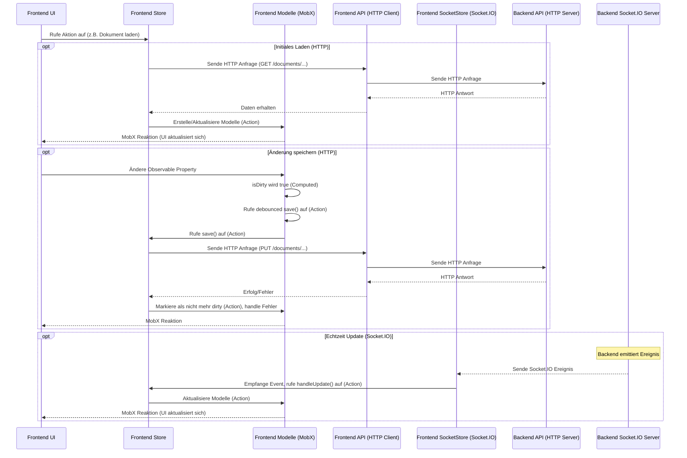

# Chapter 9: Frontend-Zustandsspeicher (Stores)


Nun drehen wir den Spiess um und schauen auf die andere Seite: das **Frontend**. Der Backend-Server speichert die Daten, erledigt die Geschäftslogik und sendet die Ergebnisse an den Browser. Aber was macht der Browser mit diesen Daten? Wie zeigt er sie dem Benutzer an? Wie reagiert die Benutzeroberfläche (UI), wenn Daten vom Backend aktualisiert werden (sei es durch den Benutzer selbst, einen anderen Benutzer via Socket.IO oder eine geplante Aufgabe auf dem Server)?

Stellen Sie sich vor, Sie haben viele Puzzleteile (die Daten vom Backend), aber wo legen Sie diese ab, damit alle Teile der Benutzeroberfläche Zugriff darauf haben und wissen, wann sich etwas ändert, damit sie sich neu zeichnen können? Direkt im einzelnen UI-Element (z. B. einem Button oder einem Textfeld) Daten zu speichern, funktioniert nicht gut, wenn viele Teile der Anwendung dieselben Daten sehen oder bearbeiten müssen.

Hier kommen die **Frontend-Zustandsspeicher (Stores)** ins Spiel. Sie sind das "Gedächtnis" und die "Logik-Schicht" der Anwendung, die im Browser des Benutzers läuft.

## Was sind Frontend-Zustandsspeicher (Stores)?

Im Kern ist ein **Store** im Frontend eine zentrale Stelle, die den Zustand oder die Daten eines bestimmten Teils der Anwendung verwaltet. Stores sind oft MobX-gesteuerte Klassen oder Objekte, die drei Hauptaufgaben haben:

1.  **Speicherung des Anwendungszustands:** Sie halten die Daten, die die Benutzeroberfläche darstellen soll (z. B. eine Liste von Dokumenten, Informationen über den aktuell eingeloggten Benutzer, globale Einstellungen). Dieser Zustand ist "observable" (überwachbar) dank MobX.
2.  **Verwaltung der Logik für diesen Zustand:** Sie enthalten Methoden (oft "actions" in MobX), um den Zustand zu ändern. Dies können Aktionen sein, die durch Benutzerinteraktionen ausgelöst werden (z. B. "Dokument speichern") oder durch Updates vom Backend (z. B. "Dokument wurde geändert, aktualisiere meinen Zustand").
3.  **Synchronisierung mit dem Backend:** Sie kommunizieren mit der Backend-API (mittels HTTP [Kapitel 7]) und lauschen auf Echtzeit-Updates via Socket.IO [Kapitel 8], um ihren internen Zustand aktuell zu halten.

Stellen Sie sich einen Store als einen **spezialisierten Manager für einen bestimmten Datentyp oder Anwendungsbereich** vor. Es gibt einen Manager für Dokumente (`DocumentStore`), einen für Benutzer (`UserStore`), einen für Berechtigungen (`PermissionStore`), und so weiter. Alle UI-Komponenten, die Dokumente benötigen, fragen den `DocumentStore`, anstatt die Daten einzeln zu verwalten oder direkt mit dem Backend zu sprechen. Dieser Manager weiss immer, welcher Zustand aktuell ist und wie er ihn ändern muss.

In unserem `teaching-project` verwenden wir die Bibliothek **MobX** ([MobX](https://mobx.js.org/)) für das Zustandsmanagement. MobX macht es sehr einfach, überwachbaren Zustand (`observable`) zu definieren, abgeleitete Werte ('computed') automatisch berechnen zu lassen und Änderungen synchron (via 'actions') durchzuführen, wobei die UI von selbst auf diese Änderungen reagiert.

## Anwendungsfall: Anzeigen und Aktualisieren einer Liste von Dokumenten

Nehmen wir als Beispiel, wie das Frontend die Dokumente in einem bestimmten **Dokumentenbaum** ([Kapitel 5: Dokumentenbaum (Document Root)](05_dokumentenbaum__document_root__.md)) anzeigt und handhabt.

Wenn ein Benutzer einen Kursabschnitt öffnet (der einem `DocumentRoot` entspricht), muss das Frontend:

1.  Den `DocumentRoot` und die zugehörigen **Dokumente** ([Kapitel 4: Dokumente (Content Units)](04_dokumente__content_units__.md)) vom Backend laden (per HTTP).
2.  Diese Daten im Frontend speichern.
3.  Die UI rendern, die diese Dokumente anzeigt (z. B. eine Baumansicht der Dokumente).
4.  Wenn der Benutzer ein Dokument bearbeitet und speichert, die Änderung ans Backend senden (per HTTP PUT).
5.  Wenn ein *anderer* Benutzer ein Dokument im selben Baum ändert, das Update per Socket.IO vom Backend empfangen [Kapitel 8].
6.  Die lokalen Daten im Frontend aktualisieren, um die Änderung zu spiegeln.
7.  Sicherstellen, dass die UI automatisch aktualisiert wird, um die Änderung anzuzeigen.

Diese Aufgaben sind genau das, was die Frontend-Stores übernehmen.

## Die Struktur der Frontend-Stores im `teaching-project`

Das Frontend-Zustandsmanagement ist hierarchisch aufgebaut, beginnend mit einem zentralen **`RootStore`**.

1.  **`RootStore` (`teaching-dev\src\stores\rootStore.ts`):** Dies ist der oberste Store, eine einzige Instanz, die andere "Kind"-Stores enthält. Sie wird beim Start der Anwendung initialisiert und bietet einen zentralen Zugriffspunkt auf alle spezialisierten Stores.

    ```typescript
    // Aus teaching-dev/src\stores\rootStore.ts (vereinfacht)
    import React from 'react';
    import { DocumentRootStore } from '@tdev-stores/DocumentRootStore';
    import { UserStore } from '@tdev-stores/UserStore';
    import { SessionStore } from '@tdev-stores/SessionStore';
    import { SocketDataStore } from '@tdev-stores/SocketDataStore';
    // ... weitere Store Importe

    export class RootStore {
        documentRootStore: DocumentRootStore;
        userStore: UserStore;
        sessionStore: SessionStore;
        socketStore: SocketDataStore;
        // ... weitere Store Instanzen

        constructor() {
            // Initialisierung aller spezialisierten Stores
            this.documentRootStore = new DocumentRootStore(this);
            this.sessionStore = new SessionStore(this);
            this.userStore = new UserStore(this);
            this.socketStore = new SocketDataStore(this);
            // ... weitere Stores initialisieren

            // Startet das Laden der ersten Daten, wenn der Benutzer eingeloggt ist
            if (this.sessionStore.isLoggedIn) {
                this.load();
            }
        }

        // Action zum Laden der initialen Daten der Kinder-Stores
        load() {
            this.userStore.loadCurrent().then((user) => {
                if (user) {
                    this.socketStore.reconnect(); // Socket.IO Verbindung aufbauen
                    // Laden weiterer Stores, abhängig vom User
                    this.userStore.load();
                    this.studentGroupStore.load();
                    this.cmsStore.initialize();
                    if (user.isAdmin) {
                        this.adminStore.load();
                    }
                }
            });
        }
        // ... weitere Methoden (cleanup etc.)
    }

    // Erstelle eine einzige Instanz des RootStores
    export const rootStore = Object.freeze(new RootStore());
    // Stelle den Store über React Context zur Verfügung, damit UI-Komponenten darauf zugreifen können
    export const storesContext = React.createContext(rootStore);
    export const StoresProvider = storesContext.Provider;
    ```
    Der `RootStore` selbst verwaltet kaum Daten, sondern dient als Container. UI-Komponenten können über den `storesContext` auf ihn zugreifen und von dort aus die benötigten spezialisierten Stores erhalten.

2.  **Spezialisierte Stores:** Dies sind die Stores, die eine bestimmte Datendomäne verwalten. Beispiele sind:
    *   `DocumentStore` (`teaching-dev\src\stores\DocumentStore.ts`): Verwaltet alle im Frontend geladenen **Dokumente** ([Kapitel 4]).
    *   `DocumentRootStore` (`teaching-dev\src\stores\DocumentRootStore.ts`): Verwaltet alle im Frontend geladenen **Dokumentenbäume** ([Kapitel 5]).
    *   `UserStore` (`teaching-dev\src\stores\UserStore.ts`): Verwaltet alle im Frontend geladenen **Benutzer** ([Kapitel 1]).
    *   `PermissionStore` (`teaching-dev\src\stores\PermissionStore.ts`): Verwaltet die spezifischen Benutzer- und Gruppenberechtigungen für **Dokumentenbäume** ([Kapitel 5]).
    *   `StudentGroupStore` (`teaching-dev\src\stores\StudentGroupStore.ts`): Verwaltet die **Studentengruppen**.
    *   `SocketDataStore` (`teaching-dev\src\stores\SocketDataStore.ts`): Kümmert sich um die Socket.IO-Verbindung und leitet eingehende Nachrichten an die anderen Stores weiter [Kapitel 8].
    *   `AdminStore` (`teaching-dev\src\stores\AdminStore.ts`): Verwaltet administrative Daten und Einstellungen.
    *   `CmsStore` (`teaching-dev\src\stores\CmsStore.ts`): Verwaltet CMS-spezifische Daten, z. B. verbundene GitHub-Repositories und Dateien.

    Jeder dieser Stores speichert Listen oder Maps von **Frontend-Modellen** (unterschiedlich von den Backend-Modellen in [Kapitel 1]).

3.  **Frontend-Modelle:** Dies sind MobX-gesteuerte Klassen, die *einzelne* Datensätze repräsentieren (z. B. eine Instanz der `User`-Klasse für einen bestimmten Benutzer, eine Instanz der `Script`-Klasse für ein Code-Dokument). Sie sind dünne Wrapper um die reinen Daten aus dem Backend, angereichert mit MobX `observable`s, `computed`s und `action`s, um ihre eigenen Eigenschaften und Aktionen zu verwalten. Die `iDocument`-Klasse ([teaching-dev\src\models\iDocument.ts]) ist die Basisklasse für alle Frontend-Dokumenten-Modelle ([Kapitel 4]).

    ```typescript
    // Beispiel: Vereinfachtes Frontend User Model (teaching-dev\src\models\User.ts)
    import { observable, computed, action } from 'mobx';
    import { UserStore } from '@tdev-stores/UserStore'; // Importiere den zuständigen Store

    export interface UserProps { /* ... Struktur des Benutzerobjekts vom Backend ... */
        id: string;
        firstName: string;
        lastName: string;
        email: string;
        isAdmin: boolean;
        // ... andere Eigenschaften
    }

    class User {
        readonly store: UserStore; // Referenz zum Store, der dieses Modell verwaltet
        readonly id;

        @observable accessor _pristine: UserProps; // Ursprünglicher Zustand (für isDirty Vergleich)
        @observable accessor firstName: string; // Observable Eigenschaft
        @observable accessor lastName: string;  // Observable Eigenschaft
        @observable accessor isAdmin: boolean;   // Observable Eigenschaft
        @observable accessor email: string;
        // ... andere Observable Eigenschaften

        constructor(user: UserProps, store: UserStore) {
            this.store = store;
            this.id = user.id;
            // Initialisiere Observable Eigenschaften und pristine Zustand
            this._pristine = user;
            this.firstName = user.firstName;
            this.lastName = user.lastName;
            this.isAdmin = user.isAdmin;
            this.email = user.email;
        }

        @computed get props(): UserProps { // Gibt die aktuellen Eigenschaften zurück (für API/Persistenz)
            return {
                id: this.id,
                firstName: this.firstName,
                lastName: this.lastName,
                email: this.email,
                isAdmin: this.isAdmin,
                // ... andere Eigenschaften
            };
        }

        @computed get isDirty(): boolean { // Prüft, ob das Modell seit dem letzten Laden/Speichern geändert wurde
            // Vergleicht aktuelle Eigenschaften mit dem pristine Zustand
            return (
                 this._pristine.firstName !== this.firstName ||
                 this._pristine.lastName !== this.lastName ||
                 this._pristine.isAdmin !== this.isAdmin
                 // ... weitere Vergleiche
            );
        }

        @action // Methode, um Eigenschaften zu setzen (Action, da es Zustand ändert)
        setProps(props: Partial<UserProps>): void {
            Object.assign(this, props); // Aktualisiere Observable Eigenschaften
        }

        @action // Methode, um das Modell über den Store zu speichern
        save() {
            return this.store.update(this); // Delegiert den Speichervorgang an den Store
        }
         // ... andere Methoden (z.B. reset, cleanup)
         cleanup() {
             // ... Aufräumlogik, falls nötig ...
         }
    }

    export default User;
    ```
    Ein Frontend-Modell hostet die Daten eines einzelnen Backend-Datensatzes, fügt spezifische Logik hinzu (z. B. `isDirty`) und ermöglicht Aktionen (`save`). Wichtig ist, dass die Methode `save()` im Modell *nicht* direkt die API aufruft, sondern dies an den zuständigen Store (`this.store.update(this)`) delegiert. Dies hält die Models schlank und die API-Kommunikationslogik zentral im Store.

## Stores in Aktion: Anzeigen einer Dokumentenliste

Zurück zu unserem Anwendungsfall: Anzeigen von Dokumenten in einem Kursabschnitt (`DocumentRoot`).

1.  **Initiales Laden:**
    *   Wenn der Benutzer den Kursabschnitt öffnet, greift eine UI-Komponente ([z. B. eine React-Komponente](https://react.dev/)) über den `storesContext` auf den `RootStore` zu.
    *   Von dort bekommt sie den `DocumentRootStore` und den `DocumentStore`.
    *   Die Komponente oder eine View-Schicht ruft eine Methode im `DocumentRootStore` auf, z. B. `loadInNextBatch(documentRootId, ...)`, die wiederum eine API-Funktion wie `apiFindManyFor(userId, [documentRootId], ...)` aufruft (siehe [Kapitel 5: Dokumentenbaum (Document Root)](05_dokumentenbaum__document_root__.md) für Backend-Seite).
    *   Wenn die Daten (der `DocumentRoot` und seine `documents`) vom Backend via HTTP eintreffen, verarbeitet der `DocumentRootStore` die Antwort.
    *   Er erstellt eine Instanz des Frontend `DocumentRoot` Modells für den geladenen Baum und fügt es seiner `documentRoots` Liste hinzu.
    *   Für *jedes* empfangene Dokument erstellt er über eine Helferfunktion (`CreateDocumentModel`, siehe Code in `DocumentStore.ts`) das passende Frontend Dokumenten-Modell (basiert auf `type`, z. B. `new Script(...)`, `new String(...)`) und fügt es dem `documents` Observable-Array im `DocumentStore` hinzu (`documentStore.addToStore(doc)`).
    *   Da `documentRoots` und `documents` MobX `observable`s sind, erkennen die beobachtenden UI-Komponenten die Änderung und aktualisieren sich automatisch, um die neu geladenen Dokumente anzuzeigen.

    ```typescript
    // Aus teaching-dev\src\stores\DocumentRootStore.ts (vereinfacht)
    import { action, observable } from 'mobx';
    import { RootStore } from '@tdev-stores/rootStore';
    import { debounce, Dictionary } from 'lodash';
    import DocumentRoot, { TypeMeta } from '@tdev-models/DocumentRoot';
    // ... Imports für API-Aufrufe etc.

    export class DocumentRootStore /* ... */ {
        readonly root: RootStore;
        documentRoots = observable.array<DocumentRoot<any>>([]); // Liste der DocumentRoot Modelle
        queued = new Map<string, any>(); // IDs für verzögertes Laden

        constructor(root: RootStore) {
            super();
            this.root = root;
        }

        // Methode, um per Debounce-Mechanismus mehrere DocumentRoots in einem Batch zu laden
        @action
        loadInNextBatch(id: string, meta?: TypeMeta<any>, loadConfig?: any, accessConfig?: any) {
             // ... Logik zur Queueing der ID ...
            this.queued.set(id, { meta: meta, load: loadConfig, access: accessConfig });
            this.loadQueued(); // Ruft die debouncete Methode auf
        }

        // Die debouncete Methode, die tatsächlich lädt
        loadQueued = debounce(action(this._loadQueued), 10, { leading: false, trailing: true, maxWait: 15 });

        // Interne Methode zum Laden der DocumentRoots und Dokumente vom Backend
        @action
        _loadQueued() {
            // ... Logik zur Verarbeitung der Queue und API-Aufruf apiFindManyFor ...
            const keys = [...this.queued.keys()].sort();
            this.withAbortController(`load-queued-${keys.join('--')}`, async (signal) => {
                const models = await apiFindManyFor(/* userId, */ keys, /* isSwitched, */ signal.signal);
                 // Verarbeiten der empfangenen Daten
                models.data.forEach(
                    action((data) => {
                        const config = this.queued.get(data.id);
                        if (!config) { return; }
                        // Füge Daten dem Store (und damit Kind-Stores wie DocumentStore) hinzu
                        this.addApiResultToStore(data, config);
                        this.queued.delete(data.id);
                    })
                );
                // ... Logik zum optionalen Erstellen fehlender Roots & Markieren als geladen ...
            });
        }

        // Fügt die API-Ergebnisse den relevanten Stores hinzu
        @action
        addApiResultToStore(data: any, config: any) {
            // ... Logik, um basierend auf config DocumentRoot, Permissions etc. zu extrahieren ...
            const documentRoot = /* erstelle DocumentRoot Modell ... */ new DocumentRoot(data, config.meta, this);
            if (config.load.documentRoot) {
                 this.addDocumentRoot(documentRoot, { cleanup: true, deep: false }); // Füge DocumentRoot hinzu
            }
            if (config.load.groupPermissions) {
                 // Füge Gruppenberechtigungen dem PermissionStore hinzu
                 data.groupPermissions.forEach((gp: any) => {
                    this.root.permissionStore.addGroupPermission(new GroupPermission({ ...gp, documentRootId: documentRoot.id }, this.root.permissionStore));
                 });
             }
             if (config.load.userPermissions) {
                  // Füge Benutzerberechtigungen dem PermissionStore hinzu
                  data.userPermissions.forEach((up: any) => {
                     this.root.permissionStore.addUserPermission(new UserPermission({ ...up, documentRootId: documentRoot.id }, this.root.permissionStore));
                  });
             }
            if (config.load.documents) {
                 // Füge Dokumente dem DocumentStore hinzu
                 data.documents.forEach((doc: any) => {
                    this.root.documentStore.addToStore(doc);
                 });
            }
            return documentRoot;
        }

        @action
        addDocumentRoot(documentRoot: DocumentRoot<any>, config: any = {}) {
            // ... Logik zum Hinzufügen/Ersetzen im observable.array und Aufräumen ...
            const old = this.find(documentRoot.id);
            if (old) { this.documentRoots.remove(old); /* cleanup? */ }
            this.documentRoots.push(documentRoot);
            return documentRoot;
        }

        find = computedFn(/* ... Suchlogik ... */);
        // ... andere Methoden (create, update, destroy, permissions etc.) ...
    }
    // ... Export ...
    ```
    Dieser Ausschnitt zeigt, wie der `DocumentRootStore` lädt, die Daten verarbeitet und sie strategisch an andere Stores (`PermissionStore`, `DocumentStore`) weiterleitet.

2.  **Echtzeit-Updates verarbeiten (via Socket.IO):**
    *   Wenn ein `IoEvent.CHANGED_DOCUMENT` Ereignis vom Backend per Socket.IO eintrifft [Kapitel 8], empfängt es der `SocketDataStore`.
    *   Der `SocketDataStore` hat einen Listener für dieses Ereignis konfiguriert, z. B. `socket.on(IoEvent.CHANGED_DOCUMENT, this.updateDocument)`.
    *   Dieser Listener, eine MobX `action`, ruft dann eine spezifische Methode im `DocumentStore` auf: `this.root.documentStore.handleUpdate(change)`.
    *   Die `documentStore.handleUpdate` Methode findet das betroffene Frontend Dokumenten-Modell in ihrem `documents` Array und ruft eine MobX `action` Methode auf diesem Modell auf (z. B. `model.setData(change.data, Source.API, change.updatedAt)`).
    *   Die `model.setData` Action aktualisiert die MobX `observable` Eigenschaften des Modells (z. B. den Text eines `String`-Dokuments).
    *   MobX erkennt die Änderung in den `observable`s des Modells und benachrichtigt alle UI-Komponenten, die dieses Modell beobachten.
    *   Die UI-Komponente aktualisiert sich automatisch, um den neuen Dokumentenzustand anzuzeigen.

    ```typescript
    // Aus teaching-dev\src\stores\SocketDataStore.ts (vereinfacht)
    import { action, observable, reaction } from 'mobx';
    import { RootStore } from '@tdev-stores/rootStore';
    import { io, Socket } from 'socket.io-client';
    // ... Imports für Socket.IO Typen (IoEvent, ChangedDocument etc.)

    export class SocketDataStore /* ... */ {
        readonly root: RootStore;
        @observable.ref accessor socket: Socket | undefined = undefined;
        @observable accessor isLive: boolean = false;

        constructor(root: RootStore) {
             super(); this.root = root;
             // ... Interceptoren, Reactions ...
        }

        connect() { /* ... Logik zum Aufbau der Socket Verbindung io(...) ... */ this._socketConfig(); }

        // Konfiguriert die Listener für server-seitige Events
        _socketConfig() {
            if (!this.socket) { return; }
             // ... connect, disconnect Listener ...

            // *** HIER WERDEN SERVER-SEITIGE NOTIFICATIONS EMPFANGEN! ***
            this.socket.on(IoEvent.NEW_RECORD, this.createRecord.bind(this));
            this.socket.on(IoEvent.CHANGED_DOCUMENT, this.updateDocument.bind(this)); // Wichtig für Dokumentänderungen
            this.socket.on(IoEvent.CHANGED_RECORD, this.updateRecord.bind(this));
             // ... weitere Listener (DELETED_RECORD etc.)
        }

        // Handler für IoEvent.CHANGED_DOCUMENT
        @action
        updateDocument(change: ChangedDocument) {
             // Sucht das relevante Dokumenten-Modell im DocumentStore und ruft dessen Handler auf
             const model = this.root.documentStore.find(change.id);
             if (model) {
                 // Ruft die setData Action auf dem Frontend Dokumenten-Modell auf
                 model.setData(change.data as any, Source.API, new Date(change.updatedAt));
             }
        }

         // Handler für IoEvent.CHANGED_RECORD (allgemeinere Updates)
        @action
        updateRecord({ type, record }: any) {
            switch (type) {
                 case RecordType.DocumentRoot: // Update eines DocumentRoot-Modells
                    this.root.documentRootStore.handleUpdate(record);
                    break;
                 case RecordType.UserPermission: // Update einer UserPermission
                    this.root.permissionStore.handleUserPermissionUpdate(record);
                     break;
                 // ... andere RecordTypes
            }
        }

        // ... createRecord, deleteRecord, joinRoom, leaveRoom etc.
    }
    // ... Export ...
    ```
    Der `SocketDataStore` ist also der Verteiler für Socket-Nachrichten. Er empfängt die rohen Nachrichten vom Server und ruft dann die zuständigen, spezialisierten Stores mit den relevanten Daten auf, die dann ihre Modelle aktualisieren.

## Unter der Haube: Datenfluss im Frontend (mit Stores)

Wie fliessen die Daten vom Backend durch die Stores zur UI?

Es gibt zwei lose gekoppelte Flüsse:

1.  **Initiales Laden / Benutzer-initiierte Änderungen (via HTTP):**
    *   Frontend UI-Komponente benötigt Daten (z. B. Liste der Dokumente).
    *   UI-Komponente ruft eine Methode (`action`) im zuständigen Frontend Store auf (z. B. `documentRootStore.loadInNextBatch(...)`, die intern `documentStore.addToStore(...)` aufruft).
    *   Der Store führt einen API-Aufruf durch (HTTP GET/PUT/POST etc. an den Backend-Controller).
    *   Das Backend verarbeitet die Anfrage (Middleware [Kapitel 7], Model-Logik [Kapitel 1], Datenbank [Kapitel 2]).
    *   Das Backend sendet eine HTTP-Antwort zurück (Daten oder Bestätigung).
    *   Der Store empfängt die Antwort und aktualisiert seinen internen `observable`n Zustand (z. B. fügt neue Modelle der `documents` Liste hinzu oder aktualisiert die Eigenschaften eines Modells wie `model.setData(...)`).
    *   MobX erkennt die Änderung im `observable`n Zustand des Stores oder Modells.
    *   MobX benachrichtigt die UI-Komponenten, die diesen Zustand beobachten.
    *   Die UI-Komponenten rendern sich neu, um den aktuellen Zustand anzuzeigen.

2.  **Backend-initiierte Änderungen (via Socket.IO):**
    *   Im Backend löst eine Aktion (z. B. ein anderer Benutzer speichert ein Dokument) das Senden einer Socket.IO-Nachricht aus (via Notification Middleware [Kapitel 8]).
    *   Der Socket.IO Server sendet das Ereignis an die relevanten Frontend-Clients (basierend auf Räumen).
    *   Im Frontend empfängt der `SocketDataStore` das Socket.IO-Ereignis.
    *   Der `SocketDataStore` leitet die Nachricht an den zuständigen spezialisierten Store weiter (z. B. `documentStore.handleUpdate(...)` für ein Dokumentenupdate).
    *   Der spezialisierte Store findet das relevante Frontend-Modell (z. B. das Dokumentenmodell mit der gegebenen ID) und ruft eine `action` auf diesem Modell auf (z. B. `model.setData(...)`).
    *   Diese `action` aktualisiert die `observable`n Eigenschaften des Modells.
    *   MobX erkennt die Änderung, benachrichtigt die beobachtenden UI-Komponenten.
    *   Die UI-Komponenten rendern sich neu.

Hier ist ein Flussdiagramm, das die Interaktion des Frontend Stores mit anderen Teilen des Systems veranschaulicht (vereinfacht):



Der Store ist der zentrale Punkt im Frontend, an dem Daten vom Backend ankommen (entweder direkt per HTTP-Antwort oder asynchron per Socket.IO-Nachricht) und in das MobX-Zustandsmanagement eingespeist werden, das dann automatisch die UI aktualisiert.

## Vorteile der Frontend-Zustandsspeicher (Stores)

Die Verwendung von Stores mit MobX bietet im Frontend mehrere wichtige Vorteile:

*   **Zentralisiertes Zustandsmanagement:** Anstatt den Zustand über viele Komponenten zu verteilen, wird er an zentralen, dedizierten Orten (den Stores) verwaltet.
*   **Vorhersehbarer Datenfluss:** UI-Komponenten lesen Zustand aus Stores und lösen Änderungen durch das Aufrufen von `action`s in Stores/Models aus. Das macht es einfacher zu verstehen, wie sich Daten ändern.
*   **Effiziente Reaktivität:** MobX sorgt dafür, dass nur die tatsächlich benötigten UI-Komponenten neu gerendert werden, wenn sich der Zustand ändert, auf den sie zugreifen. Das macht die UI sehr responsiv.
*   **Trennung der Belange:** Die UI-Komponenten sind "dumm" und fokussieren sich nur auf die Darstellung. Die Logik für Datenhaltung, Abruf und Synchronisierung liegt in den Stores.
*   **Einfache Handhabung asynchroner Operationen:** API-Aufrufe und Socket.IO-Handling werden innerhalb von Stores gekapselt.

## Fazit

Die **Frontend-Zustandsspeicher (Stores)**, implementiert mit MobX, sind das Herzstück des Frontend-Datenmanagements im `teaching-project`. Sie dienen als zentrale Speichereinheit für den Anwendungszustand im Browser, verwalten die Logik zur Datenaktualisierung und synchronisieren sich mit dem Backend über traditionelle HTTP-Anfragen (für Laden/Speichern/Löschen) und Echtzeit-Updates via Socket.IO (für Live-Änderungen).

Strukturiert in einem `RootStore` als Hauptcontainer, der spezialisierte Stores (wie `DocumentStore`, `UserStore`, `PermissionStore`) enthält, welche wiederum MobX-gesteuerte Frontend-Modelle (`User`, `iDocument` etc.) verwalten, bieten sie eine saubere, reaktive und wartbare Architektur für komplexe Frontend-Anwendungen. Durch das Trennen von UI (Darstellung) und Stores (Daten & Logik) wird der Entwicklungsprozess vereinfacht und die Anwendungsleistung verbessert.

Mit diesem Kapitel haben wir die Reise durch die Architektur des `teaching-project` von der Datenbank im Backend bis zur Benutzeroberfläche im Frontend abgeschlossen. Wir haben gesehen, wie die verschiedenen Schichten und Konzepte zusammenarbeiten, um eine robuste, sichere und reaktive Anwendung zu ermöglichen.

---

Generated by [AI Codebase Knowledge Builder](https://github.com/The-Pocket/Tutorial-Codebase-Knowledge)
