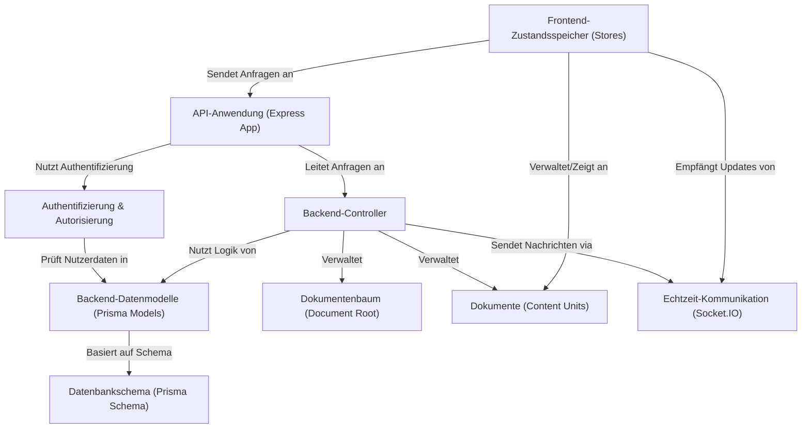

# Beginner Tutorial

Dieses Projekt ist eine **Lernplattform** mit Fokus auf die Arbeit mit
*Dokumenten* und *Berechtigungen*. Es besteht aus einem **Backend**
(API-Anwendung, Datenbank, Controller), das Daten verwaltet und Anfragen
verarbeitet, und einem **Frontend** (Zustandsspeicher), das die Daten im Browser
anzeigt und bearbeitet. Wichtige Funktionen sind **Benutzerauthentifizierung**,
*Zugriffsverwaltung* über Dokumentenbäume und die **Echtzeit-Synchronisierung** von
Änderungen zwischen allen Nutzern.

**Source Repository:**

## Chapters

1. [Backend-Datenmodelle (Prisma Models)
](01_backend_datenmodelle__prisma_models__.md)
2. [Datenbankschema (Prisma Schema)
](02_datenbankschema__prisma_schema__.md)
3. [Authentifizierung & Autorisierung
](03_authentifizierung___autorisierung_.md)
4. [Dokumente (Content Units)
](04_dokumente__content_units__.md)
5. [Dokumentenbaum (Document Root)
](05_dokumentenbaum__document_root__.md)
6. [Backend-Controller
](06_backend_controller_.md)
7. [API-Anwendung (Express App)
](07_api_anwendung__express_app__.md)
8. [Echtzeit-Kommunikation (Socket.IO)
](08_echtzeit_kommunikation__socket_io__.md)
9. [Frontend-Zustandsspeicher (Stores)
](09_frontend_zustandsspeicher__stores__.md)

---

Generated by [AI Codebase Knowledge Builder](https://github.com/The-Pocket/Tutorial-Codebase-Knowledge)
