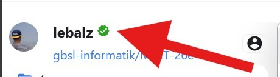
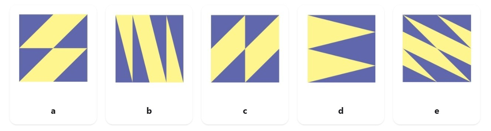
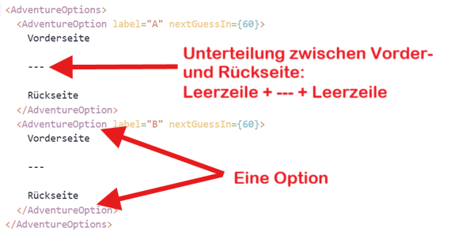

# MINT Woche 26e

Willkommen auf unserer MINT Seite. Hier entstehen die Inhalte für die Woche

## Vorbereitung

- [Github-Account](https://github.com/) erstellen, um die Webseite bearbeiten zu können.
  - Bei Herrn Hofer Benutzer\:innen-Name mitteilen
  - Einladung akzeptieren :mdi[account-check]{.green size="2em"}



- Optional: wer eigene Komponenten (wie die Mini-Spiele) hinzufügen möchte, kann verknüpft seinen Github Account mit [Codesandbox.io](https://codesandbox.io/).

## Antwortoptionen

- Antwortoptionen haben ein __Label__ ("Antwortoption **a**") eine __Vorderseite__ und eine __Rückseite__.
- Beim Draufklicken wird die Rückseite angezeigt.
- Abhängig vom Wert `nextGuessIn` kann erst nach der gesetzten Anzahl Sekunden eine andere Antwortoption gewählt werden.



Um Antwort-Optionen zu erstellen, soll wie folgt vorgegangen werden:

1. Alle notwendigen Bilder untereinander einfügen und speichern.
2. In den Source-Mode wechseln (oben rechts, auf :mdi[language-markdown-outline] klicken).
3. Die Kärtchen erstellen. Es braucht ein `<AdventureOptions>` (Mehrzahl!) und mehrere `<AdventureOption>` - eins pro Antwort.

```tsx
<AdventureOptions>
  <AdventureOption label="A" nextGuessIn={60}>
    Vorderseite

    ---
  
    Rückseite
  </AdventureOption>
  <AdventureOption label="B" nextGuessIn={60}>
    Vorderseite

    ---

    Rückseite
  </AdventureOption>
</AdventureOptions>
```

