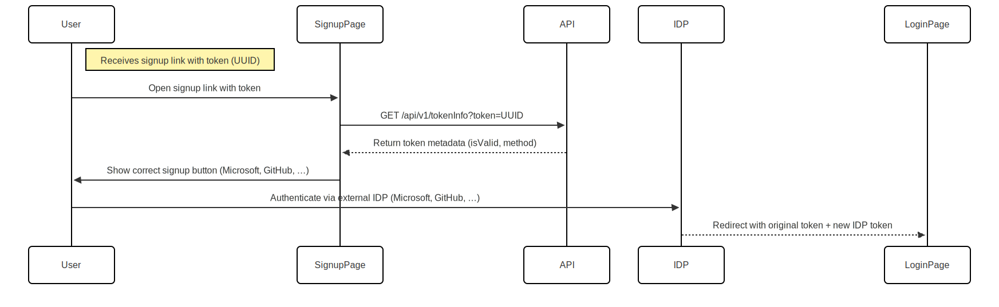
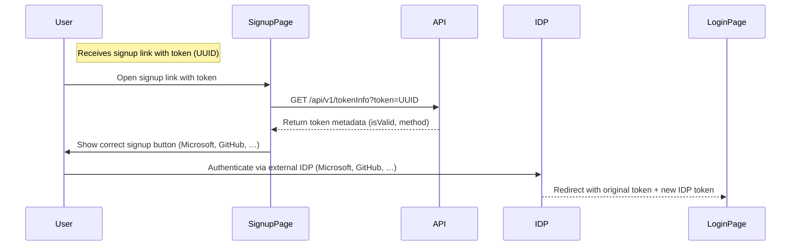
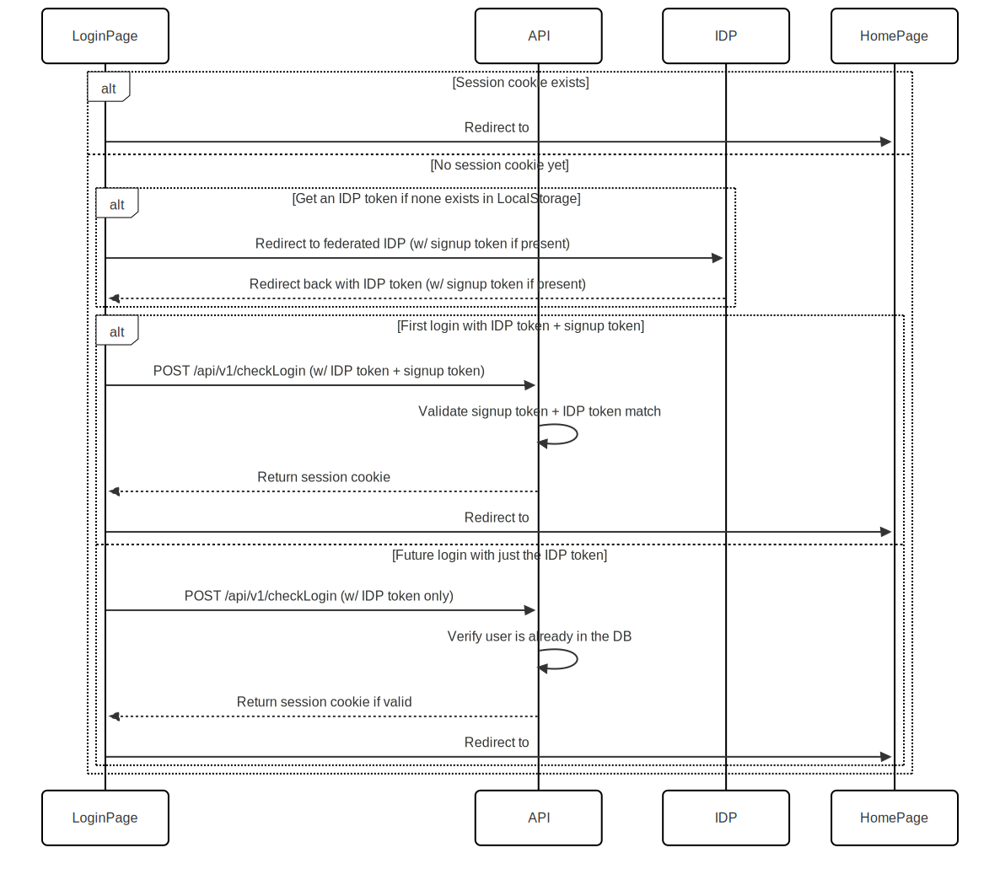
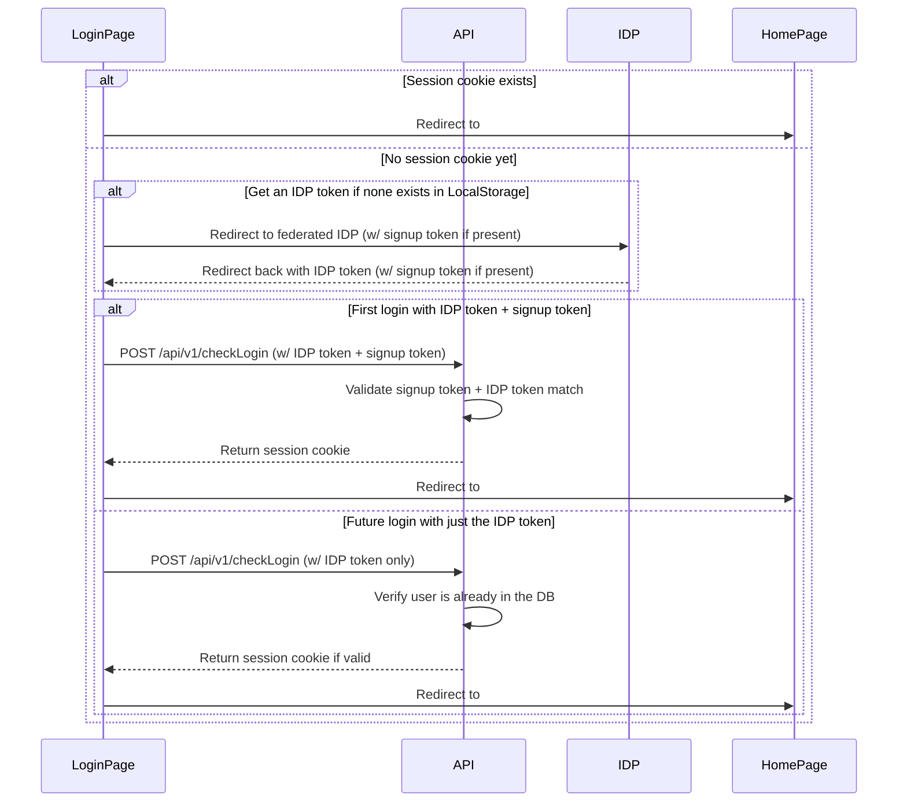

# Signup und Login
## Signup

```mermaid
sequenceDiagram
    participant User
    participant SignupPage

    participant API
    participant IDP
    participant LoginPage

    %% Signup link
    Note right of User: Receives signup link with token (UUID)

    %% User opens signup page
    User->>SignupPage: Open signup link with token
    SignupPage->>API: GET /api/v1/tokenInfo?token=UUID
    API-->>SignupPage: Return token metadata (isValid, method)

    %% Signup options shown
    SignupPage->>User: Show correct signup button (Microsoft, GitHub, …)

    %% Federated auth
    User->>IDP: Authenticate via external IDP (Microsoft, GitHub, …)
    IDP-->>LoginPage: Redirect with original token + new IDP token
```

## Login

```mermaid
sequenceDiagram
    participant LoginPage
    participant API
    participant IDP
    participant HomePage

    %% Case: Browser already has session
    alt Session cookie exists
        LoginPage->>HomePage: Redirect to
    else No session cookie yet
        %% Need to get an IDP token
        alt Get an IDP token if none exists in LocalStorage
            LoginPage->>IDP: Redirect to federated IDP (w/ signup token if present)
            IDP-->>LoginPage: Redirect back with IDP token (w/ signup token if present)
        end

        %% Now we have an IDP token but no session cookie yet
        alt First login with IDP token + signup token
            LoginPage->>API: POST /api/v1/checkLogin (w/ IDP token + signup token)
            API->>API: Validate signup token + IDP token match
            API-->>LoginPage: Return session cookie
            LoginPage->>HomePage: Redirect to
        else Future login with just the IDP token
            LoginPage->>API: POST /api/v1/checkLogin (w/ IDP token only)
            API->>API: Verify user is already in the DB
            API-->>LoginPage: Return session cookie if valid
            LoginPage->>HomePage: Redirect to
        end
    end
```