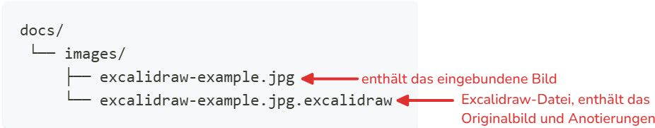

# Excalidraw-Bilder

:::warning[Nur für Chrome-Browser]
Die Excalidraw-Integration für das Editieren von Bildern basiert auf der [Local File System Access API](https://developer.mozilla.org/de/docs/Web/API/Window/showOpenFilePicker), welche aktuell nur unter Chrome-basierten Browsern (z.B. Google Chrome, Microsoft Edge) unterstützt wird.
:::

Im Entwicklungsmodus (`yarn run start`) können jegliche Bilder direkt editiert/annotiert werden. Bei den Bildern erscheint eine "Bearbeiten"-Schaltfläche.


Für die Bearbeitung des Bildes wird zunächst die **Berechtigung** für den Zugriff auf das lokale Dateisystem, konkret für den Projekt-Ordner (enthält die `docusaurus.config.ts` Datei) und alle Unterordner erfragt.
Danach wird das Bild im Excalidraw-Editor geöffnet und kann bearbeitet werden.

Nach dem Speichern im Editor wird die Excalidraw-Datei (`.excalidraw`) im gleichen Ordner wie das Bild abgelegt.





Dies hat den Vorteil, dass die Anotierungen unabhängig von der Bilddatei gespeichert werden. Dies hat mehrere Vorteile:
- Die Original-Bilddatei bleibt unverändert (und kann wiederhergestellt werden)
- Die servierte Bilddatei bleibt klein, da das Bild und die Anotierungen getrennt gespeichert werden
- Die Anotierungen können jederzeit wieder angepasst werden
- Das Hintergrundbild kann ausgetauscht werden, ohne die Anotierungen zu verlieren 

## Neue Excalidraw-Zeichnung erstellen

Es können auch neue Excalidraw-Zeichnungen erstellt werden, indem im Markdown ein neuer Bild-Pfad angegeben wird:

```md

```

Dann wird:
- basierend auf der Dateiendung ein neues Bild beim angegebenen Pfad erzeugt (erzeugt wenn nötig auch die Ordnerstruktur)
- der Pfad im Markdown-Bild ohne das `.new` Suffix überschrieben
- eine neue, leere Excalidraw-Zeichnung am angegebenen Pfad (hier `./images/zeichnung.webp.excalidraw`) erstellt

```md

```

Unterstützte Bildformate:
- `.png`
- `.jpg`
- `.jpeg`
- `.svg`
- `.webp`

::video[./images/excalidraw-standalone.mp4]