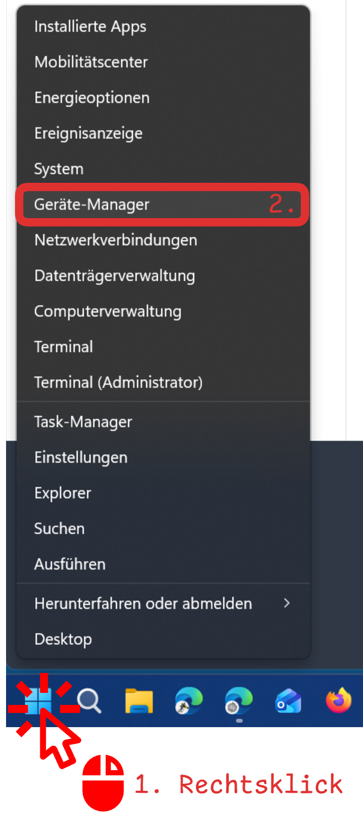
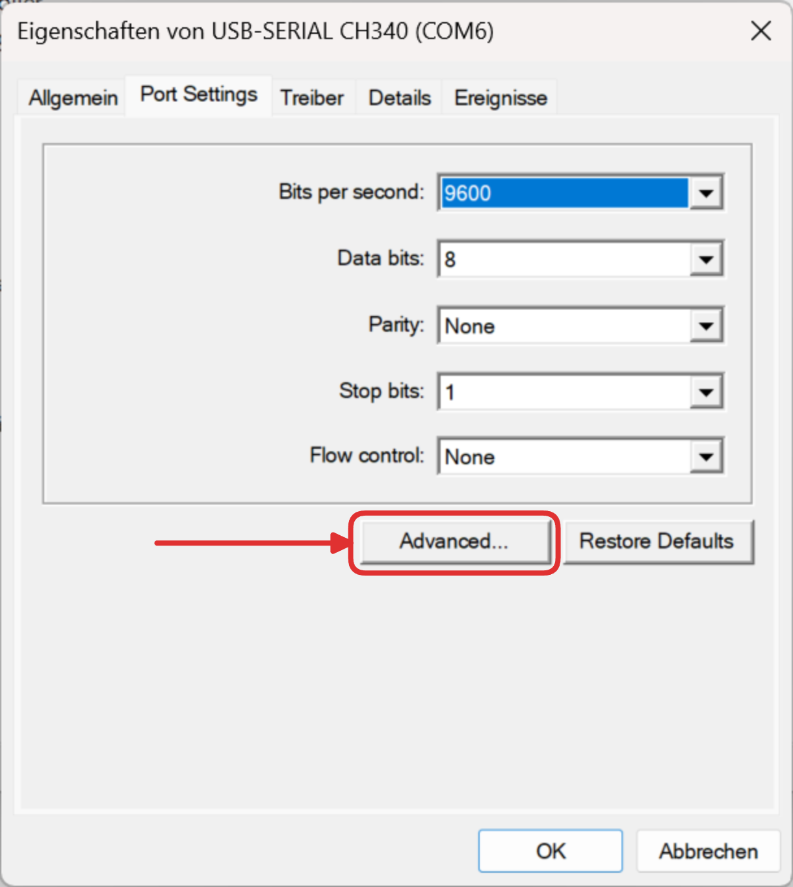
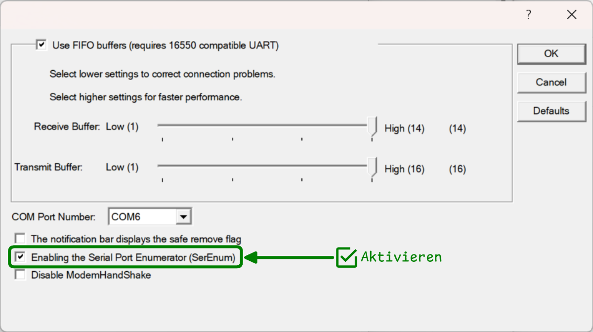

import Webserial from '@tdev/webserial/components'
import Badge from '@tdev-components/shared/Badge'

# webserial

<Webserial baudRate={115200}/>

## Troubleshooting

Fehler: <Badge type='danger'>Error: Failed to execute 'open' on 'SerialPort': Failed to open serial port</Badge>

:::cards{flexBasis="350px"}

::br

::br

::br

:::

