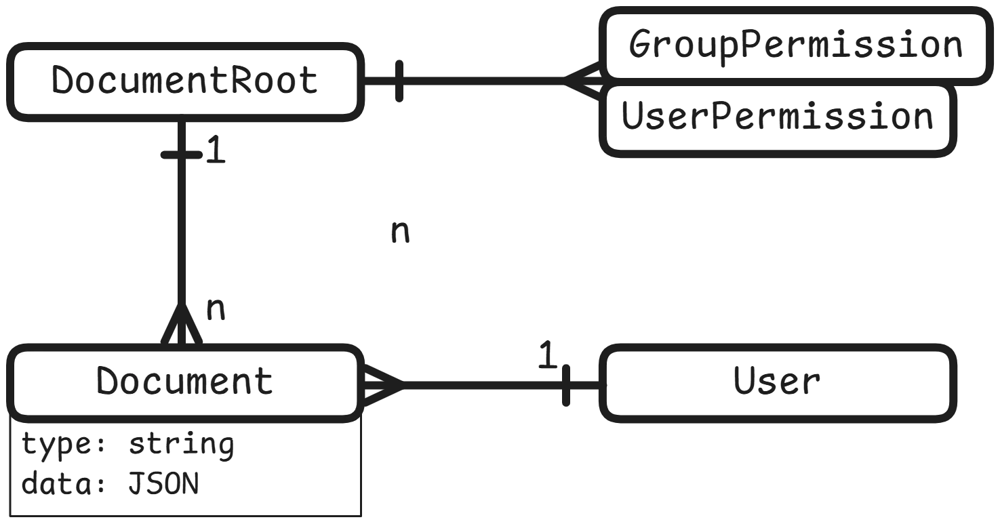
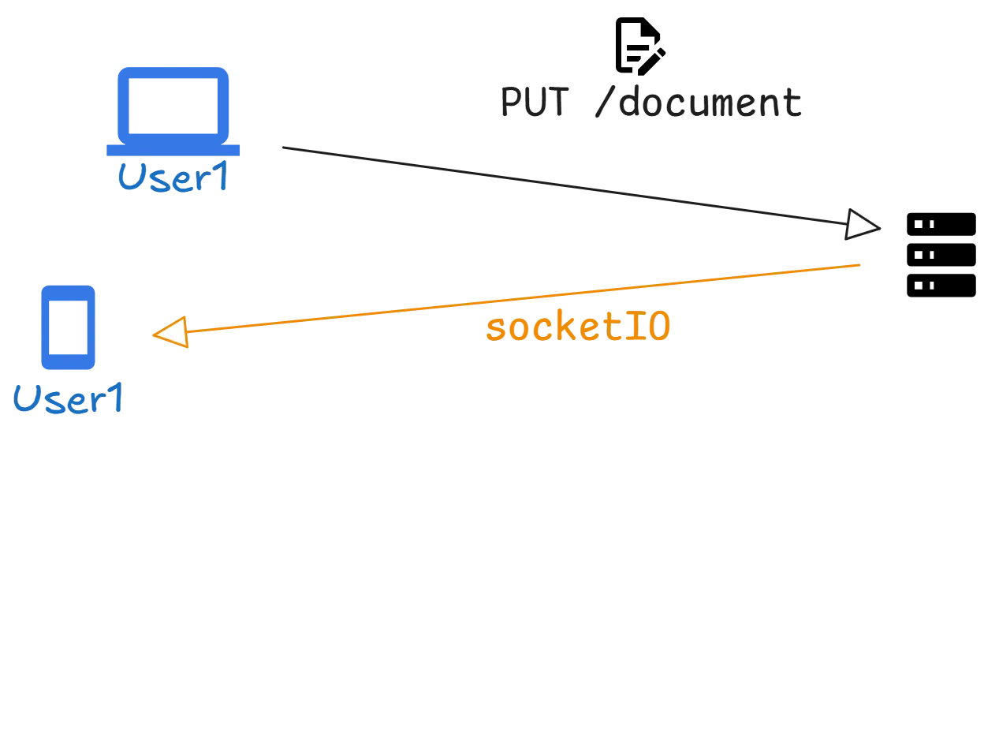
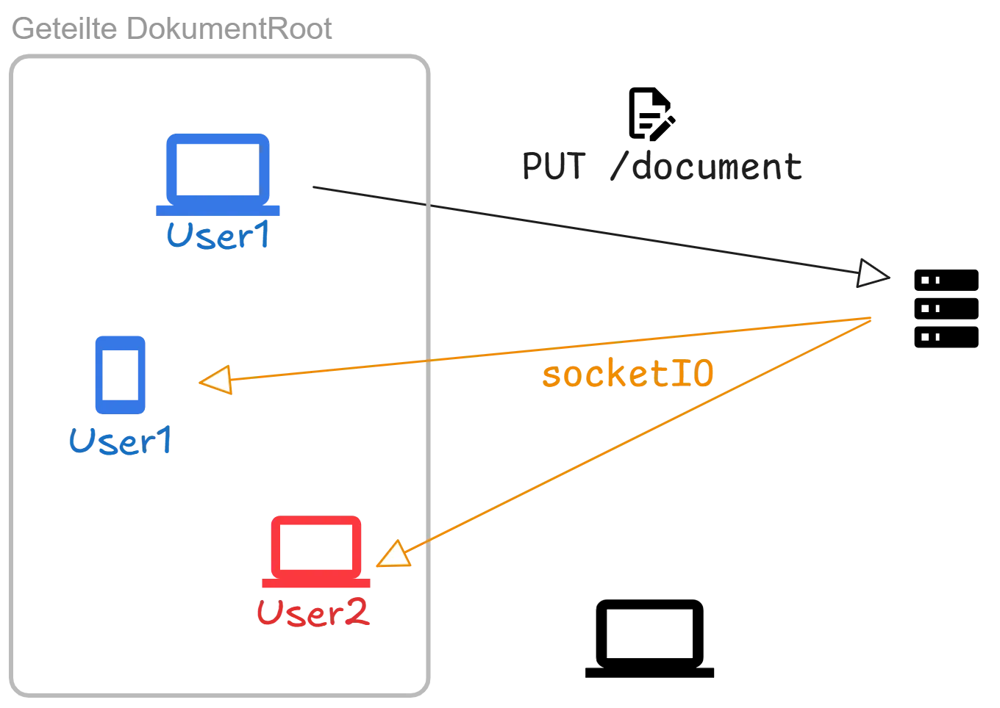

import DocCardList from '@theme/DocCardList';
import Badge from '@tdev-components/shared/Badge';

# App-Architektur

<DocCardList />


## Speicherbare Dokumente

Speicherbare Dokumente sind über eine `DocumentRoot` in einem Markdown-File "verankert". Es wird also direkt im Markdown-File eine UUID definiert, welche als eindeutiger Bezeichner für die `DocumentRoot` dient. Darauf kann sowohl die Berechtigung (Gruppen- oder Benutzerzuweisung) festgelegt, wie auch Benutzerspezifisch ein- oder mehere `Document`s hinzugefügt werden.

Benutzerspezifisch werden dann beim Besuch der Seite alle zu einer `DocumentRoot` gehörenden `Document`s geladen, oder beim erstmaligen Besuch erstellt.



So ist es einfach, bspw. eine Versionierung für einen Dokument-Typ zu implementieren - bspw. für den Typ `script` wird das aktuelle `script` wird aktualisiert und bei jeder Aktualisierung eine `scrip_version` hinzugefügt.

```tsx
<Script id="5f972f2e-bae0-410b-a953-647bc6278a39" versioned />
```

führt zu folgender Datenstruktur:

```
- DocumentRoot (uuid: "5f972f2e-bae0-410b-a953-647bc6278a39")
  - Document (type: "script",         data: "hallo", user_id: "user1", created_at: "2025-12-17T21:31:00Z")
  - Document (type: "script_version", data: "hall.", user_id: "user1", created_at: "2025-12-17T21:30:21Z")
  - Document (type: "script_version", data: "ha...", user_id: "user1", created_at: "2025-12-17T21:30:10Z")
  - Document (type: "script_version", data: "h....", user_id: "user1", created_at: "2025-12-17T21:30:00Z")
```
wobei der zum Markdown konsistente Document-Typ `script` das `Main-Document` für die Benutzer:in darstellt.

### Dokument-Modelle instanziieren

Beim Laden von `Document`-Einträgen von der API werden die entsprechenden Modelle im `DocumentStore` instanziiert. Damit das funktioniert, müssen für jeden `Document`-Typ sogenannte `Factory`-Funktionen registriert werden, die ein `Document`-Modell mittels des `data`-Feldes erstellt.


```ts title="src/stores/DocumentStore.ts"
const FactoryDefault: [DocumentType, Factory][] = [
    ['script', (data, store) => new Script(data, store)],
    ['script_version', (data, store) => new ScriptVersion(data, store)],
    // ...
];

class DocumentStore {
    factories = new Map<DocumentType, Factory>(FactoryDefault);

    registerFactory(type: DocumentType, factory: Factory) {
        this.factories.set(type, factory);
    }

    createDocument<Type extends DocumentType>(data: DocumentProps<Type>): TypeModelMapping[Type] | null {
        const factory = this.factories.get(data.type);
        if (!factory) {
            console.warn(`No factory registered for document type ${data.type}`);
            return null;
        }
        return factory(data, this) as TypeModelMapping[Type];
    }
}
```


### Dokument-Synchronisation

User werden beim Einloggen automatisch einer oder mehrere [SocketIO-Räumen](https://socket.io/docs/v4/rooms/) zugewiesen:

| Raum-Name | Beschreibung |
|:----------|:-------------|
| `User-Id` | Synchronisation aller Dokumente, die dem Benutzer gehören. |
| `admin`   | Für Admins: hier werden Dokument-Änderungen aller Benutzer synchronisiert. Dadurch können bspw. Bearbeitungsstände live synchronisiert werden. |
| `DocumentRoot-UUID` | Gemäss konfigurierter Berechtigung können DocumentRoot-ID's gejoint werden, so dass geteilte Dokument-Aktualisierungen synchronisiert werden. |


:::cards

::br

:::

## Erweiterbarkeit

Teaching-Dev ist so konzipiert, dass es leicht erweiterbar ist. Die Architektur ermöglicht es, neue Funktionen hinzuzufügen, ohne die bestehende Funktionalität zu beeinträchtigen. Dies wird durch die Verwendung zum einen von Webpack Aliases und zum anderen durch die Verwendung von Yarn Workspaces erreicht.

Die grundsätzliche Ordnerstruktur von Teaching-Dev ist wie folgt aufgebaut:

```
teaching-dev/
├── blog/
├── docs/
├── packages/
│   ├── tdev/
│   │   ├── remark-pdf/
│   │   │    ├── package.json
│   │   │    └── index.ts
│   │   ├── remark-pdf/
│   ├── <user-scoped components>
|   ...
├── src/
│   ├── api/
│   ├── components/
│   ├── hooks/
│   ├── pages/
│   ├── plugins/
│   ├── stores/
│   └── static/
└── website/
    └── static/
```

### Webpack Aliases

Mit Webpack Aliases können Ordner angegeben werden, in welchen die zu importierenden Module gesucht werden:

```json
{
    "@tdev-components/*": ["website/components/*", "src/components/*"],
    "@tdev-hooks/*": ["website/hooks/*", "src/hooks/*"],
    "@tdev-models/*": ["website/models/*", "src/models/*"],
    "@tdev-stores/*": ["website/stores/*", "src/stores/*"],
    "@tdev-plugins/*": ["website/plugins/*", "src/plugins/*"],
    "@tdev-api/*": ["website/api/*", "src/api/*"],
    "@tdev/*": ["website/*", "src/*", "packages/tdev/*"],
    "@tdev-original/*": ["src/*", "packages/tdev/*"],
    "@site/*": ["./*"]
}
```

Teaching-Dev implementiert dadurch eine Art "Fallback"-Mechanismus, der es ermöglicht, dass Komponenten, Hooks, Stores und Plugins in mehreren Ordnern gesucht werden. Zuerst wird im `website`-Ordner gesucht, dann im `src`-Ordner und zuletzt in den `packages`.

Dadurch kann die Website-Entwicklung von der Entwicklung der Kernfunktionen getrennt werden. Solange keine Änderungen im `src`-Ordner und- oder im `packages`-Ordner vorgenommen werden, kann die Website unabhängig von der Kernentwicklung weiterentwickelt werden und stets die neuste Version von Teaching-Dev verwenden.

### Yarn Workspaces

Mit Yarn Workspaces ist es möglich, Bibliotheken für eigene Erweiterungen zu verwenden, ohne diese im `package.json` von Teaching-Dev zu definieren. Dies ermöglicht
- einfaches Synchronisieren mit Teaching-Dev
- einfaches übernehmen von Funktionen, die eine andere Teaching-Dev-Instanz entwickelt hat
- einfache Entwicklung von Teaching-Dev Erweiterungen, indem die Abhängigkeiten in der `package.json` des jeweiligen Pakets definiert werden können.

### Eigene Tools hinzufügen

Im Unterricht entstehen teils auf die Schnelle eigene Visualisierungen, Tools oder Erweiterungen, die jenach Anwendung auch eigene Abhängigkeiten (Bibliotheken) benötigen. Damit solche Tools ohne viel Aufwand selber geschrieben und aber auch von anderen Lehrpersonen einfach übernommen weren können, können solche Tools als Package angelegt werden.

```
packages/
├── tdev/
|   ├── /* nicht verändern, diese Packages werden von tdev bereitgestellt */
├── hfr
│   ├── huffman-tree
│   │    ├── package.json
│   │    ├── index.tsx
│   │    └── styles.module.scss
│   ...
├── brr
│   ├── netpbm-editor
│   │    ├── package.json
│   │    ├── index.tsx
│   │    └── styles.module.scss
│   ...
```

Die Namen (und das Scoping) der Pakete ist grundsätzlich frei wählbar. Tdev verwendet die Konvention, dass die Pakete mit dem Kürzel der Lehrperson beginnen, die das Paket erstellt hat. So kann das Paket einfach von anderen Lehrpersonen übernommen werden, ohne dass es zu Namenskonflikten kommt.

```json title="packages/hfr/huffman-tree/package.json"
{
    "name": "@hfr/huffman-tree",
    "version": "0.1.0",
    "main": "index.tsx",
    "types": "index.d.ts",
    "private": true,
    "dependencies": {
        "d3": "^7.9.0"
    },
    "devDependencies": {
        "vitest": "*",
        "@docusaurus/module-type-aliases": "*",
        "@docusaurus/core": "*"
    },
    "peerDependencies": {
        "@tdev/core": "*"
    }
}
```

Dann kann die Visualisierung direkt verwendet werden:

```md
import HuffmanTree from '@hfr/huffman-tree';

<HuffmanTree />
```

:::note[Hinweis]
TDev stellt grundsätzlich keine eigenen Visualisierungstools zur Verfügung, stellt aber die Infrastruktur bereit, um eigene Tools zu erstellen. Diese können dann von anderen Lehrpersonen übernommen und weiterentwickelt werden.
:::

### Eigene `document`-Typen hinzufügen

Packages können eigene (speicherbare oder auch dynamisch generierte) `document`-Typen hinzufügen und für die VErwendung registrieren. Dabei gibt es vier Schnittstellen, die bedient werden können/müssen:

#### Typescript <Badge type="warning">Pflicht</Badge>

Damit eine Typesafety gewährleistet wird, muss der `document`-Typ in Typescript definiert werden.

Beispiel: Excalidraw-Dokumente

```ts title="packages/tdev/excalidoc/index.ts"
import Excalidoc from './model';
export interface ExcaliData {
    files: BinaryFiles;
    elements: readonly ExcalidrawElement[];
    image: string;
}
declare module '@tdev-api/document' {
    export interface TypeDataMapping {
        excalidoc: ExcaliData;
    }
    export interface TypeModelMapping {
        excalidoc: Excalidoc;
    }
}
```

Beim `TypeDataMapping` wird der Typ des `data`-Attributs eines `Document`s definiert, beim `TypeModelMapping` wird der Typ des zugehörigen Modells zugewiesen.

#### Initialisierung des Document Models <Badge type="warning">Pflicht</Badge>

Damit ein neues Dokument initialisiert werden kann, muss eine Initialisierungsfunktion, eine sog. `Factory`, registriert werden.

```ts title="packages/tdev/text-message/register.ts"
import { rootStore } from '@tdev-stores/rootStore';
import { Document, Factory } from '@tdev-api/document';
import TextMessage from './model';

const createModel: Factory = (data, store) => {
    return new TextMessage(data as Document<'text_message'>, store);
};

// Registrierung der Factory
const register = () => {
    rootStore.documentStore.registerFactory('text_message', createModel);
    // optional: Registrierung für Server-Seitig erzeugte Dokumente, die über
    // SocketIO initialisiert werden können
    rootStore.socketStore.registerRecordToCreate('text_message');
    // optional: Für dynamische Raum-Komponenten registrieren, so dass
    // die korrekten Komponenten bei Raum-Dokumenten verwendet werden können
    rootStore.componentStore.registerRoomComponent('text_messages', {
        name: 'Textnachrichten',
        description: 'Textnachrichten können in einem Chat versandt- und empfangen werden.',
        component: TextMessages,
        default: true
    });
};

// zentral: Registrierung direkt beim Import der Datei aufrufen
register();
```

Diese `register`-Funktion muss in der `siteConfig.ts` als `apiDocumentProviders` hinterlegt werden, so dass die entsprechenden Einträge beim Laden der Client-App noch vor dem ersten Rendern verfügbar sind.

## Debug

Im Projekt ist [@docusaurus/plugin-rsdoctor](https://docusaurus.io/docs/api/plugins/@docusaurus/plugin-rsdoctor) als dev dependency installiert. Dieses Plugin hilft bei der Analyse von Performance-Problemen und kann beim Aufsuchen von kritischen (langsamen) Code-Teilen helfen.

```bash
RSDOCTOR=true yarn run build
```
