import Steps from '@tdev-components/Steps'

# WSL2

WSL2
: Windows Subsystem for Linux ermöglicht es, Linux-Tools und -Anwendungen direkt auf dem Windows-System auszuführen, ohne eine separate virtuelle Maschine oder Dual-Boot-Konfiguration einrichten zu müssen.

## Installation WSL2

<Steps>
1. Öffnen Sie PowerShell als Administrator:in
    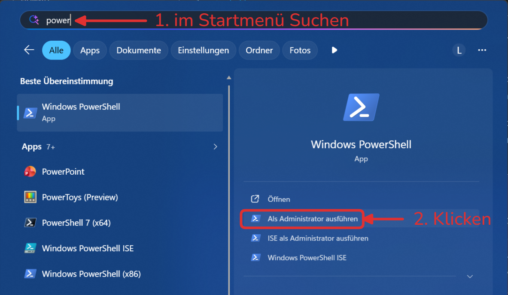
2. Geben Sie den folgenden Befehl ein und drücken Sie Enter, um WSL zu installieren:

   ```powershell
   wsl --install
   ```

   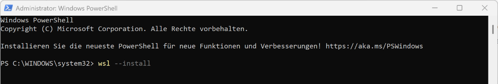

   :::details[Troubleshooting]
   [Bei Problemen kann diese Seite helfen](https://learn.microsoft.com/en-us/windows/wsl/troubleshooting#installation-issues)
   :::

3. Starten Sie Ihren Computer neu, wenn Sie dazu aufgefordert werden.
   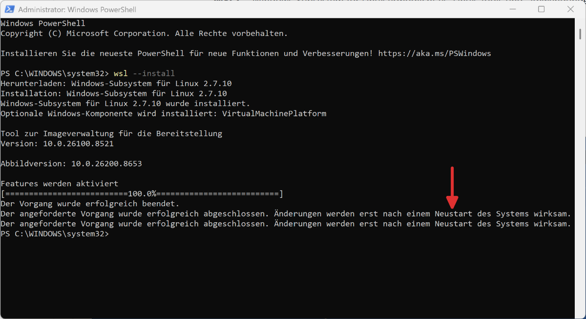

4. Ubuntu installieren: Öffnen Sie PowerShell erneut als __Administrator:in__ und geben Sie den folgenden Befehl ein:

   ```powershell
   wsl --install ubuntu
   ```

   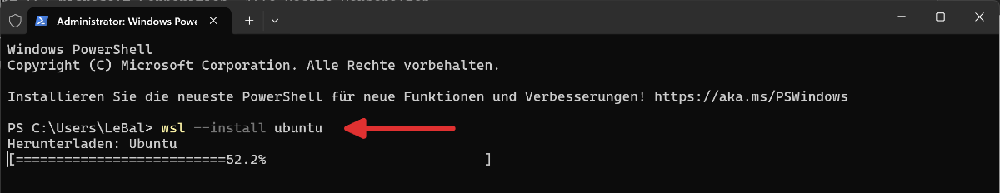

5. Ubuntu __erstmalig__ starten: Benutzer:in und Passwort festlegen:
   - **Benutzername**: z.B. Ihr Vorname - ohne Sonderzeichen oder Umlaute
   - **Passwort**: darf etwas einfaches sein (`1234` oder `asdf`), da für den Zugriff auf WSL zuerst das Windows-Passwort verwendet wird.

    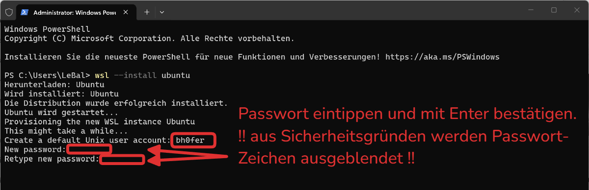

   Falls Sie gefragt werden, ob Sie Nutzungsdaten an Ubuntu senden möchtem, können Sie dies mit `y` annehmen, oder mit `n` ablehnen.
    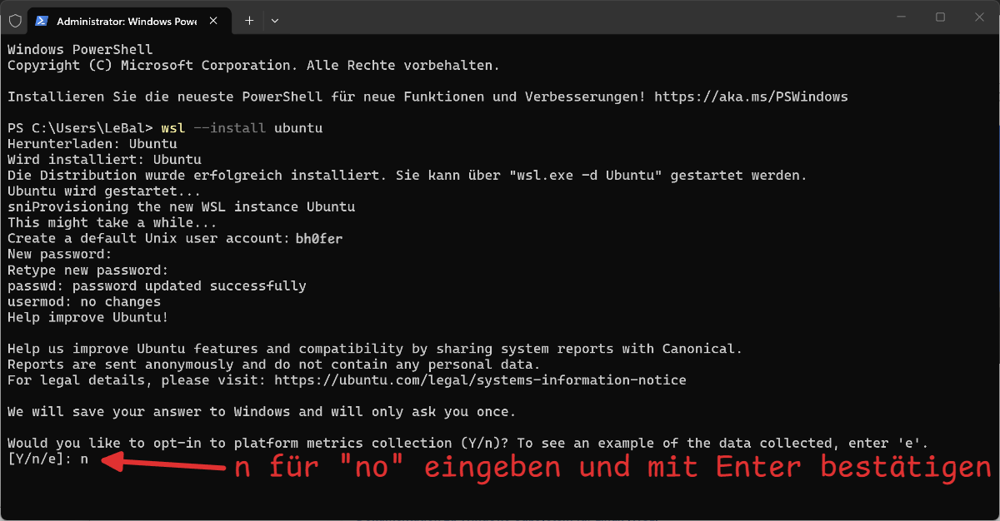


6. Aktuelle Ubuntu-Version prüfen:

   Öffnen Sie das __Terminal__ und öffnen Sie darin das Ubuntu-Terminal:

   (Bei älteren Windows-Versionen kann es sein, dass das Terminal nicht installiert ist. Installieren Sie es von [hier](https://apps.microsoft.com/detail/9n0dx20hk701?hl=de-DE&gl=DE))

   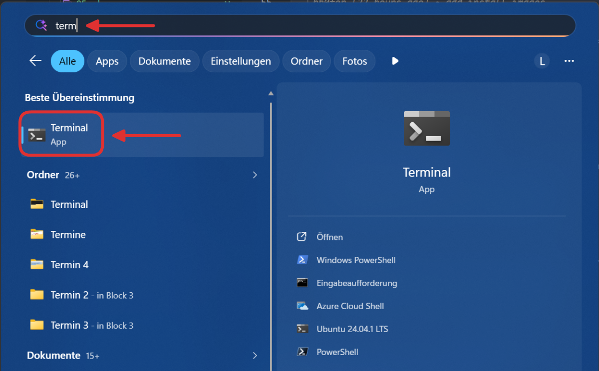

    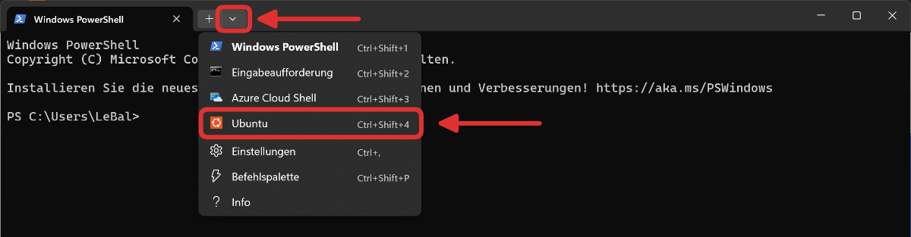

    und überprüfen Sie die aktuelle Ubuntu-Version mit folgendem Befehl:

    ```bash
    lsb_release -a
    ```
    
    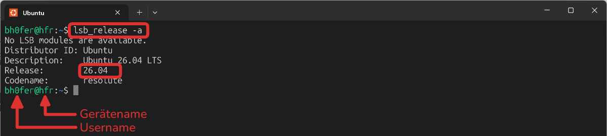

    ::::tip[Farbschema anpassen]
    Standardmässig verwendet Ubuntu ein violettes Terminal. Damit das Terminal genau gleich aussieht wie oben im Screenshot, kann das **Farbschema** angepasst werden.
    :::details[Anleitung]
    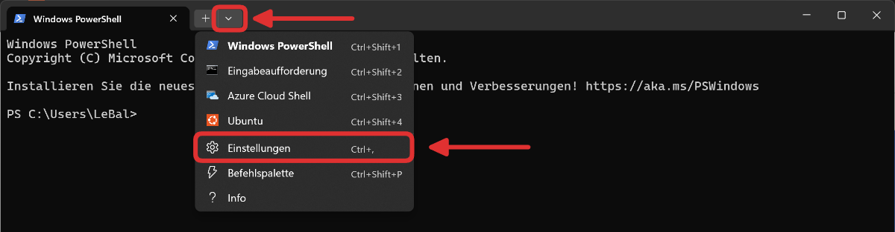
    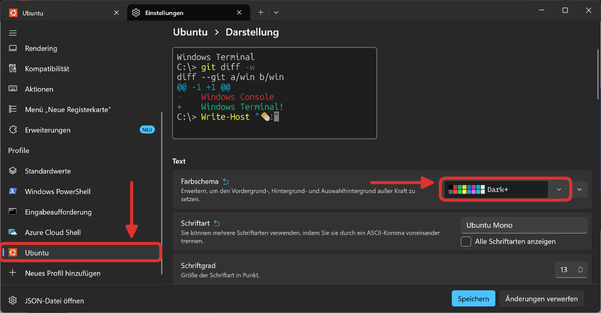
    :::
    ::::

   :::details[Optional: Ubuntu-Terminal als Standard-Terminal festlegen]
    

    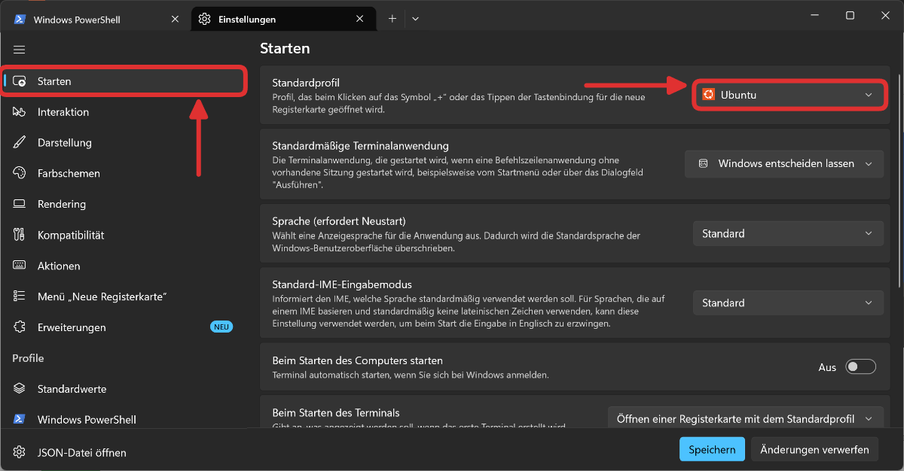
   :::


7. Ubuntu aktualisieren:

   ```bash
   sudo apt update
   sudo apt upgrade
   ```

   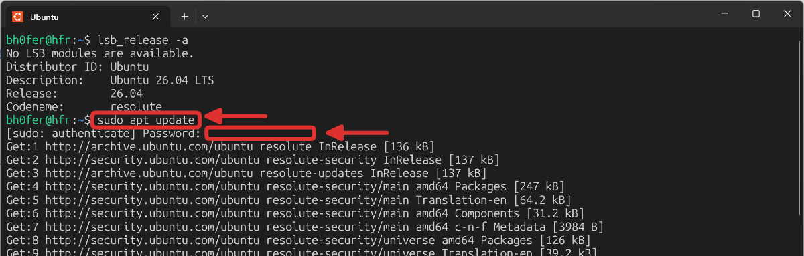

   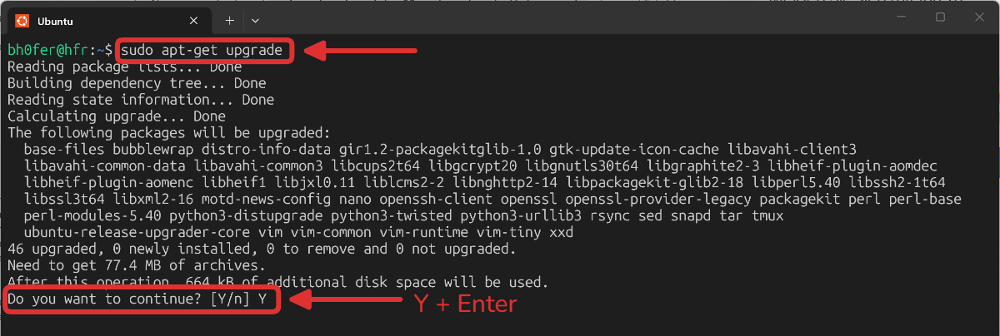
</Steps>

## Installation NVM/NodeJS

Für eine reibungslose und zukunfssichere Nutzung von NodeJS, wird NVM (Node Version Manager) empfohlen. NVM ermöglicht es, mehrere NodeJS-Versionen auf demselben System zu installieren und zu verwalten.

NVM
: [Webseite NVM](https://www.nvmnode.com) 
: [Installationsanleitung](https://www.nvmnode.com/guide/installation.html#nvm-install-for-linux-macos)

<Steps>
1. NVM herunterladen und installieren:
   ```bash
   curl -o- https://raw.githubusercontent.com/nvm-sh/nvm/v0.39.3/install.sh | bash
   source ~/.bashrc
   nvm -v # 0.39.3
   ```

   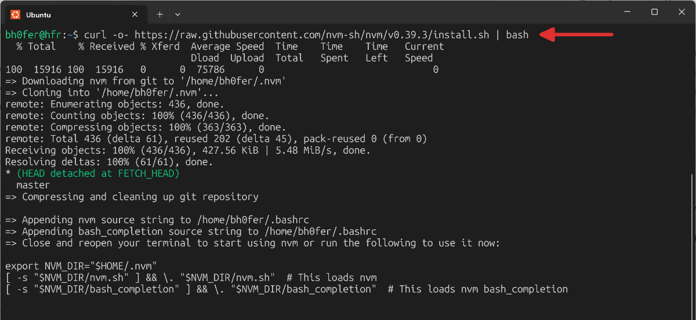
2. NodeJS installieren:
   ```bash
   nvm install 24.18.0
   nvm use 24.18.0 # Version v24.18.0 verwenden
   nvm alias default 24.18.0 # v24.18.0 als Standardversion festlegen
   node -v # v24.18.0
   ```
   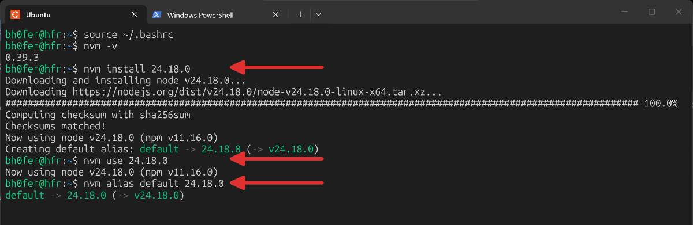
3. Paketmanager `yarn` installieren:
   ```bash
   npm install -g yarn
   ```
   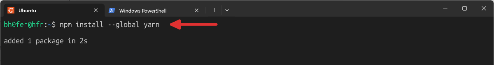

</Steps>

## Docker in WSL installieren

Für die unkompliziertere Entwicklung der tdev-API wird das Arbeiten mit dev-containern empfohlen. Dazu wird eine Docker-Installation benötigt. Docker-Desktop für Windows ist zwar die Standard-Option, ist aber unglaublich langsam und deshalb nicht empfohlen. Stattdessen kann das Docker-CLI direkt in WSL installiert werden. Die Installation ist unkompliziert und die Performance ist deutlich besser.

<Steps>

1. Docker Repository hinzufügen:
   ```bash
   sudo apt install ca-certificates curl
   sudo install -m 0755 -d /etc/apt/keyrings
   sudo curl -fsSL https://download.docker.com/linux/ubuntu/gpg -o /etc/apt/keyrings/docker.asc
   sudo chmod a+r /etc/apt/keyrings/docker.asc

   # Add the repository to Apt sources:
   sudo tee /etc/apt/sources.list.d/docker.sources <<EOF
   Types: deb
   URIs: https://download.docker.com/linux/ubuntu
   Suites: $(. /etc/os-release && echo "${UBUNTU_CODENAME:-$VERSION_CODENAME}")
   Components: stable
   Architectures: $(dpkg --print-architecture)
   Signed-By: /etc/apt/keyrings/docker.asc
   EOF

   sudo apt update
   ```
   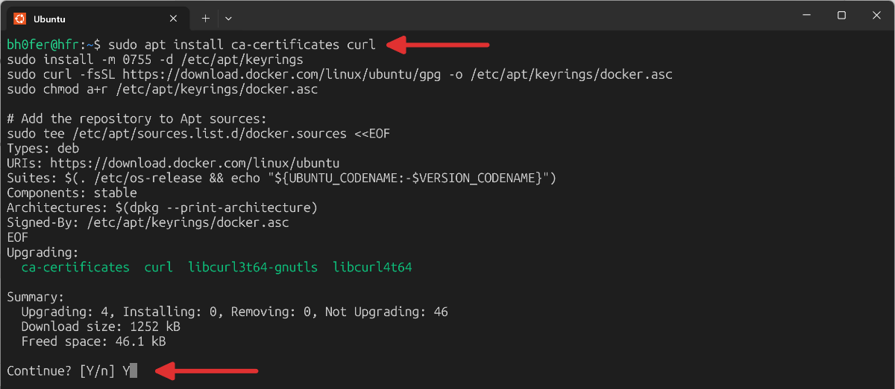
2. Docker CLI installieren:
   ```bash
   sudo apt install docker-ce docker-ce-cli containerd.io docker-buildx-plugin docker-compose-plugin
   ```
   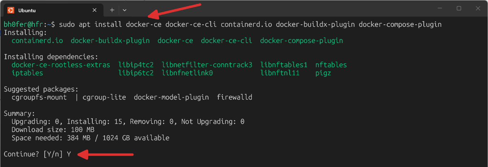
3. Docker-Dienst status prüfen/starten:
   ```bash
   sudo service docker status
   sudo service docker start
   sudo service docker enable
   ```
   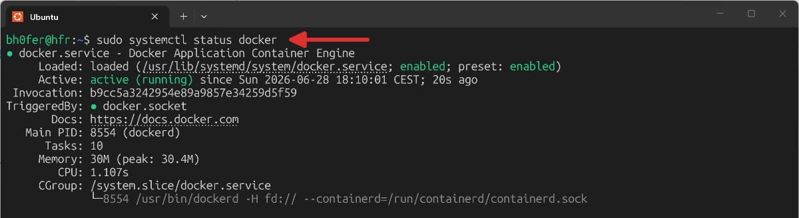
   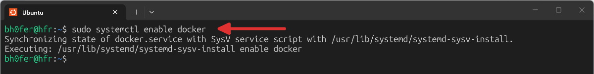
   und Docker zur Nutzung ohne `sudo` freigeben:
   ```bash
   sudo groupadd docker
   sudo usermod -aG docker $USER
   ```
4. Laptop neu starten  
   *(theoretisch reicht auch WSL komplett neu zu starten mit PS `wsl --shutdown`)*
5. Docker Installation prüfen:
   ```bash
   docker --version
   docker run hello-world
   ```
   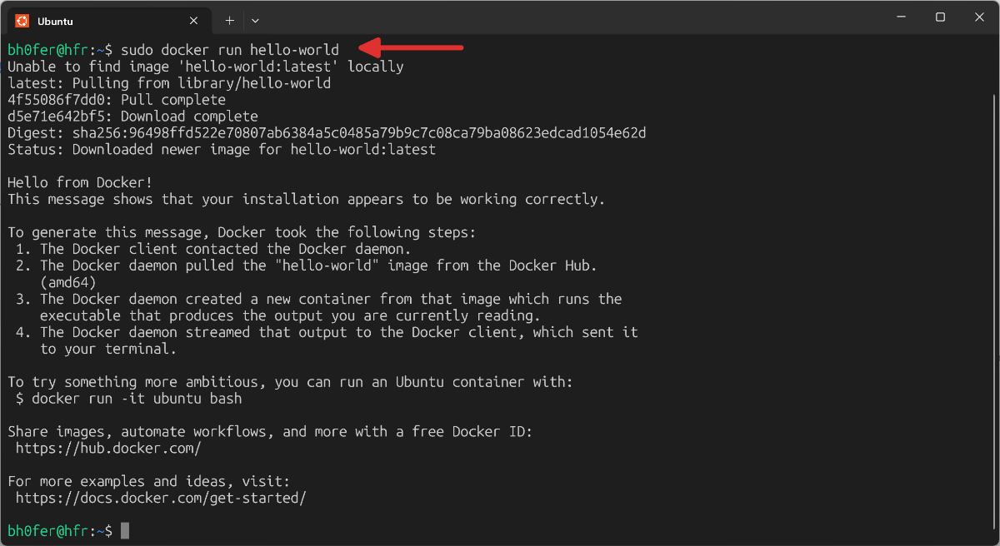

</Steps>