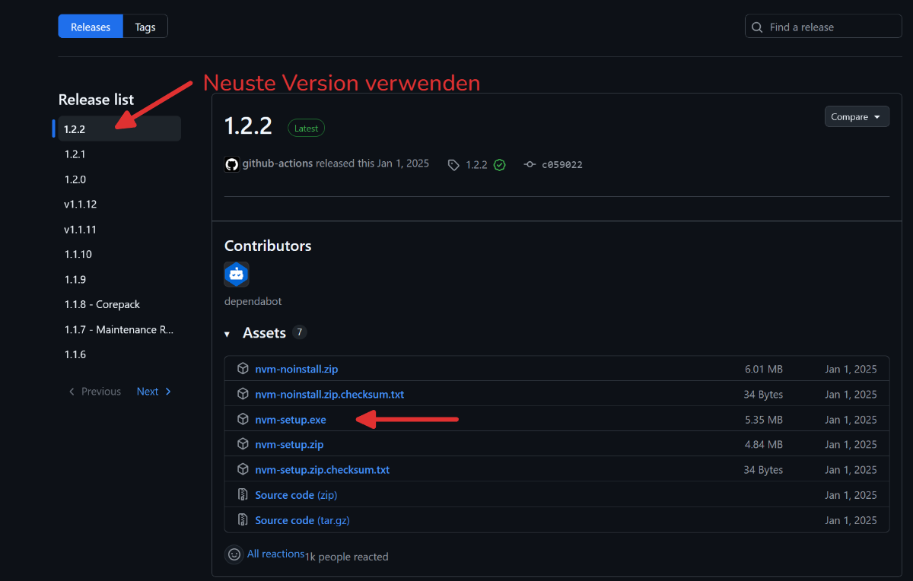
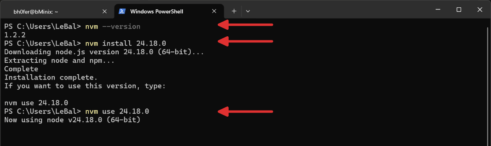
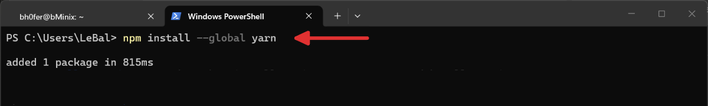

import Steps from '@tdev-components/Steps';

# Windows PS

Node kann wahlweise direkt [heruntergeladen](https://nodejs.org/en/download/) und installiert werden, oder über einen Versions-Manager wie [NVM](https://www.nvmnode.com)  installiert werden. NVM wird empfohlen, da es die Verwaltung von Node-Versionen erleichtert.

## NVM installieren

:::danger[Installiere Node-Versionen deinstallieren]
Falls aktuell eine Node-Version installiert ist, muss diese zuerst deinstalliert werden, **bevor** NVM installiert wird.
:::

<Steps>
1. Aktuelle Node-Version deinstallieren (falls vorhanden)
2. [nvm-setup.zip](https://github.com/coreybutler/nvm-windows/releases) herunterladen.
    
3. nvm-setup.zip entpacken und __nvm-setup.exe__ ausführen.

4. Ausführung von Skripts bei **PowerShell** zulassen:
    - Überprüfen, ob die Ausführung von Skripts erlaubt ist:
        ```ps
        Get-ExecutionPolicy   # Restricted | RemoteSigned | Unrestricted
        ```
    - Falls die Ausgabe `Restricted` ist, mindestens Skriptausführung (`RemoteSigned`) erlauben (oder auch `Unrestricted`):
        ```ps
        Set-ExecutionPolicy -ExecutionPolicy RemoteSigned -Scope CurrentUser
        ```
5. Powershell im Terminal öffnen (oder neu starten) und Node installieren:
    ```bash
    nvm --version # sicherstellen dass nvm installiert ist
    nvm install 24.18.0
    nvm use 24.18.0
    ```
    :::tip[Unterschied zu Unix]
    Unter Windows bleibt die zuletzt genutzte Node-Version aktiv, bis eine andere Version mit `nvm use <version>` ausgewählt wird. `nvm alias default <version>` ist unter Windows nicht verfügbar.
    :::
    
6. yarn installieren:
    ```bash
    npm install --global yarn
    ```
    
</Steps>
